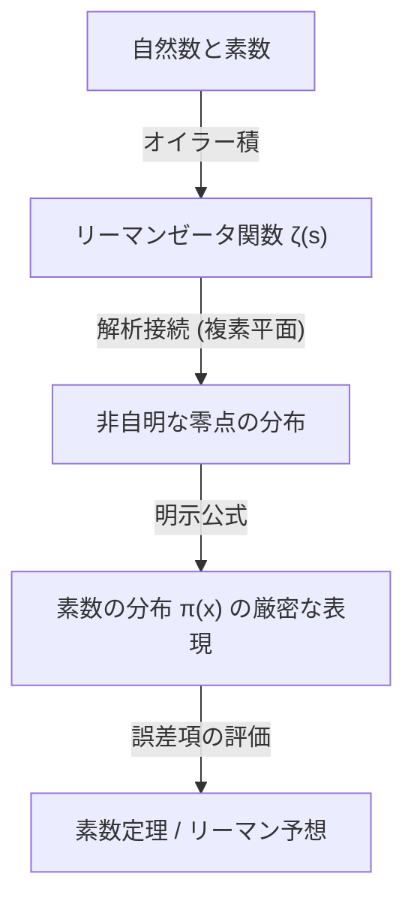

## 1. 簡介：質數的神祕與不規則性

質數（Prime Numbers）是除了1和自身之外沒有其他正因數的自然數。2, 3, 5, 7, 11, 13, 17, 19... 這樣延續下去的數列，在數學中是最基本卻也是最神祕的存在，自古以來便讓許多數學家為之著迷。質數也被稱為「數的原子」，所有的自然數都可以唯一地表示為質數的乘積（質因數分解的唯一性）。

然而，乍看質數的出現規律，我們無法從中找出任何規則性。有時會像 11 和 13 那樣作為孿生質數密集出現，有時則存在著即使相隔數千、數萬也不會出現下一個質數的「質數沙漠」。這種局部的隨機性與不可預測性，對數學家們來說曾是一道巨大的高牆。

儘管如此，從巨觀的角度來看，也就是在探討「在所有數字中，質數存在的比例有多少」這種全局行為時，人們發現其中隱藏著令人驚嘆的優美平滑法則。這就是本文將要解說的**質數定理（Prime Number Theorem, PNT）**。

## 2. 什麼是質數定理？高斯偉大的直覺

質數定理描述了給定實數 $x$ 以下的質數個數 $\pi(x)$，隨著 $x$ 的增大會如何增加。

用數學方式來表達，質數定理可以敘述如下：

$$
\lim_{x \to \infty} \frac{\pi(x)}{x / \ln(x)} = 1
$$

這意味著「小於等於 $x$ 的質數個數 $\pi(x)$，漸近等於 $x / \ln(x)$（$\pi(x) \sim x / \ln(x)$）」（這裡的 $\ln(x)$ 是自然對數）。換句話說，在某個夠大的數字 $N$ 附近隨機挑選一個數時，它是質數的機率大約為 $1 / \ln(N)$。

### 15歲高斯的發現

最早注意到這個驚人事實的，是當時年僅15歲的天才卡爾·弗里德里希·高斯（Carl Friedrich Gauss）。1792年，高斯熱心地研究了對數表與質數表，解讀出質數的密度有著與自然對數成反比而遞減的趨勢。他猜想了以下近似式：

$$
\pi(x) \approx \operatorname{Li}(x) = \int_{2}^{x} \frac{dt}{\ln t}
$$

這裡的 $\operatorname{Li}(x)$ 被稱為**對數積分**。相較於 $x / \ln(x)$，$\operatorname{Li}(x)$ 對於實際的 $\pi(x)$ 提供了好得多的近似。高斯的這項猜想，是人類首次一瞥隱藏在質數分佈中的深層法則的瞬間。

## 3. 切比雪夫定理與部分進展

高斯的猜想長久以來一直未獲證明，但進入19世紀中葉後，俄羅斯數學家帕夫努季·切比雪夫（Pafnuty Chebyshev）帶來了重大的進展。在1848年與1850年的論文中，切比雪夫嚴格地證明了 $\pi(x)$ 與 $x / \ln(x)$ 同階。

具體來說，他證明了對於所有夠大的 $x$，以下不等式都會成立：

$$
0.92129 \frac{x}{\ln x} < \pi(x) < 1.10555 \frac{x}{\ln x}
$$

切比雪夫還證明了，如果 $\pi(x) / (x/\ln x)$ 的極限存在，那麼它必定為 1。然而，他未能證明極限本身存在（也就是未能給出質數定理的完整證明）。

## 4. 黎曼ζ函數與複變分析的引入

邁向質數定理證明的最大突破，是由伯恩哈德·黎曼（Bernhard Riemann）帶來的。在1859年發表的劃時代論文《論小於給定數的質數個數》中，黎曼展示了質數的分佈與**複變函數**的行為之間有著深刻的聯繫。

他所使用的，就是今日被稱為**黎曼ζ函數**（Riemann zeta function）的函數 $\zeta(s)$。

$$
\zeta(s) = \sum_{n=1}^{\infty} \frac{1}{n^s} = \prod_{p \text{ prime}} \left( 1 - \frac{1}{p^s} \right)^{-1}
$$

這個等式（歐拉積表示法）將所有整數的和與所有質數的積聯繫起來，顯示了質數的資訊完全被編碼在ζ函數之中。

黎曼將變數 $s$ 擴展（解析延拓）到複數（$s = \sigma + it$），並發現ζ函數「零點」（即 $\zeta(s) = 0$ 的點）的分佈，能準確地決定質數分佈的波動（$\pi(x)$ 與 $\operatorname{Li}(x)$ 之間的誤差）。



## 5. 阿達馬與德·拉·瓦萊·普桑的完整證明

在黎曼提出劃時代方法的約40年後，也就是1896年，法國的雅克·阿達馬（Jacques Hadamard）與比利時的夏爾·德·拉·瓦萊·普桑（Charles de la Vallée Poussin），各自獨立地成功給出了質數定理的完整證明。

他們證明的核心在於指出「ζ函數 $\zeta(s)$ 在複數平面上的直線 $\operatorname{Re}(s) = 1$ 上沒有零點」。藉由使用強大的複變分析工具（例如柯西積分定理），從這個零點不存在的事實中導出了質數定理。

如此一來，高斯在15歲時猜想的質數漸近分佈法則，歷經一百多年後，終於被確立為一項數學「定理」。

## 6. 黎曼猜想與質數定理的誤差項

即使在質數定理被證明之後，關於質數的探索仍未結束。目前的焦點在於「$\pi(x)$ 與 $\operatorname{Li}(x)$ 的差（誤差）究竟有多小」的問題。

德·拉·瓦萊·普桑給出了以下關於誤差項的估計：

$$
\pi(x) = \operatorname{Li}(x) + O\left(x e^{-c\sqrt{\ln x}}\right)
$$

然而，如果黎曼自己在1859年論文中提出的猜想（**黎曼猜想**）是正確的，那麼這個誤差將會戲劇性地變小。黎曼猜想的內容是：「ζ函數所有的非平凡零點都位在一條直線 $\operatorname{Re}(s) = 1/2$ 上」。

如果黎曼猜想為真，誤差項將可被估計為：

$$
\pi(x) = \operatorname{Li}(x) + O(\sqrt{x} \ln x)
$$

這意味著質數的分佈（雖然帶有隨機性）被配置在盡可能最規則的狀態。黎曼猜想作為現代數學中最重要且未解決的難題之一，時至今日仍有許多數學家在不斷挑戰。

## 7. 在計算機科學中的應用與質數判定

質數的理論不僅停留在純粹數學的世界。在現代的數位社會中，質數支撐著密碼學（特別是公開金鑰密碼學）的根基。

例如，讓網際網路上能進行安全通訊的 **RSA加密演算法**，就是利用了「將兩個巨大的質數相乘很容易，但要把乘積質因數分解回原來的質數卻極其困難」的特性。

為了產生 RSA 加密的金鑰，必須快速地找出數百位數（數千位元）的巨大質數。在這裡，質數定理扮演了關鍵角色。根據質數定理，$N$ 附近的數字是質數的機率為 $1 / \ln(N)$。因此，如果我們在 2048位元的數字（約 $10^{616}$）附近隨機選取數字，大約測試 $616 \times \ln(10) \approx 1418$ 個數，就幾乎肯定能找到一個質數。正是因為有質數定理的存在，尋找巨大質數的演算法才被保證能在現實的時間內完成。

### 米勒-拉賓質數判定法

為了高速判定一個巨大的數字是否為質數，我們不會使用試除法，而是使用機率質數判定法。其中的代表就是**米勒-拉賓（Miller-Rabin）質數判定法**。

以下是用 Python 實作米勒-拉賓質數判定法的簡單範例。

```python
import random

def miller_rabin_test(n, k=5):
    """
    ミラー・ラビン素数判定法
    n: 判定する整数
    k: テストを繰り返す回数（精度を決定）
    戻り値: True ならおそらく素数、False なら合成数
    """
    if n == 2 or n == 3:
        return True
    if n <= 1 or n % 2 == 0:
        return False

    # n - 1 = d * 2^s となるように d と s を求める
    s = 0
    d = n - 1
    while d % 2 == 0:
        s += 1
        d //= 2

    for _ in range(k):
        a = random.randrange(2, n - 1)
        x = pow(a, d, n)
        if x == 1 or x == n - 1:
            continue
        
        for _ in range(s - 1):
            x = pow(x, 2, n)
            if x == n - 1:
                break
        else:
            return False  # 合成数であることが確定
            
    return True  # おそらく素数

# テスト
print(f"997 is prime? {miller_rabin_test(997)}")
print(f"1001 is prime? {miller_rabin_test(1001)}")
```

這個演算法是費馬小定理的擴展，即使它是合數卻被誤判為質數的機率，可以透過增加測試次數 $k$ 而呈指數級別縮小（誤判機率在 $4^{-k}$ 以下）。

## 8. 結論：作為宇宙密碼的質數

質數定理展示了數學中一項深刻的哲理：「在個體層面上看似完全無序的事物，當作為一個整體聚集起來時，卻能產生極其精緻的秩序」。

從高斯的直覺開始，經過切比雪夫腳踏實地的分析、黎曼向複數平面的飛躍，直到最後由阿達馬與德·拉·瓦萊·普桑完成最終的證明，質數定理的歷史可說就是人類智慧的歷史。

當我們在網際網路上安全地購物時，有數百位數的質數正在背後默默地被計算著，守護著資訊的安全。數千年前古希臘數學家們開始探索的質數，如今已進化為支撐現代社會基礎設施的核心技術。

隱藏在質數分佈中的真實面貌（黎曼猜想）被完全解開的那一天會到來嗎？宇宙留下的最大密碼，至今尚未被完全解讀。然而，透過質數定理這面強大的透鏡，我們確實能夠捕捉到那優美法則的輪廓。
