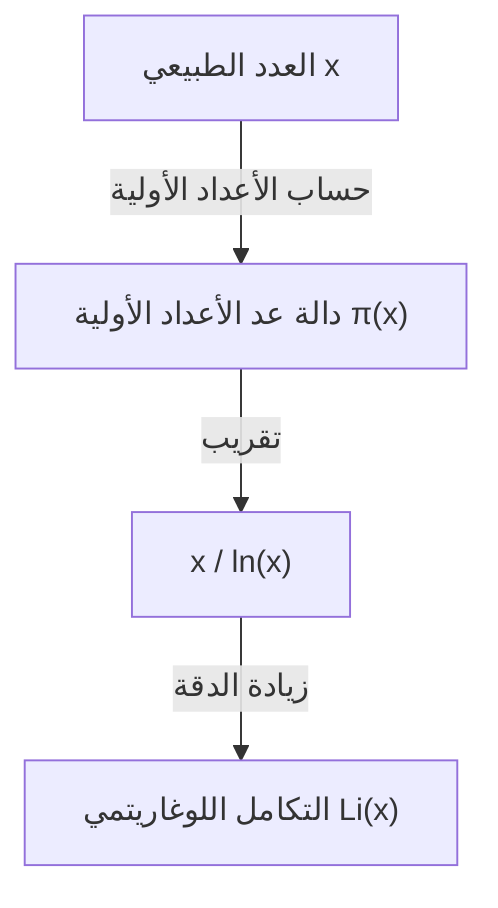

## ما هي نظرية الأعداد الأولية؟

من أجمل النتائج في مجال الرياضيات هي **نظرية الأعداد الأولية** (Prime Number Theorem, PNT). إنها توضح أن الأعداد الأولية، التي تبدو للوهلة الأولى غير منتظمة وتظهر بشكل عشوائي، تمتلك انتظامًا سلسًا بشكل مذهل عند النظر إليها من منظور كلي.

على وجه التحديد، إذا افترضنا أن "عدد الأعداد الأولية الأقل من أو تساوي عددًا حقيقيًا $x$" هو $\pi(x)$ (دالة عد الأعداد الأولية)، فإنه عندما يكون $x$ كبيرًا جدًا، تقترب $\pi(x)$ بشكل مقارب من $x / \ln(x)$. هذا هو نص النظرية.

$$ \lim_{x \to \infty} \frac{\pi(x)}{x / \ln(x)} = 1 $$

هنا، يمثل $\ln(x)$ اللوغاريتم الطبيعي (أساسه $e$). تنص هذه النظرية على حقيقة مذهلة وهي أن توزيع الأعداد الأولية مرتبط ارتباطًا وثيقًا باللوغاريتم الطبيعي.

### دالة عد الأعداد الأولية $\pi(x)$

دالة عد الأعداد الأولية $\pi(x)$ هي دالة تقوم بعد الأعداد الأولية الأقل من أو تساوي $x$. على سبيل المثال:

- $\pi(10) = 4$ (2, 3, 5, 7)
- $\pi(100) = 25$
- $\pi(1000) = 168$

كلما كبر العدد، أصبح العثور على الأعداد الأولية أكثر صعوبة، وتتسع فترات ظهورها تدريجيًا. ومع ذلك، تصبح "الكثافة" الإجمالية قابلة للتوقع.



## الخلفية التاريخية: من حدسية غاوس إلى الإثبات

يعود تاريخ نظرية الأعداد الأولية إلى أواخر القرن الثامن عشر. لاحظ عالم الرياضيات العبقري كارل فريدريش غاوس، وهو في الخامسة عشرة من عمره فقط، أثناء نظره في جداول الأعداد الأولية أن وتيرة ظهور الأعداد الأولية ترتبط بالدالة اللوغاريتمية. وفي نفس الوقت تقريبًا، وضع أدريان-ماري ليجاندر بشكل مستقل حدسية مشابهة.

ومع ذلك، لم يتمكنوا من إثبات ذلك بشكل صارم.

جاء التطور الكبير في الإثبات من خلال ورقة بحثية رائدة كتبها برنهارد ريمان عام 1859 بعنوان "حول عدد الأعداد الأولية الأقل من مقدار معين". قدم ريمان نهجًا جديدًا تمامًا باستخدام **دالة زيتا** $\zeta(s)$، وهي دالة مركبة، لتحويل مشكلة توزيع الأعداد الأولية إلى مشكلة على المستوى المركب.

$$ \zeta(s) = \sum_{n=1}^{\infty} \frac{1}{n^s} = \prod_{p \text{ أولي }} \left(1 - \frac{1}{p^s}\right)^{-1} $$

هذه الصيغة لضرب أويلر (Euler product formula) هي علاقة مهمة جدًا تربط بين دالة تتعلق بمجموع جميع الأعداد الطبيعية (الجانب الأيسر) وحاصل ضرب لانهائي يتعلق بالأعداد الأولية فقط (الجانب الأيمن).

بعد ذلك، في عام 1896، أكمل كل من جاك هادامار وشارل جان دي لا فالي بوسان بشكل مستقل إثبات نظرية الأعداد الأولية بناءً على أفكار ريمان. كان مفتاح إثباتهم هو توضيح أن "دالة زيتا لريمان $\zeta(s)$ ليس لها أصفار على الخط $\operatorname{Re}(s) = 1$ في المستوى المركب".

## تقريب أكثر دقة: التكامل اللوغاريتمي $\operatorname{Li}(x)$

في حين أن $x / \ln(x)$ يعبر عن نظرية الأعداد الأولية ببساطة، لتقريب العدد الفعلي للأعداد الأولية $\pi(x)$، فإن **التكامل اللوغاريتمي** (Logarithmic Integral, $\operatorname{Li}(x)$) الذي قدمه غاوس يعتبر أفضل بكثير.

يُعرّف التكامل اللوغاريتمي على النحو التالي:

$$ \operatorname{Li}(x) = \int_{2}^{x} \frac{dt}{\ln(t)} $$

يمكن أيضًا إعادة كتابة نظرية الأعداد الأولية على النحو التالي $\pi(x) \sim \operatorname{Li}(x)$.

$$ \lim_{x \to \infty} \frac{\pi(x)}{\operatorname{Li}(x)} = 1 $$

في الواقع، عندما يكون $x = 10^{10}$،
- $\pi(10^{10}) = 455,052,511$
- $10^{10} / \ln(10^{10}) \approx 434,294,481$ (الخطأ حوالي 4.5%)
- $\operatorname{Li}(10^{10}) \approx 455,055,614$ (الخطأ 3103 فقط)

يُظهر هذا مدى روعة التقريب الذي يوفره التكامل اللوغاريتمي.

## علاقة عميقة مع فرضية ريمان

يرتبط بنظرية الأعداد الأولية ارتباطًا لا ينفصل أهم مسألة غير محلولة في الرياضيات وهي **فرضية ريمان** (Riemann Hypothesis).

تنص فرضية ريمان على أن "جميع الأصفار غير البديهية لدالة زيتا لريمان $\zeta(s)$ تقع على الخط الذي يكون جزؤه الحقيقي $1/2$ (الخط الحرج)".

إذا ثبتت صحة فرضية ريمان، فسنحصل على أقوى تقييم ممكن لمصطلح الخطأ (الفرق بين $\pi(x)$ و $\operatorname{Li}(x)$) في نظرية الأعداد الأولية. على وجه التحديد، من المعروف أنه يوجد ثابت $C$ بحيث يتحقق:

$$ |\pi(x) - \operatorname{Li}(x)| \le C \sqrt{x} \ln(x) $$

هذا يعني أن "الأعداد الأولية موزعة بشكل منتظم للغاية لدرجة أنه لا يمكن تمييزها عن التوزيع العشوائي تمامًا". بعبارة أخرى، تتحدث نظرية الأعداد الأولية عن التوزيع "المتوسط" للأعداد الأولية، بينما تتحدث فرضية ريمان عن حدود "التقلب (الخطأ)" في هذا التوزيع.

## التحقق من نظرية الأعداد الأولية باستخدام Python

دعونا نستخدم البرمجة لملاحظة سلوك نظرية الأعداد الأولية عمليًا.

```python
import math
import matplotlib.pyplot as plt

def sieve_of_eratosthenes(limit):
    """
    سرد الأعداد الأولية باستخدام غربال إراتوستينس
    """
    is_prime = [True] * (limit + 1)
    p = 2
    while (p * p <= limit):
        if is_prime[p]:
            for i in range(p * p, limit + 1, p):
                is_prime[i] = False
        p += 1
    
    primes = [p for p in range(2, limit) if is_prime[p]]
    return primes

def pi(x, primes):
    """
    إرجاع عدد الأعداد الأولية الأقل من أو تساوي x
    """
    import bisect
    return bisect.bisect_right(primes, x)

limit = 1000000
primes = sieve_of_eratosthenes(limit)

x_values = [10**i for i in range(1, 7)]
pi_values = [pi(x, primes) for x in x_values]
approx_values = [x / math.log(x) for x in x_values]

print(f"{'x':<10} | {'π(x)':<10} | {'x / ln(x)':<15} | {'Ratio'}")
print("-" * 55)
for i in range(len(x_values)):
    x = x_values[i]
    pi_x = pi_values[i]
    approx = approx_values[i]
    ratio = pi_x / approx
    print(f"{x:<10} | {pi_x:<10} | {approx:<15.2f} | {ratio:.4f}")
```

عند تشغيل هذا الكود، يمكن ملاحظة أنه كلما زادت قيمة $x$، اقتربت النسبة $\pi(x) / (x/\ln(x))$ من 1. هذا أحد الأدلة القوية على نظرية الأعداد الأولية.

## التطبيقات في التشفير الحديث

لا تقتصر خصائص الأعداد الأولية على كونها موضوعًا مثيرًا للاهتمام في الرياضيات البحتة فحسب، بل هي أيضًا عنصر أساسي يدعم البنية التحتية الأمنية للمجتمع الحديث.

تستفيد خوارزميات تشفير المفتاح العام مثل RSA من خاصية أن "التحليل إلى العوامل الأولية للأعداد الصحيحة الضخمة أمر بالغ الصعوبة". تضمن نظرية الأعداد الأولية الاحتمال الذي يمكن من خلاله العثور على "أعداد أولية بالحجم المناسب" ضرورية لإنشاء مفاتيح التشفير.

على سبيل المثال، يُقدر احتمال أن يكون عدد فردي عشوائي مكون من 1024 بت عددًا أوليًا بحوالي $1 / (1024 \times \ln(2) / 2) \approx 1 / 355$. هذا يعني أنه من خلال إجراء بضع مئات من اختبارات الأعداد الأولية، يمكننا العثور على عدد أولي ضخم مطلوب باحتمالية عالية، وبدون نظرية الأعداد الأولية، سيكون من المستحيل بناء أنظمة تشفير فعالة.

## خلاصة

تعد نظرية الأعداد الأولية واحدة من أجمل النظريات التي تجسد "النظام داخل الفوضى" في الرياضيات. إن حقيقة أن القوانين الأساسية للطبيعة، مثل الدالة اللوغاريتمية، تكمن وراء توزيع الأعداد الأولية الذي يبدو عشوائيًا، تستمر في جذب العديد من علماء الرياضيات.

هذا المجال، الذي افتتحه عباقرة مثل غاوس، ريمان، وهادامار، لا يزال في طليعة الرياضيات الحديثة من خلال المشكلة الضخمة غير المحلولة وهي فرضية ريمان. إن لغز الأعداد الأولية عميق، وسيستمر الاستكشاف حتى اليوم الذي نفهم فيه الصورة الكاملة.
