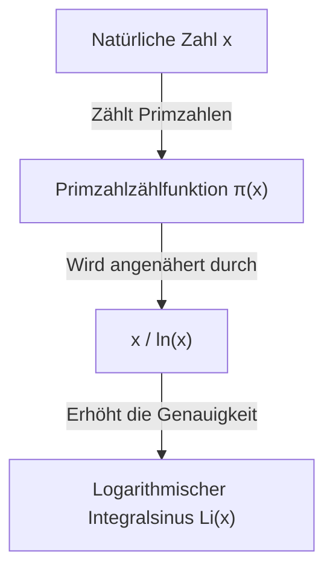

## Was ist der Primzahlsatz?

Eines der schönsten Ergebnisse im Bereich der Mathematik ist der **Primzahlsatz** ([Prime Number Theorem](https://kenji.blog/de/p/prime-number-theorem/), PNT). Er zeigt, dass Primzahlen, die auf den ersten Blick unregelmäßig und zufällig erscheinen, bei makroskopischer Betrachtung eine erstaunlich glatte Regelmäßigkeit aufweisen.

Konkret besagt der Satz: Wenn $\pi(x)$ (die Primzahlzählfunktion) die "Anzahl der Primzahlen bis zu einer reellen Zahl $x$" ist, nähert sich $\pi(x)$ für sehr große $x$ asymptotisch $x / \ln(x)$ an.

$$ \lim_{x \to \infty} \frac{\pi(x)}{x / \ln(x)} = 1 $$

Hierbei steht $\ln(x)$ für den natürlichen Logarithmus (zur Basis $e$). Dieser Satz drückt die erstaunliche Tatsache aus, dass die Verteilung der Primzahlen tief mit dem natürlichen Logarithmus verbunden ist.

### Primzahlzählfunktion $\pi(x)$

Die Primzahlzählfunktion $\pi(x)$ ist eine Funktion, die die Anzahl der Primzahlen bis $x$ zählt. Zum Beispiel:

- $\pi(10) = 4$ (2, 3, 5, 7)
- $\pi(100) = 25$
- $\pi(1000) = 168$

Je größer die Zahlen werden, desto schwieriger wird es, Primzahlen zu finden, und die Abstände zwischen ihnen werden allmählich größer. Aber die "Dichte" im Großen und Ganzen wird vorhersagbar.



## Historischer Hintergrund: Von der Gaußschen Vermutung zum Beweis

Die Geschichte des Primzahlsatzes reicht bis in das späte 18. Jahrhundert zurück. Der erst 15-jährige geniale Mathematiker [Carl Friedrich Gauß](https://kenji.blog/de/p/gauss/) bemerkte beim Betrachten von Primzahltabellen, dass die Häufigkeit des Auftretens von Primzahlen mit logarithmischen Funktionen zusammenhängt. Etwa zur gleichen Zeit stellte [Adrien-Marie Legendre](https://kenji.blog/de/p/legendre/) unabhängig davon eine ähnliche Vermutung auf.

Allerdings gelang es ihnen nicht, dies streng zu beweisen.

Ein großer Durchbruch beim Beweis kam durch die bahnbrechende Arbeit "Ueber die Anzahl der Primzahlen unter einer gegebenen Grösse" von [Bernhard Riemann](https://kenji.blog/de/p/riemann/) im Jahr 1859. [Riemann](https://kenji.blog/de/p/riemann/) präsentierte einen völlig neuen Ansatz, indem er die **Zeta-Funktion** $\zeta(s)$, eine komplexe Funktion, verwendete, um die Verteilung von Primzahlen in ein Problem auf der komplexen Zahlenebene zu transformieren.

$$ \zeta(s) = \sum_{n=1}^{\infty} \frac{1}{n^s} = \prod_{p \text{ prim}} \left(1 - \frac{1}{p^s}\right)^{-1} $$

Diese Formel für das Euler-Produkt (Euler product formula) ist eine äußerst wichtige Beziehung, die eine Funktion der Summe aller natürlichen Zahlen (linke Seite) mit einem unendlichen Produkt verbindet, das nur Primzahlen betrifft (rechte Seite).

Später, im Jahr 1896, vollendeten Jacques Hadamard und Charles de la Vallée Poussin unabhängig voneinander den Beweis des Primzahlsatzes auf der Grundlage von [Riemann](https://kenji.blog/de/p/riemann/)s Ideen. Der Schlüssel zu ihrem Beweis war zu zeigen, dass "die [Riemann](https://kenji.blog/de/p/riemann/)sche Zeta-Funktion $\zeta(s)$ keine Nullstellen auf der Geraden $\operatorname{Re}(s) = 1$ in der komplexen Ebene besitzt".

## Eine genauere Näherung: Das logarithmische Integral $\operatorname{Li}(x)$

Während $x / \ln(x)$ den Primzahlsatz einfach ausdrückt, ist das von Gauß eingeführte **logarithmische Integral** (Logarithmic Integral, $\operatorname{Li}(x)$) weitaus besser geeignet, um die tatsächliche Anzahl der Primzahlen $\pi(x)$ anzunähern.

Das logarithmische Integral ist wie folgt definiert:

$$ \operatorname{Li}(x) = \int_{2}^{x} \frac{dt}{\ln(t)} $$

Der Primzahlsatz kann auch als $\pi(x) \sim \operatorname{Li}(x)$ umgeschrieben werden.

$$ \lim_{x \to \infty} \frac{\pi(x)}{\operatorname{Li}(x)} = 1 $$

Tatsächlich, wenn $x = 10^{10}$:
- $\pi(10^{10}) = 455.052.511$
- $10^{10} / \ln(10^{10}) \approx 434.294.481$ (Fehler ca. 4,5%)
- $\operatorname{Li}(10^{10}) \approx 455.055.614$ (Fehler nur 3103)

Dies zeigt, welch hervorragende Näherung das logarithmische Integral bietet.

## Die tiefe Beziehung zur [Riemann](https://kenji.blog/de/p/riemann/)schen Vermutung

Untrennbar mit dem Primzahlsatz verbunden ist die **[Riemann](https://kenji.blog/de/p/riemann/)sche Vermutung** ([Riemann](https://kenji.blog/de/p/riemann/) Hypothesis), die als das wichtigste ungelöste Problem der Mathematik gilt.

Die [Riemann](https://kenji.blog/de/p/riemann/)sche Vermutung besagt, dass "alle nicht-trivialen Nullstellen der [Riemann](https://kenji.blog/de/p/riemann/)schen Zeta-Funktion $\zeta(s)$ auf der Geraden mit dem Realteil $1/2$ (der kritischen Geraden) liegen".

Wenn bewiesen wird, dass die [Riemann](https://kenji.blog/de/p/riemann/)sche Vermutung wahr ist, erhält man die stärkste Form der Abschätzung für den Fehlerterm im Primzahlsatz (die Differenz zwischen $\pi(x)$ und $\operatorname{Li}(x)$). Speziell ist bekannt, dass eine Konstante $C$ existiert, sodass gilt:

$$ |\pi(x) - \operatorname{Li}(x)| \le C \sqrt{x} \ln(x) $$

Dies bedeutet: "Primzahlen sind so extrem regelmäßig verteilt, dass sie von einer völlig zufälligen Verteilung nicht zu unterscheiden sind." Das heißt, der Primzahlsatz beschreibt die "durchschnittliche" Verteilung der Primzahlen, während die [Riemann](https://kenji.blog/de/p/riemann/)sche Vermutung die Grenzen dieser "Schwankung (Fehler)" beschreibt.

## Den Primzahlsatz in Python überprüfen

Lassen Sie uns das Verhalten des Primzahlsatzes mithilfe der Programmierung in der Praxis beobachten.

```python
import math
import matplotlib.pyplot as plt

def sieve_of_eratosthenes(limit):
    """
    Listet Primzahlen mit dem Sieb des Eratosthenes auf
    """
    is_prime = [True] * (limit + 1)
    p = 2
    while (p * p <= limit):
        if is_prime[p]:
            for i in range(p * p, limit + 1, p):
                is_prime[i] = False
        p += 1
    
    primes = [p for p in range(2, limit) if is_prime[p]]
    return primes

def pi(x, primes):
    """
    Gibt die Anzahl der Primzahlen bis zu x zurück
    """
    import bisect
    return bisect.bisect_right(primes, x)

limit = 1000000
primes = sieve_of_eratosthenes(limit)

x_values = [10**i for i in range(1, 7)]
pi_values = [pi(x, primes) for x in x_values]
approx_values = [x / math.log(x) for x in x_values]

print(f"{'x':<10} | {'π(x)':<10} | {'x / ln(x)':<15} | {'Ratio'}")
print("-" * 55)
for i in range(len(x_values)):
    x = x_values[i]
    pi_x = pi_values[i]
    approx = approx_values[i]
    ratio = pi_x / approx
    print(f"{x:<10} | {pi_x:<10} | {approx:<15.2f} | {ratio:.4f}")
```

Wenn Sie diesen Code ausführen, können Sie beobachten, dass sich das Verhältnis $\pi(x) / (x/\ln(x))$ der 1 nähert, wenn $x$ größer wird. Dies ist einer der stärksten Beweise für den Primzahlsatz.

## Anwendungen in der modernen Kryptographie

Die Eigenschaften von Primzahlen sind nicht nur ein interessantes Objekt der reinen Mathematik, sondern auch ein wichtiges Element, das die Sicherheitsinfrastruktur der modernen Gesellschaft stützt.

Public-Key-Verschlüsselungsverfahren wie [RSA](https://kenji.blog/de/p/modern-cryptography-public-key-hash-signature/) nutzen die Eigenschaft, dass "die Primfaktorzerlegung riesiger ganzer Zahlen extrem schwierig ist". Der Primzahlsatz garantiert uns, mit welcher Wahrscheinlichkeit wir "Primzahlen von angemessener Größe" finden, die zur Generierung kryptographischer Schlüssel erforderlich sind.

Beispielsweise wird die Wahrscheinlichkeit, dass eine zufällige ungerade 1024-Bit-Zahl eine Primzahl ist, auf etwa $1 / (1024 \times \ln(2) / 2) \approx 1 / 355$ geschätzt. Dies bedeutet, dass man nach ein paar hundert Primzahltests mit hoher Wahrscheinlichkeit eine benötigte riesige Primzahl findet, und ohne den Primzahlsatz wäre der Aufbau effizienter kryptographischer Systeme unmöglich.

## Zusammenfassung

Der Primzahlsatz ist einer der schönsten Sätze in der Mathematik, der die "Ordnung im Chaos" verkörpert. Die Tatsache, dass sich hinter der scheinbar zufälligen Verteilung von Primzahlen ein grundlegendes Naturgesetz in Form einer logarithmischen Funktion verbirgt, fasziniert Mathematiker weiterhin.

Dieses von Genies wie Gauß, [Riemann](https://kenji.blog/de/p/riemann/) und Hadamard erschlossene Gebiet bleibt durch das enorme ungelöste Problem der [Riemann](https://kenji.blog/de/p/riemann/)schen Vermutung an der Spitze der modernen Mathematik. Das Geheimnis der Primzahlen ist tief, und die Erforschung wird weitergehen, bis wir das ganze Bild verstehen.
