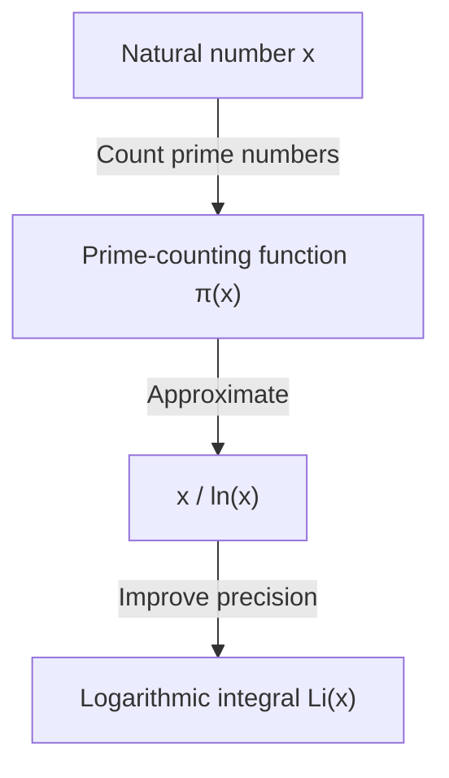

## What is the [Prime Number Theorem](https://kenji.blog/p/prime-number-theorem/)?

One of the most beautiful results in the field of mathematics is the **[Prime Number Theorem](https://kenji.blog/p/prime-number-theorem/)** (PNT). It shows that prime numbers, which at first glance appear irregularly and randomly, possess an surprisingly smooth regularity when viewed macroscopically.

Specifically, when letting $\pi(x)$ (the prime-counting function) be "the number of prime numbers less than or equal to a real number $x$", the theorem states that as $x$ becomes very large, $\pi(x)$ is asymptotic to $x / \ln(x)$.

$$ \lim_{x \to \infty} \frac{\pi(x)}{x / \ln(x)} = 1 $$

Here, $\ln(x)$ represents the natural logarithm (base $e$). This theorem states the surprising fact that the distribution of prime numbers is deeply connected to the natural logarithm.

### The Prime-Counting Function $\pi(x)$

The prime-counting function $\pi(x)$ is a function that counts the number of primes less than or equal to $x$. For example:

- $\pi(10) = 4$ (2, 3, 5, 7)
- $\pi(100) = 25$
- $\pi(1000) = 168$

As numbers become larger, finding prime numbers becomes difficult, and the intervals between their appearances gradually widen. However, the "density" as a whole becomes predictable.



## Historical Background: From Gauss's Conjecture to Proof

The history of the [Prime Number Theorem](https://kenji.blog/p/prime-number-theorem/) dates back to the late 18th century. The 15-year-old genius mathematician [Carl Friedrich Gauss](https://kenji.blog/p/gauss/), while looking at a table of prime numbers, noticed that the frequency of prime numbers is related to a logarithmic function. Around the same time, [Adrien-Marie Legendre](https://kenji.blog/p/legendre/) independently formulated a similar conjecture.

However, they could not strictly prove this.

A major breakthrough in the proof was brought about by [Bernhard Riemann](https://kenji.blog/p/riemann/)'s groundbreaking 1859 paper, "On the Number of Primes Less Than a Given Magnitude." Riemann presented a completely new approach of transforming the distribution of prime numbers into a problem on the complex plane using the **Riemann zeta function** $\zeta(s)$, which is a complex function.

$$ \zeta(s) = \sum_{n=1}^{\infty} \frac{1}{n^s} = \prod_{p \text{ prime}} \left(1 - \frac{1}{p^s}\right)^{-1} $$

This Euler product formula is a very important relation that connects a function of the sum of all natural numbers (left side) with an infinite product over only prime numbers (right side).

Later, in 1896, Jacques Hadamard and Charles de la Vallée Poussin independently completed the proof of the [Prime Number Theorem](https://kenji.blog/p/prime-number-theorem/) based on Riemann's ideas. The key to their proof was to show that "the Riemann zeta function $\zeta(s)$ has no zeros on the line $\operatorname{Re}(s) = 1$ in the complex plane."

## A More Precise Approximation: The Logarithmic Integral $\operatorname{Li}(x)$

Although $x / \ln(x)$ expresses the [Prime Number Theorem](https://kenji.blog/p/prime-number-theorem/) simply, the actual number of primes $\pi(x)$ is much better approximated by the **Logarithmic Integral** ($\operatorname{Li}(x)$), introduced by Gauss.

The logarithmic integral is defined as follows:

$$ \operatorname{Li}(x) = \int_{2}^{x} \frac{dt}{\ln(dt)} $$

The [Prime Number Theorem](https://kenji.blog/p/prime-number-theorem/) can also be rewritten as $\pi(x) \sim \operatorname{Li}(x)$.

$$ \lim_{x \to \infty} \frac{\pi(x)}{\operatorname{Li}(x)} = 1 $$

In fact, when $x = 10^{10}$:
- $\pi(10^{10}) = 455,052,511$
- $10^{10} / \ln(10^{10}) \approx 434,294,481$ (an error of about 4.5%)
- $\operatorname{Li}(10^{10}) \approx 455,055,614$ (an error of only 3103)

You can see what an excellent approximation the logarithmic integral provides.

## Deep Relationship with the Riemann Hypothesis

Inseparably linked to the [Prime Number Theorem](https://kenji.blog/p/prime-number-theorem/) is the **Riemann Hypothesis**, considered the most important unsolved problem in mathematics.

The Riemann Hypothesis claims that "all non-trivial zeros of the Riemann zeta function $\zeta(s)$ lie on the line (the critical line) where the real part is $1/2$."

If the Riemann Hypothesis is proven to be true, we will obtain the strongest form of evaluation for the error term (the difference between $\pi(x)$ and $\operatorname{Li}(x)$) in the [Prime Number Theorem](https://kenji.blog/p/prime-number-theorem/). Specifically, it is known that there exists a constant $C$ such that:

$$ |\pi(x) - \operatorname{Li}(x)| \le C \sqrt{x} \ln(x) $$

This means that "prime numbers are distributed so extremely regularly that they are indistinguishable from being completely randomly distributed." In other words, the [Prime Number Theorem](https://kenji.blog/p/prime-number-theorem/) tells of the "average" distribution of primes, while the Riemann Hypothesis tells of the limits of its "fluctuations (errors)."

## Verifying the [Prime Number Theorem](https://kenji.blog/p/prime-number-theorem/) in Python

Let's actually observe the behavior of the [Prime Number Theorem](https://kenji.blog/p/prime-number-theorem/) using programming.

```python
import math
import matplotlib.pyplot as plt

def sieve_of_eratosthenes(limit):
    """
    Enumerate prime numbers using the Sieve of Eratosthenes
    """
    is_prime = [True] * (limit + 1)
    p = 2
    while (p * p <= limit):
        if is_prime[p]:
            for i in range(p * p, limit + 1, p):
                is_prime[i] = False
        p += 1
    
    primes = [p for p in range(2, limit) if is_prime[p]]
    return primes

def pi(x, primes):
    """
    Return the number of prime numbers less than or equal to x
    """
    import bisect
    return bisect.bisect_right(primes, x)

limit = 1000000
primes = sieve_of_eratosthenes(limit)

x_values = [10**i for i in range(1, 7)]
pi_values = [pi(x, primes) for x in x_values]
approx_values = [x / math.log(x) for x in x_values]

print(f"{'x':<10} | {'π(x)':<10} | {'x / ln(x)':<15} | {'Ratio'}")
print("-" * 55)
for i in range(len(x_values)):
    x = x_values[i]
    pi_x = pi_values[i]
    approx = approx_values[i]
    ratio = pi_x / approx
    print(f"{x:<10} | {pi_x:<10} | {approx:<15.2f} | {ratio:.4f}")
```

When you run this code, you can observe that as $x$ increases, the ratio $\pi(x) / (x/\ln(x))$ approaches 1. This is one of the strong pieces of evidence for the [Prime Number Theorem](https://kenji.blog/p/prime-number-theorem/).

## Applications to Modern Cryptography

The properties of prime numbers are not just interesting subjects in pure mathematics, but they are also important elements that support the security infrastructure of modern society.

Public-key cryptography systems, such as RSA cryptography, utilize the property that "the prime factorization of huge integers is extremely difficult." The [Prime Number Theorem](https://kenji.blog/p/prime-number-theorem/) guarantees the probability of finding "primes of an appropriate size" necessary for generating cryptographic keys.

For example, the probability that a random 1024-bit odd number is prime is estimated to be approximately $1 / (1024 \times \ln(2) / 2) \approx 1 / 355$. This means that by performing a few hundred primality tests, you can find a necessary huge prime number with high probability, making the construction of an efficient cryptographic system impossible without the [Prime Number Theorem](https://kenji.blog/p/prime-number-theorem/).

## Conclusion

The [Prime Number Theorem](https://kenji.blog/p/prime-number-theorem/) is one of the most beautiful theorems that embodies "order within chaos" in mathematics. The fact that the fundamental law of the natural world, the logarithmic function, lies hidden within the seemingly random distribution of prime numbers continues to fascinate many mathematicians.

This field, opened up by geniuses such as Gauss, Riemann, and Hadamard, continues to be at the forefront of modern mathematics through the huge unsolved problem of the Riemann Hypothesis. The mysteries of prime numbers are deep, and the exploration will likely continue until the day we understand the full picture.
