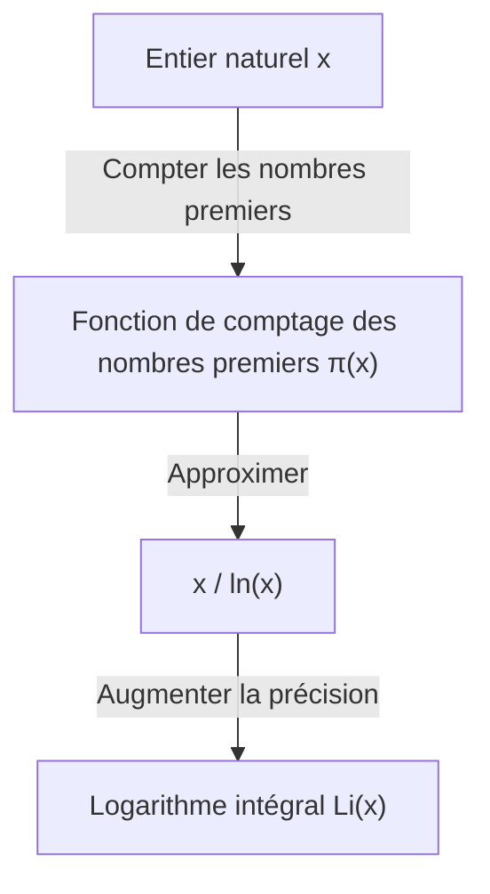

## Qu'est-ce que le théorème des nombres premiers ?

L'un des résultats les plus beaux dans le domaine des mathématiques est le **théorème des nombres premiers** ([Prime Number Theorem](https://kenji.blog/fr/p/prime-number-theorem/), PNT). Il montre que les nombres premiers, qui semblent apparaître de manière irrégulière et aléatoire à première vue, possèdent une régularité étonnamment lisse lorsqu'ils sont observés à une échelle macroscopique.

Plus précisément, si l'on note $\pi(x)$ (fonction de comptage des nombres premiers) le "nombre de nombres premiers inférieurs ou égaux à un certain nombre réel $x$", le théorème stipule que lorsque $x$ est très grand, $\pi(x)$ est asymptotique à $x / \ln(x)$.

$$ \lim_{x \to \infty} \frac{\pi(x)}{x / \ln(x)} = 1 $$

Ici, $\ln(x)$ représente le logarithme népérien (de base $e$). Ce théorème énonce le fait surprenant que la distribution des nombres premiers est profondément liée au logarithme népérien.

### Fonction de comptage des nombres premiers $\pi(x)$

La fonction de comptage des nombres premiers $\pi(x)$ est une fonction qui compte le nombre de nombres premiers inférieurs ou égaux à $x$. Par exemple :

- $\pi(10) = 4$ (2, 3, 5, 7)
- $\pi(100) = 25$
- $\pi(1000) = 168$

À mesure que les nombres deviennent plus grands, il devient plus difficile de trouver des nombres premiers, et l'intervalle entre leurs apparitions s'élargit progressivement. Cependant, leur "densité" globale devient prévisible.



## Contexte historique : De la conjecture de Gauss à la preuve

L'histoire du théorème des nombres premiers remonte à la fin du 18ème siècle. Le mathématicien de génie [Carl Friedrich Gauss](https://kenji.blog/fr/p/gauss/), alors âgé de seulement 15 ans, en observant des tables de nombres premiers, remarqua que la fréquence d'apparition des nombres premiers était liée à la fonction logarithmique. Vers la même époque, [Adrien-Marie Legendre](https://kenji.blog/fr/p/legendre/) formula indépendamment une conjecture similaire.

Cependant, ils ne parvinrent pas à prouver cela de manière rigoureuse.

Une avancée majeure dans la preuve a été apportée par l'article révolutionnaire de [Bernhard Riemann](https://kenji.blog/fr/p/riemann/) de 1859, "Sur le nombre de nombres premiers inférieurs à une taille donnée". [Riemann](https://kenji.blog/fr/p/riemann/) a présenté une approche entièrement nouvelle en utilisant la **fonction zêta** $\zeta(s)$, qui est une fonction complexe, pour transformer le problème de la distribution des nombres premiers en un problème sur le plan complexe.

$$ \zeta(s) = \sum_{n=1}^{\infty} \frac{1}{n^s} = \prod_{p \text{ premier}} \left(1 - \frac{1}{p^s}\right)^{-1} $$

Cette formule du produit d'Euler (Euler product formula) est une relation extrêmement importante qui relie une fonction sur la somme de tous les entiers naturels (côté gauche) et un produit infini portant uniquement sur les nombres premiers (côté droit).

Par la suite, en 1896, Jacques Hadamard et Charles de La Vallée Poussin ont chacun achevé, de manière indépendante, la preuve du théorème des nombres premiers en se basant sur les idées de [Riemann](https://kenji.blog/fr/p/riemann/). La clé de leur preuve était de montrer que "la fonction zêta de [Riemann](https://kenji.blog/fr/p/riemann/) $\zeta(s)$ n'a pas de zéros sur la droite $\operatorname{Re}(s) = 1$ du plan complexe".

## Une approximation plus précise : Le logarithme intégral $\operatorname{Li}(x)$

Bien que $x / \ln(x)$ exprime simplement le théorème des nombres premiers, le **logarithme intégral** (Logarithmic Integral, $\operatorname{Li}(x)$) introduit par Gauss est bien meilleur pour approximer le nombre réel de nombres premiers $\pi(x)$.

Le logarithme intégral est défini comme suit :

$$ \operatorname{Li}(x) = \int_{2}^{x} \frac{dt}{\ln(t)} $$

Le théorème des nombres premiers peut également être réécrit comme $\pi(x) \sim \operatorname{Li}(x)$.

$$ \lim_{x \to \infty} \frac{\pi(x)}{\operatorname{Li}(x)} = 1 $$

En fait, lorsque $x = 10^{10}$,
- $\pi(10^{10}) = 455,052,511$
- $10^{10} / \ln(10^{10}) \approx 434,294,481$ (erreur d'environ 4.5%)
- $\operatorname{Li}(10^{10}) \approx 455,055,614$ (erreur de seulement 3103)

On peut voir à quel point le logarithme intégral donne une excellente approximation.

## La relation profonde avec l'hypothèse de [Riemann](https://kenji.blog/fr/p/riemann/)

Le théorème des nombres premiers est indissociablement lié à l'**hypothèse de [Riemann](https://kenji.blog/fr/p/riemann/)** ([Riemann](https://kenji.blog/fr/p/riemann/) Hypothesis), considérée comme le problème non résolu le plus important en mathématiques.

L'hypothèse de [Riemann](https://kenji.blog/fr/p/riemann/) affirme que "tous les zéros non triviaux de la fonction zêta de [Riemann](https://kenji.blog/fr/p/riemann/) $\zeta(s)$ se trouvent sur la droite (ligne critique) dont la partie réelle est $1/2$".

S'il est prouvé que l'hypothèse de [Riemann](https://kenji.blog/fr/p/riemann/) est correcte, nous obtiendrons l'évaluation la plus forte possible concernant le terme d'erreur (la différence entre $\pi(x)$ et $\operatorname{Li}(x)$) dans le théorème des nombres premiers. Plus précisément, on sait qu'il existerait une constante $C$ telle que,

$$ |\pi(x) - \operatorname{Li}(x)| \le C \sqrt{x} \ln(x) $$

Cela signifie que "les nombres premiers sont distribués de manière si régulière qu'ils sont indiscernables d'une distribution complètement aléatoire". En d'autres termes, le théorème des nombres premiers décrit la distribution "moyenne" des nombres premiers, tandis que l'hypothèse de [Riemann](https://kenji.blog/fr/p/riemann/) décrit la limite de leurs "fluctuations (erreurs)".

## Vérification du théorème des nombres premiers en Python

Observons le comportement du théorème des nombres premiers en utilisant concrètement la programmation.

```python
import math
import matplotlib.pyplot as plt

def sieve_of_eratosthenes(limit):
    """
    Énumère les nombres premiers en utilisant le crible d'Ératosthène
    """
    is_prime = [True] * (limit + 1)
    p = 2
    while (p * p <= limit):
        if is_prime[p]:
            for i in range(p * p, limit + 1, p):
                is_prime[i] = False
        p += 1
    
    primes = [p for p in range(2, limit) if is_prime[p]]
    return primes

def pi(x, primes):
    """
    Renvoie le nombre de nombres premiers inférieurs ou égaux à x
    """
    import bisect
    return bisect.bisect_right(primes, x)

limit = 1000000
primes = sieve_of_eratosthenes(limit)

x_values = [10**i for i in range(1, 7)]
pi_values = [pi(x, primes) for x in x_values]
approx_values = [x / math.log(x) for x in x_values]

print(f"{'x':<10} | {'π(x)':<10} | {'x / ln(x)':<15} | {'Ratio'}")
print("-" * 55)
for i in range(len(x_values)):
    x = x_values[i]
    pi_x = pi_values[i]
    approx = approx_values[i]
    ratio = pi_x / approx
    print(f"{x:<10} | {pi_x:<10} | {approx:<15.2f} | {ratio:.4f}")
```

En exécutant ce code, on peut observer que le ratio $\pi(x) / (x/\ln(x))$ se rapproche de 1 à mesure que $x$ devient plus grand. C'est l'une des preuves solides du théorème des nombres premiers.

## Applications à la cryptographie moderne

Les propriétés des nombres premiers ne sont pas seulement un sujet fascinant en mathématiques pures, mais elles sont aussi un élément crucial qui soutient l'infrastructure de sécurité de notre société moderne.

La cryptographie à clé publique, telle que le chiffrement [RSA](https://kenji.blog/fr/p/modern-cryptography-public-key-hash-signature/), utilise la propriété selon laquelle "la factorisation en nombres premiers d'entiers gigantesques est extrêmement difficile". Le théorème des nombres premiers garantit la probabilité de trouver un "nombre premier d'une taille appropriée", ce qui est nécessaire pour la génération de clés cryptographiques.

Par exemple, la probabilité qu'un nombre impair aléatoire de 1024 bits soit premier est estimée à environ $1 / (1024 \times \ln(2) / 2) \approx 1 / 355$. Cela signifie qu'en effectuant le test de primalité quelques centaines de fois, on peut trouver un grand nombre premier nécessaire avec une probabilité élevée, et sans le théorème des nombres premiers, la construction de systèmes cryptographiques efficaces serait impossible.

## Conclusion

Le théorème des nombres premiers est l'un des plus beaux théorèmes incarnant "l'ordre dans le chaos" en mathématiques. Le fait qu'une loi fondamentale de la nature, telle que la fonction logarithmique, se cache dans la distribution apparemment aléatoire des nombres premiers continue de fasciner de nombreux mathématiciens.

Ce domaine, défriché par des génies tels que Gauss, [Riemann](https://kenji.blog/fr/p/riemann/) et Hadamard, reste à la pointe des mathématiques modernes à travers le problème colossal et non résolu de l'hypothèse de [Riemann](https://kenji.blog/fr/p/riemann/). Le mystère des nombres premiers est profond, et la quête se poursuivra probablement jusqu'au jour où nous en comprendrons l'intégralité.
