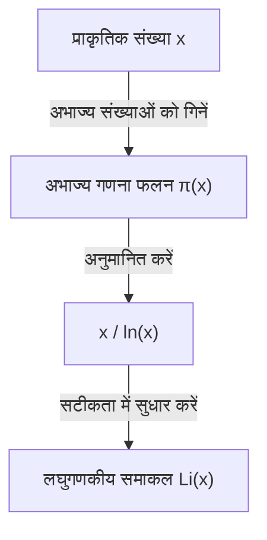

## अभाज्य संख्या प्रमेय क्या है?

गणित के क्षेत्र में सबसे सुंदर परिणामों में से एक **अभाज्य संख्या प्रमेय** (Prime Number Theorem, PNT) है। यह दर्शाता है कि अभाज्य संख्याएँ, जो पहली नज़र में अनियमित और यादृच्छिक रूप से प्रकट होती हैं, एक बहुत ही सुचारू नियमितता रखती हैं जब उन्हें मैक्रोस्कोपिक रूप से देखा जाता है।

विशेष रूप से, यदि हम किसी वास्तविक संख्या $x$ या उससे कम की अभाज्य संख्याओं की संख्या को $\pi(x)$ (अभाज्य गणना फलन) मानते हैं, तो प्रमेय बताता है कि जब $x$ बहुत बड़ा होता है, $\pi(x)$ , $x / \ln(x)$ के अनंतस्पर्शी (asymptotic) होता है।

$$ \lim_{x \to \infty} \frac{\pi(x)}{x / \ln(x)} = 1 $$

यहाँ, $\ln(x)$ प्राकृतिक लघुगणक (जिसका आधार $e$ है) का प्रतिनिधित्व करता है। यह प्रमेय एक आश्चर्यजनक तथ्य बताता है कि अभाज्य संख्याओं का वितरण प्राकृतिक लघुगणक के साथ गहराई से जुड़ा हुआ है।

### अभाज्य गणना फलन $\pi(x)$

अभाज्य गणना फलन $\pi(x)$ एक ऐसा फलन है जो $x$ और उससे कम की अभाज्य संख्याओं को गिनता है। उदाहरण के लिए:

- $\pi(10) = 4$ (2, 3, 5, 7)
- $\pi(100) = 25$
- $\pi(1000) = 168$

जैसे-जैसे संख्याएँ बड़ी होती जाती हैं, अभाज्य संख्याएँ खोजना कठिन होता जाता है, और उनके प्रकट होने का अंतराल धीरे-धीरे बढ़ता जाता है। हालाँकि, समग्र "घनत्व" का अनुमान लगाया जा सकता है।



## ऐतिहासिक पृष्ठभूमि: गॉस के अनुमान से लेकर प्रमाण तक

अभाज्य संख्या प्रमेय का इतिहास 18वीं सदी के अंत तक जाता है। केवल 15 वर्ष की आयु के एक प्रतिभाशाली गणितज्ञ कार्ल फ्रेडरिक गॉस ने अभाज्य संख्याओं की एक तालिका को देखते हुए देखा कि अभाज्य संख्याओं के प्रकट होने की आवृत्ति लघुगणकीय फलन से संबंधित है। उसी समय के आसपास, एड्रियन-मैरी लीजेंड्रे ने भी स्वतंत्र रूप से एक समान अनुमान लगाया।

हालाँकि, वे इसे सख्ती से साबित करने में असमर्थ रहे।

प्रमाण में एक बड़ी सफलता 1859 में बर्नहार्ड रीमैन के युगান্তकारी पेपर "दिए गए परिमाण से कम अभाज्य संख्याओं की संख्या पर" द्वारा लाई गई थी। रीमैन ने एक जटिल फलन, **ज़ीटा फलन** $\zeta(s)$ का उपयोग करके, अभाज्य संख्याओं के वितरण को सम्मिश्र संख्या तल पर एक समस्या में बदलने का एक पूरी तरह से नया दृष्टिकोण प्रस्तुत किया।

$$ \zeta(s) = \sum_{n=1}^{\infty} \frac{1}{n^s} = \prod_{p \text{ अभाज्य}} \left(1 - \frac{1}{p^s}\right)^{-1} $$

यह यूलर उत्पाद सूत्र (Euler product formula) एक अत्यंत महत्वपूर्ण संबंध है जो सभी प्राकृतिक संख्याओं के योग से संबंधित फलन (बाईं ओर) को केवल अभाज्य संख्याओं के अनंत गुणनफल (दाईं ओर) से जोड़ता है।

बाद में, 1896 में, जैक्स हैडमार्ड और चार्ल्स डी ला वैले-पूसिन ने रीमैन के विचारों के आधार पर स्वतंत्र रूप से अभाज्य संख्या प्रमेय का प्रमाण पूरा किया। उनके प्रमाण की कुंजी यह दिखाना था कि "रीमैन ज़ीटा फलन $\zeta(s)$ की सम्मिश्र तल पर रेखा $\operatorname{Re}(s) = 1$ पर कोई शून्य (zeros) नहीं है।"

## उच्च सटीकता का सन्निकटन: लघुगणकीय समाकल $\operatorname{Li}(x)$

यद्यपि $x / \ln(x)$ अभाज्य संख्या प्रमेय को सरलता से व्यक्त करता है, गॉस द्वारा प्रस्तुत **लघुगणकीय समाकल** (Logarithmic Integral, $\operatorname{Li}(x)$) वास्तविक अभाज्य संख्याओं की संख्या $\pi(x)$ का अनुमान लगाने में कहीं बेहतर है।

लघुगणकीय समाकल को इस प्रकार परिभाषित किया गया है:

$$ \operatorname{Li}(x) = \int_{2}^{x} \frac{dt}{\ln(dt)} $$

अभाज्य संख्या प्रमेय को $\pi(x) \sim \operatorname{Li}(x)$ के रूप में भी लिखा जा सकता है।

$$ \lim_{x \to \infty} \frac{\pi(x)}{\operatorname{Li}(x)} = 1 $$

वास्तव में, जब $x = 10^{10}$ होता है,
- $\pi(10^{10}) = 455,052,511$
- $10^{10} / \ln(10^{10}) \approx 434,294,481$ (लगभग 4.5% की त्रुटि)
- $\operatorname{Li}(10^{10}) \approx 455,055,614$ (केवल 3103 की त्रुटि)

आप देख सकते हैं कि लघुगणकीय समाकल कितना उत्कृष्ट सन्निकटन प्रदान करता है।

## रीमैन परिकल्पना के साथ गहरा संबंध

अभाज्य संख्या प्रमेय से अटूट रूप से जुड़ी हुई गणित की सबसे महत्वपूर्ण अनसुलझी समस्या है **रीमैन परिकल्पना** (Riemann Hypothesis)।

रीमैन परिकल्पना का दावा है कि "रीमैन ज़ीटा फलन $\zeta(s)$ के सभी गैर-तुच्छ शून्य (non-trivial zeros) उस रेखा पर हैं जिसका वास्तविक भाग $1/2$ है (क्रांतिक रेखा)।"

यदि रीमैन परिकल्पना को सही साबित कर दिया जाता है, तो हमें अभाज्य संख्या प्रमेय में त्रुटि पद ($\pi(x)$ और $\operatorname{Li}(x)$ के बीच का अंतर) के लिए सबसे मजबूत संभव मूल्यांकन प्राप्त होगा। विशेष रूप से, यह ज्ञात है कि एक स्थिरांक $C$ मौजूद है ताकि,

$$ |\pi(x) - \operatorname{Li}(x)| \le C \sqrt{x} \ln(x) $$

सत्य हो। इसका मतलब है कि "अभाज्य संख्याएँ इतनी नियमित रूप से वितरित होती हैं कि उन्हें पूरी तरह से यादृच्छिक रूप से वितरित होने की स्थिति से अलग नहीं किया जा सकता है।" दूसरे शब्दों में, अभाज्य संख्या प्रमेय अभाज्य संख्याओं के "औसत" वितरण के बारे में बात करता है, और रीमैन परिकल्पना इसके "उतार-चढ़ाव (त्रुटि)" की सीमा के बारे में बात करती है।

## Python में अभाज्य संख्या प्रमेय का सत्यापन

आइए वास्तव में प्रोग्रामिंग का उपयोग करके अभाज्य संख्या प्रमेय के व्यवहार का निरीक्षण करें।

```python
import math
import matplotlib.pyplot as plt

def sieve_of_eratosthenes(limit):
    """
    इरेटोस्थनीज की छलनी का उपयोग करके अभाज्य संख्याओं को सूचीबद्ध करें
    """
    is_prime = [True] * (limit + 1)
    p = 2
    while (p * p <= limit):
        if is_prime[p]:
            for i in range(p * p, limit + 1, p):
                is_prime[i] = False
        p += 1
    
    primes = [p for p in range(2, limit) if is_prime[p]]
    return primes

def pi(x, primes):
    """
    x और उससे कम की अभाज्य संख्याओं की गिनती लौटाता है
    """
    import bisect
    return bisect.bisect_right(primes, x)

limit = 1000000
primes = sieve_of_eratosthenes(limit)

x_values = [10**i for i in range(1, 7)]
pi_values = [pi(x, primes) for x in x_values]
approx_values = [x / math.log(x) for x in x_values]

print(f"{'x':<10} | {'π(x)':<10} | {'x / ln(x)':<15} | {'Ratio'}")
print("-" * 55)
for i in range(len(x_values)):
    x = x_values[i]
    pi_x = pi_values[i]
    approx = approx_values[i]
    ratio = pi_x / approx
    print(f"{x:<10} | {pi_x:<10} | {approx:<15.2f} | {ratio:.4f}")
```

इस कोड को चलाने पर, हम देख सकते हैं कि जैसे-जैसे $x$ बढ़ता है, अनुपात $\pi(x) / (x/\ln(x))$ , 1 के करीब पहुंचता है। यह अभाज्य संख्या प्रमेय के मजबूत प्रमाणों में से্বা एक है।

## आधुनिक क्रिप्टोग्राफी (Cryptography) में अनुप्रयोग

अभाज्य संख्याओं के गुण केवल शुद्ध गणित में रुचि का विषय नहीं हैं, बल्कि वे आधुनिक समाज के सुरक्षा आधारभूत ढांचे का समर्थन करने वाले महत्वपूर्ण तत्व भी हैं।

RSA क्रिप्टोग्राफी जैसे सार्वजनिक-कुंजी (public-key) क्रिप्टोग्राफी सिस्टम इस गुण का उपयोग करते हैं कि "विशाल पूर्णांकों का गुणनखंडन बहुत कठिन है।" अभाज्य संख्या प्रमेय यह गारंटी देता है कि एन्क्रिप्शन कुंजी बनाने के लिए आवश्यक "उचित आकार की अभाज्य संख्याएँ" किस संभावना के साथ पाई जा सकती हैं।

उदाहरण के लिए, एक 1024-बिट यादृच्छिक विषम संख्या के अभाज्य होने की संभावना लगभग $1 / (1024 \times \ln(2) / 2) \approx 1 / 355$ होने का अनुमान है। इसका मतलब है कि यदि आप कुछ सौ बार अभाज्य संख्या परीक्षण करते हैं, तो एक उच्च संभावना है कि आप आवश्यक विशाल अभाज्य संख्या पाएंगे, और अभाज्य संख्या प्रमेय के बिना एक कुशल एन्क्रिप्शन प्रणाली का निर्माण करना असंभव है।

## निष्कर्ष

अभाज्य संख्या प्रमेय गणित में "अराजकता में व्यवस्था" को मूर्त रूप देने वाले सबसे सुंदर प्रमेयों में से एक है। यह तथ्य कि लघुगणकीय फलन का मौलिक प्राकृतिक नियम, पहली नज़र में अभाज्य संख्याओं के यादृच्छिक रूप से दिखाई देने वाले वितरण में छिपा है, कई गणितज्ञों को आकर्षित करता रहता है।

गॉस, रीमैन और हैडमार्ड जैसे प्रतिभावान लोगों द्वारा शुरू किया गया यह क्षेत्र, आज भी रीमैन परिकल्पना की विशाल अनसुलझी समस्या के माध्यम से आधुनिक गणित में सबसे आगे बना हुआ है। अभाज्य संख्याओं का रहस्य गहरा है, और जब तक हम पूरी तस्वीर को नहीं समझ लेते, तब तक अन्वेषण जारी रहेगा।
