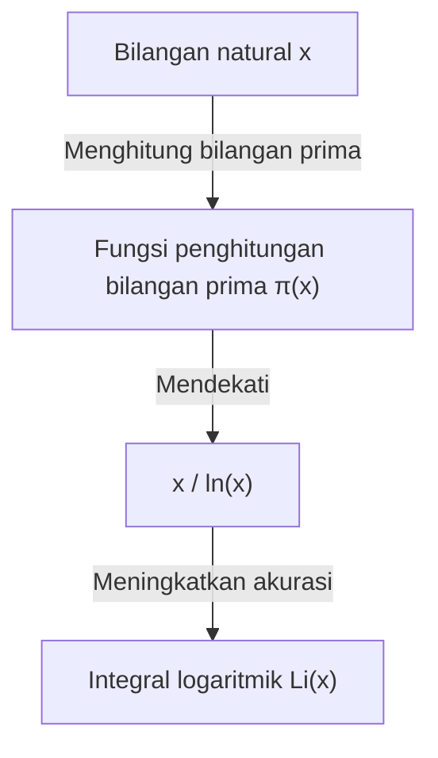

## Apa itu Teorema Bilangan Prima?

Salah satu hasil paling indah dalam bidang matematika adalah **Teorema Bilangan Prima** ([Prime Number Theorem](https://kenji.blog/id/p/prime-number-theorem/), PNT). Teorema ini menunjukkan bahwa bilangan prima, angka-angka yang sekilas tampak muncul secara tidak teratur dan acak, secara makroskopis memiliki keteraturan yang sangat halus.

Secara khusus, jika kita memisalkan "jumlah bilangan prima yang kurang dari atau sama dengan bilangan real $x$" sebagai $\pi(x)$ (fungsi penghitungan bilangan prima), maka ketika $x$ sangat besar, $\pi(x)$ asimtotik terhadap $x / \ln(x)$. Inilah teoremanya.

$$ \lim_{x \to \infty} \frac{\pi(x)}{x / \ln(x)} = 1 $$

Di sini, $\ln(x)$ menyatakan logaritma natural (basis $e$). Teorema ini menyatakan fakta yang menakjubkan bahwa distribusi bilangan prima terhubung erat dengan logaritma natural.

### Fungsi Penghitungan Bilangan Prima $\pi(x)$

Fungsi penghitungan bilangan prima $\pi(x)$ adalah fungsi yang menghitung jumlah bilangan prima hingga $x$. Misalnya:

- $\pi(10) = 4$ (2, 3, 5, 7)
- $\pi(100) = 25$
- $\pi(1000) = 168$

Semakin besar angkanya, semakin sulit menemukan bilangan prima, dan jarak kemunculannya berangsur-angsur melebar. Namun, "kepadatan" secara keseluruhan menjadi dapat diprediksi.



## Latar Belakang Sejarah: Dari Dugaan Gauss hingga Pembuktian

Sejarah Teorema Bilangan Prima berawal pada akhir abad ke-18. Matematikawan jenius berusia 15 tahun, [Carl Friedrich Gauss](https://kenji.blog/id/p/gauss/), memperhatikan saat melihat tabel bilangan prima bahwa frekuensi kemunculan bilangan prima berhubungan dengan fungsi logaritma. Sekitar waktu yang sama, [Adrien-Marie Legendre](https://kenji.blog/id/p/legendre/) juga secara independen membuat dugaan serupa.

Namun, mereka belum berhasil membuktikannya secara ketat.

Kemajuan besar dalam pembuktian dicapai melalui makalah terobosan [Bernhard Riemann](https://kenji.blog/id/p/riemann/) tahun 1859 yang berjudul "Tentang Jumlah Bilangan Prima yang Kurang dari Besaran Tertentu". Riemann menyajikan pendekatan yang sama sekali baru, yaitu mengubah masalah distribusi bilangan prima menjadi masalah pada bidang kompleks menggunakan fungsi kompleks, **Fungsi Zeta** $\zeta(s)$.

$$ \zeta(s) = \sum_{n=1}^{\infty} \frac{1}{n^s} = \prod_{p \text{ prima}} \left(1 - \frac{1}{p^s}\right)^{-1} $$

Rumus perkalian Euler (Euler product formula) ini adalah persamaan sangat penting yang menghubungkan fungsi mengenai jumlah semua bilangan natural (sisi kiri) dengan perkalian tak terhingga yang hanya melibatkan bilangan prima (sisi kanan).

Kemudian, pada tahun 1896, Jacques Hadamard dan Charles de la Vallée Poussin secara independen menyelesaikan pembuktian Teorema Bilangan Prima berdasarkan ide Riemann. Kunci pembuktian mereka adalah menunjukkan bahwa "Fungsi zeta Riemann $\zeta(s)$ tidak memiliki titik nol pada garis $\operatorname{Re}(s) = 1$ di bidang kompleks".

## Aproksimasi dengan Akurasi Lebih Tinggi: Integral Logaritmik $\operatorname{Li}(x)$

$x / \ln(x)$ mengekspresikan Teorema Bilangan Prima dengan sederhana, tetapi untuk memperkirakan jumlah bilangan prima aktual $\pi(x)$, **Integral Logaritmik** (Logarithmic Integral, $\operatorname{Li}(x)$) yang diperkenalkan oleh Gauss jauh lebih baik.

Integral logaritmik didefinisikan sebagai berikut:

$$ \operatorname{Li}(x) = \int_{2}^{x} \frac{dt}{\ln(dt)} $$

Teorema Bilangan Prima juga dapat ditulis ulang sebagai $\pi(x) \sim \operatorname{Li}(x)$.

$$ \lim_{x \to \infty} \frac{\pi(x)}{\operatorname{Li}(x)} = 1 $$

Kenyataannya, ketika $x = 10^{10}$,
- $\pi(10^{10}) = 455,052,511$
- $10^{10} / \ln(10^{10}) \approx 434,294,481$ (kesalahan sekitar 4,5%)
- $\operatorname{Li}(10^{10}) \approx 455,055,614$ (kesalahan hanya 3103)

Ini menunjukkan seberapa baik integral logaritmik memberikan nilai pendekatan.

## Hubungan Mendalam dengan Hipotesis Riemann

Hal yang tak terpisahkan dari Teorema Bilangan Prima adalah **Hipotesis Riemann** (Riemann Hypothesis), yang dianggap sebagai masalah belum terpecahkan paling penting dalam matematika.

Hipotesis Riemann menyatakan bahwa "semua titik nol tak-trivial dari fungsi zeta Riemann $\zeta(s)$ terletak pada garis dengan bagian real $1/2$ (garis kritis)".

Jika Hipotesis Riemann terbukti benar, batas paling kuat untuk nilai galat (selisih antara $\pi(x)$ dan $\operatorname{Li}(x)$) dalam Teorema Bilangan Prima dapat diperoleh. Secara spesifik, diketahui bahwa terdapat suatu konstanta $C$ sehingga,

$$ |\pi(x) - \operatorname{Li}(x)| \le C \sqrt{x} \ln(x) $$

berlaku. Ini berarti bahwa "bilangan prima terdistribusi dengan sangat teratur sehingga tidak dapat dibedakan dari distribusi acak sempurna". Dengan kata lain, Teorema Bilangan Prima berbicara tentang distribusi "rata-rata" dari bilangan prima, sementara Hipotesis Riemann berbicara tentang batas dari "fluktuasi (kesalahan)" tersebut.

## Memeriksa Teorema Bilangan Prima dengan Python

Mari kita amati perilaku Teorema Bilangan Prima menggunakan pemrograman.

```python
import math
import matplotlib.pyplot as plt

def sieve_of_eratosthenes(limit):
    """
    Mendaftar bilangan prima menggunakan Saringan Eratosthenes
    """
    is_prime = [True] * (limit + 1)
    p = 2
    while (p * p <= limit):
        if is_prime[p]:
            for i in range(p * p, limit + 1, p):
                is_prime[i] = False
        p += 1
    
    primes = [p for p in range(2, limit) if is_prime[p]]
    return primes

def pi(x, primes):
    """
    Mengembalikan jumlah bilangan prima yang kurang dari atau sama dengan x
    """
    import bisect
    return bisect.bisect_right(primes, x)

limit = 1000000
primes = sieve_of_eratosthenes(limit)

x_values = [10**i for i in range(1, 7)]
pi_values = [pi(x, primes) for x in x_values]
approx_values = [x / math.log(x) for x in x_values]

print(f"{'x':<10} | {'π(x)':<10} | {'x / ln(x)':<15} | {'Rasio'}")
print("-" * 55)
for i in range(len(x_values)):
    x = x_values[i]
    pi_x = pi_values[i]
    approx = approx_values[i]
    ratio = pi_x / approx
    print(f"{x:<10} | {pi_x:<10} | {approx:<15.2f} | {ratio:.4f}")
```

Dengan menjalankan kode ini, Anda dapat mengamati bahwa rasio $\pi(x) / (x/\ln(x))$ semakin mendekati 1 saat $x$ semakin besar. Ini merupakan salah satu bukti kuat dari Teorema Bilangan Prima.

## Aplikasi pada Kriptografi Modern

Sifat-sifat bilangan prima tidak hanya menjadi objek menarik dalam matematika murni, tetapi juga merupakan elemen penting yang mendukung infrastruktur keamanan masyarakat modern.

Metode kriptografi kunci publik seperti kriptografi RSA memanfaatkan sifat bahwa "faktorisasi bilangan bulat yang sangat besar adalah hal yang sangat sulit". Teorema Bilangan Prima menjamin probabilitas ditemukannya "bilangan prima dengan ukuran yang tepat" yang diperlukan untuk menghasilkan kunci kriptografi.

Sebagai contoh, probabilitas bahwa bilangan ganjil acak 1024-bit adalah bilangan prima diperkirakan sekitar $1 / (1024 \times \ln(2) / 2) \approx 1 / 355$. Ini berarti bahwa dengan melakukan pengujian keprimaan beberapa ratus kali, ada probabilitas tinggi untuk menemukan bilangan prima besar yang diperlukan. Tanpa Teorema Bilangan Prima, membangun sistem kriptografi yang efisien adalah hal yang mustahil.

## Kesimpulan

Teorema Bilangan Prima adalah salah satu teorema paling indah yang mewujudkan "keteraturan di dalam kekacauan" dalam matematika. Fakta bahwa distribusi bilangan prima yang sekilas tampak acak menyembunyikan hukum dasar alam berupa fungsi logaritma, terus memikat banyak matematikawan.

Bidang yang dirintis oleh para jenius seperti Gauss, Riemann, dan Hadamard ini tetap menjadi garda depan matematika modern, terutama melalui masalah besar yang belum terpecahkan yaitu Hipotesis Riemann. Misteri bilangan prima begitu dalam, dan pencarian kita mungkin akan terus berlanjut hingga tiba saatnya kita memahami gambarannya secara utuh.
