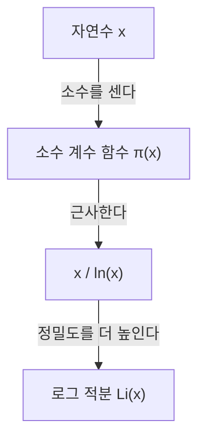

## 소수 정리란 무엇인가?

수학 분야에서 가장 아름다운 결과 중 하나가 **소수 정리** ([Prime Number Theorem](https://kenji.blog/ko/p/prime-number-theorem/), PNT)입니다. 소수라는, 언뜻 보면 불규칙하고 무작위로 나타나는 수들이, 거시적으로 보면 놀라울 정도로 매끄러운 규칙성을 가지고 있음을 보여줍니다.

구체적으로는, '어떤 실수 $x$ 이하의 소수의 개수'를 $\pi(x)$ (소수 계수 함수)라고 할 때, $x$ 가 매우 클 경우, $\pi(x)$ 는 $x / \ln(x)$ 에 점근한다는 정리입니다.

$$ \lim_{x \to \infty} \frac{\pi(x)}{x / \ln(x)} = 1 $$

여기서 $\ln(x)$ 는 자연로그(밑이 $e$)를 나타냅니다. 이 정리는 소수의 분포가 자연로그와 깊이 결부되어 있다는 놀라운 사실을 말해주고 있습니다.

### 소수 계수 함수 $\pi(x)$

소수 계수 함수 $\pi(x)$ 는 $x$ 이하의 소수의 개수를 세는 함수입니다. 예를 들어:

- $\pi(10) = 4$ (2, 3, 5, 7)
- $\pi(100) = 25$
- $\pi(1000) = 168$

수치가 커질수록 소수를 찾는 것은 어려워지고, 그 출현 간격은 점차 넓어집니다. 하지만 전체로서의 '밀도'는 예측 가능해집니다.



## 역사적 배경: 가우스의 가설에서 증명까지

소수 정리의 역사는 18세기 후반으로 거슬러 올라갑니다. 불과 15세의 천재 수학자 [카를 프리드리히 가우스](https://kenji.blog/ko/p/gauss/)는 소수표를 바라보다가, 소수의 출현 빈도가 로그 함수와 관련되어 있다는 것을 깨달았습니다. 같은 시기에 [아드리앵마리 르장드르](https://kenji.blog/ko/p/legendre/)도 독립적으로 비슷한 가설을 세웠습니다.

하지만 그들은 이것을 엄밀하게 증명하는 데에는 이르지 못했습니다.

증명의 큰 진전은 1859년 [베른하르트 리만](https://kenji.blog/ko/p/riemann/)의 획기적인 논문 '주어진 수보다 작은 소수의 개수에 관하여'에 의해 이루어졌습니다. 리만은 복소함수인 **제타 함수** $\zeta(s)$ 를 사용하여, 소수의 분포를 복소평면상의 문제로 변환한다는 전혀 새로운 접근법을 제시했습니다.

$$ \zeta(s) = \sum_{n=1}^{\infty} \frac{1}{n^s} = \prod_{p \text{ 소수}} \left(1 - \frac{1}{p^s}\right)^{-1} $$

이 오일러 곱 공식(Euler product formula)은 모든 자연수의 합에 관한 함수(좌변)와 소수에만 관한 무한 곱(우변)을 연결하는 매우 중요한 관계식입니다.

그 후, 1896년에 자크 아다마르와 샤를 드 라 발레푸생이 각각 독립적으로 리만의 아이디어를 바탕으로 소수 정리의 증명을 완료했습니다. 그들의 증명의 핵심은 '리만 제타 함수 $\zeta(s)$ 는 복소평면의 직선 $\operatorname{Re}(s) = 1$ 상에 영점을 갖지 않는다'는 것을 보여주는 것이었습니다.

## 더 정밀한 근사: 로그 적분 $\operatorname{Li}(x)$

$x / \ln(x)$ 는 소수 정리를 단순하게 표현하고 있지만, 실제 소수의 개수 $\pi(x)$ 를 근사하는 데에는 가우스가 도입한 **로그 적분** (Logarithmic Integral, $\operatorname{Li}(x)$)이 훨씬 뛰어납니다.

로그 적분은 다음과 같이 정의됩니다:

$$ \operatorname{Li}(x) = \int_{2}^{x} \frac{dt}{\ln(dt)} $$

소수 정리는 $\pi(x) \sim \operatorname{Li}(x)$ 로 바꿔 쓸 수도 있습니다.

$$ \lim_{x \to \infty} \frac{\pi(x)}{\operatorname{Li}(x)} = 1 $$

실제로 $x = 10^{10}$ 일 때,
- $\pi(10^{10}) = 455,052,511$
- $10^{10} / \ln(10^{10}) \approx 434,294,481$ (오차 약 4.5%)
- $\operatorname{Li}(10^{10}) \approx 455,055,614$ (오차 불과 3103)

로그 적분이 얼마나 훌륭한 근사를 제공하는지 알 수 있습니다.

## 리만 가설과의 깊은 관계

소수 정리와 불가분하게 얽혀 있는 것이 수학의 미해결 문제 중 가장 중요하다고 여겨지는 **리만 가설** ([Riemann](https://kenji.blog/ko/p/riemann/) Hypothesis)입니다.

리만 가설은 '리만 제타 함수 $\zeta(s)$ 의 자명하지 않은 영점(비자명 영점)은 모두 실수부가 $1/2$ 인 직선상(임계선)에 있다'는 주장입니다.

만약 리만 가설이 옳다고 증명된다면, 소수 정리의 오차항($\pi(x)$ 와 $\operatorname{Li}(x)$ 의 차이)에 대해 가장 강력한 형태의 평가를 얻을 수 있습니다. 구체적으로는 어떤 상수 $C$ 가 존재하여,

$$ |\pi(x) - \operatorname{Li}(x)| \le C \sqrt{x} \ln(x) $$

가 성립한다는 것이 알려져 있습니다. 이것은 '소수는 완전히 무작위로 분포되어 있는 경우와 구별이 안 될 정도로, 극히 규칙적으로 분포되어 있다'는 것을 의미합니다. 즉, 소수 정리는 소수의 '평균적인' 분포를 말하며, 리만 가설은 그 '요동(오차)'의 한계를 말하고 있는 것입니다.

## Python 으로 소수 정리 확인하기

실제로 프로그래밍을 사용하여 소수 정리의 거동을 관찰해 봅시다.

```python
import math
import matplotlib.pyplot as plt

def sieve_of_eratosthenes(limit):
    """
    에라토스테네스의 체를 사용하여 소수를 나열한다
    """
    is_prime = [True] * (limit + 1)
    p = 2
    while (p * p <= limit):
        if is_prime[p]:
            for i in range(p * p, limit + 1, p):
                is_prime[i] = False
        p += 1
    
    primes = [p for p in range(2, limit) if is_prime[p]]
    return primes

def pi(x, primes):
    """
    x 이하의 소수의 개수를 반환한다
    """
    import bisect
    return bisect.bisect_right(primes, x)

limit = 1000000
primes = sieve_of_eratosthenes(limit)

x_values = [10**i for i in range(1, 7)]
pi_values = [pi(x, primes) for x in x_values]
approx_values = [x / math.log(x) for x in x_values]

print(f"{'x':<10} | {'π(x)':<10} | {'x / ln(x)':<15} | {'비율'}")
print("-" * 55)
for i in range(len(x_values)):
    x = x_values[i]
    pi_x = pi_values[i]
    approx = approx_values[i]
    ratio = pi_x / approx
    print(f"{x:<10} | {pi_x:<10} | {approx:<15.2f} | {ratio:.4f}")
```

이 코드를 실행하면 $x$ 가 커짐에 따라 비율 $\pi(x) / (x/\ln(x))$ 가 1에 가까워지는 모습을 관찰할 수 있습니다. 이것이 소수 정리의 강력한 증거 중 하나입니다.

## 현대 암호에의 응용

소수의 성질은 단순히 순수 수학에 있어서 흥미로운 대상일 뿐만 아니라, 현대 사회의 보안 기반을 지탱하는 중요한 요소입니다.

[RSA](https://kenji.blog/ko/p/modern-cryptography-public-key-hash-signature/) 암호 등의 공개키 암호 방식은 '거대한 정수의 소인수분해가 매우 어렵다'는 성질을 이용하고 있습니다. 소수 정리는 암호키 생성에 필요한 '적절한 크기의 소수'가 어느 정도의 확률로 발견될지를 보장해 줍니다.

예를 들어, 1024비트의 무작위 홀수가 소수일 확률은 약 $1 / (1024 \times \ln(2) / 2) \approx 1 / 355$ 로 추산됩니다. 이것은 수백 번의 소수 판정을 수행하면 높은 확률로 필요한 거대 소수를 발견할 수 있음을 의미하며, 소수 정리 없이는 효율적인 암호 시스템의 구축이 불가능합니다.

## 요약

소수 정리는 수학에서 '혼돈 속의 질서'를 구현하는 가장 아름다운 정리 중 하나입니다. 언뜻 무작위로 보이는 소수의 분포에 로그 함수라는 자연계의 기본적인 법칙이 숨어 있다는 것은 많은 수학자들을 계속해서 매료시키고 있습니다.

가우스나 리만, 아다마르 등의 천재들에 의해 개척된 이 분야는 지금도 리만 가설이라는 거대한 미해결 문제를 통해 현대 수학의 최전선으로 남아 있습니다. 소수의 수수께끼는 깊으며, 우리가 그 전모를 이해하는 날까지 탐구는 계속될 것입니다.
