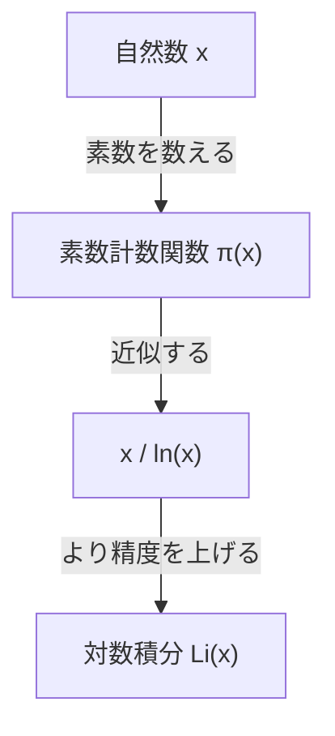

## 素数定理とは何か？

数学の分野における最も美しい結果の一つが **素数定理** （[Prime Number Theorem](https://kenji.blog/p/prime-number-theorem/), PNT）です。素数という、一見すると不規則でランダムに現れる数たちが、巨視的に見ると驚くほど滑らかな規則性を持っていることを示しています。

具体的には、「ある実数 $x$ 以下の素数の個数」を $\pi(x)$ （素数計数関数）としたとき、$x$ が非常に大きい場合、$\pi(x)$ は $x / \ln(x)$ に漸近するという定理です。

$$ \lim_{x \to \infty} \frac{\pi(x)}{x / \ln(x)} = 1 $$

ここで、$\ln(x)$ は自然対数（底が $e$）を表します。この定理は、素数の分布が自然対数と深く結びついているという驚くべき事実を述べています。

### 素数計数関数 $\pi(x)$

素数計数関数 $\pi(x)$ は、$x$ 以下の素数の個数を数え上げる関数です。例えば：

- $\pi(10) = 4$ （2, 3, 5, 7）
- $\pi(100) = 25$
- $\pi(1000) = 168$

数値が大きくなるにつれて、素数を見つけるのは困難になり、その出現間隔は徐々に広がっていきます。しかし、全体としての「密度」は予測可能になります。



## 歴史的背景：[ガウス](https://kenji.blog/p/gauss/)の予想から証明まで

素数定理の歴史は、18世紀後半に遡ります。若干15歳の天才数学者カール・フリードリヒ・[ガウス](https://kenji.blog/p/gauss/)は、素数表を眺めているうちに、素数の出現頻度が対数関数に関連していることに気づきました。同じ頃、[アドリアン＝マリ・ルジャンドル](https://kenji.blog/p/legendre/)も独立して同様の予想を立てました。

しかし、彼らはこれを厳密に証明するには至りませんでした。

証明の大きな進展は、1859年の[ベルンハルト・リーマン](https://kenji.blog/p/riemann/)による画期的な論文「与えられた数より小さい素数の個数について」によってもたらされました。[リーマン](https://kenji.blog/p/riemann/)は、複素関数である **ゼータ関数** $\zeta(s)$ を用いて、素数の分布を複素数平面上の問題に変換するという全く新しいアプローチを提示しました。

$$ \zeta(s) = \sum_{n=1}^{\infty} \frac{1}{n^s} = \prod_{p \text{ prime}} \left(1 - \frac{1}{p^s}\right)^{-1} $$

この[オイラー](https://kenji.blog/p/euler/)積の公式（Euler product formula）は、すべての自然数の和に関する関数（左辺）と、素数のみに関する無限乗積（右辺）を結びつける、非常に重要な関係式です。

その後、1896年にジャック・アダマールとシャルル・ド・ラ・ヴァレ・プーサンがそれぞれ独立に、[リーマン](https://kenji.blog/p/riemann/)のアイデアを基にして素数定理の証明を完了させました。彼らの証明の鍵は、「[リーマン](https://kenji.blog/p/riemann/)ゼータ関数 $\zeta(s)$ は、複素数平面の直線 $\operatorname{Re}(s) = 1$ 上に零点を持たない」ことを示すことでした。

## より精度の高い近似：対数積分 $\operatorname{Li}(x)$

$x / \ln(x)$ は素数定理をシンプルに表現していますが、実際の素数の個数 $\pi(x)$ を近似するには、[ガウス](https://kenji.blog/p/gauss/)が導入した **対数積分** （Logarithmic Integral, $\operatorname{Li}(x)$）の方がはるかに優れています。

対数積分は次のように定義されます：

$$ \operatorname{Li}(x) = \int_{2}^{x} \frac{dt}{\ln(dt)} $$

素数定理は、$\pi(x) \sim \operatorname{Li}(x)$ と書き換えることもできます。

$$ \lim_{x \to \infty} \frac{\pi(x)}{\operatorname{Li}(x)} = 1 $$

実際、$x = 10^{10}$ のとき、
- $\pi(10^{10}) = 455,052,511$
- $10^{10} / \ln(10^{10}) \approx 434,294,481$ （誤差約 4.5%）
- $\operatorname{Li}(10^{10}) \approx 455,055,614$ （誤差わずか 3103）

対数積分がいかに優れた近似を与えているかがわかります。

## [リーマン予想](https://kenji.blog/p/riemann-hypothesis-prime-distribution-cryptography/)との深い関係

素数定理と不可分に結びついているのが、数学の未解決問題の中で最も重要とされる **[リーマン予想](https://kenji.blog/p/riemann-hypothesis-prime-distribution-cryptography/)** （[Riemann](https://kenji.blog/p/riemann/) Hypothesis）です。

[リーマン予想](https://kenji.blog/p/riemann-hypothesis-prime-distribution-cryptography/)は、「[リーマン](https://kenji.blog/p/riemann/)ゼータ関数 $\zeta(s)$ の自明でない零点（非自明な零点）はすべて、実部が $1/2$ の直線上（臨界線）にある」という主張です。

もし[リーマン予想](https://kenji.blog/p/riemann-hypothesis-prime-distribution-cryptography/)が正しいと証明されれば、素数定理における誤差項（$\pi(x)$ と $\operatorname{Li}(x)$ の差）について、最も強い形での評価が得られます。具体的には、ある定数 $C$ が存在して、

$$ |\pi(x) - \operatorname{Li}(x)| \le C \sqrt{x} \ln(x) $$

が成り立つことが知られています。これは、「素数は、完全にランダムに分布している場合と区別がつかないほど、極めて規則正しく分布している」ことを意味します。つまり、素数定理は素数の「平均的な」分布を語り、[リーマン予想](https://kenji.blog/p/riemann-hypothesis-prime-distribution-cryptography/)はその「揺らぎ（誤差）」の限界を語っているのです。

## Python で素数定理を確かめる

実際にプログラミングを用いて、素数定理の振る舞いを観察してみましょう。

```python
import math
import matplotlib.pyplot as plt

def sieve_of_eratosthenes(limit):
    """
    エラトステネスの篩を用いて素数を列挙する
    """
    is_prime = [True] * (limit + 1)
    p = 2
    while (p * p <= limit):
        if is_prime[p]:
            for i in range(p * p, limit + 1, p):
                is_prime[i] = False
        p += 1
    
    primes = [p for p in range(2, limit) if is_prime[p]]
    return primes

def pi(x, primes):
    """
    x 以下の素数の個数を返す
    """
    import bisect
    return bisect.bisect_right(primes, x)

limit = 1000000
primes = sieve_of_eratosthenes(limit)

x_values = [10**i for i in range(1, 7)]
pi_values = [pi(x, primes) for x in x_values]
approx_values = [x / math.log(x) for x in x_values]

print(f"{'x':<10} | {'π(x)':<10} | {'x / ln(x)':<15} | {'Ratio'}")
print("-" * 55)
for i in range(len(x_values)):
    x = x_values[i]
    pi_x = pi_values[i]
    approx = approx_values[i]
    ratio = pi_x / approx
    print(f"{x:<10} | {pi_x:<10} | {approx:<15.2f} | {ratio:.4f}")
```

このコードを実行すると、$x$ が大きくなるにつれて、比率 $\pi(x) / (x/\ln(x))$ が 1 に近づいていく様子が観察できます。これが素数定理の強力な証拠の一つです。

## 現代暗号への応用

素数の性質は、単に純粋数学における興味深い対象というだけでなく、現代社会のセキュリティ基盤を支える重要な要素です。

[RSA](https://kenji.blog/p/modern-cryptography-public-key-hash-signature/)暗号などの[公開鍵](https://kenji.blog/p/modern-cryptography-public-key-hash-signature/)暗号方式は、「巨大な整数の素因数分解が非常に困難である」という性質を利用しています。素数定理は、暗号鍵の生成に必要な「適切な大きさの素数」がどの程度の確率で見つかるかを保証してくれます。

例えば、1024ビットのランダムな奇数が素数である確率は約 $1 / (1024 \times \ln(2) / 2) \approx 1 / 355$ と見積もられます。これは、数百回の素数判定を行えば、高い確率で必要な巨大素数を見つけられることを意味しており、素数定理なしには効率的な暗号システムの構築は不可能です。

## まとめ

素数定理は、数学における「混沌の中の秩序」を体現する最も美しい定理の一つです。一見ランダムに見える素数の分布に、対数関数という自然界の基本的な法則が潜んでいることは、多くの数学者を魅了し続けています。

[ガウス](https://kenji.blog/p/gauss/)やリーマン、アダマールらの天才たちによって切り拓かれたこの分野は、今なお[リーマン予想](https://kenji.blog/p/riemann-hypothesis-prime-distribution-cryptography/)という巨大な未解決問題を通じて、現代数学の最前線であり続けています。素数の謎は深く、私たちがその全貌を理解する日まで、探求は続いていくことでしょう。
