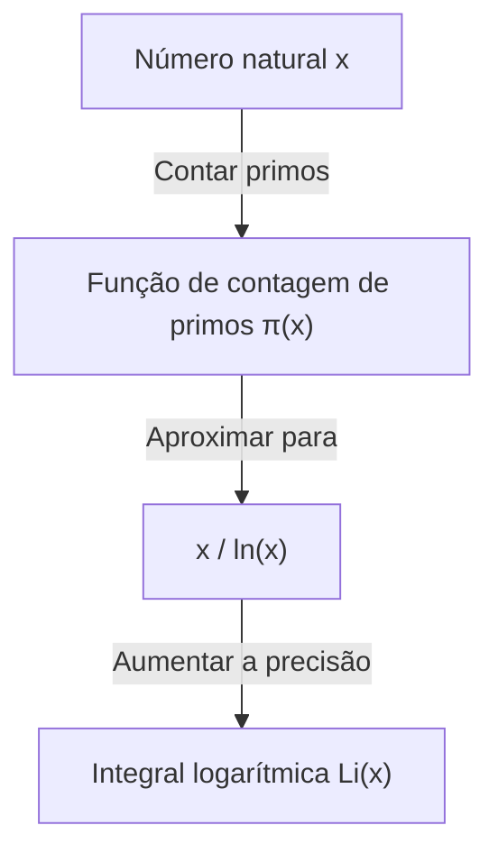

## O que é o Teorema dos Números Primos?

Um dos resultados mais belos no campo da matemática é o **Teorema dos Números Primos** ([Prime Number Theorem](https://kenji.blog/pt/p/prime-number-theorem/), PNT). Ele mostra que os números primos, que à primeira vista parecem aparecer de forma irregular e aleatória, possuem uma regularidade surpreendentemente suave quando vistos macroscopicamente.

Especificamente, se definirmos a "quantidade de números primos menores ou iguais a um número real $x$" como $\pi(x)$ (função de contagem de números primos), o teorema afirma que quando $x$ é muito grande, $\pi(x)$ é assintótico a $x / \ln(x)$.

$$ \lim_{x \to \infty} \frac{\pi(x)}{x / \ln(x)} = 1 $$

Aqui, $\ln(x)$ representa o logaritmo natural (base $e$). Este teorema afirma o fato surpreendente de que a distribuição dos números primos está profundamente ligada ao logaritmo natural.

### Função de contagem de números primos $\pi(x)$

A função de contagem de números primos $\pi(x)$ é uma função que conta a quantidade de números primos menores ou iguais a $x$. Por exemplo:

- $\pi(10) = 4$ (2, 3, 5, 7)
- $\pi(100) = 25$
- $\pi(1000) = 168$

À medida que os números se tornam maiores, encontrar números primos torna-se difícil e o intervalo entre suas ocorrências aumenta gradualmente. No entanto, a "densidade" geral torna-se previsível.



## Contexto Histórico: Da conjectura de Gauss à demonstração

A história do teorema dos números primos remonta ao final do século XVIII. O jovem gênio matemático de apenas 15 anos, [Carl Friedrich Gauss](https://kenji.blog/pt/p/gauss/), ao observar tabelas de números primos, percebeu que a frequência de ocorrência dos números primos estava relacionada à função logarítmica. Na mesma época, [Adrien-Marie Legendre](https://kenji.blog/pt/p/legendre/) também formulou independentemente uma conjectura semelhante.

No entanto, eles não conseguiram provar isso rigorosamente.

Um grande avanço na demonstração foi trazido pelo artigo inovador de [Bernhard Riemann](https://kenji.blog/pt/p/riemann/) de 1859, "Sobre o Número de Primos Menores que uma Dada Grandeza". [Riemann](https://kenji.blog/pt/p/riemann/) propôs uma abordagem completamente nova de converter o problema da distribuição dos números primos em um problema no plano complexo, usando a **função zeta** $\zeta(s)$, que é uma função complexa.

$$ \zeta(s) = \sum_{n=1}^{\infty} \frac{1}{n^s} = \prod_{p \text{ primo}} \left(1 - \frac{1}{p^s}\right)^{-1} $$

Esta fórmula do produto de Euler (Euler product formula) é uma relação muito importante que liga uma função sobre a soma de todos os números naturais (lado esquerdo) e um produto infinito apenas sobre números primos (lado direito).

Mais tarde, em 1896, Jacques Hadamard e Charles de la Vallée Poussin, de forma independente e com base nas ideias de [Riemann](https://kenji.blog/pt/p/riemann/), completaram a demonstração do teorema dos números primos. A chave de suas provas foi mostrar que "a função zeta de [Riemann](https://kenji.blog/pt/p/riemann/) $\zeta(s)$ não possui zeros na reta $\operatorname{Re}(s) = 1$ no plano complexo".

## Aproximação de maior precisão: Integral logarítmica $\operatorname{Li}(x)$

Embora $x / \ln(x)$ expresse o teorema dos números primos de forma simples, para aproximar a quantidade real de números primos $\pi(x)$, a **Integral Logarítmica** ($\operatorname{Li}(x)$), introduzida por Gauss, é muito superior.

A integral logarítmica é definida da seguinte forma:

$$ \operatorname{Li}(x) = \int_{2}^{x} \frac{dt}{\ln(t)} $$

O teorema dos números primos também pode ser reescrito como $\pi(x) \sim \operatorname{Li}(x)$.

$$ \lim_{x \to \infty} \frac{\pi(x)}{\operatorname{Li}(x)} = 1 $$

De fato, quando $x = 10^{10}$:
- $\pi(10^{10}) = 455,052,511$
- $10^{10} / \ln(10^{10}) \approx 434,294,481$ (erro de cerca de 4.5%)
- $\operatorname{Li}(10^{10}) \approx 455,055,614$ (erro de apenas 3103)

Podemos ver quão excelente é a aproximação fornecida pela integral logarítmica.

## Profunda relação com a Hipótese de [Riemann](https://kenji.blog/pt/p/riemann/)

Indissoluvelmente ligado ao teorema dos números primos está a **Hipótese de [Riemann](https://kenji.blog/pt/p/riemann/)** ([Riemann](https://kenji.blog/pt/p/riemann/) Hypothesis), considerada o problema não resolvido mais importante da matemática.

A Hipótese de [Riemann](https://kenji.blog/pt/p/riemann/) é a afirmação de que "todos os zeros não triviais da função zeta de [Riemann](https://kenji.blog/pt/p/riemann/) $\zeta(s)$ estão na reta (linha crítica) cuja parte real é $1/2$".

Se for provado que a Hipótese de [Riemann](https://kenji.blog/pt/p/riemann/) é correta, obteríamos a forma mais forte de avaliação para o termo de erro no teorema dos números primos (a diferença entre $\pi(x)$ e $\operatorname{Li}(x)$). Especificamente, sabe-se que existe uma constante $C$ tal que:

$$ |\pi(x) - \operatorname{Li}(x)| \le C \sqrt{x} \ln(x) $$

Isto significa que "os números primos estão distribuídos de forma tão extremamente regular que são indistinguíveis de uma distribuição completamente aleatória". Em outras palavras, o teorema dos números primos descreve a distribuição "média" dos números primos, e a Hipótese de [Riemann](https://kenji.blog/pt/p/riemann/) descreve o limite de sua "flutuação (erro)".

## Verificando o Teorema dos Números Primos em Python

Vamos tentar observar o comportamento do teorema dos números primos usando programação.

```python
import math
import matplotlib.pyplot as plt

def sieve_of_eratosthenes(limit):
    """
    Enumera os números primos usando o Crivo de Eratóstenes
    """
    is_prime = [True] * (limit + 1)
    p = 2
    while (p * p <= limit):
        if is_prime[p]:
            for i in range(p * p, limit + 1, p):
                is_prime[i] = False
        p += 1
    
    primes = [p for p in range(2, limit) if is_prime[p]]
    return primes

def pi(x, primes):
    """
    Retorna o número de números primos menores ou iguais a x
    """
    import bisect
    return bisect.bisect_right(primes, x)

limit = 1000000
primes = sieve_of_eratosthenes(limit)

x_values = [10**i for i in range(1, 7)]
pi_values = [pi(x, primes) for x in x_values]
approx_values = [x / math.log(x) for x in x_values]

print(f"{'x':<10} | {'π(x)':<10} | {'x / ln(x)':<15} | {'Ratio'}")
print("-" * 55)
for i in range(len(x_values)):
    x = x_values[i]
    pi_x = pi_values[i]
    approx = approx_values[i]
    ratio = pi_x / approx
    print(f"{x:<10} | {pi_x:<10} | {approx:<15.2f} | {ratio:.4f}")
```

Quando você executa este código, pode observar como a razão $\pi(x) / (x/\ln(x))$ se aproxima de 1 à medida que $x$ se torna maior. Esta é uma das fortes evidências do teorema dos números primos.

## Aplicação na Criptografia Moderna

As propriedades dos números primos não são apenas assuntos interessantes na matemática pura, mas também elementos cruciais que sustentam a infraestrutura de segurança da sociedade moderna.

Sistemas de criptografia de chave pública, como a criptografia RSA, utilizam a propriedade de que "a fatoração em números primos de inteiros enormes é extremamente difícil". O teorema dos números primos garante qual é a probabilidade de encontrar "números primos de tamanho apropriado" necessários para a geração de chaves criptográficas.

Por exemplo, a probabilidade de um número ímpar aleatório de 1024 bits ser um número primo é estimada em cerca de $1 / (1024 \times \ln(2) / 2) \approx 1 / 355$. Isso significa que, ao realizar centenas de testes de primalidade, podemos encontrar os enormes números primos necessários com alta probabilidade, e construir um sistema criptográfico eficiente seria impossível sem o teorema dos números primos.

## Resumo

O teorema dos números primos é um dos teoremas mais belos que incorpora a "ordem no caos" na matemática. O fato de que a distribuição aparentemente aleatória dos números primos esconde a lei fundamental do logaritmo da natureza continua a fascinar muitos matemáticos.

Este campo, pioneiro por gênios como Gauss, [Riemann](https://kenji.blog/pt/p/riemann/) e Hadamard, continua sendo a fronteira da matemática moderna através do gigantesco problema não resolvido da Hipótese de [Riemann](https://kenji.blog/pt/p/riemann/). O mistério dos números primos é profundo, e nossa busca continuará até o dia em que compreendermos toda a sua imagem.
