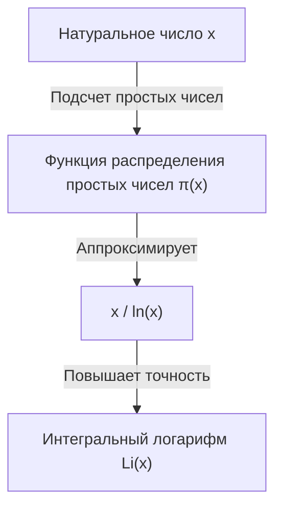

## Что такое Теорема о простых числах?

Одним из самых красивых результатов в области математики является **Теорема о простых числах** ([Prime Number Theorem](https://kenji.blog/ru/p/prime-number-theorem/), PNT). Она показывает, что простые числа, которые на первый взгляд появляются нерегулярно и случайно, при макроскопическом рассмотрении обладают удивительно плавной закономерностью.

В частности, если обозначить "количество простых чисел, не превышающих некоторое действительное число $x$" как $\pi(x)$ (функция распределения простых чисел), теорема утверждает, что при очень большом $x$, $\pi(x)$ асимптотически приближается к $x / \ln(x)$.

$$ \lim_{x \to \infty} \frac{\pi(x)}{x / \ln(x)} = 1 $$

Здесь $\ln(x)$ обозначает натуральный логарифм (с основанием $e$). Эта теорема утверждает удивительный факт, что распределение простых чисел глубоко связано с натуральным логарифмом.

### Функция распределения простых чисел $\pi(x)$

Функция распределения простых чисел $\pi(x)$ — это функция, которая подсчитывает количество простых чисел, не превышающих $x$. Например:

- $\pi(10) = 4$ (2, 3, 5, 7)
- $\pi(100) = 25$
- $\pi(1000) = 168$

По мере увеличения чисел находить простые числа становится сложнее, и интервалы между их появлениями постепенно увеличиваются. Однако "плотность" в целом становится предсказуемой.



## Исторический контекст: От гипотезы Гаусса до доказательства

История Теоремы о простых числах восходит к концу 18 века. Гениальный математик [Карл Фридрих Гаусс](https://kenji.blog/ru/p/gauss/), которому было всего 15 лет, изучая таблицы простых чисел, заметил, что частота появления простых чисел связана с логарифмической функцией. Примерно в то же время Адриен-Мари Лежандр независимо выдвинул аналогичную гипотезу.

Однако они не смогли дать строгого доказательства этого.

Большой прорыв в доказательстве был сделан в 1859 году благодаря новаторской статье Бернхарда Римана "О числе простых чисел, не превышающих данной величины". Риман предложил совершенно новый подход, преобразовав проблему распределения простых чисел в задачу на комплексной плоскости с использованием комплексной функции, **дзета-функции** $\zeta(s)$.

$$ \zeta(s) = \sum_{n=1}^{\infty} \frac{1}{n^s} = \prod_{p \text{ простое}} \left(1 - \frac{1}{p^s}\right)^{-1} $$

Эта формула эйлерова произведения (Euler product formula) является очень важным соотношением, связывающим функцию суммы по всем натуральным числам (левая часть) с бесконечным произведением только по простым числам (правая часть).

Впоследствии, в 1896 году, Жак Адамар и Шарль де ла Валле-Пуссен независимо друг от друга завершили доказательство Теоремы о простых числах, основываясь на идеях Римана. Ключом к их доказательству было показать, что "Дзета-функция Римана $\zeta(s)$ не имеет нулей на прямой $\operatorname{Re}(s) = 1$ комплексной плоскости".

## Более точная аппроксимация: Интегральный логарифм $\operatorname{Li}(x)$

Хотя $x / \ln(x)$ просто выражает Теорему о простых числах, для аппроксимации фактического количества простых чисел $\pi(x)$ гораздо лучше подходит **интегральный логарифм** (Logarithmic Integral, $\operatorname{Li}(x)$), введенный Гауссом.

Интегральный логарифм определяется следующим образом:

$$ \operatorname{Li}(x) = \int_{2}^{x} \frac{dt}{\ln(dt)} $$

Теорему о простых числах также можно переписать как $\pi(x) \sim \operatorname{Li}(x)$.

$$ \lim_{x \to \infty} \frac{\pi(x)}{\operatorname{Li}(x)} = 1 $$

На самом деле, при $x = 10^{10}$:
- $\pi(10^{10}) = 455,052,511$
- $10^{10} / \ln(10^{10}) \approx 434,294,481$ (погрешность около 4.5%)
- $\operatorname{Li}(10^{10}) \approx 455,055,614$ (погрешность всего 3103)

Видно, насколько превосходную аппроксимацию дает интегральный логарифм.

## Глубокая связь с гипотезой Римана

Неразрывно с Теоремой о простых числах связана **гипотеза Римана** ([Riemann](https://kenji.blog/ru/p/riemann/) Hypothesis), которая считается самой важной нерешенной проблемой в математике.

Гипотеза Римана утверждает, что "все нетривиальные нули дзета-функции Римана $\zeta(s)$ лежат на прямой, действительная часть которой равна $1/2$ (критической прямой)".

Если гипотеза Римана будет доказана как верная, мы получим сильнейшую оценку остаточного члена в Теореме о простых числах (разницы между $\pi(x)$ и $\operatorname{Li}(x)$). В частности, известно, что существует некоторая константа $C$, такая что:

$$ |\pi(x) - \operatorname{Li}(x)| \le C \sqrt{x} \ln(x) $$

Это означает, что "простые числа распределены настолько исключительно регулярно, что это неотличимо от совершенно случайного распределения". Другими словами, Теорема о простых числах говорит о "среднем" распределении простых чисел, а гипотеза Римана говорит о пределе этого "колебания (погрешности)".

## Проверка Теоремы о простых числах с помощью Python

Давайте на практике с помощью программирования понаблюдаем за поведением Теоремы о простых числах.

```python
import math
import matplotlib.pyplot as plt

def sieve_of_eratosthenes(limit):
    """
    Использование решета Эратосфена для перечисления простых чисел
    """
    is_prime = [True] * (limit + 1)
    p = 2
    while (p * p <= limit):
        if is_prime[p]:
            for i in range(p * p, limit + 1, p):
                is_prime[i] = False
        p += 1
    
    primes = [p for p in range(2, limit) if is_prime[p]]
    return primes

def pi(x, primes):
    """
    Возвращает количество простых чисел, не превышающих x
    """
    import bisect
    return bisect.bisect_right(primes, x)

limit = 1000000
primes = sieve_of_eratosthenes(limit)

x_values = [10**i for i in range(1, 7)]
pi_values = [pi(x, primes) for x in x_values]
approx_values = [x / math.log(x) for x in x_values]

print(f"{'x':<10} | {'π(x)':<10} | {'x / ln(x)':<15} | {'Отношение'}")
print("-" * 55)
for i in range(len(x_values)):
    x = x_values[i]
    pi_x = pi_values[i]
    approx = approx_values[i]
    ratio = pi_x / approx
    print(f"{x:<10} | {pi_x:<10} | {approx:<15.2f} | {ratio:.4f}")
```

Если выполнить этот код, можно наблюдать, как по мере увеличения $x$ отношение $\pi(x) / (x/\ln(x))$ приближается к 1. Это является одним из веских доказательств Теоремы о простых числах.

## Применение в современной криптографии

Свойства простых чисел являются не просто интересным объектом в чистой математике, но и важным элементом, поддерживающим основы безопасности современного общества.

Алгоритмы криптографии с открытым ключом, такие как RSA, используют свойство "чрезвычайной сложности факторизации огромных целых чисел". Теорема о простых числах гарантирует, с какой вероятностью можно найти "простое число подходящего размера", необходимое для генерации криптографического ключа.

Например, вероятность того, что случайное 1024-битное нечетное число является простым, оценивается примерно как $1 / (1024 \times \ln(2) / 2) \approx 1 / 355$. Это означает, что если выполнить несколько сотен проверок на простоту, можно с высокой вероятностью найти необходимое огромное простое число, и без Теоремы о простых числах построение эффективных криптографических систем было бы невозможно.

## Заключение

Теорема о простых числах — одна из самых красивых теорем, олицетворяющих "порядок в хаосе" в математике. Тот факт, что за казалось бы случайным распределением простых чисел скрывается фундаментальный закон природы — логарифмическая функция, продолжает очаровывать многих математиков.

Эта область, открытая гениями Гауссом, Риманом и Адамаром, до сих пор остается на переднем крае современной математики благодаря огромной нерешенной проблеме — гипотезе Римана. Загадки простых чисел глубоки, и наши исследования будут продолжаться до того дня, пока мы не поймем их картину в полном объеме.
