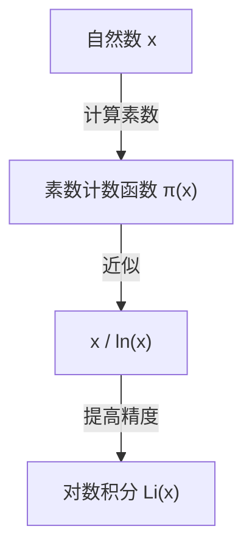

## 什么是素数定理？

数学领域中最美丽的结果之一就是 **素数定理** （[Prime Number Theorem](https://kenji.blog/zh-cn/p/prime-number-theorem/), PNT）。它表明，那些乍看之下不规则且随机出现的素数，从宏观上看却有着令人惊叹的平滑规律性。

具体而言，如果将“小于或等于某个实数 $x$ 的素数个数”记为 $\pi(x)$ （素数计数函数），当 $x$ 非常大时，$\pi(x)$ 会渐近于 $x / \ln(x)$，这就是该定理的内容。

$$ \lim_{x \to \infty} \frac{\pi(x)}{x / \ln(x)} = 1 $$

这里，$\ln(x)$ 表示自然对数（以 $e$ 为底）。这个定理陈述了一个惊人的事实，即素数的分布与自然对数有着极深的联系。

### 素数计数函数 $\pi(x)$

素数计数函数 $\pi(x)$ 是一个用于计算小于或等于 $x$ 的素数个数的函数。例如：

- $\pi(10) = 4$ （2, 3, 5, 7）
- $\pi(100) = 25$
- $\pi(1000) = 168$

随着数值的增大，寻找素数变得越来越困难，其出现间隔也逐渐变宽。然而，作为一个整体的“密度”却变得可以预测。



## 历史背景：从高斯的猜想到证明

素数定理的历史可以追溯到18世纪末。年仅15岁的天才数学家[卡尔·弗里德里希·高斯](https://kenji.blog/zh-cn/p/gauss/)（Carl Friedrich Gauss）在观察素数表时，发现素数出现的频率与对数函数有关。大约在同一时间，阿德里安-马里·勒让德（[Adrien-Marie Legendre](https://kenji.blog/zh-cn/p/legendre/)）也独立提出了类似的猜想。

然而，他们都没能给出严格的证明。

证明上的重大进展，是由[波恩哈德·黎曼](https://kenji.blog/zh-cn/p/riemann/)（[Bernhard Riemann](https://kenji.blog/zh-cn/p/riemann/)）在1859年发表的一篇划时代论文《论小于给定数值的素数个数》带来的。黎曼提出了一种全新的方法，他利用复变函数 **黎曼ζ函数** $\zeta(s)$ ，将素数分布的问题转化为了复平面上的问题。

$$ \zeta(s) = \sum_{n=1}^{\infty} \frac{1}{n^s} = \prod_{p \text{ 素数}} \left(1 - \frac{1}{p^s}\right)^{-1} $$

这个欧拉乘积公式（Euler product formula）是一个非常重要的关系式，它将关于所有自然数之和的函数（左边）与仅关于素数的无穷乘积（右边）联系在了一起。

之后，在1896年，雅克·阿达马（Jacques Hadamard）和夏尔·德·拉瓦莱·普桑（Charles de la Vallée Poussin）两人独立地基于黎曼的思想完成了素数定理的证明。他们证明的关键在于表明，“黎曼ζ函数 $\zeta(s)$ 在复平面的直线 $\operatorname{Re}(s) = 1$ 上没有零点”。

## 更高精度的近似：对数积分 $\operatorname{Li}(x)$

虽然 $x / \ln(x)$ 简单地表达了素数定理，但为了近似实际的素数个数 $\pi(x)$，高斯引入的 **对数积分** （Logarithmic Integral, $\operatorname{Li}(x)$）效果要好得多。

对数积分定义如下：

$$ \operatorname{Li}(x) = \int_{2}^{x} \frac{dt}{\ln(dt)} $$

素数定理也可以改写为 $\pi(x) \sim \operatorname{Li}(x)$。

$$ \lim_{x \to \infty} \frac{\pi(x)}{\operatorname{Li}(x)} = 1 $$

实际上，当 $x = 10^{10}$ 时：
- $\pi(10^{10}) = 455,052,511$
- $10^{10} / \ln(10^{10}) \approx 434,294,481$ （误差约 4.5%）
- $\operatorname{Li}(10^{10}) \approx 455,055,614$ （误差仅为 3103）

由此可见对数积分给出的近似是多么出色。

## 与黎曼猜想的深层联系

与素数定理密不可分的是数学中最重要的未解之谜—— **黎曼猜想** （[Riemann](https://kenji.blog/zh-cn/p/riemann/) Hypothesis）。

黎曼猜想断言：“黎曼ζ函数 $\zeta(s)$ 的所有非平凡零点都位于实部等于 $1/2$ 的直线（临界线）上。”

如果黎曼猜想被证明是正确的，那么我们就能得到关于素数定理中误差项（$\pi(x)$ 与 $\operatorname{Li}(x)$ 之差）的最强形式的估计。具体来说，已知存在某个常数 $C$，使得：

$$ |\pi(x) - \operatorname{Li}(x)| \le C \sqrt{x} \ln(x) $$

成立。这意味着，“素数的分布极其规则，以至于无法与完全随机的分布区分开来”。也就是说，素数定理讲述了素数的“平均”分布，而黎曼猜想则讲述了这种“波动（误差）”的极限。

## 用 Python 验证素数定理

让我们实际使用编程来观察素数定理的特征。

```python
import math
import matplotlib.pyplot as plt

def sieve_of_eratosthenes(limit):
    """
    使用埃拉托斯特尼筛法列举素数
    """
    is_prime = [True] * (limit + 1)
    p = 2
    while (p * p <= limit):
        if is_prime[p]:
            for i in range(p * p, limit + 1, p):
                is_prime[i] = False
        p += 1
    
    primes = [p for p in range(2, limit) if is_prime[p]]
    return primes

def pi(x, primes):
    """
    返回小于或等于 x 的素数个数
    """
    import bisect
    return bisect.bisect_right(primes, x)

limit = 1000000
primes = sieve_of_eratosthenes(limit)

x_values = [10**i for i in range(1, 7)]
pi_values = [pi(x, primes) for x in x_values]
approx_values = [x / math.log(x) for x in x_values]

print(f"{'x':<10} | {'π(x)':<10} | {'x / ln(x)':<15} | {'比率'}")
print("-" * 55)
for i in range(len(x_values)):
    x = x_values[i]
    pi_x = pi_values[i]
    approx = approx_values[i]
    ratio = pi_x / approx
    print(f"{x:<10} | {pi_x:<10} | {approx:<15.2f} | {ratio:.4f}")
```

运行这段代码，可以观察到随着 $x$ 的增大，比率 $\pi(x) / (x/\ln(x))$ 越来越接近 1。这是素数定理有力的证据之一。

## 在现代密码学中的应用

素数的性质不仅仅是纯数学中有趣的研究对象，更是支撑现代社会安全基础的重要元素。

像[RSA](https://kenji.blog/zh-cn/p/modern-cryptography-public-key-hash-signature/)密码这样的公钥密码体制，利用了“对巨大整数进行素因数分解极其困难”这一性质。素数定理保证了生成密码密钥所需的“合适大小的素数”能够以多大的概率被找到。

例如，一个1024位的随机奇数是素数的概率估计约为 $1 / (1024 \times \ln(2) / 2) \approx 1 / 355$。这意味着，只要进行几百次素性测试，就有很高的概率找到所需的巨大素数。如果没有素数定理，构建高效的密码系统是不可能的。

## 总结

素数定理是体现数学中“混沌中的秩序”的最美定理之一。在乍看随机的素数分布中，隐藏着对数函数这一自然界的基本法则，这一点持续吸引着许多数学家。

由高斯、黎曼、阿达马等天才们开拓的这一领域，如今依然通过黎曼猜想这一巨大的未解之谜，保持在现代数学的最前沿。素数之谜深不可测，直到我们理解其全貌的那一天，探索之路都将继续下去。
