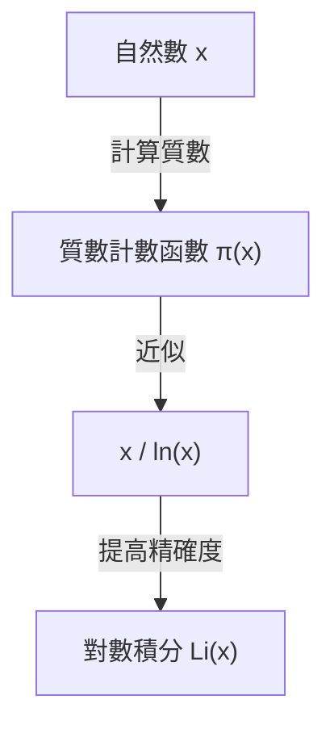

## 什麼是質數定理？

在數學領域中最美麗的結果之一就是 **質數定理** （[Prime Number Theorem](https://kenji.blog/zh-tw/p/prime-number-theorem/), PNT）。它指出，質數這種乍看之下不規則且隨機出現的數字，從巨觀來看卻具有令人驚訝的平滑規律性。

具體來說，當我們將「小於等於某實數 $x$ 的質數個數」設為 $\pi(x)$ （質數計數函數）時，如果 $x$ 非常大，則 $\pi(x)$ 會漸近於 $x / \ln(x)$ ，這就是該定理的內容。

$$ \lim_{x \to \infty} \frac{\pi(x)}{x / \ln(x)} = 1 $$

在這裡，$\ln(x)$ 代表自然對數（以 $e$ 為底）。這個定理闡述了一個驚人的事實：質數的分佈與自然對數有著深厚的聯繫。

### 質數計數函數 $\pi(x)$

質數計數函數 $\pi(x)$ 是計算小於等於 $x$ 的質數個數的函數。例如：

- $\pi(10) = 4$ （2, 3, 5, 7）
- $\pi(100) = 25$
- $\pi(1000) = 168$

隨著數值變大，尋找質數會變得困難，其出現的間距也會逐漸拉大。然而，整體的「密度」卻變得可以預測。



## 歷史背景：從高斯的猜想到證明

質數定理的歷史可以追溯到 18 世紀後半葉。年僅 15 歲的天才數學家[卡爾·弗里德里希·高斯](https://kenji.blog/zh-tw/p/gauss/)，在觀察質數表時發現了質數的出現頻率與對數函數有關。大約在同一時期，[阿德里安-馬里·勒讓德](https://kenji.blog/zh-tw/p/legendre/)也獨立提出了類似的猜想。

然而，他們都未能給出嚴格的證明。

證明的重大進展來自於 1859 年伯恩哈德·黎曼那篇劃時代的論文《論小於給定數值的質數個數》。黎曼提出了一種全新的方法，利用複變函數，即 **zeta 函數** （ $\zeta(s)$ ），將質數分佈的問題轉換為複數平面上的問題。

$$ \zeta(s) = \sum_{n=1}^{\infty} \frac{1}{n^s} = \prod_{p \text{ 質數}} \left(1 - \frac{1}{p^s}\right)^{-1} $$

這個歐拉乘積公式（Euler product formula）是一個非常重要的關係式，它將所有自然數之和的函數（左邊）與僅與質數相關的無限乘積（右邊）連結起來。

隨後，在 1896 年，雅克·阿達馬和夏爾·德拉瓦萊·普桑各自獨立地基於黎曼的想法完成了質數定理的證明。他們證明的關鍵在於指出：「黎曼 zeta 函數 $\zeta(s)$ 在複數平面的直線 $\operatorname{Re}(s) = 1$ 上沒有零點」。

## 更高精確度的近似：對數積分 $\operatorname{Li}(x)$

雖然 $x / \ln(x)$ 簡單地表達了質數定理，但要近似實際的質數個數 $\pi(x)$ ，高斯引入的 **對數積分** （Logarithmic Integral, $\operatorname{Li}(x)$）要優秀得多。

對數積分的定義如下：

$$ \operatorname{Li}(x) = \int_{2}^{x} \frac{dt}{\ln(dt)} $$

質數定理也可以改寫為 $\pi(x) \sim \operatorname{Li}(x)$ 。

$$ \lim_{x \to \infty} \frac{\pi(x)}{\operatorname{Li}(x)} = 1 $$

實際上，當 $x = 10^{10}$ 時，
- $\pi(10^{10}) = 455,052,511$
- $10^{10} / \ln(10^{10}) \approx 434,294,481$ （誤差約 4.5%）
- $\operatorname{Li}(10^{10}) \approx 455,055,614$ （誤差僅 3103）

由此可見，對數積分提供了多麼出色的近似。

## 與黎曼猜想的深厚關係

與質數定理密不可分的是數學中未解決問題裡最重要的 **黎曼猜想** （[Riemann](https://kenji.blog/zh-tw/p/riemann/) Hypothesis）。

黎曼猜想主張：「黎曼 zeta 函數 $\zeta(s)$ 的所有非平凡零點都位於實部為 $1/2$ 的直線（臨界線）上」。

如果黎曼猜想被證明為真，那麼對於質數定理中的誤差項（ $\pi(x)$ 與 $\operatorname{Li}(x)$ 的差值），將能獲得最強形式的評估。具體來說，已知存在一個常數 $C$ ，使得：

$$ |\pi(x) - \operatorname{Li}(x)| \le C \sqrt{x} \ln(x) $$

成立。這意味著「質數的分佈極其規律，以至於與完全隨機分佈的情況無法區分」。也就是說，質數定理講述了質數的「平均」分佈，而黎曼猜想則講述了其「波動（誤差）」的極限。

## 用 Python 驗證質數定理

讓我們實際運用程式設計來觀察質數定理的表現吧。

```python
import math
import matplotlib.pyplot as plt

def sieve_of_eratosthenes(limit):
    """
    使用埃拉托斯特尼篩法列舉質數
    """
    is_prime = [True] * (limit + 1)
    p = 2
    while (p * p <= limit):
        if is_prime[p]:
            for i in range(p * p, limit + 1, p):
                is_prime[i] = False
        p += 1
    
    primes = [p for p in range(2, limit) if is_prime[p]]
    return primes

def pi(x, primes):
    """
    回傳小於等於 x 的質數個數
    """
    import bisect
    return bisect.bisect_right(primes, x)

limit = 1000000
primes = sieve_of_eratosthenes(limit)

x_values = [10**i for i in range(1, 7)]
pi_values = [pi(x, primes) for x in x_values]
approx_values = [x / math.log(x) for x in x_values]

print(f"{'x':<10} | {'π(x)':<10} | {'x / ln(x)':<15} | {'比率'}")
print("-" * 55)
for i in range(len(x_values)):
    x = x_values[i]
    pi_x = pi_values[i]
    approx = approx_values[i]
    ratio = pi_x / approx
    print(f"{x:<10} | {pi_x:<10} | {approx:<15.2f} | {ratio:.4f}")
```

執行這段程式碼後，我們可以觀察到隨著 $x$ 變大，比率 $\pi(x) / (x/\ln(x))$ 越來越接近 1。這是質數定理強而有力的證據之一。

## 在現代密碼學中的應用

質數的性質不僅僅是純粹數學中令人感興趣的對象，更是支撐現代社會安全基礎的重要元素。

[RSA](https://kenji.blog/zh-tw/p/modern-cryptography-public-key-hash-signature/) 密碼等公鑰密碼系統，利用了「對巨大的整數進行質因數分解非常困難」的性質。質數定理保證了生成密碼金鑰所需的「適當大小的質數」能夠以多大的機率被找到。

例如，一個 1024 位元的隨機奇數為質數的機率估計約為 $1 / (1024 \times \ln(2) / 2) \approx 1 / 355$ 。這意味著只要進行數百次的質數判定，就有很高的機率找到所需的巨大質數，沒有質數定理就不可能建構出高效的密碼系統。

## 總結

質數定理是體現了數學中「混沌中的秩序」最美麗的定理之一。在看似隨機的質數分佈中，潛藏著對數函數這一自然界的基本法則，持續吸引著眾多數學家。

由高斯、黎曼、阿達馬等天才們所開拓的這個領域，至今仍透過黎曼猜想這個巨大的未解決問題，繼續處於現代數學的最前線。質數的謎團深邃，在我們了解其全貌的那一天到來之前，探索將會繼續下去。
