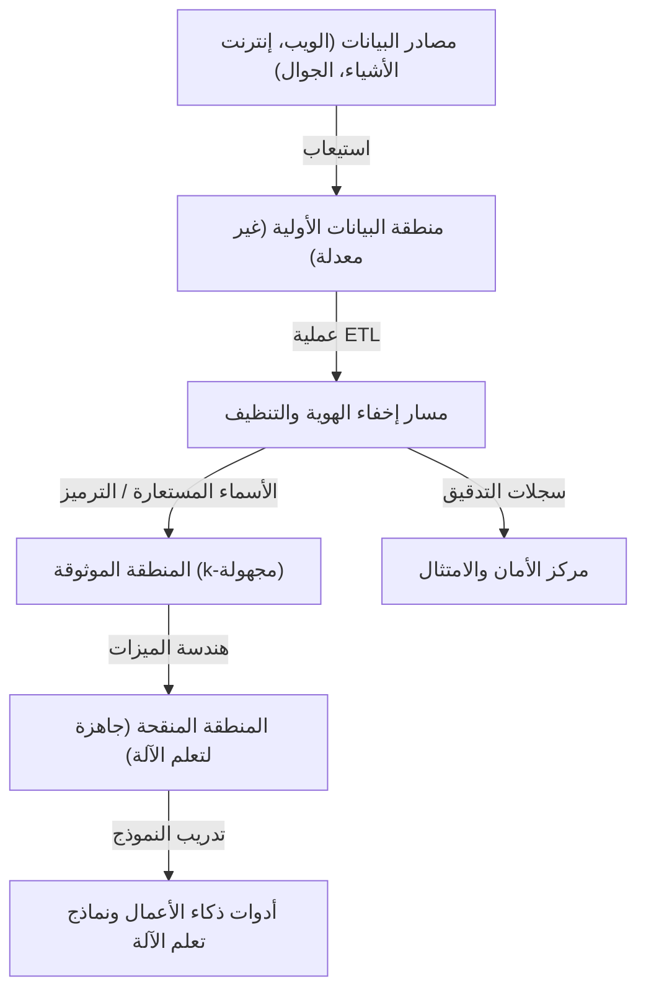

# المفاضلة بين الخصوصية والراحة: مصير المعلومات الشخصية في عصر البيانات الضخمة

في المجتمع الرقمي الحديث، نقوم بتوليد كميات هائلة من البيانات في حياتنا اليومية. يتم جمع "البيانات الضخمة" باستمرار، بما في ذلك بيانات الموقع الجغرافي من الهواتف الذكية، المنشورات على وسائل التواصل الاجتماعي، سجلات الشراء من التسوق عبر الإنترنت، والبيانات الصحية التي تسجلها الأجهزة القابلة للارتداء. هذه البيانات ضرورية لتطور الذكاء الاصطناعي وتقديم خدمات مخصصة، مما يجعل حياتنا أكثر راحة وثراءً.

ولكن من ناحية أخرى، برز خطر انتهاك الخصوصية المصاحب لجمع واستخدام المعلومات الشخصية كمشكلة اجتماعية خطيرة. وصلت المخاطر الكامنة وراء الراحة إلى مستوى لا يمكن تجاهله، مثل حوادث تسرب البيانات، ومشاركة البيانات مع أطراف ثالثة دون موافقة المستخدم، والمخاوف بشأن تحول المجتمعات إلى مجتمعات مراقبة من قبل الدول. في هذا المقال، سنقدم شرحاً تقنياً مفصلاً حول كيفية معالجة هذه المعضلة الحديثة المتمثلة في "المفاضلة بين الخصوصية والراحة" من المنظورين التكنولوجي والتنظيمي (القانوني)، مع دمج أحدث الاتجاهات.

## 1. نموذج المجتمع القائم على البيانات وتطور بنية البيانات

من أجل جمع البيانات واستخدامها بكفاءة، تتبنى الشركات بنيات بيانات مختلفة. نشهد حالياً تحولاً نموذجياً من "مستودع البيانات" (Data Warehouse)، الذي كان سائداً في الماضي، إلى "بحيرة البيانات" (Data Lake)، التي تدير مركزياً جميع أنواع البيانات بما في ذلك البيانات غير المهيكلة، وصولاً إلى البنية الموزعة الحالية المعروفة باسم "شبكة البيانات" (Data Mesh).

### بحيرة البيانات المركزية ومسار إخفاء الهوية

بحيرة البيانات هي مستودع تخزين يحتفظ بكميات هائلة من البيانات الأولية بتنسيقها الأصلي. ومع ذلك، فإن استخدام البيانات الأولية التي تحتوي على معلومات التعريف الشخصية (PII) مباشرة للتحليل سيؤدي إلى انتهاكات خطيرة للامتثال. ولذلك، يتم تنفيذ "مسار إخفاء الهوية" (Anonymization Pipeline) صارم بين بحيرة البيانات وبيئة التحليل.

يوضح الشكل التالي تدفق مسار إخفاء الهوية في بحيرة بيانات مركزية نموذجية.



في مثل هذه المسارات، يتم تطبيق عمليات مثل التجزئة (hashing) والتقنيع (masking) والتشفير (encryption) تلقائيًا عند تدفق البيانات. ومع ذلك، كما سنناقش لاحقًا، فإن التقنيع البسيط أو استخدام الأسماء المستعارة (Pseudonymization) لا يمكن أن يقضي تمامًا على خطر "إعادة تحديد الهوية" (Re-identification) من خلال المطابقة مع مصادر البيانات الأخرى.

## 2. فهم عميق لتقنيات تعزيز الخصوصية (PETs)

المفتاح لتحقيق التوازن بين الخصوصية واستخدام البيانات هو "تقنيات تعزيز الخصوصية" (Privacy-Enhancing Technologies: PETs). هنا، سنشرح بالتفصيل التعريفات الرياضية والتطبيقات التقنية لتقنيات تعزيز الخصوصية الرئيسية التي تلعب دورًا بالغ الأهمية في تحليلات البيانات الضخمة الحديثة والتعلم الآلي.

### 2.1 إخفاء الهوية k (K-Anonymity) وتوسعاته

يعد "إخفاء الهوية k"، الذي اقترحته لاتانيا سويني وبييرانجيلا ساماراتي في عام 1998، مفهومًا أساسيًا لحماية الخصوصية عند نشر البيانات. ويعني ذلك أن أي سجل في مجموعة البيانات يجب أن يكون غير قابل للتمييز عن $k-1$ من السجلات الأخرى على الأقل.

تنقسم السمات في قاعدة البيانات على نطاق واسع إلى ثلاثة أنواع:
1. **المعرفات الصريحة (Explicit Identifiers)**: المعلومات التي يمكن أن تحدد هوية الفرد مباشرة، مثل الاسم أو رقم الهوية الوطنية (يتم حذفها أو تشفيرها عادةً).
2. **شبه المعرفات (Quasi-Identifiers: QIs)**: المعلومات التي لا يمكن أن تحدد هوية الفرد بمفردها، مثل العمر والجنس والرمز البريدي، ولكن يمكنها ذلك عند دمجها.
3. **السمات الحساسة (Sensitive Attributes)**: المعلومات التي يجب حمايتها، مثل اسم المرض أو الدخل السنوي.

يضمن إخفاء الهوية k وجود $k$ على الأقل من مجموعات شبه المعرفات (فئة التكافؤ: Equivalence Class). ومع ذلك، فإن إخفاء الهوية k يعاني من نقاط ضعف تجاه "هجوم التجانس" (Homogeneity Attack) و"هجوم المعرفة الأساسية" (Background Knowledge Attack). على سبيل المثال، إذا كان جميع الأفراد الـ $k$ الذين ينتمون إلى فئة تكافؤ معينة لديهم نفس اسم المرض (سمة حساسة)، فسيتم تحديد اسم المرض حتى لو تم الحفاظ على إخفاء الهوية k.

للتغلب على هذا، تم اقتراح النماذج الموسعة التالية:

- **التنوع l (l-diversity)**: يضمن أن السمات الحساسة في كل فئة تكافؤ تحتوي على ما لا يقل عن $l$ من القيم المختلفة.
- **التقارب t (t-closeness)**: يضمن أن المسافة (مثل مسافة ناقل الأرض - Earth Mover's Distance) بين توزيع السمات الحساسة في كل فئة تكافؤ وتوزيع السمات الحساسة في مجموعة البيانات بأكملها أقل من أو تساوي العتبة $t$.

### 2.2 الخصوصية التفاضلية (Differential Privacy: DP)

تم اقتراح "الخصوصية التفاضلية" في عام 2006 من قبل سينثيا دورك وآخرين، وهي تتغلب على قيود نموذج إخفاء الهوية k ويتم اعتمادها على نطاق واسع حاليًا كمعيار الخصوصية الأقوى والأكثر صرامة من الناحية الرياضية. تطبق شركات التكنولوجيا العملاقة مثل Apple و Google و Microsoft خصوصية $\epsilon$-التفاضلية عند جمع بيانات القياس عن بُعد (القياس عن بعد) والبيانات الإحصائية من المستخدمين.

#### التعريف الرياضي للخصوصية التفاضلية

يقال إن الخوارزمية العشوائية (Randomized Algorithm) $\mathcal{M}$ تحقق $\epsilon$-الخصوصية التفاضلية إذا كان لأي مجموعتي بيانات متجاورتين $D$ و $D'$ تختلفان في سجل واحد فقط (أي $\|D - D'\|_1 = 1$)، ولأي مجموعة فرعية من المخرجات $S \subseteq \text{Range}(\mathcal{M})$، تتحقق المتباينة التالية:

$$ \Pr[\mathcal{M}(D) \in S] \le e^\epsilon \Pr[\mathcal{M}(D') \in S] $$

هنا، $\epsilon$ (ميزانية الخصوصية) هو معامل غير سالب يتحكم في مستوى حماية الخصوصية. كلما كان $\epsilon$ أصغر، كانت حماية الخصوصية أقوى، ولكن فائدة البيانات (المنفعة) تنخفض.

بالإضافة إلى ذلك، يُستخدم نموذج $(\epsilon, \delta)$-الخصوصية التفاضلية أيضًا على نطاق واسع، وهو نموذج مخفف يسمح بكسر ضمان الخصوصية باحتمال ضئيل جدًا $\delta$.

$$ \Pr[\mathcal{M}(D) \in S] \le e^\epsilon \Pr[\mathcal{M}(D') \in S] + \delta $$

#### آلية لابلاس (Laplace Mechanism)

تتمثل الطريقة النموذجية لتحقيق الخصوصية التفاضلية في "آلية لابلاس"، والتي تضيف عن قصد ضوضاء (أرقام عشوائية) تتبع توزيعًا محددًا إلى نتيجة الإخراج الحقيقية للاستعلام. يعتمد مقدار الضوضاء التي يجب إضافتها على "الحساسية العالمية" (Global Sensitivity) $\Delta f$ للدالة $f$.

تُعرّف الحساسية العالمية $\Delta f$ بأنها أقصى تغيير في ناتج الدالة $f$ لأي مجموعتي بيانات متجاورتين $D, D'$.

$$ \Delta f = \max_{D, D'} \| f(D) - f(D') \|_1 $$

تضيف آلية لابلاس إلى نتيجة الدالة $f(D)$ ضوضاء $Y$ مأخوذة من توزيع لابلاس $\text{Lap}(b)$ بمعامل مقياس $b = \frac{\Delta f}{\epsilon}$.

$$ \mathcal{M}(D) = f(D) + Y, \quad Y \sim \text{Lap}\left(\frac{\Delta f}{\epsilon}\right) $$

دالة الكثافة الاحتمالية لتوزيع لابلاس هي كما يلي:

$$ p(x \mid b) = \frac{1}{2b} \exp\left( - \frac{|x|}{b} \right) $$

من خلال حقن هذه الضوضاء، يصبح من المستحيل استنتاج ما إذا كان فرد معين مشمولاً في مجموعة البيانات من نتيجة الإخراج. تستخدم الشركات الخصوصية التفاضلية كتقنية للحفاظ على فائدة الاتجاهات الإحصائية للبيانات ككل (مثل المتوسط والتباين والعد) مع إخفاء بيانات الأفراد نفسها.

### 2.3 التعلم الموحد (Federated Learning: FL)

كان التعلم الآلي التقليدي يتبع نهجًا مركزيًا حيث يتم تجميع كميات هائلة من البيانات في خادم مركزي لتدريب النماذج، تمامًا مثل بحيرة البيانات المذكورة أعلاه. ومع ذلك، فإن إرسال بيانات حساسة مثل الصور الطبية وسجلات إدخال الهواتف الذكية إلى خادم مركزي ينطوي على مخاطر خصوصية كبيرة.

لذلك، اقترحت جوجل في عام 2016 "التعلم الموحد" (Federated Learning). في التعلم الموحد، بدلاً من نقل البيانات نفسها، يتم نقل "المعالجة الحسابية للنموذج" إلى الأجهزة الطرفية (مثل الهواتف الذكية وخوادم المستشفيات) حيث توجد البيانات.

```mermaid
flowchart TD
    Server["خادم التجميع المركزي"]
    Device1["الجهاز الطرفي 1 (هاتف ذكي)"]
    Device2["الجهاز الطرفي 2 (هاتف ذكي)"]
    Device3["الجهاز الطرفي 3 (هاتف ذكي)"]

    Server -->| 1. بث أوزان النموذج العالمي | Device1
    Server -->| 1. بث أوزان النموذج العالمي | Device2
    Server -->| 1. بث أوزان النموذج العالمي | Device3

    Device1 -->| 2. التدريب المحلي على البيانات الخاصة | Device1
    Device2 -->| 2. التدريب المحلي على البيانات الخاصة | Device2
    Device3 -->| 2. التدريب المحلي على البيانات الخاصة | Device3

    Device1 -->| 3. نقل تدرجات/تحديثات النموذج | Server
    Device2 -->| 3. نقل تدرجات/تحديثات النموذج | Server
    Device3 -->| 3. نقل تدرجات/تحديثات النموذج | Server

    Server -->| 4. التجميع (FedAvg) | Server
    Server -->| 5. تحديث النموذج العالمي | Server
```

#### خوارزمية التوسيط الموحد (Federated Averaging - FedAvg)

إن خوارزمية التجميع النموذجية في التعلم الموحد هي FedAvg. يستخدم كل عميل $k$ مجموعة بياناته الخاصة $D_k$ (بحجم $n_k$) لإجراء التدريب محليًا عبر الانحدار العشوائي المتدرج (SGD) لعدة حقب (epochs)، ويحسب الوزن المحدث $w_{t+1}^k$.

يتلقى الخادم المركزي الأوزان من العملاء الـ $K$ المشاركين، ويقوم بتحديث وزن النموذج العالمي $w_{t+1}$ عن طريق أخذ متوسط مرجح لهذه الأوزان بناءً على حجم البيانات. بافتراض أن إجمالي عدد البيانات هو $n = \sum_{k=1}^K n_k$، تكون معادلة التحديث كما يلي:

$$ w_{t+1} = \sum_{k=1}^K \frac{n_k}{n} w_{t+1}^k $$

بهذه الطريقة، يمكن بناء نماذج ذكاء اصطناعي ذكية دون أن تخرج البيانات الخام للأفراد (مثل سجلات الرسائل والصور) من أجهزتهم خطوة واحدة. تشمل الأمثلة التطبيقية النموذجية تحسين ميزة التنبؤ بالكلمة التالية في لوحة مفاتيح Google (Gboard)، وتحسين نماذج التعرف على الوجه FaceID من Apple، والتعرف على الصوت Hey Siri.

### 2.4 التشفير المتماثل (Homomorphic Encryption: HE)

التشفير المتماثل هو تقنية تشفير "سحرية" تتيح إجراء العمليات الحسابية (مثل الجمع والضرب) على البيانات وهي لا تزال مشفرة. في طرق التشفير العادية، عند معالجة البيانات، يجب أولاً فك تشفيرها (إعادتها إلى نص عادي)، لكن فك التشفير على خادم سحابي يشكل نقطة ضعف أمنية.

باستخدام التشفير المتماثل، تتحقق الخصائص التالية. إذا افترضنا أن دالة التشفير هي $E(\cdot)$، فإن إضافة أو ضرب النصوص العادية $m_1$ و $m_2$ يصبح ممكنًا من خلال العمليات (مثل $\oplus$ أو $\otimes$) على النصوص المشفرة كما هي.

$$ E(m_1 + m_2) = E(m_1) \oplus E(m_2) $$
$$ E(m_1 \times m_2) = E(m_1) \otimes E(m_2) $$

ينقسم التشفير المتماثل إلى "التشفير المتماثل الجزئي" (Partially Homomorphic Encryption: PHE)، والذي يسمح إما بالجمع أو بالضرب فقط، و"التشفير المتماثل الكامل" (Fully Homomorphic Encryption: FHE)، الذي يسمح بكل من الجمع والضرب لعدد غير محدود من المرات. منذ أن أنشأ كريج جينتري أول مخطط FHE باستخدام التشفير القائم على الشبكة (Lattice-based cryptography) في عام 2009، شكل ذلك إنجازًا كبيرًا في علم التشفير.

حاليًا، لا تزال هناك تحديات متبقية مثل تكلفة الحوسبة وزيادة حجم النص المشفر (overhead)، ولكن من المتوقع تطبيقه في التحليل الآمن للبيانات الطبية على السحابة والحوسبة الآمنة بين المؤسسات المالية.

## 3. اتجاهات القوانين واللوائح والامتثال: GDPR مقابل CCPA

بالتوازي مع التطور التكنولوجي، يتقدم وضع الأطر القانونية بسرعة على مستوى العالم. أصبح الامتثال لهذه القوانين واللوائح شرطًا أساسيًا للشركات عند الاستفادة من البيانات الضخمة. دعونا نقارن بين الإطارين التنظيميين الأكثر تأثيراً.

### اللائحة العامة لحماية البيانات في الاتحاد الأوروبي (GDPR)

تعتبر لائحة GDPR (اللائحة العامة لحماية البيانات)، التي دخلت حيز التنفيذ في مايو 2018، "المعيار الذهبي" لحماية البيانات الشخصية على مستوى العالم. تُطبق GDPR على جميع المؤسسات التي تتعامل مع بيانات الأفراد داخل الاتحاد الأوروبي، وفي حالة المخالفة، يتم فرض غرامات ضخمة تصل إلى 4% من إجمالي المبيعات السنوية العالمية، أو 20 مليون يورو، أيهما أعلى.

**الميزات الرئيسية لـ GDPR:**
- **مبدأ الاشتراك (Opt-in)**: يتطلب جمع البيانات ومعالجتها موافقة مسبقة صريحة وحرة من المستخدم.
- **الحق في النسيان (Right to be Forgotten/Right to Erasure)**: يحق للمستخدم مطالبة الشركات بالمسح الكامل لبياناته الشخصية. تتطلب هذه القاعدة إزالة البيانات حتى من النسخ الاحتياطية لبحيرات البيانات، وهو مطلب بالغ الصعوبة من الناحية الفنية.
- **مراقب البيانات ومعالج البيانات**: تحدد اللائحة بصرامة مسؤوليات من يحدد غرض استخدام البيانات (المراقب) ومن يعالج البيانات بناءً على تلك التعليمات (المعالج).

### قانون خصوصية المستهلك في كاليفورنيا (CCPA/CPRA)

في ظل غياب قانون شامل للخصوصية على المستوى الفيدرالي في الولايات المتحدة، يعمل قانون CCPA (قانون خصوصية المستهلك في كاليفورنيا)، الذي دخل حيز التنفيذ في كاليفورنيا في عام 2020، كمعيار وطني بحكم الأمر الواقع. وفي وقت لاحق، تم تعزيزه بموجب قانون CPRA (قانون حقوق الخصوصية في كاليفورنيا).

**الميزات الرئيسية لـ CCPA:**
- **مبدأ إلغاء الاشتراك (Opt-out)**: على عكس "الموافقة المسبقة" في GDPR، يمكن جمع البيانات دون موافقة مسبقة، لكن من الإلزامي تزويد المستخدمين برابط واضح لإلغاء الاشتراك ينص على "لا تبع معلوماتي الشخصية" (Do Not Sell My Personal Information).
- **حق الوصول إلى البيانات**: يمكن للمستهلكين طلب الكشف عن معلومات محددة جمعتها الشركة، وفئاتها، ومصادرها، وما إذا تم بيعها لأطراف ثالثة.

تتطلب هذه القوانين واللوائح من الشركات بقوة تطبيق "الخصوصية حسب التصميم" (Privacy by Design) — أي دمج حماية الخصوصية منذ مرحلة تصميم الأنظمة والعمليات.

## 4. تحديات التنفيذ في النظام البيئي للبيانات

دعونا نلقي نظرة على التحديات التنفيذية عند تطبيق تقنيات حماية الخصوصية والقوانين التنظيمية في بيئة فعلية للبيانات الضخمة. على سبيل المثال، لنفترض حالة تطبيق إخفاء الهوية k أو الخصوصية التفاضلية في بحيرة بيانات باستخدام Python و Pandas، أو PySpark.

```python
# تنفيذ مفاهيمي لتجميع البيانات مع تطبيق الخصوصية التفاضلية (Python)
import numpy as np
import pandas as pd

def laplace_mechanism(true_value, sensitivity, epsilon):
    """
    دالة لإضافة ضوضاء لابلاس إلى القيمة الحقيقية
    """
    scale = sensitivity / epsilon
    noise = np.random.laplace(loc=0, scale=scale)
    return true_value + noise

def get_dp_average_salary(dataframe, epsilon=1.0):
    """
    حساب متوسط الراتب مع ضمان الخصوصية التفاضلية
    """
    # الحساب الفعلي
    true_sum = dataframe['salary'].sum()
    true_count = len(dataframe)
    
    # تطبيق الخصوصية التفاضلية (بناءً على افتراض الحساسية)
    # لنفترض أن الحد الأقصى لتغير الراتب هو الحساسية (بشكل أكثر دقة، يتطلب الأمر اقتصاص Clipping)
    max_salary_diff = 100000 
    
    # إضافة الضوضاء (يمكن أيضًا تطبيق DP على كل من المجموع الإجمالي والعدد)
    noisy_sum = laplace_mechanism(true_sum, max_salary_diff, epsilon / 2)
    noisy_count = laplace_mechanism(true_count, 1, epsilon / 2)
    
    return noisy_sum / noisy_count

# التنفيذ داخل مسار البيانات
# dp_avg_salary = get_dp_average_salary(raw_df, epsilon=0.5)
```

كما يظهر في مقتطف الكود هذا، فإن تنفيذ الخصوصية التفاضلية بحد ذاته بسيط ويتمثل في إضافة ضوضاء، ولكن في العمليات الفعلية، تصبح إدارة "ميزانية الخصوصية ($\epsilon$)" بالغة الصعوبة. إذا تم إصدار استعلامات متعددة لنفس مجموعة البيانات، يتم استهلاك ميزانية الخصوصية (بناءً على نظرية التركيب)، وفي النهاية يجب بناء آلية لقفل مجموعة البيانات بأكملها أو رفض الاستعلامات (إدارة ميزانية الخصوصية).

## 5. آفاق المستقبل والتحديات الأخلاقية

المفاضلة بين البيانات الضخمة والخصوصية ليست لعبة صفرية (Zero-sum game). فمع تطور تقنيات PETs مثل الخصوصية التفاضلية، والتعلم الموحد، والتشفير المتماثل، أصبح النموذج الجديد لاستخدام البيانات الذي يتيح "مشاركة الرؤى (Insights) دون مشاركة البيانات" حقيقة واقعة.

علاوة على ذلك، في السنوات الأخيرة، وبالارتباط مع مفاهيم "شبكة البيانات" (Data Mesh) و"الويب 3" (Web3 - الويب اللامركزي)، تتسارع الحركة لاستعادة "سيادة البيانات" (Data Sovereignty) من منصات التكنولوجيا العملاقة إلى الأفراد. وتُجرى نقاشات حول مستقبل يتم فيه تخزين البيانات الشخصية في مخازن البيانات الشخصية (PDS) أو محافظ البيانات، حيث يتحكم المستخدم نفسه في ترخيص استخدام بياناته وتحقيق الدخل منها.

ومع ذلك، فإن الحلول التكنولوجية ليست مثالية. في التعلم الموحد، يوجد تهديد "هجوم التسميم" (Poisoning Attack) حيث يرسل عميل ضار تحديثات نموذجية خبيثة لتلويث النموذج العالمي. وفي الخصوصية التفاضلية، يُشار إلى تحديات أخلاقية تتمثل في أن بيانات الأقليات قد تُطمس بفعل الضوضاء، مما يؤدي إلى حدوث تحيز في نموذج الذكاء الاصطناعي.

## الخاتمة

يتجاوز مصير المعلومات الشخصية في عصر البيانات الضخمة كونه مجرد تحدٍ تكنولوجي، ليطرح سؤالاً جوهرياً حول طبيعة المجتمع الذي نأمل في العيش فيه. كيف يمكننا الاستمتاع بالراحة مع حماية كرامة الفرد وخصوصيته؟ لا يمكن الوصول إلى حل مستدام إلا من خلال ثالوث متمثل في: وضع الأطر القانونية والتنظيمية، والابتكار المستمر في تقنيات حماية الخصوصية، والمستوى العالي من الوعي الرقمي (محو الأمية الرقمية) لدى كل فرد منا كمزود للبيانات. من المرجح ألا تبقى الخصوصية والراحة مجرد مفاضلة (Trade-off)، بل ستتطور إلى "متطلبات أساسية" يمكن تحقيق التوافق بينها بفضل أحدث التقنيات.


