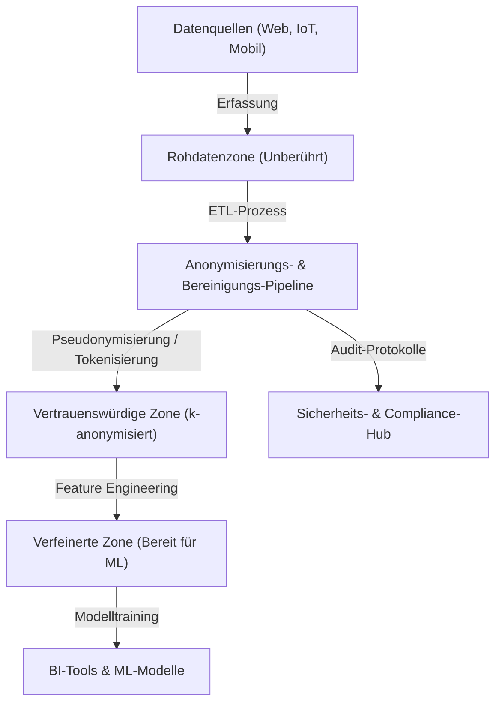
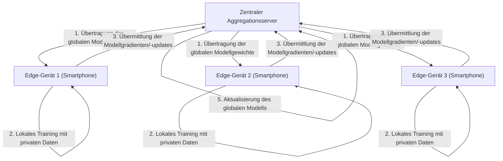

# Kompromiss zwischen Datenschutz und Komfort: Der Verbleib persönlicher Daten im Zeitalter von Big Data

In der heutigen digitalen Gesellschaft generieren wir in unserem täglichen Leben enorme Datenmengen. Vielfältige "Big Data" werden kontinuierlich gesammelt, wie Standortdaten von Smartphones, Beiträge in sozialen Netzwerken, Kaufhistorien beim Online-Shopping und Gesundheitsdaten, die von Wearables aufgezeichnet werden. Diese Daten sind unerlässlich für die Weiterentwicklung der KI (Künstliche Intelligenz) und die Bereitstellung personalisierter Dienste, wodurch unser Leben komfortabler und reicher wird.

Auf der anderen Seite hat sich das Risiko von Datenschutzverletzungen im Zusammenhang mit der Erfassung und Nutzung persönlicher Daten zu einem ernsthaften gesellschaftlichen Problem entwickelt. Datenlecks, die Weitergabe von Daten an Dritte ohne Zustimmung der Nutzer und die Sorge vor einer vom Staat überwachten Gesellschaft – die Risiken, die sich hinter dem Komfort verbergen, haben ein Ausmaß erreicht, das nicht ignoriert werden kann. In diesem Artikel bieten wir eine äußerst detaillierte technische Erklärung, wie dieses moderne Dilemma des „Kompromisses zwischen Datenschutz und Komfort“ sowohl aus technologischer als auch aus regulatorischer Sicht mit den neuesten Entwicklungen angegangen wird.

## 1. Das Paradigma der datengesteuerten Gesellschaft und die Evolution der Datenarchitektur

Um Daten effizient zu sammeln und zu nutzen, setzen Unternehmen verschiedene Datenarchitekturen ein. Es gab einen Übergang vom einst vorherrschenden „Data Warehouse“ zum „Data Lake“, der alle Daten einschließlich unstrukturierter Daten zentral verwaltet, und heute erleben wir einen Paradigmenwechsel zum „Data Mesh“, einer verteilten Architektur.

### Zentralisierter Data Lake und Anonymisierungs-Pipeline

Ein Data Lake ist ein Speicher-Repository, das riesige Mengen an Rohdaten in ihrem ursprünglichen Format speichert. Die direkte Verwendung von Rohdaten, die persönlich identifizierbare Informationen (PII) enthalten, für Analysen führt jedoch zu schwerwiegenden Compliance-Verstößen. Daher wird zwischen dem Data Lake und der Analyseumgebung eine strikte „Anonymisierungs-Pipeline“ (Anonymization Pipeline) implementiert.

Das folgende Diagramm zeigt den Ablauf einer Anonymisierungs-Pipeline in einem typischen zentralisierten Data Lake.



In solch einer Pipeline werden Prozesse wie Hashing, Maskierung und Verschlüsselung automatisch bei der Dateneingabe angewendet. Wie jedoch später erläutert wird, kann eine einfache Maskierung oder Pseudonymisierung das Risiko der „Re-Identifizierung“ (Re-identification) durch Abgleich mit anderen Datenquellen nicht vollständig ausschließen.

## 2. Tiefes Verständnis datenschutzverbessernder Technologien (PETs)

Der Schlüssel zur Vereinbarkeit von Datenschutz und Datennutzung liegt in den „Privacy-Enhancing Technologies (PETs)“ (datenschutzverbessernde Technologien). Hier geben wir eine detaillierte mathematische Definition und technische Erklärung der wichtigsten PETs, die bei der modernen Big-Data-Analyse und beim maschinellen Lernen eine äußerst wichtige Rolle spielen.

### 2.1 k-Anonymität (k-Anonymity) und ihre Erweiterungen

Die 1998 von Latanya Sweeney und Pierangela Samarati vorgeschlagene „k-Anonymität“ ist ein grundlegendes Konzept für den Datenschutz bei der Datenveröffentlichung. Dies bedeutet, dass jeder Datensatz in einem Datensatz nicht von mindestens $k-1$ anderen Datensätzen unterschieden werden kann.

Die Attribute in einer Datenbank werden grob in die folgenden drei Kategorien unterteilt:
1. **Identifikatoren (Explicit Identifiers)**: Informationen, die eine Person direkt identifizieren können, wie Namen oder persönliche Identifikationsnummern (diese werden normalerweise gelöscht oder verschlüsselt).
2. **Quasi-Identifikatoren (Quasi-Identifiers: QIs)**: Informationen wie Alter, Geschlecht oder Postleitzahl, die allein keine Person identifizieren können, dies jedoch in Kombination ermöglichen.
3. **Sensible Attribute (Sensitive Attributes)**: Zu schützende Informationen wie Krankheitsnamen oder Jahreseinkommen.

Die k-Anonymität garantiert, dass es immer mindestens $k$ Kombinationen von Quasi-Identifikatoren (Äquivalenzklassen: Equivalence Class) gibt. Die k-Anonymität weist jedoch Schwachstellen gegenüber dem „Homogenitätsangriff“ (Homogeneity Attack) und dem „Hintergrundwissensangriff“ (Background Knowledge Attack) auf. Wenn beispielsweise alle $k$ Personen, die zu einer bestimmten Äquivalenzklasse gehören, denselben Krankheitsnamen (sensibles Attribut) haben, wird die Krankheit identifiziert, obwohl die k-Anonymität gewahrt bleibt.

Um dies zu überwinden, wurden die folgenden erweiterten Modelle vorgeschlagen:

- **l-Diversität (l-diversity)**: Garantiert, dass sensible Attribute in jeder Äquivalenzklasse mindestens $l$ verschiedene Werte aufweisen.
- **t-Nähe (t-closeness)**: Stellt sicher, dass der Abstand (z. B. Earth Mover's Distance) zwischen der Verteilung sensibler Attribute in jeder Äquivalenzklasse und der Verteilung sensibler Attribute im gesamten Datensatz unter einem Schwellenwert $t$ liegt.

### 2.2 Differentielle Privatsphäre (Differential Privacy: DP)

Die derzeit am weitesten verbreitete und mächtigste, mathematisch strenge Datenschutzrichtlinie, die die Grenzen des k-Anonymitätsmodells überwindet, ist die 2006 von Cynthia Dwork und anderen vorgeschlagene „Differentielle Privatsphäre“ (Differential Privacy). Tech-Giganten wie Apple, Google und Microsoft wenden diese $\epsilon$-Differentielle Privatsphäre an, wenn sie Telemetrie- oder statistische Daten von Nutzern sammeln.

#### Mathematische Definition der differentiellen Privatsphäre

Ein randomisierter Algorithmus (Randomized Algorithm) $\mathcal{M}$ erfüllt die $\epsilon$-differentielle Privatsphäre, wenn für beliebige zwei benachbarte Datensätze $D$ und $D'$, die sich in genau einem Datensatz unterscheiden (d. h. $\|D - D'\|_1 = 1$), und jede Teilmenge der Ausgaben $S \subseteq \text{Range}(\mathcal{M})$ die folgende Ungleichung gilt:

$$ \Pr[\mathcal{M}(D) \in S] \le e^\epsilon \Pr[\mathcal{M}(D') \in S] $$

Hierbei ist $\epsilon$ (das Datenschutzbudget) ein nicht-negativer Parameter, der das Schutzniveau des Datenschutzes steuert. Je kleiner $\epsilon$ ist, desto stärker ist der Datenschutz, jedoch sinkt der Nutzen (Utility) der Daten.

Darüber hinaus wird häufig die $(\epsilon, \delta)$-differentielle Privatsphäre als entspanntes Modell verwendet, das mit einer sehr geringen Wahrscheinlichkeit $\delta$ eine Verletzung der Datenschutzgarantie zulässt.

$$ \Pr[\mathcal{M}(D) \in S] \le e^\epsilon \Pr[\mathcal{M}(D') \in S] + \delta $$

#### Laplace-Mechanismus (Laplace Mechanism)

Eine repräsentative Methode zur Erreichung der differentiellen Privatsphäre ist der „Laplace-Mechanismus“, der den tatsächlichen Ausgabeergebnissen einer Abfrage absichtlich Rauschen (Zufallszahlen) hinzufügt, das einer bestimmten Verteilung folgt. Wie viel Rauschen hinzugefügt werden soll, hängt von der „globalen Sensitivität“ (Global Sensitivity) $\Delta f$ der Funktion $f$ ab.

Die globale Sensitivität $\Delta f$ ist als die maximale Änderung der Ausgabe der Funktion $f$ für beliebige benachbarte Datensätze $D, D'$ definiert.

$$ \Delta f = \max_{D, D'} \| f(D) - f(D') \|_1 $$

Der Laplace-Mechanismus fügt dem Ergebnis der Funktion $f(D)$ ein Rauschen $Y$ hinzu, das aus der Laplace-Verteilung $\text{Lap}(b)$ mit dem Skalenparameter $b = \frac{\Delta f}{\epsilon}$ gezogen wird.

$$ \mathcal{M}(D) = f(D) + Y, \quad Y \sim \text{Lap}\left(\frac{\Delta f}{\epsilon}\right) $$

Die Wahrscheinlichkeitsdichtefunktion der Laplace-Verteilung ist wie folgt:

$$ p(x \mid b) = \frac{1}{2b} \exp\left( - \frac{|x|}{b} \right) $$

Durch diese Injektion von Rauschen wird es unmöglich, aus dem Ausgabeergebnis zu schließen, ob eine bestimmte Person im Datensatz enthalten ist oder nicht. Unternehmen nutzen DP als Technologie, um nützliche statistische Trends der gesamten Daten (Durchschnitt, Varianz, Anzahl usw.) beizubehalten, während die Daten einzelner Personen maskiert werden.

### 2.3 Föderiertes Lernen (Federated Learning: FL)

Das herkömmliche maschinelle Lernen basierte auf einem zentralisierten Ansatz, bei dem riesige Datenmengen auf einem zentralen Server aggregiert wurden, um Modelle zu trainieren, ähnlich wie beim zuvor erwähnten Data Lake. Die Übertragung vertraulicher Daten wie medizinischer Bilder oder Eingabeverläufe von Smartphones an einen zentralen Server birgt jedoch erhebliche Datenschutzrisiken.

Daher hat Google 2016 das „Federated Learning“ (föderiertes Lernen) vorgeschlagen. Beim föderierten Lernen werden nicht die Daten selbst übertragen, sondern die „Berechnung des Modells“ wird auf das Edge-Gerät (wie ein Smartphone oder ein Krankenhausserver) verlagert, wo sich die Daten befinden.



#### Federated Averaging (FedAvg) Algorithmus

Der repräsentative Aggregationsalgorithmus beim föderierten Lernen ist FedAvg. Jeder Client $k$ führt das Lernen durch den stochastischen Gradientenabstieg (SGD) lokal über mehrere Epochen unter Verwendung seines eigenen Datensatzes $D_k$ (Größe $n_k$) durch und berechnet die aktualisierten Gewichte $w_{t+1}^k$.

Der zentrale Server empfängt die Gewichte von den teilnehmenden $K$ Clients und aktualisiert das globale Modellgewicht $w_{t+1}$, indem er diese Gewichte entsprechend der Datengröße gewichtet mittelt. Wenn die Gesamtzahl der Daten $n = \sum_{k=1}^K n_k$ ist, sieht die Aktualisierungsgleichung wie folgt aus:

$$ w_{t+1} = \sum_{k=1}^K \frac{n_k}{n} w_{t+1}^k $$

Dies ermöglicht den Aufbau intelligenter KI-Modelle, ohne dass die persönlichen Rohdaten (wie Nachrichtenverläufe oder Fotos) das Gerät jemals verlassen. Typische Anwendungsbeispiele sind die Funktion zur Vorhersage des nächsten Wortes in der Google-Tastatur (Gboard) sowie die Verbesserungen von Apples FaceID und den Spracherkennungsmodellen für Hey Siri.

### 2.4 Homomorphe Verschlüsselung (Homomorphic Encryption: HE)

Eine „magische“ Verschlüsselungstechnologie, die es ermöglicht, Berechnungen (wie Addition und Multiplikation) an Daten durchzuführen, während diese in ihrem verschlüsselten Zustand verbleiben, ist die homomorphe Verschlüsselung. Bei herkömmlichen Verschlüsselungsmethoden müssen Daten zur Verarbeitung zunächst entschlüsselt (in Klartext zurückverwandelt) werden. Eine Entschlüsselung auf Cloud-Servern stellt jedoch eine Sicherheitslücke dar.

Durch die Verwendung der homomorphen Verschlüsselung werden die folgenden Eigenschaften realisiert. Wenn die Verschlüsselungsfunktion $E(\cdot)$ ist, können Addition oder Multiplikation der Klartexte $m_1$ und $m_2$ als Operationen ($\oplus$ oder $\otimes$) an den Chiffretexten ausgeführt werden.

$$ E(m_1 + m_2) = E(m_1) \oplus E(m_2) $$
$$ E(m_1 \times m_2) = E(m_1) \otimes E(m_2) $$

Die homomorphe Verschlüsselung wird in eine „partiell homomorphe Verschlüsselung (Partially Homomorphic Encryption: PHE)“, die entweder nur Addition oder nur Multiplikation zulässt, und eine „vollständig homomorphe Verschlüsselung (Fully Homomorphic Encryption: FHE)“, die unendlich viele Additionen und Multiplikationen zulässt, unterteilt. Seit Craig Gentry 2009 das erste FHE-Schema unter Verwendung gitterbasierter Kryptographie (Lattice-based cryptography) entwickelte, war dies ein großer Durchbruch in der Kryptographie.

Obwohl derzeit noch Herausforderungen in Bezug auf Rechenkosten und eine Zunahme der Größe des Chiffretextes (Overhead) bestehen, wird eine Anwendung auf die sichere Analyse medizinischer Daten in der Cloud und vertrauliche Berechnungen zwischen Finanzinstituten erwartet.

## 3. Regulierung und Compliance-Trends: GDPR vs. CCPA

Parallel zum technologischen Fortschritt schreitet auch die Entwicklung rechtlicher Rahmenbedingungen weltweit rasant voran. Wenn Unternehmen Big Data nutzen, ist die Einhaltung dieser Gesetze und Vorschriften eine zwingende Voraussetzung. Lassen Sie uns die beiden einflussreichsten regulatorischen Rahmenbedingungen vergleichen.

### EU-Datenschutz-Grundverordnung (GDPR)

Die im Mai 2018 in Kraft getretene EU-Datenschutz-Grundverordnung (GDPR) wird als weltweiter Maßstab („Goldstandard“) für den Schutz personenbezogener Daten angesehen. Die GDPR gilt für alle Organisationen, die Daten von Personen innerhalb der EU verarbeiten. Bei Verstößen drohen enorme Bußgelder in Höhe von bis zu 4 % des weltweiten Jahresumsatzes oder 20 Millionen Euro, je nachdem, welcher Betrag höher ist.

**Hauptmerkmale der GDPR:**
- **Opt-in-Prinzip**: Die Datenerfassung und -verarbeitung erfordert die ausdrückliche, freiwillige und vorherige Zustimmung des Nutzers.
- **Recht auf Vergessenwerden (Right to be Forgotten / Right to Erasure)**: Benutzer haben das Recht, von Unternehmen die vollständige Löschung ihrer personenbezogenen Daten zu verlangen. Auch aus den Backups von Data Lakes müssen Daten gelöscht werden, was eine technisch extrem anspruchsvolle Anforderung darstellt.
- **Datenverantwortlicher (Controller) und Auftragsverarbeiter (Processor)**: Es definiert strikt die Verantwortlichkeiten derjenigen, die über den Zweck der Datennutzung entscheiden (Datenverantwortlicher), und derjenigen, die die Daten gemäß diesen Anweisungen verarbeiten (Auftragsverarbeiter).

### California Consumer Privacy Act (CCPA/CPRA)

Während in den Vereinigten Staaten kein umfassendes Datenschutzgesetz auf Bundesebene existiert, fungiert der CCPA (California Consumer Privacy Act), der 2020 in Kalifornien in Kraft trat, faktisch als landesweiter Standard. Er wurde später durch den CPRA (California Privacy Rights Act) weiter verschärft.

**Hauptmerkmale des CCPA:**
- **Opt-out-Prinzip**: Im Gegensatz zur „vorherigen Zustimmung“ in der GDPR können Daten ohne vorherige Zustimmung gesammelt werden, aber Unternehmen sind verpflichtet, den Benutzern einen klaren Opt-out-Link mit der Aufschrift „Meine persönlichen Daten nicht verkaufen“ (Do Not Sell My Personal Information) anzubieten.
- **Recht auf Datenzugriff**: Verbraucher können die Offenlegung bestimmter von Unternehmen gesammelter Informationen, ihrer Kategorien, der Quellen und der Frage verlangen, ob sie an Dritte verkauft wurden.

Diese regulatorischen Rahmenbedingungen verlangen von Unternehmen nachdrücklich „Privacy by Design“ – die Integration des Datenschutzes bereits ab der Entwurfsphase von Systemen und Prozessen.

## 4. Implementierungsherausforderungen im Daten-Ökosystem

Lassen Sie uns die Implementierungsaspekte der Anwendung von Datenschutztechnologien und -vorschriften in einer tatsächlichen Big-Data-Umgebung betrachten. Wir nehmen beispielsweise einen Fall an, in dem k-Anonymisierung oder differentielle Privatsphäre unter Verwendung von Python und Pandas oder PySpark in einem Data Lake implementiert wird.

```python
# Konzeptuelle Implementierung der Datenaggregation mit differentieller Privatsphäre (Python)
import numpy as np
import pandas as pd

def laplace_mechanism(true_value, sensitivity, epsilon):
    """
    Funktion zum Hinzufügen von Laplace-Rauschen zu einem wahren Wert
    """
    scale = sensitivity / epsilon
    noise = np.random.laplace(loc=0, scale=scale)
    return true_value + noise

def get_dp_average_salary(dataframe, epsilon=1.0):
    """
    Berechnung des Durchschnittsgehalts mit garantierter differentieller Privatsphäre
    """
    # Tatsächliche Berechnung
    true_sum = dataframe['salary'].sum()
    true_count = len(dataframe)
    
    # Anwendung der differentiellen Privatsphäre (basierend auf der Sensitivitätsannahme)
    # Angenommen, die Fluktuation des Maximalgehalts ist die Sensitivität (streng genommen ist Clipping erforderlich)
    max_salary_diff = 100000 
    
    # Hinzufügen von Rauschen (es ist auch möglich, DP jeweils auf die Summe und die Anzahl anzuwenden)
    noisy_sum = laplace_mechanism(true_sum, max_salary_diff, epsilon / 2)
    noisy_count = laplace_mechanism(true_count, 1, epsilon / 2)
    
    return noisy_sum / noisy_count

# Ausführung innerhalb der Daten-Pipeline
# dp_avg_salary = get_dp_average_salary(raw_df, epsilon=0.5)
```

Wie aus diesem Codeausschnitt ersichtlich ist, ist die Implementierung der differentiellen Privatsphäre selbst nur die einfache Addition von Rauschen, aber in realen Operationen wird die Verwaltung des „Datenschutzbudgets“ ($\epsilon$) extrem schwierig. Wenn auf denselben Datensatz mehrere Abfragen ausgeführt werden, wird das Datenschutzbudget verbraucht (basierend auf dem Kompositionstheorem), und letztendlich ist es notwendig, einen Mechanismus (Privacy Budget Management) aufzubauen, um den gesamten Datensatz zu sperren oder Abfragen abzulehnen.

## 5. Zukunftsaussichten und ethische Herausforderungen

Der Kompromiss zwischen Big Data und Datenschutz ist kein Nullsummenspiel. Mit der Weiterentwicklung von PETs wie der differentiellen Privatsphäre, dem föderierten Lernen und der homomorphen Verschlüsselung wird ein neues Paradigma der Datennutzung – das „Teilen von Erkenntnissen ohne Teilen der Daten“ – Realität.

Darüber hinaus hat sich diese Entwicklung in den letzten Jahren mit den Konzepten von „Data Mesh“ und „Web3“ (dezentrales Web) verbunden, was den Trend beschleunigt, die Datensouveränität (Data Sovereignty) von riesigen Plattformbetreibern an den Einzelnen zurückzugeben. Es wird über eine Zukunft diskutiert, in der persönliche Daten in Personal Data Stores (PDS) oder Daten-Wallets gespeichert werden und die Nutzer selbst die Lizenzierung und Monetarisierung ihrer Daten kontrollieren.

Technologische Lösungen sind jedoch nicht perfekt. Beim föderierten Lernen besteht die Gefahr eines „Vergiftungsangriffs“ (Poisoning Attack), bei dem böswillige Clients ungültige Modell-Updates senden, um das globale Modell zu kontaminieren. Bei der differentiellen Privatsphäre wurde auch auf ethische Bedenken hingewiesen, dass Daten von Minderheiten durch das Rauschen übertönt werden können, was zu Voreingenommenheit (Bias) im KI-Modell führt.

## Fazit

Die Frage nach dem Verbleib persönlicher Daten im Zeitalter von Big Data geht über eine bloße technische Herausforderung hinaus und stellt die grundlegende Frage, welche Art von Gesellschaft wir uns wünschen. Wie können wir den Komfort genießen und gleichzeitig die persönliche Würde und Privatsphäre schützen? Nur durch eine Dreifaltigkeit aus der Entwicklung rechtlicher Rahmenbedingungen, der kontinuierlichen Innovation von Datenschutztechnologien und einer hohen Kompetenz von jedem Einzelnen von uns, der Daten bereitstellt, können wir eine nachhaltige Lösung erreichen. Datenschutz und Komfort sind nicht länger ein Kompromiss, sondern werden sich mit modernster Technologie zu einer miteinander vereinbaren „unumgänglichen Anforderung“ entwickeln.


