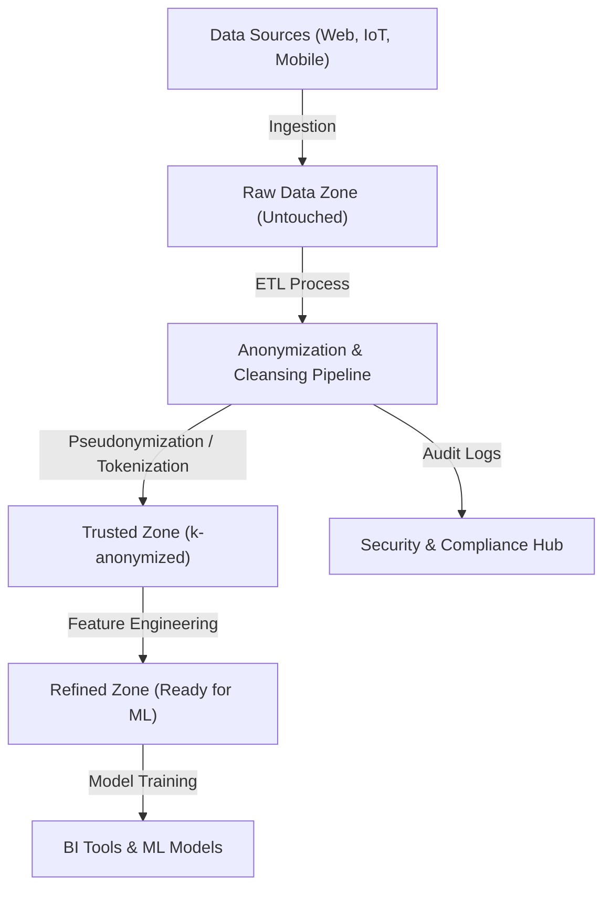
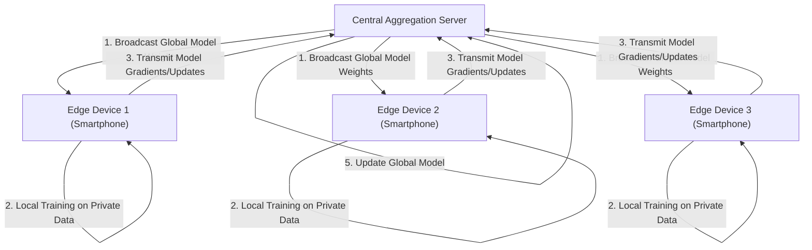

# The Trade-off Between Privacy and Convenience: The Fate of Personal Information in the Era of Big Data

In today's digital society, we generate enormous amounts of data in our daily lives. A wide variety of "big data"—such as smartphone location information, social media posts, online shopping purchase histories, and health data recorded by wearable devices—is constantly being collected. This data is essential for the evolution of AI (Artificial Intelligence) and the provision of personalized services, making our lives more convenient and richer.

However, on the other hand, the risk of privacy infringement associated with the collection and use of personal information has emerged as a serious social issue. The risks lurking behind convenience have reached an undeniable scale, including data breaches, the provision of data to third parties without user consent, and concerns about a surveillance society by the state. This article provides an extremely detailed technical explanation of how technology and legal regulations are approaching the modern dilemma of this "trade-off between privacy and convenience," along with the latest trends.

## 1. The Paradigm of a Data-Driven Society and the Evolution of Data Architecture

To collect and utilize data efficiently, companies are adopting various data architectures. There is an ongoing paradigm shift from the once-mainstream "Data Warehouse" to a "Data Lake" that centrally manages all data, including unstructured data, and now to a "Data Mesh," which is a decentralized architecture.

### Centralized Data Lakes and Anonymization [Pipeline](https://kenji.blog/en/p/cicd-pipeline-github-actions-best-practices/)s

A data lake is a storage repository that stores large amounts of raw data in its native format. However, using raw data containing PII (Personally Identifiable Information) directly for analysis causes serious compliance violations. Therefore, a strict "Anonymization Pipeline" is implemented between the data lake and the analysis environment.

The figure below shows the flow of an anonymization pipeline in a typical centralized data lake.



In such pipelines, processes like hashing, masking, and encryption are automatically applied when data flows in. However, as discussed later, simple masking or pseudonymization cannot completely eliminate the risk of "Re-identification" through matching with other data sources.

## 2. A Deep Understanding of Privacy-Enhancing Technologies (PETs)

The key to balancing privacy and data utilization is "Privacy-Enhancing Technologies (PETs)". Here, we provide detailed mathematical definitions and technical implementations of the major PETs that play extremely important roles in modern big data analysis and machine learning.

### 2.1 K-Anonymity and Its Extensions

Proposed by Latanya Sweeney and Pierangela Samarati in 1998, "k-anonymity" is a foundational concept for privacy protection in data publication. It means ensuring that every record in a dataset is indistinguishable from at least $k-1$ other records.

Attributes in a database are broadly classified into the following three categories:
1. **Explicit Identifiers**: Information that can directly identify an individual, such as names and social security numbers (these are usually deleted or encrypted).
2. **Quasi-Identifiers (QIs)**: Information that cannot identify an individual on its own, such as age, gender, and zip code, but can be used to identify them when combined.
3. **Sensitive Attributes**: Information that should be protected, such as medical conditions or annual income.

K-anonymity guarantees that there are always at least $k$ combinations of quasi-identifiers (Equivalence Classes). However, k-anonymity is vulnerable to "Homogeneity Attacks" and "Background Knowledge Attacks". For example, if all $k$ people belonging to an equivalence class have the same medical condition (sensitive attribute), the condition will be identified even if k-anonymity is maintained.

To overcome this, the following extended models have been proposed:

- **l-diversity**: Guarantees that sensitive attributes have at least $l$ different values in each equivalence class.
- **t-closeness**: Ensures that the distance (such as Earth Mover's Distance) between the distribution of sensitive attributes in each equivalence class and the distribution of sensitive attributes in the entire dataset is less than or equal to a threshold $t$.

### 2.2 Differential Privacy ([DP](https://kenji.blog/en/p/dynamic-programming-dp-introduction-knapsack-fibonacci/))

Overcoming the limitations of the k-anonymity model, "Differential Privacy" proposed by Cynthia Dwork et al. in 2006 is now widely adopted as the strongest and most mathematically rigorous privacy standard. Tech giants such as Apple, Google, and Microsoft apply this $\epsilon$-differential privacy when collecting telemetry and statistical data from users.

#### Mathematical Definition of Differential Privacy

A randomized algorithm $\mathcal{M}$ satisfies $\epsilon$-differential privacy if, for any two adjacent datasets $D$ and $D'$ differing by only one record (i.e., $\|D - D'\|_1 = 1$), and for any subset of outputs $S \subseteq \text{Range}(\mathcal{M})$, the following inequality holds:

$$ \Pr[\mathcal{M}(D) \in S] \le e^\epsilon \Pr[\mathcal{M}(D') \in S] $$

Here, $\epsilon$ (privacy budget) is a non-negative parameter that controls the level of privacy protection. The smaller the $\epsilon$, the stronger the privacy protection, but the utility of the data decreases.

Furthermore, $(\epsilon, \delta)$-differential privacy, a relaxed model that allows the privacy guarantee to be broken with a very small probability $\delta$, is also widely used.

$$ \Pr[\mathcal{M}(D) \in S] \le e^\epsilon \Pr[\mathcal{M}(D') \in S] + \delta $$

#### Laplace Mechanism

A typical method for achieving differential privacy is the "Laplace Mechanism," which intentionally adds noise (random numbers) following a specific distribution to the true output result of a query. How much noise should be added depends on the "Global Sensitivity" $\Delta f$ of the function $f$.

The global sensitivity $\Delta f$ is defined as the maximum change in the output of the function $f$ for any adjacent datasets $D, D'$.

$$ \Delta f = \max_{D, D'} \| f(D) - f(D') \|_1 $$

The Laplace mechanism adds noise $Y$ sampled from the Laplace distribution $\text{Lap}(b)$ with scale parameter $b = \frac{\Delta f}{\epsilon}$ to the result of the function $f(D)$.

$$ \mathcal{M}(D) = f(D) + Y, \quad Y \sim \text{Lap}\left(\frac{\Delta f}{\epsilon}\right) $$

The probability density function of the Laplace distribution is as follows:

$$ p(x \mid b) = \frac{1}{2b} \exp\left( - \frac{|x|}{b} \right) $$

By this noise injection, it becomes impossible to infer whether a specific individual is included in the dataset from the output result. Companies leverage DP as a technology that masks individual data itself while maintaining the utility of statistical trends (mean, variance, counts, etc.) of the entire data.

### 2.3 Federated Learning (FL)

Traditional machine learning took a centralized approach, where massive amounts of data were aggregated on a central server to train models, like the aforementioned data lakes. However, sending sensitive data such as medical images or smartphone input histories to a central server involves significant privacy risks.

Therefore, "Federated Learning" was proposed by Google in 2016. In federated learning, rather than moving the data itself, the "computational processing of the model" is moved to the edge devices (smartphones, hospital servers, etc.) where the data resides.



#### Federated Averaging (FedAvg) Algorithm

A representative aggregation algorithm in federated learning is FedAvg. Each client $k$ performs several epochs of local training using Stochastic Gradient Descent (SGD) on their own dataset $D_k$ (of size $n_k$) to calculate the updated weights $w_{t+1}^k$.

The central server receives the weights from the $K$ participating clients and updates the global model weights $w_{t+1}$ by taking a weighted average of these weights according to the data size. Letting the total number of data samples be $n = \sum_{k=1}^K n_k$, the update equation is as follows:

$$ w_{t+1} = \sum_{k=1}^K \frac{n_k}{n} w_{t+1}^k $$

This makes it possible to build intelligent AI models without an individual's raw data (message history, photos, etc.) ever leaving the device. Typical applications include improving the next-word prediction feature of Google Keyboard (Gboard) and Apple's FaceID and Hey Siri voice recognition models.

### 2.4 Homomorphic Encryption (HE)

"Homomorphic Encryption" is a "magical" cryptographic technology that allows computations (such as addition and multiplication) to be performed on data while it remains in an encrypted state. With normal encryption methods, when performing computations on data, it must first be decrypted (returned to plaintext), but decrypting on a cloud server creates a security vulnerability.

By using homomorphic encryption, the following properties are achieved. Letting the encryption function be $E(\cdot)$, the addition and multiplication of plaintexts $m_1$ and $m_2$ become possible with operations ($\oplus$ and $\otimes$) directly on the ciphertext.

$$ E(m_1 + m_2) = E(m_1) \oplus E(m_2) $$
$$ E(m_1 \times m_2) = E(m_1) \otimes E(m_2) $$

Homomorphic encryption is divided into "Partially Homomorphic Encryption (PHE)," which allows either addition or multiplication, and "Fully Homomorphic Encryption ([FHE](/en/p/fully-homomorphic-encryption-fhe-explained/))," which allows both addition and multiplication an unlimited number of times. Since Craig Gentry constructed the first [FHE](/en/p/fully-homomorphic-encryption-fhe-explained/) scheme using lattice-based cryptography in 2009, it has been a major breakthrough in cryptography.

Currently, challenges such as computational cost and increased ciphertext size (overhead) remain, but it is expected to be applied to the secure analysis of medical data on the cloud and secure multi-party computation among financial institutions.

## 3. Trends in Legal Regulations and Compliance: GDPR vs. CCPA

In parallel with technological evolution, the development of legal frameworks is advancing rapidly worldwide. When companies utilize big data, complying with these legal regulations is a strict requirement. Let's compare the two most influential regulatory frameworks.

### EU General Data Protection Regulation (GDPR)

Enforced in May 2018, the EU's GDPR (General Data Protection Regulation) is recognized as the global "gold standard" for personal data protection. GDPR applies to all organizations that handle the data of individuals within the EU, and violations result in massive fines of either up to 4% of global annual turnover or 20 million euros, whichever is higher.

**Key Features of GDPR:**
- **Opt-in Principle**: Explicit and freely given prior consent from users is required for data collection and processing.
- **Right to be Forgotten / Right to Erasure**: Users have the right to request companies to completely erase their personal data. Data must also be deleted from data lake backups, which is an extremely difficult technical requirement.
- **Data Controllers and Data Processors**: It strictly defines the responsibilities of those who determine the purposes of using the data (controllers) and those who process the data according to those instructions (processors).

### California Consumer Privacy Act (CCPA/CPRA)

While there is no comprehensive privacy law at the federal level in the US, the CCPA (California Consumer Privacy Act) enacted in California in 2020 serves as the de facto national standard. It was later further strengthened by the CPRA (California Privacy Rights Act).

**Key Features of CCPA:**
- **Opt-out Principle**: Unlike GDPR's "prior consent," data collection is possible without prior consent, but it is mandatory to provide users with a clear opt-out link stating "Do Not Sell My Personal Information."
- **Right to Access Data**: Consumers can request the disclosure of specific pieces of information collected by the company, their categories, sources, and whether they have been sold to third parties.

These regulations strongly demand that companies adopt "Privacy by Design"—embedding privacy protection from the design stage of systems and processes.

## 4. Implementation Challenges in the Data Ecosystem

Let's look at the implementation perspective when applying privacy-enhancing technologies and legal regulations to actual big data environments. For example, assume a case of implementing k-anonymization or differential privacy in a data lake using Python and Pandas, or PySpark.

```python
# Conceptual implementation of data aggregation applying differential privacy (Python)
import numpy as np
import pandas as pd

def laplace_mechanism(true_value, sensitivity, epsilon):
    """
    Function to add Laplace noise to the true value
    """
    scale = sensitivity / epsilon
    noise = np.random.laplace(loc=0, scale=scale)
    return true_value + noise

def get_dp_average_salary(dataframe, epsilon=1.0):
    """
    Calculate the average salary with guaranteed differential privacy
    """
    # Actual calculation
    true_sum = dataframe['salary'].sum()
    true_count = len(dataframe)
    
    # Application of differential privacy (based on sensitivity assumption)
    # Assume the fluctuation of the maximum salary as sensitivity (more strictly, clipping is necessary)
    max_salary_diff = 100000 
    
    # Adding noise (DP can be applied to both the sum and the count)
    noisy_sum = laplace_mechanism(true_sum, max_salary_diff, epsilon / 2)
    noisy_count = laplace_mechanism(true_count, 1, epsilon / 2)
    
    return noisy_sum / noisy_count

# Execution within the data pipeline
# dp_avg_salary = get_dp_average_salary(raw_df, epsilon=0.5)
```

As seen in this code snippet, the implementation of differential privacy itself is as simple as adding noise; however, in actual operations, managing the "privacy budget ($\epsilon$)" becomes extremely difficult. Issuing multiple queries to the same dataset consumes the privacy budget (based on the composition theorem), and ultimately it is necessary to build a mechanism (Privacy Budget Management) that locks the entire dataset or rejects queries.

## 5. Future Outlook and Ethical Issues

The trade-off between big data and privacy is not a zero-sum game. With the evolution of PETs such as differential privacy, federated learning, and homomorphic encryption, a new data utilization paradigm of "sharing insights without sharing data" is becoming a reality.

Furthermore, in recent years, connected with the concepts of "Data Mesh" and "Web3" (decentralized web), the movement to take back "Data Sovereignty" from giant platformers to individuals is accelerating. A future is being discussed where individual data is stored in Personal Data Stores (PDS) or data wallets, and users themselves control the licensing and monetization of their data.

However, technological solutions are not perfect. In federated learning, there is a threat of "Poisoning Attacks," where malicious clients send fraudulent model updates to corrupt the global model. In differential privacy, an ethical issue has also been pointed out where data of minorities is drowned out by noise, creating bias in AI models.

## Conclusion

The fate of personal information in the era of big data poses a fundamental question that goes beyond a mere technical issue: what kind of society do we desire? How can we protect individual dignity and privacy while enjoying convenience? We can only arrive at a sustainable solution through a trinity: the establishment of legal regulations, the continuous innovation of privacy-enhancing technologies, and the high literacy of each of us who provide the data. Privacy and convenience are no longer a trade-off, but will evolve into "essential requirements" that can be achieved simultaneously through the latest technologies.


