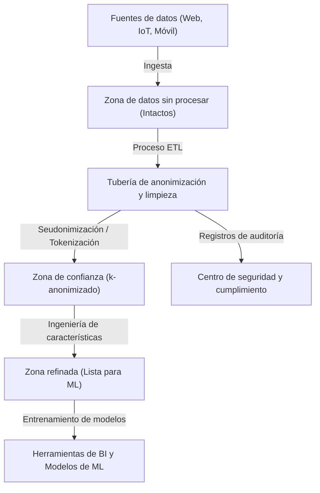
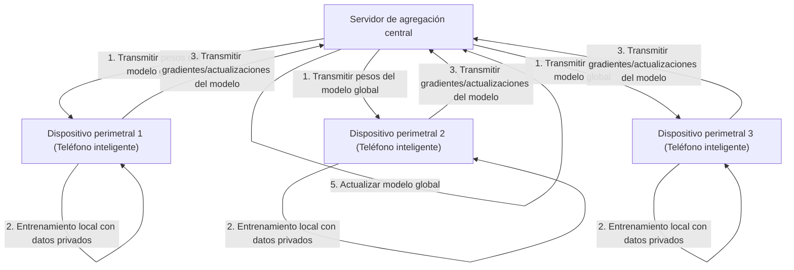

# El equilibrio entre privacidad y conveniencia: El destino de la información personal en la era del Big Data

En la sociedad digital moderna, generamos cantidades masivas de datos en nuestra vida diaria. Se recopilan incesantemente "big data" en múltiples formas, como datos de ubicación de teléfonos inteligentes, publicaciones en redes sociales, historiales de compras en línea y datos de salud registrados por dispositivos portátiles. Estos datos son esenciales para la evolución de la IA (Inteligencia Artificial) y la provisión de servicios personalizados, haciendo nuestras vidas más convenientes y enriquecedoras.

Sin embargo, por otro lado, el riesgo de invasión de la privacidad asociado con la recopilación y uso de información personal ha surgido como un problema social grave. Los riesgos ocultos tras la conveniencia han alcanzado una escala que no se puede ignorar, como los incidentes de filtración de datos, el suministro de datos a terceros sin el consentimiento del usuario e incluso las preocupaciones sobre la transformación en una sociedad de vigilancia por parte del Estado. En este artículo, proporcionaremos una explicación técnica extremadamente detallada de cómo se está abordando este dilema moderno del "equilibrio entre privacidad y conveniencia" tanto desde el aspecto tecnológico como el regulatorio, incluyendo las últimas tendencias.

## 1. El paradigma de la sociedad impulsada por datos y la evolución de la arquitectura de datos

Para recopilar y utilizar datos de manera eficiente, las empresas adoptan diversas arquitecturas de datos. Ha habido una transición desde el "Data Warehouse" (Almacén de datos), que solía ser la corriente principal, hacia el "Data Lake" (Lago de datos), que gestiona centralizadamente todos los datos, incluidos los no estructurados, y actualmente se está produciendo un cambio de paradigma hacia el "Data Mesh" (Malla de datos), una arquitectura descentralizada.

### Lago de datos centralizado y tubería de anonimización

Un lago de datos es un repositorio de almacenamiento que guarda grandes volúmenes de datos sin procesar en su formato original. Sin embargo, utilizar datos sin procesar que incluyen información de identificación personal (PII) directamente para el análisis causa graves violaciones de cumplimiento. Por lo tanto, se implementa una estricta "tubería de anonimización (Anonymization [Pipeline](https://kenji.blog/es/p/cicd-pipeline-github-actions-best-practices/))" entre el lago de datos y el entorno de análisis.

El siguiente diagrama muestra el flujo de la tubería de anonimización en un lago de datos centralizado típico.



En una tubería de este tipo, procesos como el hash, el enmascaramiento y el cifrado se aplican automáticamente al ingreso de los datos. Sin embargo, como se discutirá más adelante, el simple enmascaramiento o la seudonimización no pueden eliminar por completo el riesgo de "reidentificación (Re-identification)" al cruzarlos con otras fuentes de datos.

## 2. Comprensión profunda de las Tecnologías de Mejora de la Privacidad (PETs)

La clave para lograr tanto la privacidad como la utilización de datos son las "Tecnologías de mejora de la privacidad (PETs, por sus siglas en inglés)". Aquí, explicaremos en detalle las definiciones matemáticas y las implementaciones técnicas de las principales PETs que juegan un papel extremadamente importante en el análisis moderno de big data y el aprendizaje automático.

### 2.1 k-anonimato (K-Anonymity) y sus extensiones

El "k-anonimato", propuesto por Latanya Sweeney y Pierangela Samarati en 1998, es un concepto fundamental para la protección de la privacidad en la publicación de datos. Significa garantizar que cualquier registro en un conjunto de datos sea indistinguible de al menos $k-1$ otros registros.

Los atributos dentro de una base de datos se clasifican a grandes rasgos en tres tipos:
1. **Identificadores explícitos (Explicit Identifiers)**: Información que puede identificar directamente a un individuo, como nombres o números de seguridad social (generalmente se eliminan o cifran).
2. **Cuasi-identificadores (Quasi-Identifiers: QIs)**: Información que, como edad, género o código postal, no puede identificar a un individuo por sí sola, pero puede hacerlo cuando se combina.
3. **Atributos sensibles (Sensitive Attributes)**: Información que debe protegerse, como el nombre de una enfermedad o los ingresos anuales.

El k-anonimato garantiza que siempre haya $k$ o más combinaciones de cuasi-identificadores (Clase de equivalencia: Equivalence Class). Sin embargo, el k-anonimato tiene vulnerabilidades frente a los "Ataques de homogeneidad (Homogeneity Attack)" y "Ataques de conocimiento previo (Background Knowledge Attack)". Por ejemplo, si las $k$ personas que pertenecen a una determinada clase de equivalencia tienen la misma enfermedad (atributo sensible), la enfermedad será identificada incluso si se mantiene el k-anonimato.

Para superar esto, se han propuesto los siguientes modelos extendidos:

- **l-diversidad (l-diversity)**: Garantiza que en cada clase de equivalencia, el atributo sensible tenga al menos $l$ valores diferentes.
- **t-cercanía (t-closeness)**: Asegura que la distancia (como la Earth Mover's Distance) entre la distribución del atributo sensible en cada clase de equivalencia y la distribución del atributo sensible en todo el conjunto de datos sea menor o igual a un umbral $t$.

### 2.2 Privacidad diferencial (Differential Privacy: [DP](https://kenji.blog/es/p/dynamic-programming-dp-introduction-knapsack-fibonacci/))

Superando las limitaciones del modelo de k-anonimato, la "Privacidad diferencial (Differential Privacy)", propuesta por Cynthia Dwork y otros en 2006, es ampliamente adoptada hoy en día como el estándar de privacidad más fuerte y matemáticamente riguroso. Gigantes tecnológicos como Apple, Google y Microsoft aplican esta privacidad diferencial $\epsilon$ al recopilar datos de telemetría y datos estadísticos de los usuarios.

#### Definición matemática de la privacidad diferencial

Se dice que un algoritmo aleatorizado (Randomized Algorithm) $\mathcal{M}$ satisface la privacidad diferencial $\epsilon$ si, para cualesquiera dos conjuntos de datos adyacentes $D$ y $D'$ que difieren en solo un registro (es decir, $\|D - D'\|_1 = 1$), y para cualquier subconjunto de salidas $S \subseteq \text{Range}(\mathcal{M})$, se cumple la siguiente desigualdad:

$$ \Pr[\mathcal{M}(D) \in S] \le e^\epsilon \Pr[\mathcal{M}(D') \in S] $$

Aquí, $\epsilon$ (presupuesto de privacidad) es un parámetro no negativo que controla el nivel de protección de la privacidad. Cuanto menor sea $\epsilon$, más fuerte será la protección de la privacidad, pero la utilidad de los datos disminuirá.

Además, también se utiliza ampliamente la privacidad diferencial $(\epsilon, \delta)$, que es un modelo relajado que permite que la garantía de privacidad se rompa con una probabilidad muy pequeña $\delta$.

$$ \Pr[\mathcal{M}(D) \in S] \le e^\epsilon \Pr[\mathcal{M}(D') \in S] + \delta $$

#### Mecanismo de Laplace (Laplace Mechanism)

Un método representativo para lograr la privacidad diferencial es el "Mecanismo de Laplace", que agrega intencionalmente ruido (números aleatorios) siguiendo una distribución específica al resultado de salida verdadero de una consulta. La cantidad de ruido que se debe agregar depende de la "sensibilidad global (Global Sensitivity)" $\Delta f$ de la función $f$.

La sensibilidad global $\Delta f$ se define como la cantidad máxima de cambio en la salida de la función $f$ para cualesquiera conjuntos de datos adyacentes $D, D'$.

$$ \Delta f = \max_{D, D'} \| f(D) - f(D') \|_1 $$

El mecanismo de Laplace agrega al resultado de la función $f(D)$ el ruido $Y$ muestreado de la distribución de Laplace $\text{Lap}(b)$ con parámetro de escala $b = \frac{\Delta f}{\epsilon}$.

$$ \mathcal{M}(D) = f(D) + Y, \quad Y \sim \text{Lap}\left(\frac{\Delta f}{\epsilon}\right) $$

La función de densidad de probabilidad de la distribución de Laplace es la siguiente:

$$ p(x \mid b) = \frac{1}{2b} \exp\left( - \frac{|x|}{b} \right) $$

Debido a esta inyección de ruido, se vuelve imposible inferir a partir del resultado de salida si un individuo específico está incluido en el conjunto de datos. Las empresas utilizan la DP como una tecnología para enmascarar los datos individuales en sí mismos, mientras mantienen la utilidad de las tendencias estadísticas (como la media, varianza, recuentos, etc.) de los datos en su conjunto.

### 2.3 Aprendizaje Federado (Federated Learning: FL)

El aprendizaje automático tradicional utilizaba un enfoque centralizado en el que se entrenaban modelos agregando cantidades masivas de datos en un servidor central, como el lago de datos mencionado anteriormente. Sin embargo, transmitir datos confidenciales, como imágenes médicas o historiales de entrada de teléfonos inteligentes, a un servidor central conlleva graves riesgos de privacidad.

Por lo tanto, en 2016 Google propuso el "Aprendizaje Federado (Federated Learning)". En el aprendizaje federado, en lugar de mover los datos en sí, el "procesamiento computacional del modelo" se traslada al lado del dispositivo perimetral (como teléfonos inteligentes o servidores de hospitales) donde residen los datos.



#### Algoritmo de promediado federado (Federated Averaging: FedAvg)

Un algoritmo de agregación representativo en el aprendizaje federado es FedAvg. Cada cliente $k$ realiza localmente un entrenamiento de múltiples épocas utilizando descenso de gradiente estocástico (SGD) con su propio conjunto de datos $D_k$ (de tamaño $n_k$), y calcula los pesos actualizados $w_{t+1}^k$.

El servidor central recibe los pesos de los $K$ clientes participantes y actualiza los pesos del modelo global $w_{t+1}$ promediando estos pesos ponderados según el tamaño de los datos. Si el número total de datos es $n = \sum_{k=1}^K n_k$, la fórmula de actualización es la siguiente:

$$ w_{t+1} = \sum_{k=1}^K \frac{n_k}{n} w_{t+1}^k $$

Esto permite construir modelos de IA inteligentes sin que los datos personales sin procesar (como historiales de mensajes o fotos) salgan nunca del dispositivo. Ejemplos representativos de aplicación incluyen la función de predicción de la siguiente palabra en Google Keyboard (Gboard) y las mejoras en los modelos de reconocimiento de voz de FaceID y Hey Siri de Apple.

### 2.4 Cifrado homomórfico (Homomorphic Encryption: HE)

La tecnología criptográfica "mágica" que permite realizar cálculos (como suma y multiplicación) en datos mientras permanecen cifrados es el cifrado homomórfico. Con los métodos de cifrado normales, cuando se realiza procesamiento computacional en los datos, es necesario descifrarlos primero (devolverlos a texto plano), pero realizar el descifrado en un servidor en la nube crea una vulnerabilidad de seguridad.

Si se utiliza el cifrado homomórfico, se logran las siguientes propiedades. Suponiendo que la función de cifrado es $E(\cdot)$, la suma y la multiplicación de los textos planos $m_1$ y $m_2$ se vuelven posibles mediante operaciones ($\oplus$ y $\otimes$) en los textos cifrados tal cual.

$$ E(m_1 + m_2) = E(m_1) \oplus E(m_2) $$
$$ E(m_1 \times m_2) = E(m_1) \otimes E(m_2) $$

El cifrado homomórfico se divide en "Cifrado parcialmente homomórfico (Partially Homomorphic Encryption: PHE)", donde solo es posible la suma o la multiplicación, y "Cifrado completamente homomórfico (Fully Homomorphic Encryption: [FHE](/es/p/fully-homomorphic-encryption-fhe-explained/))", donde tanto la suma como la multiplicación son posibles un número infinito de veces. Desde que Craig Gentry construyó el primer esquema [FHE](/es/p/fully-homomorphic-encryption-fhe-explained/) en 2009 utilizando criptografía basada en retículos ([Lattice-based cryptography](/es/p/lattice-based-cryptography-math-intuition/)), ha sido un gran avance en la criptografía.

Actualmente, aún quedan desafíos como los costos computacionales y el aumento en el tamaño de los textos cifrados (sobrecarga), pero se espera su aplicación para el análisis seguro de datos médicos en la nube y para el cálculo secreto entre instituciones financieras.

## 3. Tendencias en regulación legal y cumplimiento: GDPR vs CCPA

En paralelo con la evolución técnica, el establecimiento de marcos legales también avanza rápidamente a nivel mundial. Al utilizar big data, las empresas deben cumplir obligatoriamente con estas regulaciones legales. Comparemos los dos marcos regulatorios más influyentes.

### Reglamento General de Protección de Datos de la UE (GDPR)

El GDPR (Reglamento General de Protección de Datos) de la UE, que entró en vigor en mayo de 2018, es reconocido como el "estándar global (estándar de oro)" para la protección de datos personales. El GDPR se aplica a todas las organizaciones que manejan datos de individuos dentro de la UE, y en caso de violación, impone enormes multas de hasta el 4% de los ingresos anuales globales o 20 millones de euros, la cantidad que sea mayor.

**Características principales del GDPR:**
- **Principio de inclusión (Opt-in)**: La recopilación y el procesamiento de datos requieren el consentimiento previo, libre y explícito del usuario.
- **Derecho al olvido (Right to be Forgotten/Right to Erasure)**: Los usuarios tienen derecho a exigir que las empresas borren por completo sus datos personales. Esto requiere eliminar datos incluso de las copias de seguridad del lago de datos, lo cual es un requisito técnicamente muy difícil.
- **Controlador de datos y Procesador de datos**: Define estrictamente las responsabilidades de quienes deciden el propósito de uso de los datos (controlador) y quienes procesan los datos de acuerdo con sus instrucciones (procesador).

### Ley de Privacidad del Consumidor de California (CCPA/CPRA)

Si bien Estados Unidos carece de una ley de privacidad integral a nivel federal, la CCPA (California Consumer Privacy Act), promulgada en California en 2020, sirve como el estándar nacional de facto. Posteriormente se fortaleció con la CPRA (California Privacy Rights Act).

**Características principales de la CCPA:**
- **Principio de exclusión (Opt-out)**: A diferencia del "consentimiento previo" del GDPR, se pueden recopilar datos sin consentimiento previo, pero es obligatorio proporcionar a los usuarios un enlace claro de exclusión voluntaria que diga "No vender mi información personal (Do Not Sell My Personal Information)".
- **Derecho de acceso a los datos**: Los consumidores pueden solicitar que las empresas divulguen información específica recopilada, sus categorías, fuentes y si se vendió a terceros.

Estas leyes y regulaciones exigen firmemente a las empresas la "Privacidad por diseño (Privacy by Design)", que consiste en incorporar la protección de la privacidad desde la fase de diseño de los sistemas y procesos.

## 4. Desafíos de implementación en el ecosistema de datos

Veamos las perspectivas de implementación al aplicar tecnologías de mejora de la privacidad y regulaciones legales en un entorno real de big data. Por ejemplo, suponga un caso en el que se implementa k-anonimato o privacidad diferencial utilizando Python y Pandas, o PySpark, en un lago de datos.

```python
# Implementación conceptual de agregación de datos aplicando privacidad diferencial (Python)
import numpy as np
import pandas as pd

def laplace_mechanism(true_value, sensitivity, epsilon):
    """
    Función que agrega ruido de Laplace al valor verdadero
    """
    scale = sensitivity / epsilon
    noise = np.random.laplace(loc=0, scale=scale)
    return true_value + noise

def get_dp_average_salary(dataframe, epsilon=1.0):
    """
    Cálculo del salario promedio con garantía de privacidad diferencial
    """
    # Cálculo real
    true_sum = dataframe['salary'].sum()
    true_count = len(dataframe)
    
    # Aplicación de privacidad diferencial (basada en supuestos de sensibilidad)
    # Suponemos la variación máxima del salario como sensibilidad (se requiere recorte para mayor rigor)
    max_salary_diff = 100000 
    
    # Adición de ruido (es posible aplicar DP a la suma y al recuento individualmente)
    noisy_sum = laplace_mechanism(true_sum, max_salary_diff, epsilon / 2)
    noisy_count = laplace_mechanism(true_count, 1, epsilon / 2)
    
    return noisy_sum / noisy_count

# Ejecución en la tubería de datos
# dp_avg_salary = get_dp_average_salary(raw_df, epsilon=0.5)
```

Como se ve en este fragmento de código, la implementación de la privacidad diferencial en sí misma es tan simple como agregar ruido, pero en las operaciones reales, la gestión del "presupuesto de privacidad ($\epsilon$)" se vuelve extremadamente difícil. Cuando se emiten múltiples consultas contra el mismo conjunto de datos, el presupuesto de privacidad se consume (según el teorema de composición) y, en última instancia, es necesario construir un mecanismo (Privacy Budget Management) para bloquear todo el conjunto de datos o rechazar las consultas.

## 5. Perspectivas futuras y desafíos éticos

El equilibrio entre el big data y la privacidad no es un juego de suma cero. Con la evolución de las PETs, como la privacidad diferencial, el aprendizaje federado y el cifrado homomórfico, un nuevo paradigma de utilización de datos de "compartir información sin compartir datos" se está convirtiendo en una realidad.

Además, en los últimos años, vinculado con los conceptos de "Malla de datos (Data Mesh)" y "Web3 (Web descentralizada)", el movimiento para recuperar la soberanía de los datos (Data Sovereignty) de las plataformas gigantes hacia los individuos también se está acelerando. Se está discutiendo un futuro en el que los datos individuales se almacenen en almacenes de datos personales (PDS) o billeteras de datos, y los propios usuarios controlen las licencias y la monetización de sus datos.

Sin embargo, las soluciones técnicas no son perfectas. En el aprendizaje federado, existe la amenaza de un "ataque de envenenamiento (Poisoning Attack)" en el que clientes maliciosos envían actualizaciones de modelos fraudulentas para contaminar el modelo global. En la privacidad diferencial, también se han señalado desafíos éticos donde los datos de las minorías son borrados por el ruido, creando sesgos en los modelos de IA.

## Conclusión

El destino de la información personal en la era del big data va más allá de ser un simple problema técnico; plantea la pregunta fundamental de qué tipo de sociedad deseamos. Cómo proteger la dignidad personal y la privacidad mientras disfrutamos de la conveniencia. Solo se puede alcanzar una solución sostenible mediante la trinidad de regulaciones legales, innovación continua en tecnologías de protección de la privacidad y una alta alfabetización de cada uno de nosotros que proporciona los datos. La privacidad y la conveniencia ya no son una compensación, sino que evolucionarán hacia un "requisito indispensable" que puede coexistir gracias a las últimas tecnologías.


