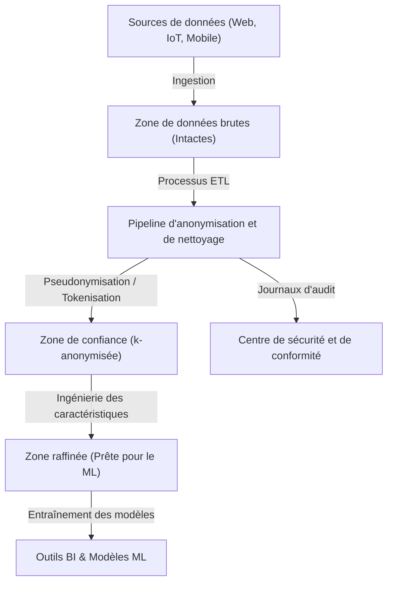
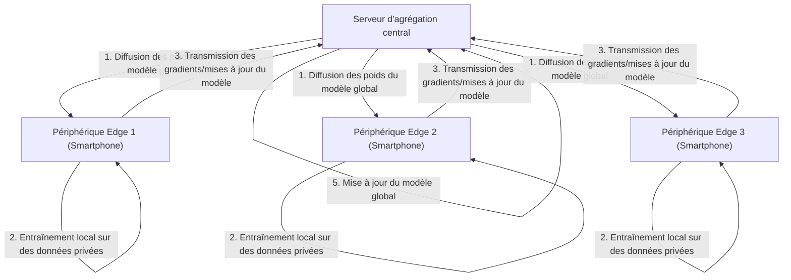

# Le compromis entre vie privée et commodité : l’avenir des informations personnelles à l’ère du Big Data

Dans la société numérique moderne, nous générons quotidiennement des quantités massives de données. Qu'il s'agisse des données de localisation de nos smartphones, de nos publications sur les réseaux sociaux, de notre historique d'achats en ligne ou des données de santé enregistrées par nos objets connectés, des « Big Data » très variées sont collectées en permanence. Ces données sont indispensables à l'évolution de l'IA (Intelligence Artificielle) et à la fourniture de services personnalisés, rendant notre vie plus pratique et plus riche.

Cependant, d'un autre côté, le risque de violation de la vie privée lié à la collecte et à l'utilisation d'informations personnelles émerge comme un grave problème de société. Les incidents de fuite de données, le partage de données à des tiers sans le consentement des utilisateurs, ainsi que les inquiétudes concernant l'émergence d'une société de surveillance d'État, constituent des risques dissimulés derrière la commodité, qui atteignent désormais une ampleur qu'il est impossible d'ignorer. Dans cet article, nous proposerons une explication technique très détaillée, en intégrant les dernières tendances, sur la manière dont ce dilemme moderne du « compromis entre vie privée et commodité » est abordé à la fois sous l'angle technologique et sous l'angle de la réglementation juridique.

## 1. Le paradigme de la société axée sur les données et l'évolution de l'architecture des données

Pour collecter et exploiter efficacement les données, les entreprises adoptent diverses architectures de données. D'un modèle autrefois dominant comme l'« entrepôt de données (Data Warehouse) », nous sommes passés au « lac de données (Data Lake) » qui centralise toutes les données, y compris non structurées. Actuellement, un changement de paradigme est en cours vers le « maillage de données (Data Mesh) », une architecture décentralisée.

### Lac de données centralisé et pipeline d'anonymisation

Un lac de données est un référentiel de stockage qui conserve de grandes quantités de données brutes dans leur format d'origine. Cependant, utiliser des données brutes contenant des informations personnellement identifiables (PII) telles quelles pour l'analyse entraînerait de graves violations de conformité. Par conséquent, un « pipeline d'anonymisation (Anonymization Pipeline) » strict est implémenté entre le lac de données et l'environnement d'analyse.

Le schéma ci-dessous illustre le flux du pipeline d'anonymisation dans un lac de données centralisé classique.



Dans un tel pipeline, des traitements tels que le hachage, le masquage et le chiffrement sont appliqués automatiquement à l'entrée des données. Néanmoins, comme nous le verrons plus loin, un simple masquage ou une pseudonymisation ne suffisent pas à éliminer totalement le risque de « ré-identification » par croisement avec d'autres sources de données.

## 2. Compréhension approfondie des technologies d'amélioration de la confidentialité (PETs)

La clé pour concilier la protection de la vie privée et l'exploitation des données réside dans les « technologies d'amélioration de la confidentialité (PETs) ». Nous allons expliquer ici en détail, avec leurs définitions mathématiques et leurs implémentations techniques, les principales PETs qui jouent un rôle crucial dans l'analyse moderne des Big Data et de l'apprentissage automatique.

### 2.1 K-anonymat (K-Anonymity) et ses extensions

Proposé en 1998 par Latanya Sweeney et Pierangela Samarati, le « k-anonymat » est un concept fondamental pour la protection de la vie privée lors de la publication de données. Il signifie que chaque enregistrement dans un jeu de données doit être indiscernable d'au moins $k-1$ autres enregistrements.

Les attributs au sein d'une base de données se divisent globalement en trois catégories :
1. **Identifiants explicites (Explicit Identifiers)** : informations permettant d'identifier directement un individu, telles que le nom ou le numéro de sécurité sociale (celles-ci sont généralement supprimées ou chiffrées).
2. **Quasi-identifiants (Quasi-Identifiers : QIs)** : informations qui, individuellement, ne peuvent pas identifier une personne (comme l'âge, le sexe, le code postal), mais qui peuvent le faire lorsqu'elles sont combinées.
3. **Attributs sensibles (Sensitive Attributes)** : informations à protéger, telles que la maladie ou le revenu annuel.

Le k-anonymat garantit qu'il existe toujours au moins $k$ combinaisons identiques de quasi-identifiants (classe d'équivalence). Cependant, il est vulnérable aux « attaques par homogénéité (Homogeneity Attack) » et aux « attaques par connaissances de base (Background Knowledge Attack) ». Par exemple, si l'ensemble des $k$ personnes d'une classe d'équivalence partagent la même maladie (attribut sensible), la maladie sera identifiée même si le k-anonymat est préservé.

Pour pallier ces faiblesses, les modèles étendus suivants ont été proposés :

- **l-diversité (l-diversity)** : garantit que dans chaque classe d'équivalence, l'attribut sensible possède au moins $l$ valeurs distinctes.
- **t-proximité (t-closeness)** : s'assure que la distance (comme la distance du cantonnier, Earth Mover's Distance) entre la distribution de l'attribut sensible dans chaque classe d'équivalence et sa distribution dans l'ensemble du jeu de données reste inférieure ou égale à un seuil $t$.

### 2.2 Confidentialité différentielle (Differential Privacy : DP)

Afin de surmonter les limites du modèle de k-anonymat, la « confidentialité différentielle (Differential Privacy) », proposée en 2006 par Cynthia Dwork et ses collègues, est aujourd'hui largement adoptée comme la norme de confidentialité la plus puissante et mathématiquement rigoureuse. Les géants de la technologie tels qu'Apple, Google et Microsoft appliquent cette $\epsilon$-confidentialité différentielle lors de la collecte de données de télémétrie et de statistiques auprès de leurs utilisateurs.

#### Définition mathématique de la confidentialité différentielle

Un algorithme aléatoire (Randomized Algorithm) $\mathcal{M}$ satisfait la $\epsilon$-confidentialité différentielle si, pour deux jeux de données adjacents $D$ et $D'$ ne différant que d'un seul enregistrement (c'est-à-dire $\|D - D'\|_1 = 1$), et pour tout sous-ensemble de résultats $S \subseteq \text{Range}(\mathcal{M})$, l'inégalité suivante est vérifiée :

$$ \Pr[\mathcal{M}(D) \in S] \le e^\epsilon \Pr[\mathcal{M}(D') \in S] $$

Où $\epsilon$ (le budget de confidentialité) est un paramètre non négatif qui contrôle le niveau de protection de la vie privée. Plus $\epsilon$ est petit, plus la protection est forte, mais l'utilité des données diminue en conséquence.

En outre, le modèle assoupli de la $(\epsilon, \delta)$-confidentialité différentielle, qui tolère une très faible probabilité $\delta$ que la garantie de confidentialité soit rompue, est également très utilisé.

$$ \Pr[\mathcal{M}(D) \in S] \le e^\epsilon \Pr[\mathcal{M}(D') \in S] + \delta $$

#### Le mécanisme de Laplace (Laplace Mechanism)

Une méthode représentative pour réaliser la confidentialité différentielle est le « mécanisme de Laplace », qui consiste à ajouter intentionnellement un bruit (nombre aléatoire) suivant une certaine distribution au résultat réel d'une requête. La quantité de bruit à ajouter dépend de la « sensibilité globale (Global Sensitivity) » $\Delta f$ de la fonction $f$.

La sensibilité globale $\Delta f$ est définie comme la variation maximale de la sortie de la fonction $f$ pour n'importe quelle paire de jeux de données adjacents $D$ et $D'$.

$$ \Delta f = \max_{D, D'} \| f(D) - f(D') \|_1 $$

Le mécanisme de Laplace ajoute au résultat de la fonction $f(D)$ un bruit $Y$ échantillonné à partir d'une distribution de Laplace $\text{Lap}(b)$ dont le paramètre d'échelle est $b = \frac{\Delta f}{\epsilon}$.

$$ \mathcal{M}(D) = f(D) + Y, \quad Y \sim \text{Lap}\left(\frac{\Delta f}{\epsilon}\right) $$

La fonction de densité de probabilité de la distribution de Laplace est la suivante :

$$ p(x \mid b) = \frac{1}{2b} \exp\left( - \frac{|x|}{b} \right) $$

Grâce à cette injection de bruit, il devient impossible de déduire du résultat si un individu spécifique est présent ou non dans le jeu de données. Les entreprises exploitent la DP comme une technique permettant de masquer les données individuelles tout en préservant l'utilité des tendances statistiques globales (moyenne, variance, comptage, etc.) des données.

### 2.3 Apprentissage fédéré (Federated Learning : FL)

L'apprentissage automatique traditionnel adoptait une approche centralisée consistant à agréger d'énormes volumes de données sur un serveur central pour entraîner des modèles, à l'image du lac de données mentionné précédemment. Cependant, l'envoi de données sensibles, telles que des images médicales ou l'historique de saisie des smartphones, vers un serveur central implique des risques majeurs pour la vie privée.

Pour résoudre ce problème, Google a introduit en 2016 l'« apprentissage fédéré (Federated Learning) ». Dans l'apprentissage fédéré, au lieu de déplacer les données, c'est le « processus de calcul du modèle » qui est déplacé vers les périphériques en périphérie (smartphones, serveurs d'hôpitaux, etc.) où se trouvent les données.



#### Algorithme de moyenne fédérée (FedAvg)

L'algorithme d'agrégation emblématique de l'apprentissage fédéré est le FedAvg. Chaque client $k$ utilise son propre jeu de données $D_k$ (de taille $n_k$) pour effectuer localement plusieurs époques d'entraînement via la descente de gradient stochastique (SGD), et calcule les poids mis à jour $w_{t+1}^k$.

Le serveur central reçoit les poids des $K$ clients participants et met à jour les poids du modèle global $w_{t+1}$ en effectuant une moyenne pondérée de ces poids selon la taille de leurs données. Si le volume total des données est $n = \sum_{k=1}^K n_k$, la formule de mise à jour s'écrit ainsi :

$$ w_{t+1} = \sum_{k=1}^K \frac{n_k}{n} w_{t+1}^k $$

Grâce à cela, il est possible de construire des modèles d'IA performants sans que les données brutes personnelles (comme l'historique des messages ou les photos) ne quittent jamais l'appareil. Parmi les applications phares, on peut citer la fonction de prédiction du mot suivant du clavier Google (Gboard), l'amélioration des modèles de reconnaissance vocale de Hey Siri ou de FaceID d'Apple.

### 2.4 Chiffrement homomorphe (Homomorphic Encryption : HE)

Le chiffrement homomorphe est une technologie de cryptographie « magique » qui permet d'effectuer des calculs (comme des additions ou des multiplications) sur des données tout en les conservant chiffrées. Avec les méthodes de chiffrement classiques, il est nécessaire de déchiffrer (revenir au texte clair) les données pour pouvoir les traiter, mais effectuer ce déchiffrement sur un serveur cloud constitue une vulnérabilité de sécurité.

L'utilisation du chiffrement homomorphe permet d'obtenir les propriétés suivantes. En notant $E(\cdot)$ la fonction de chiffrement, l'addition ou la multiplication des textes clairs $m_1$ et $m_2$ devient possible grâce aux opérations sur les textes chiffrés ($\oplus$ et $\otimes$).

$$ E(m_1 + m_2) = E(m_1) \oplus E(m_2) $$
$$ E(m_1 \times m_2) = E(m_1) \otimes E(m_2) $$

Le chiffrement homomorphe se divise en « chiffrement partiellement homomorphe (Partially Homomorphic Encryption : PHE) », qui ne permet que l'addition ou la multiplication, et en « chiffrement totalement homomorphe (Fully Homomorphic Encryption : FHE) », qui autorise à la fois l'addition et la multiplication un nombre infini de fois. La construction du premier schéma FHE basé sur la cryptographie sur les réseaux euclidiens (Lattice-based cryptography) par Craig Gentry en 2009 a marqué une avancée majeure en cryptographie.

Actuellement, bien que des défis subsistent en matière de coûts de calcul et d'augmentation de la taille des textes chiffrés (surcharge), on attend beaucoup de ses applications pour l'analyse sécurisée de données médicales sur le cloud ou le calcul sécurisé multiparti entre institutions financières.

## 3. Tendances en matière de réglementation et de conformité : RGPD vs CCPA

Parallèlement aux évolutions technologiques, la mise en place de cadres juridiques progresse rapidement à l'échelle mondiale. Lors de l'exploitation du Big Data par les entreprises, le respect de ces réglementations est devenu une condition sine qua non. Comparons les deux cadres réglementaires les plus influents.

### Règlement général sur la protection des données (RGPD) de l'UE

Entré en vigueur en mai 2018, le RGPD (Règlement général sur la protection des données) de l'UE est reconnu comme la « norme mondiale (gold standard) » en matière de protection des données à caractère personnel. Le RGPD s'applique à toutes les organisations traitant les données de personnes résidant au sein de l'UE. En cas d'infraction, de lourdes amendes peuvent être infligées, pouvant atteindre jusqu'à 4 % du chiffre d'affaires annuel mondial ou 20 millions d'euros, le montant le plus élevé étant retenu.

**Principales caractéristiques du RGPD :**
- **Principe d'adhésion (Opt-in)** : la collecte et le traitement des données nécessitent un consentement préalable, libre et explicite de la part de l'utilisateur.
- **Droit à l'oubli (Right to be Forgotten/Right to Erasure)** : l'utilisateur a le droit d'exiger des entreprises l'effacement complet de ses données personnelles. Cela implique également de supprimer les données des sauvegardes des lacs de données, une exigence techniquement très complexe.
- **Responsable du traitement (Contrôleur) et Sous-traitant (Processeur)** : il définit de manière stricte les responsabilités de celui qui détermine les finalités du traitement des données (le contrôleur) et de celui qui traite les données selon ses instructions (le processeur).

### Loi sur la protection de la vie privée des consommateurs de Californie (CCPA/CPRA)

En l'absence de loi fédérale globale sur la protection de la vie privée aux États-Unis, la CCPA (California Consumer Privacy Act), entrée en vigueur en Californie en 2020, fait office de norme nationale de facto. Elle a ensuite été renforcée par la CPRA (California Privacy Rights Act).

**Principales caractéristiques de la CCPA :**
- **Principe de retrait (Opt-out)** : contrairement au « consentement préalable » du RGPD, la collecte de données est autorisée sans consentement préalable, mais il est obligatoire de fournir à l'utilisateur un lien de refus clair tel que « Ne vendez pas mes informations personnelles (Do Not Sell My Personal Information) ».
- **Droit d'accès aux données** : les consommateurs peuvent exiger la divulgation d'informations spécifiques collectées par l'entreprise, ainsi que leurs catégories, leurs sources et si elles ont été vendues à des tiers.

Ces cadres juridiques exigent fortement des entreprises l'adoption du « Privacy by Design » (le respect de la vie privée dès la conception), c'est-à-dire l'intégration de la protection de la vie privée dès la phase de conception des systèmes et des processus.

## 4. Défis d'implémentation dans l'écosystème des données

Examinons la perspective de l'implémentation lors de l'application de ces technologies de protection de la vie privée et de ces réglementations dans un environnement Big Data réel. Imaginons par exemple l'implémentation du k-anonymat ou de la confidentialité différentielle à l'aide de Python et Pandas, ou de PySpark, au sein d'un lac de données.

```python
# Implémentation conceptuelle de l'agrégation de données appliquant la confidentialité différentielle (Python)
import numpy as np
import pandas as pd

def laplace_mechanism(true_value, sensitivity, epsilon):
    """
    Fonction ajoutant un bruit de Laplace à la valeur réelle
    """
    scale = sensitivity / epsilon
    noise = np.random.laplace(loc=0, scale=scale)
    return true_value + noise

def get_dp_average_salary(dataframe, epsilon=1.0):
    """
    Calcul du salaire moyen garantissant la confidentialité différentielle
    """
    # Calcul réel
    true_sum = dataframe['salary'].sum()
    true_count = len(dataframe)
    
    # Application de la confidentialité différentielle (basée sur l'hypothèse de sensibilité)
    # En supposant que la variation maximale du salaire soit la sensibilité (un écrêtage serait plus rigoureux)
    max_salary_diff = 100000 
    
    # Ajout de bruit (il est possible d'appliquer la DP individuellement à la somme et au décompte)
    noisy_sum = laplace_mechanism(true_sum, max_salary_diff, epsilon / 2)
    noisy_count = laplace_mechanism(true_count, 1, epsilon / 2)
    
    return noisy_sum / noisy_count

# Exécution dans le pipeline de données
# dp_avg_salary = get_dp_average_salary(raw_df, epsilon=0.5)
```

Comme on peut le voir dans cet extrait de code, l'implémentation de la confidentialité différentielle en elle-même est assez simple et se résume à l'ajout de bruit. Toutefois, en pratique, la gestion du « budget de confidentialité ($\epsilon$) » s'avère extrêmement difficile. Lorsqu'on exécute plusieurs requêtes sur le même jeu de données, le budget de confidentialité se consomme (selon le théorème de composition). Il est donc nécessaire de concevoir un système (Privacy Budget Management) qui finira par verrouiller l'ensemble du jeu de données ou rejeter les requêtes.

## 5. Perspectives d'avenir et enjeux éthiques

Le compromis entre le Big Data et la vie privée n'est pas un jeu à somme nulle. Grâce à l'évolution des PETs comme la confidentialité différentielle, l'apprentissage fédéré et le chiffrement homomorphe, un nouveau paradigme d'exploitation des données consistant à « partager des informations (insights) sans partager les données » est en passe de devenir réalité.

De plus, couplé récemment aux concepts de « maillage de données (Data Mesh) » et de « Web3 (Web décentralisé) », le mouvement visant à redonner la souveraineté des données (Data Sovereignty) aux individus plutôt qu'aux géants de la plateforme s'accélère. On débat aujourd'hui d'un avenir où les données personnelles seraient stockées dans des Personal Data Stores (PDS) ou des portefeuilles de données (Data Wallets), permettant aux utilisateurs eux-mêmes de contrôler les autorisations d'utilisation et la monétisation de leurs données.

Néanmoins, les solutions technologiques ne sont pas parfaites. Dans l'apprentissage fédéré, il existe la menace d'une « attaque par empoisonnement (Poisoning Attack) », où des clients malveillants pourraient envoyer des mises à jour corrompues pour polluer le modèle global. Concernant la confidentialité différentielle, des problèmes éthiques sont soulevés : les données des minorités peuvent être noyées par le bruit, induisant ainsi des biais dans les modèles d'IA.

## Conclusion

Le devenir des informations personnelles à l'ère du Big Data dépasse le simple défi technologique ; il soulève la question fondamentale de la société dans laquelle nous souhaitons vivre. Comment profiter de la commodité tout en préservant la dignité de l'individu et sa vie privée ? Ce n'est que par la combinaison indissociable de la mise en place de cadres juridiques, de l'innovation constante des technologies de protection de la vie privée, et d'un haut niveau d'alphabétisation numérique de chacun d'entre nous (les fournisseurs de données) qu'une solution durable pourra être atteinte. La vie privée et la commodité ne seront bientôt plus un compromis, mais évolueront pour devenir des « exigences essentielles » conciliables grâce aux technologies de pointe.


