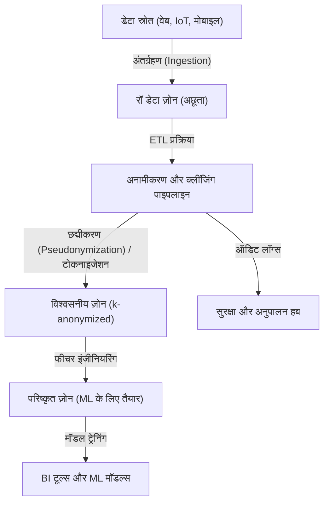
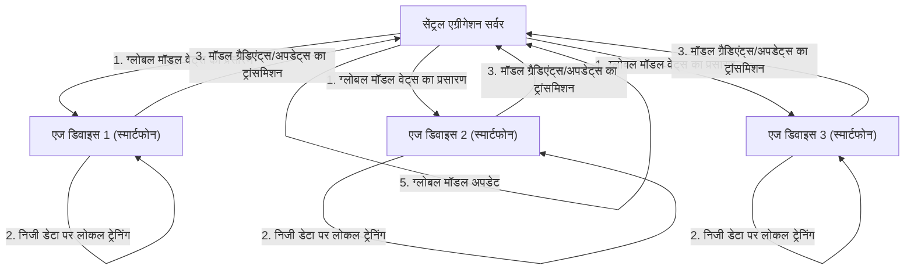

# प्राइवेसी और सुविधा के बीच समझौता: बिग डेटा के युग में व्यक्तिगत जानकारी का भविष्य

आज के डिजिटल समाज में, हम अपने दैनिक जीवन में भारी मात्रा में डेटा उत्पन्न करते हैं। स्मार्टफ़ोन का स्थान डेटा, सोशल मीडिया पोस्ट, ऑनलाइन शॉपिंग का इतिहास, और पहनने योग्य उपकरणों (वेयरेबल डिवाइस) द्वारा रिकॉर्ड किया गया स्वास्थ्य डेटा जैसे विविध "बिग डेटा" लगातार एकत्र किए जा रहे हैं। यह डेटा AI (कृत्रिम बुद्धिमत्ता) के विकास और वैयक्तिकृत सेवाओं के प्रावधान के लिए आवश्यक है, जिससे हमारा जीवन अधिक सुविधाजनक और समृद्ध हो रहा है।

हालाँकि, दूसरी ओर, व्यक्तिगत जानकारी के संग्रह और उपयोग से जुड़े प्राइवेसी के उल्लंघन का जोखिम एक गंभीर सामाजिक समस्या के रूप में उभर रहा है। डेटा लीक की घटनाएँ, उपयोगकर्ता की सहमति के बिना तीसरे पक्ष को डेटा प्रदान करना, और राज्य द्वारा निगरानी समाज की ओर बढ़ने की चिंताएं—सुविधा के पीछे छिपे ये जोखिम अब ऐसी स्थिति में पहुँच गए हैं जिन्हें नजरअंदाज नहीं किया जा सकता। इस लेख में, हम "प्राइवेसी और सुविधा के बीच समझौते" की इस आधुनिक दुविधा से निपटने के लिए प्रौद्योगिकी (टेक्नोलॉजी) और कानूनी नियमों दोनों के दृष्टिकोण पर चर्चा करेंगे, और नवीनतम प्रवृत्तियों को शामिल करते हुए एक अत्यंत विस्तृत तकनीकी व्याख्या प्रस्तुत करेंगे।

## 1. डेटा-संचालित समाज का प्रतिमान (पैराडाइम) और डेटा आर्किटेक्चर का विकास

डेटा को कुशलतापूर्वक एकत्र करने और उपयोग करने के लिए, कंपनियाँ विभिन्न डेटा आर्किटेक्चर को अपना रही हैं। पहले मुख्यधारा में रहने वाले "डेटा वेयरहाउस (Data Warehouse)" से हटकर, अब असंरचित (अनस्ट्रक्चर्ड) डेटा सहित सभी डेटा को केंद्रीकृत रूप से प्रबंधित करने वाले "डेटा लेक (Data Lake)" की ओर संक्रमण हो रहा है, और वर्तमान में वितरित आर्किटेक्चर वाले "डेटा मेश (Data Mesh)" की ओर एक पैराडाइम शिफ्ट हो रहा है।

### केंद्रीकृत डेटा लेक और अनामीकरण पाइपलाइन

डेटा लेक एक स्टोरेज रिपॉजिटरी है जो कच्चे डेटा (raw data) को बड़ी मात्रा में उसके मूल प्रारूप में सहेजता है। लेकिन व्यक्तिगत जानकारी (PII: Personally Identifiable Information) वाले कच्चे डेटा का सीधे विश्लेषण के लिए उपयोग करना गंभीर अनुपालन (compliance) उल्लंघन का कारण बन सकता है। इसलिए, डेटा लेक और विश्लेषण वातावरण के बीच एक सख्त "अनामीकरण पाइपलाइन (Anonymization Pipeline)" लागू की जाती है।

नीचे दिया गया चित्र एक सामान्य केंद्रीकृत डेटा लेक में अनामीकरण पाइपलाइन के प्रवाह को दर्शाता है।



इस तरह की पाइपलाइन में, डेटा के प्रवाह के दौरान हैशिंग, मास्किंग, और एन्क्रिप्शन जैसी प्रक्रियाएं स्वचालित रूप से लागू होती हैं। हालाँकि, जैसा कि बाद में चर्चा की जाएगी, केवल मास्किंग या छद्मीकरण (Pseudonymization) से अन्य डेटा स्रोतों के साथ मिलान करके "पुनर्पहचान (Re-identification)" के जोखिम को पूरी तरह से समाप्त नहीं किया जा सकता है।

## 2. प्राइवेसी एन्हांसिंग टेक्नोलॉजीज (PETs) की गहरी समझ

प्राइवेसी और डेटा उपयोग दोनों के बीच संतुलन स्थापित करने की कुंजी "प्राइवेसी एन्हांसिंग टेक्नोलॉजीज (Privacy-Enhancing Technologies: PETs)" है। यहाँ हम प्रमुख PETs की गणितीय परिभाषाओं और तकनीकी कार्यान्वयन के बारे में विस्तार से बताएंगे, जो आधुनिक बिग डेटा विश्लेषण और मशीन लर्निंग में अत्यंत महत्वपूर्ण भूमिका निभाते हैं।

### 2.1 k-अनामिकता (K-Anonymity) और इसका विस्तार

1998 में लतान्या स्वीनी (Latanya Sweeney) और पियरएंजेला समरती (Pierangela Samarati) द्वारा प्रस्तावित "k-अनामिकता", डेटा प्रकाशन में प्राइवेसी सुरक्षा की आधारभूत अवधारणा है। इसका अर्थ यह सुनिश्चित करना है कि डेटासेट का कोई भी रिकॉर्ड कम से कम $k-1$ अन्य रिकॉर्ड्स से अलग न पहचाना जा सके।

डेटाबेस में विशेषताओं (Attributes) को मोटे तौर पर 3 भागों में बांटा जाता है:
1. **पहचानकर्ता (Explicit Identifiers)**: नाम या माय नंबर जैसी जानकारी, जो सीधे तौर पर किसी व्यक्ति की पहचान कर सकती है (इन्हें आमतौर पर हटा दिया जाता है या एन्क्रिप्ट कर दिया जाता है)।
2. **अर्ध-पहचानकर्ता (Quasi-Identifiers: QIs)**: आयु, लिंग, ज़िप कोड जैसी जानकारी, जो अकेले व्यक्ति की पहचान नहीं कर सकती, लेकिन संयोजित होने पर पहचान संभव बना सकती है।
3. **संवेदनशील विशेषताएं (Sensitive Attributes)**: बीमारी का नाम या वार्षिक आय जैसी जानकारी, जिसे सुरक्षित किया जाना चाहिए।

k-अनामिकता यह गारंटी देती है कि अर्ध-पहचानकर्ताओं का संयोजन (समकक्षता वर्ग: Equivalence Class) हमेशा $k$ या उससे अधिक मौजूद रहे। हालाँकि, k-अनामिकता में "समरूपता हमले (Homogeneity Attack)" और "पृष्ठभूमि ज्ञान हमले (Background Knowledge Attack)" के प्रति भेद्यता होती है। उदाहरण के लिए, यदि किसी समकक्षता वर्ग के सभी $k$ लोगों की एक ही बीमारी (संवेदनशील विशेषता) है, तो k-अनामिकता बनाए रखने के बावजूद बीमारी का नाम पता चल जाएगा।

इस पर काबू पाने के लिए निम्नलिखित विस्तारित मॉडल प्रस्तावित किए गए हैं:

- **l-विविधता (l-diversity)**: यह सुनिश्चित करता है कि प्रत्येक समकक्षता वर्ग में संवेदनशील विशेषता के कम से कम $l$ अलग-अलग मान (values) हों।
- **t-निकटता (t-closeness)**: प्रत्येक समकक्षता वर्ग में संवेदनशील विशेषता के वितरण और पूरे डेटासेट में संवेदनशील विशेषता के वितरण के बीच की दूरी (जैसे Earth Mover's Distance) थ्रेशोल्ड $t$ से कम या उसके बराबर होनी चाहिए।

### 2.2 डिफरेंशियल प्राइवेसी (Differential Privacy: DP)

k-अनामिकता मॉडल की सीमाओं को दूर करते हुए, वर्तमान में सबसे शक्तिशाली और गणितीय रूप से कठोर प्राइवेसी मानक के रूप में जिसे व्यापक रूप से अपनाया जा रहा है, वह "डिफरेंशियल प्राइवेसी" है, जिसे 2006 में सिंथिया ड्वॉर्क (Cynthia Dwork) और अन्य द्वारा प्रस्तावित किया गया था। Apple, Google और Microsoft जैसे टेक दिग्गज टेलीमेट्री डेटा या सांख्यिकीय डेटा एकत्र करते समय इस $\epsilon$-डिफरेंशियल प्राइवेसी को लागू करते हैं।

#### डिफरेंशियल प्राइवेसी की गणितीय परिभाषा

एक यादृच्छिक एल्गोरिदम (Randomized Algorithm) $\mathcal{M}$ को $\epsilon$-डिफरेंशियल प्राइवेसी को पूरा करने वाला तब माना जाता है, जब किन्हीं दो आसन्न डेटासेट $D$ और $D'$ के लिए जिनमें केवल 1 रिकॉर्ड का अंतर हो (यानी $\|D - D'\|_1 = 1$), और आउटपुट के किसी भी उपसमुच्चय $S \subseteq \text{Range}(\mathcal{M})$ के लिए, निम्नलिखित असमानता लागू होती है:

$$ \Pr[\mathcal{M}(D) \in S] \le e^\epsilon \Pr[\mathcal{M}(D') \in S] $$

यहाँ, $\epsilon$ (प्राइवेसी बजट) एक गैर-नकारात्मक पैरामीटर है जो प्राइवेसी सुरक्षा के स्तर को नियंत्रित करता है। $\epsilon$ जितना छोटा होगा, प्राइवेसी सुरक्षा उतनी ही मजबूत होगी, लेकिन डेटा की उपयोगिता कम होगी।

इसके अलावा, $(\epsilon, \delta)$-डिफरेंशियल प्राइवेसी का भी व्यापक रूप से उपयोग किया जाता है, जो एक रिलैक्स्ड मॉडल है जहाँ एक बहुत ही कम संभावना $\delta$ के साथ प्राइवेसी की गारंटी टूटने की अनुमति दी जाती है।

$$ \Pr[\mathcal{M}(D) \in S] \le e^\epsilon \Pr[\mathcal{M}(D') \in S] + \delta $$

#### लाप्लास तंत्र (Laplace Mechanism)

डिफरेंशियल प्राइवेसी को प्राप्त करने की एक प्रमुख विधि "लाप्लास तंत्र" है, जो जानबूझकर क्वेरी के वास्तविक आउटपुट परिणाम में एक विशिष्ट वितरण का पालन करने वाले शोर (यादृच्छिक संख्या) को जोड़ता है। कितना शोर जोड़ा जाना चाहिए, यह फ़ंक्शन $f$ की "वैश्विक संवेदनशीलता (Global Sensitivity)" $\Delta f$ पर निर्भर करता है।

वैश्विक संवेदनशीलता $\Delta f$ को किन्हीं आसन्न डेटासेट $D, D'$ के लिए फ़ंक्शन $f$ के आउटपुट में अधिकतम परिवर्तन के रूप में परिभाषित किया गया है।

$$ \Delta f = \max_{D, D'} \| f(D) - f(D') \|_1 $$

लाप्लास तंत्र फ़ंक्शन $f(D)$ के परिणाम में शोर $Y$ जोड़ता है, जो लाप्लास वितरण $\text{Lap}(b)$ से नमूना (sample) किया जाता है, जहाँ स्केल पैरामीटर $b = \frac{\Delta f}{\epsilon}$ होता है।

$$ \mathcal{M}(D) = f(D) + Y, \quad Y \sim \text{Lap}\left(\frac{\Delta f}{\epsilon}\right) $$

लाप्लास वितरण का संभाव्यता घनत्व फलन इस प्रकार है:

$$ p(x \mid b) = \frac{1}{2b} \exp\left( - \frac{|x|}{b} \right) $$

इस शोर के समावेश से, आउटपुट परिणाम से यह अनुमान लगाना असंभव हो जाता है कि कोई विशिष्ट व्यक्ति डेटासेट में शामिल है या नहीं। कंपनियाँ डीपी का उपयोग ऐसी तकनीक के रूप में करती हैं जो संपूर्ण डेटा (औसत, प्रसरण, गणना, आदि) की सांख्यिकीय प्रवृत्तियों की उपयोगिता को बनाए रखते हुए व्यक्तिगत डेटा को छिपा (मास्क) देती है।

### 2.3 फेडरेटेड लर्निंग (Federated Learning: FL)

पारंपरिक मशीन लर्निंग एक केंद्रीकृत दृष्टिकोण अपनाती है, जहाँ मॉडल को प्रशिक्षित करने के लिए ऊपर उल्लिखित डेटा लेक की तरह एक केंद्रीय सर्वर में भारी मात्रा में डेटा एकत्र किया जाता है। हालाँकि, मेडिकल इमेज या स्मार्टफोन इनपुट इतिहास जैसे संवेदनशील डेटा को केंद्रीय सर्वर पर भेजना गंभीर प्राइवेसी जोखिम पैदा करता है।

इसलिए Google ने 2016 में "फेडरेटेड लर्निंग" का प्रस्ताव रखा। फेडरेटेड लर्निंग में, डेटा को स्वयं स्थानांतरित करने के बजाय, "मॉडल की कंप्यूटिंग प्रक्रिया" को एज डिवाइस (जैसे स्मार्टफोन या अस्पताल के सर्वर) पर ले जाया जाता है जहाँ डेटा मौजूद होता है।



#### फेडरेटेड एवरेजिंग (FedAvg) एल्गोरिदम

फेडरेटेड लर्निंग में एक प्रमुख एकत्रीकरण एल्गोरिदम FedAvg है। प्रत्येक क्लाइंट $k$ अपने स्वयं के डेटासेट $D_k$ (आकार $n_k$) का उपयोग करके, स्टोकेस्टिक ग्रेडिएंट डिसेंट (SGD) के साथ स्थानीय रूप से कई एपोक (epochs) के लिए प्रशिक्षण लेता है, और अद्यतन वेट्स $w_{t+1}^k$ की गणना करता है।

केंद्रीय सर्वर भाग लेने वाले $K$ क्लाइंट्स से वेट्स प्राप्त करता है, और डेटा आकार के अनुसार उन्हें वेटेज देकर उनका औसत निकालकर ग्लोबल मॉडल के वेट्स $w_{t+1}$ को अपडेट करता है। यदि कुल डेटा संख्या $n = \sum_{k=1}^K n_k$ है, तो अपडेट सूत्र इस प्रकार होगा:

$$ w_{t+1} = \sum_{k=1}^K \frac{n_k}{n} w_{t+1}^k $$

इसके परिणामस्वरूप, डिवाइस से व्यक्तिगत कच्चे डेटा (जैसे संदेश इतिहास या फ़ोटो) को बाहर भेजे बिना स्मार्ट AI मॉडल बनाना संभव हो जाता है। इसके विशिष्ट अनुप्रयोगों में Google कीबोर्ड (Gboard) की अगले शब्द की भविष्यवाणी सुविधा और Apple के FaceID व Hey Siri की वाक् पहचान मॉडल में सुधार शामिल हैं।

### 2.4 होमोमोर्फिक एन्क्रिप्शन (Homomorphic Encryption: HE)

होमोमोर्फिक एन्क्रिप्शन एक "जादुई" एन्क्रिप्शन तकनीक है जो एन्क्रिप्टेड अवस्था में ही डेटा पर गणना (जैसे जोड़ना और गुणा करना) करने की अनुमति देती है। सामान्य एन्क्रिप्शन विधियों में, डेटा पर गणना करते समय इसे एक बार डिक्रिप्ट (प्लेनटेक्स्ट पर वापस लौटना) करना आवश्यक होता है, लेकिन क्लाउड सर्वर पर डिक्रिप्शन करना सुरक्षा की दृष्टि से एक भेद्यता बन जाता है।

होमोमोर्फिक एन्क्रिप्शन का उपयोग करके, निम्नलिखित विशेषताएं प्राप्त की जा सकती हैं। यदि एन्क्रिप्शन फ़ंक्शन $E(\cdot)$ है, तो प्लेनटेक्स्ट $m_1$ और $m_2$ को जोड़ना और गुणा करना एन्क्रिप्टेड टेक्स्ट के ऑपरेशन्स ($\oplus$ और $\otimes$) के रूप में ही संभव है।

$$ E(m_1 + m_2) = E(m_1) \oplus E(m_2) $$
$$ E(m_1 \times m_2) = E(m_1) \otimes E(m_2) $$

होमोमोर्फिक एन्क्रिप्शन को "पार्शियली होमोमोर्फिक एन्क्रिप्शन (Partially Homomorphic Encryption: PHE)", जहाँ केवल जोड़ या गुणा संभव है, और "फुल्ली होमोमोर्फिक एन्क्रिप्शन (Fully Homomorphic Encryption: FHE)", जहाँ जोड़ और गुणा दोनों अनंत बार किए जा सकते हैं, में विभाजित किया गया है। जब से क्रेग गेंट्री (Craig Gentry) ने 2009 में लैटिस-आधारित क्रिप्टोग्राफी का उपयोग करके पहला FHE ढांचा बनाया, यह क्रिप्टोग्राफी में एक बड़ी सफलता बन गया।

वर्तमान में, कम्प्यूटेशनल लागत और एन्क्रिप्टेड टेक्स्ट के आकार में वृद्धि (ओवरहेड) जैसी चुनौतियां बनी हुई हैं, लेकिन इसके क्लाउड पर मेडिकल डेटा के सुरक्षित विश्लेषण और वित्तीय संस्थानों के बीच सुरक्षित कंप्यूटिंग के लिए लागू होने की उम्मीद है।

## 3. कानूनी विनियम और अनुपालन प्रवृत्तियाँ: GDPR बनाम CCPA

तकनीकी विकास के साथ-साथ कानूनी ढांचे का भी विश्व स्तर पर तेजी से विकास हो रहा है। जब कंपनियाँ बिग डेटा का उपयोग करती हैं, तो इन नियमों का पालन करना एक आवश्यक शर्त बन गया है। आइए दो सबसे प्रभावशाली नियामक ढांचों की तुलना करें।

### EU जनरल डेटा प्रोटेक्शन रेगुलेशन (GDPR)

मई 2018 में लागू किया गया EU का GDPR (जनरल डेटा प्रोटेक्शन रेगुलेशन), व्यक्तिगत डेटा संरक्षण के लिए "वैश्विक मानक (गोल्ड स्टैंडर्ड)" के रूप में मान्यता प्राप्त है। GDPR उन सभी संगठनों पर लागू होता है जो EU के भीतर व्यक्तियों के डेटा को संभालते हैं, और उल्लंघन के मामले में, दुनिया भर में वार्षिक बिक्री के अधिकतम 4% या 2 करोड़ यूरो (जो भी अधिक हो) का भारी जुर्माना लगाया जा सकता है।

**GDPR की मुख्य विशेषताएं:**
- **ऑप्ट-इन (Opt-in) सिद्धांत**: डेटा के संग्रह और प्रसंस्करण के लिए उपयोगकर्ता से स्पष्ट, स्वतंत्र और पूर्व सहमति आवश्यक है।
- **भूल जाने का अधिकार (Right to be Forgotten/Right to Erasure)**: उपयोगकर्ताओं को कंपनियों से अपने व्यक्तिगत डेटा को पूरी तरह से मिटाने की मांग करने का अधिकार है। डेटा को डेटा लेक के बैकअप से भी हटाना आवश्यक है, जो तकनीकी रूप से अत्यंत कठिन आवश्यकता है।
- **डेटा कंट्रोलर और डेटा प्रोसेसर**: यह डेटा के उपयोग के उद्देश्य को निर्धारित करने वाले (कंट्रोलर) और निर्देशों के अनुसार डेटा को प्रोसेस करने वाले (प्रोसेसर) की जिम्मेदारियों को कड़ाई से परिभाषित करता है।

### कैलिफोर्निया कंज्यूमर प्राइवेसी एक्ट (CCPA/CPRA)

जबकि अमेरिका में कोई व्यापक संघीय स्तर का प्राइवेसी कानून नहीं है, 2020 में कैलिफोर्निया में लागू किया गया CCPA (California Consumer Privacy Act) वस्तुतः एक राष्ट्रीय मानक के रूप में कार्य करता है। बाद में इसे CPRA (California Privacy Rights Act) द्वारा और मजबूत किया गया।

**CCPA की मुख्य विशेषताएं:**
- **ऑप्ट-आउट (Opt-out) सिद्धांत**: GDPR के "पूर्व सहमति" के विपरीत, डेटा संग्रह पूर्व सहमति के बिना किया जा सकता है, लेकिन उपयोगकर्ताओं को "मेरी व्यक्तिगत जानकारी न बेचें (Do Not Sell My Personal Information)" का स्पष्ट ऑप्ट-आउट लिंक प्रदान करना अनिवार्य है।
- **डेटा तक पहुंच का अधिकार**: उपभोक्ता कंपनियों द्वारा एकत्र की गई विशिष्ट जानकारी, उसकी श्रेणियां, जानकारी के स्रोत, और क्या इसे तीसरे पक्ष को बेचा गया है, इसके प्रकटीकरण का अनुरोध कर सकते हैं।

ये नियम कंपनियों से "प्राइवेसी बाय डिज़ाइन (Privacy by Design)" - यानी सिस्टम और प्रक्रियाओं के डिजाइन चरण से ही प्राइवेसी सुरक्षा को शामिल करने की दृढ़ता से मांग करते हैं।

## 4. डेटा इकोसिस्टम में कार्यान्वयन की चुनौतियाँ

आइए प्राइवेसी एन्हांसिंग टेक्नोलॉजीज और कानूनी विनियमों को वास्तविक बिग डेटा वातावरण में लागू करते समय कार्यान्वयन के दृष्टिकोण पर गौर करें। उदाहरण के लिए, मान लें कि हम Python और Pandas, या PySpark का उपयोग करके डेटा लेक में k-अनामिकता या डिफरेंशियल प्राइवेसी को लागू कर रहे हैं।

```python
# डिफरेंशियल प्राइवेसी लागू करके डेटा एकत्रीकरण का वैचारिक कार्यान्वयन (Python)
import numpy as np
import pandas as pd

def laplace_mechanism(true_value, sensitivity, epsilon):
    """
    वास्तविक मूल्य में लाप्लास शोर जोड़ने वाला फ़ंक्शन
    """
    scale = sensitivity / epsilon
    noise = np.random.laplace(loc=0, scale=scale)
    return true_value + noise

def get_dp_average_salary(dataframe, epsilon=1.0):
    """
    डिफरेंशियल प्राइवेसी की गारंटी के साथ औसत वेतन की गणना
    """
    # वास्तविक गणना
    true_sum = dataframe['salary'].sum()
    true_count = len(dataframe)
    
    # डिफरेंशियल प्राइवेसी लागू करना (संवेदनशीलता की धारणा के आधार पर)
    # मान लें कि अधिकतम वेतन भिन्नता संवेदनशीलता है (अधिक सख्ती से क्लिपिंग की आवश्यकता होती है)
    max_salary_diff = 100000 
    
    # शोर जोड़ना (कुल और गणना दोनों पर अलग-अलग DP लागू करना संभव है)
    noisy_sum = laplace_mechanism(true_sum, max_salary_diff, epsilon / 2)
    noisy_count = laplace_mechanism(true_count, 1, epsilon / 2)
    
    return noisy_sum / noisy_count

# डेटा पाइपलाइन के भीतर निष्पादन
# dp_avg_salary = get_dp_average_salary(raw_df, epsilon=0.5)
```

जैसा कि इस कोड स्निपेट में देखा जा सकता है, डिफरेंशियल प्राइवेसी का कार्यान्वयन स्वयं शोर जोड़ने जितना आसान है, लेकिन वास्तविक संचालन में, "प्राइवेसी बजट ($\epsilon$)" का प्रबंधन अत्यंत कठिन हो जाता है। यदि एक ही डेटासेट पर कई बार क्वेरी की जाती है, तो प्राइवेसी बजट समाप्त हो जाएगा (संरचना प्रमेय के आधार पर), और अंततः एक ऐसी प्रणाली (Privacy Budget Management) बनाने की आवश्यकता होगी जो पूरे डेटासेट को लॉक कर दे या क्वेरी को अस्वीकार कर दे।

## 5. भविष्य की संभावनाएं और नैतिक चुनौतियाँ

बिग डेटा और प्राइवेसी के बीच का समझौता कोई ज़ीरो-सम गेम नहीं है। डिफरेंशियल प्राइवेसी, फेडरेटेड लर्निंग और होमोमोर्फिक एन्क्रिप्शन जैसी PETs की प्रगति के साथ, "डेटा साझा किए बिना अंतर्दृष्टि साझा करने" का डेटा उपयोग का एक नया प्रतिमान वास्तविकता बनता जा रहा है।

इसके अलावा, हाल के वर्षों में "डेटा मेश (Data Mesh)" और "Web3 (डिसेंट्रलाइज्ड वेब)" की अवधारणाओं के साथ मिलकर, डेटा संप्रभुता (Data Sovereignty) को टेक दिग्गजों से वापस व्यक्तियों को दिलाने की पहल तेज हो गई है। ऐसे भविष्य पर चर्चा की जा रही है जहां व्यक्तिगत डेटा को पर्सनल डेटा स्टोर (PDS) या डेटा वॉलेट में संग्रहीत किया जाएगा, और उपयोगकर्ता स्वयं अपने डेटा के उपयोग और मुद्रीकरण को नियंत्रित करेंगे।

हालाँकि, तकनीकी समाधान पूर्ण नहीं हैं। फेडरेटेड लर्निंग में, "पॉइज़निंग हमले (Poisoning Attack)" का खतरा होता है, जहाँ दुर्भावनापूर्ण क्लाइंट ग्लोबल मॉडल को दूषित करने के लिए गलत मॉडल अपडेट भेजते हैं। डिफरेंशियल प्राइवेसी के संबंध में यह नैतिक मुद्दा भी उठाया गया है कि अल्पसंख्यक (minority) डेटा शोर में छिप सकता है, जिससे AI मॉडल में पक्षपात (bias) पैदा हो सकता है।

## निष्कर्ष

बिग डेटा युग में व्यक्तिगत जानकारी का भविष्य केवल एक तकनीकी चुनौती से परे है, और यह एक बुनियादी सवाल उठाता है कि हम किस तरह का समाज चाहते हैं। सुविधा का आनंद लेते हुए हम व्यक्तियों की गरिमा और प्राइवेसी की रक्षा कैसे कर सकते हैं? एक स्थायी समाधान तक केवल तभी पहुंचा जा सकता है जब कानूनी ढांचे का विकास, प्राइवेसी सुरक्षा प्रौद्योगिकियों के निरंतर नवाचार, और हम में से प्रत्येक जो डेटा प्रदान करते हैं उनकी उच्च साक्षरता का त्रयी (ट्रिनिटी) एक साथ कार्य करे। प्राइवेसी और सुविधा अब समझौता नहीं रहेंगे, बल्कि नवीनतम तकनीक के माध्यम से "आवश्यक शर्तें" के रूप में विकसित होंगे जिन्हें एक साथ प्राप्त किया जा सकता है।


