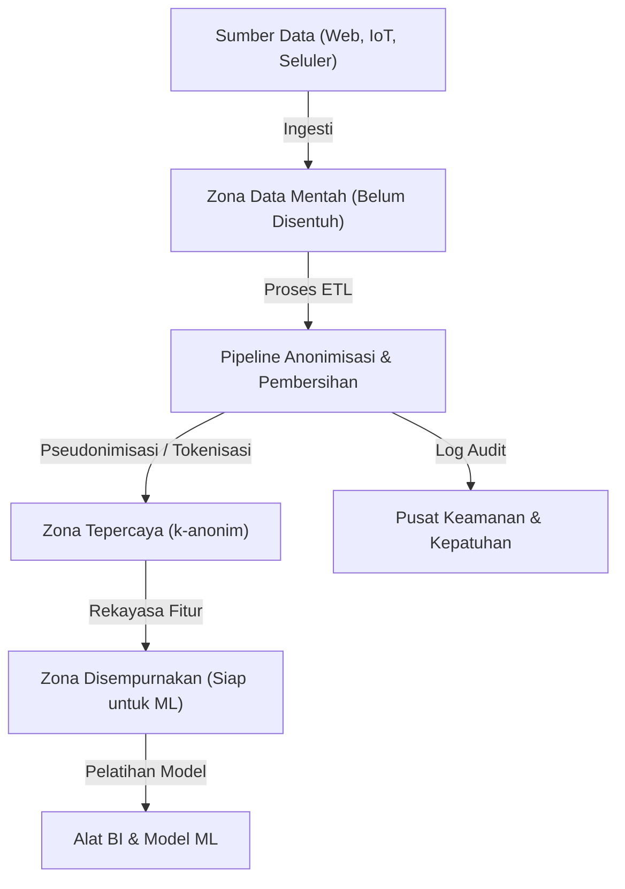
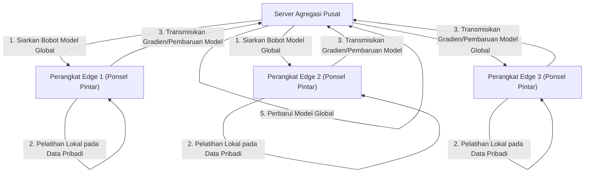

# Trade-off Privasi dan Kenyamanan: Nasib Informasi Pribadi di Era Big Data

Dalam masyarakat digital modern, kita menghasilkan jumlah data yang sangat besar dalam kehidupan sehari-hari. Berbagai macam "big data" terus dikumpulkan, mulai dari informasi lokasi ponsel pintar, postingan media sosial, riwayat pembelian belanja online, hingga data kesehatan yang direkam oleh perangkat wearable. Data ini sangat penting untuk evolusi AI (Kecerdasan Buatan) dan penyediaan layanan yang dipersonalisasi, menjadikan hidup kita lebih nyaman dan kaya.

Namun, di sisi lain, risiko pelanggaran privasi yang menyertai pengumpulan dan penggunaan informasi pribadi telah muncul sebagai masalah sosial yang serius. Risiko yang tersembunyi di balik kenyamanan ini, seperti insiden kebocoran data, pemberian data kepada pihak ketiga tanpa persetujuan pengguna, dan kekhawatiran tentang masyarakat pengawasan oleh negara, telah mencapai skala yang tidak bisa diabaikan. Artikel ini akan memberikan penjelasan teknis yang sangat rinci mengenai pendekatan teknologi dan hukum, beserta tren terbaru, dalam menghadapi dilema modern ini, yaitu "trade-off privasi dan kenyamanan".

## 1. Paradigma Masyarakat Berbasis Data dan Evolusi Arsitektur Data

Untuk mengumpulkan dan memanfaatkan data secara efisien, perusahaan mengadopsi berbagai arsitektur data. Transisi telah terjadi dari "Data Warehouse" (Gudang Data) yang dulunya mainstream, menuju "Data Lake" (Danau Data) yang mengelola semua data secara terpusat termasuk data tidak terstruktur, dan saat ini sedang terjadi pergeseran paradigma menuju "Data Mesh" (Jaring Data) yang merupakan arsitektur terdistribusi.

### Data Lake Terpusat dan Pipeline Anonimisasi

Data Lake adalah repositori penyimpanan yang menyimpan data mentah dalam jumlah besar dalam format aslinya. Namun, menggunakan data mentah yang mengandung informasi pengenal pribadi (PII: Personally Identifiable Information) langsung untuk analisis akan menyebabkan pelanggaran kepatuhan yang serius. Oleh karena itu, "Pipeline Anonimisasi" (Anonymization Pipeline) yang ketat diimplementasikan antara Data Lake dan lingkungan analisis.

Gambar di bawah ini menunjukkan alur pipeline anonimisasi dalam Data Lake terpusat pada umumnya.



Dalam pipeline semacam ini, proses seperti hashing, masking, dan enkripsi diterapkan secara otomatis saat data masuk. Namun, seperti yang akan dibahas nanti, masking sederhana atau pseudonimisasi (Pseudonymization) saja tidak dapat sepenuhnya menghilangkan risiko "Re-identifikasi" (Re-identification) dengan mencocokkannya menggunakan sumber data lain.

## 2. Pemahaman Mendalam tentang Teknologi Peningkatan Privasi (PETs)

Kunci untuk menyeimbangkan privasi dan pemanfaatan data adalah "Teknologi Peningkatan Privasi" (Privacy-Enhancing Technologies: PETs). Di sini, kami akan menjelaskan secara rinci definisi matematis dan implementasi teknis dari PETs utama yang memainkan peran sangat penting dalam analisis big data modern dan pembelajaran mesin.

### 2.1 k-Anonimitas (K-Anonymity) dan Perluasannya

"k-Anonimitas" (K-Anonymity), yang diusulkan oleh Latanya Sweeney dan Pierangela Samarati pada tahun 1998, adalah konsep dasar perlindungan privasi dalam publikasi data. Hal ini berarti membuat setiap catatan (record) dalam dataset tidak dapat dibedakan dari setidaknya $k-1$ catatan lainnya.

Atribut dalam basis data secara garis besar dibagi menjadi 3 hal berikut:
1. **Pengidentifikasi (Explicit Identifiers)**: Informasi yang dapat mengidentifikasi individu secara langsung, seperti nama atau nomor asuransi sosial/KTP (ini biasanya dihapus atau dienkripsi).
2. **Pengidentifikasi Kuasi (Quasi-Identifiers: QIs)**: Informasi seperti usia, jenis kelamin, dan kode pos, yang tidak dapat mengidentifikasi individu secara terpisah, tetapi dapat diidentifikasi jika digabungkan.
3. **Atribut Sensitif (Sensitive Attributes)**: Informasi yang harus dilindungi, seperti nama penyakit dan pendapatan tahunan.

k-Anonimitas menjamin bahwa selalu ada minimal $k$ kombinasi dari pengidentifikasi kuasi (Kelas Ekivalen: Equivalence Class). Namun, k-anonimitas memiliki kerentanan terhadap "Serangan Homogenitas" (Homogeneity Attack) dan "Serangan Pengetahuan Latar Belakang" (Background Knowledge Attack). Misalnya, jika seluruh $k$ orang yang termasuk dalam kelas ekivalen yang sama memiliki penyakit (atribut sensitif) yang sama, maka nama penyakit tersebut akan teridentifikasi meskipun k-anonimitas dipertahankan.

Untuk mengatasi hal ini, model ekstensi berikut telah diusulkan:

- **l-Keanekaragaman (l-diversity)**: Menjamin bahwa atribut sensitif di setiap kelas ekivalen memiliki setidaknya $l$ nilai berbeda.
- **t-Kekedekatan (t-closeness)**: Memastikan bahwa jarak (seperti Earth Mover's Distance) antara distribusi atribut sensitif di setiap kelas ekivalen dan distribusi atribut sensitif di seluruh dataset kurang dari atau sama dengan ambang batas $t$.

### 2.2 Privasi Diferensial (Differential Privacy: DP)

Mengatasi keterbatasan model k-anonimitas, "Privasi Diferensial" (Differential Privacy), yang diusulkan oleh Cynthia Dwork dan rekan-rekan pada tahun 2006, saat ini diadopsi secara luas sebagai standar privasi yang paling kuat dan ketat secara matematis. Raksasa teknologi seperti Apple, Google, dan Microsoft menerapkan $\epsilon$-Privasi Diferensial ini saat mengumpulkan data telemetri dan data statistik dari pengguna.

#### Definisi Matematis Privasi Diferensial

Sebuah algoritma acak (Randomized Algorithm) $\mathcal{M}$ dikatakan memenuhi $\epsilon$-Privasi Diferensial jika, untuk setiap pasang kumpulan data tetangga $D$ dan $D'$ yang hanya berbeda satu catatan (yaitu $\|D - D'\|_1 = 1$), dan untuk subset output apa pun $S \subseteq \text{Range}(\mathcal{M})$, pertidaksamaan berikut terpenuhi:

$$ \Pr[\mathcal{M}(D) \in S] \le e^\epsilon \Pr[\mathcal{M}(D') \in S] $$

Di sini, $\epsilon$ (anggaran privasi/privacy budget) adalah parameter non-negatif yang mengontrol tingkat perlindungan privasi. Semakin kecil $\epsilon$, semakin kuat perlindungan privasinya, namun kegunaan (utilitas) data akan menurun.

Selain itu, $(\epsilon, \delta)$-Privasi Diferensial, yang merupakan model relaksasi yang mengizinkan kemungkinan sangat kecil $\delta$ di mana jaminan privasi dapat dilanggar, juga banyak digunakan.

$$ \Pr[\mathcal{M}(D) \in S] \le e^\epsilon \Pr[\mathcal{M}(D') \in S] + \delta $$

#### Mekanisme Laplace (Laplace Mechanism)

Metode representatif untuk mencapai Privasi Diferensial adalah "Mekanisme Laplace", yang secara sengaja menambahkan noise (angka acak) yang mengikuti distribusi tertentu ke hasil output sebenarnya dari sebuah kueri. Seberapa banyak noise yang harus ditambahkan bergantung pada "Sensitivitas Global" (Global Sensitivity) $\Delta f$ dari fungsi $f$.

Sensitivitas global $\Delta f$ didefinisikan sebagai perubahan maksimum dalam output fungsi $f$ untuk setiap set data tetangga $D, D'$.

$$ \Delta f = \max_{D, D'} \| f(D) - f(D') \|_1 $$

Mekanisme Laplace menambahkan noise $Y$ yang diambil dari distribusi Laplace $\text{Lap}(b)$ dengan parameter skala $b = \frac{\Delta f}{\epsilon}$ pada hasil fungsi $f(D)$.

$$ \mathcal{M}(D) = f(D) + Y, \quad Y \sim \text{Lap}\left(\frac{\Delta f}{\epsilon}\right) $$

Fungsi kepadatan probabilitas distribusi Laplace adalah sebagai berikut:

$$ p(x \mid b) = \frac{1}{2b} \exp\left( - \frac{|x|}{b} \right) $$

Dengan injeksi noise ini, mustahil untuk menyimpulkan dari hasil output apakah data individu tertentu termasuk dalam dataset atau tidak. Perusahaan memanfaatkan DP sebagai teknologi untuk menutupi (masking) data mentah individu sambil mempertahankan utilitas dari tren statistik (rata-rata, varians, jumlah, dll.) dari keseluruhan data.

### 2.3 Pembelajaran Federasi (Federated Learning: FL)

Pembelajaran mesin konvensional menggunakan pendekatan terpusat di mana sejumlah besar data dikumpulkan pada server pusat untuk melatih model, seperti pada Data Lake yang disebutkan sebelumnya. Namun, mengirimkan data sensitif seperti gambar medis atau riwayat input ponsel pintar ke server pusat membawa risiko privasi yang signifikan.

Oleh karena itu, Google mengusulkan "Pembelajaran Federasi" (Federated Learning) pada tahun 2016. Dalam Pembelajaran Federasi, bukan datanya yang dipindahkan, melainkan "proses komputasi model" yang dipindahkan ke sisi perangkat edge (seperti ponsel pintar atau server rumah sakit) tempat data itu berada.



#### Algoritma Federated Averaging (FedAvg)

Algoritma agregasi perwakilan dalam pembelajaran federasi adalah FedAvg. Setiap klien $k$ menggunakan dataset $D_k$ (ukuran $n_k$) miliknya sendiri untuk melakukan pembelajaran menggunakan metode Stochastic Gradient Descent (SGD) secara lokal selama beberapa epoch, dan menghitung bobot yang diperbarui $w_{t+1}^k$.

Server pusat menerima bobot dari klien $K$ yang berpartisipasi dan memperbarui bobot model global $w_{t+1}$ dengan menghitung rata-rata tertimbang dari bobot-bobot tersebut sesuai dengan ukuran data. Jika jumlah total data adalah $n = \sum_{k=1}^K n_k$, maka rumus pembaruannya adalah sebagai berikut:

$$ w_{t+1} = \sum_{k=1}^K \frac{n_k}{n} w_{t+1}^k $$

Hal ini memungkinkan pembangunan model AI yang cerdas tanpa harus memindahkan data mentah pribadi (seperti riwayat pesan atau foto) keluar dari perangkat sedikit pun. Contoh aplikasi representatif termasuk fungsi prediksi kata berikutnya dari Google Keyboard (Gboard) dan peningkatan pada pengenalan suara FaceID dan Hey Siri dari Apple.

### 2.4 Enkripsi Homomorfik (Homomorphic Encryption: HE)

Teknologi kriptografi "ajaib" yang memungkinkan dilakukannya komputasi (seperti penjumlahan dan perkalian) sementara data masih dalam keadaan terenkripsi adalah Enkripsi Homomorfik. Dalam metode enkripsi konvensional, saat melakukan proses komputasi pada data, data tersebut harus didekripsi (dikembalikan ke teks biasa/plaintext) terlebih dahulu, tetapi melakukan dekripsi di server cloud menjadi kerentanan keamanan.

Dengan menggunakan enkripsi homomorfik, karakteristik berikut dapat diwujudkan. Jika fungsi enkripsi adalah $E(\cdot)$, maka penjumlahan dan perkalian dari plaintext $m_1$ dan $m_2$ dapat dilakukan dengan operasi ($\oplus$ dan $\otimes$) langsung pada ciphertext (teks sandi).

$$ E(m_1 + m_2) = E(m_1) \oplus E(m_2) $$
$$ E(m_1 \times m_2) = E(m_1) \otimes E(m_2) $$

Enkripsi homomorfik dibagi menjadi "Enkripsi Homomorfik Sebagian" (Partially Homomorphic Encryption: PHE), yang hanya memungkinkan salah satu dari penjumlahan atau perkalian, dan "Enkripsi Homomorfik Penuh" (Fully Homomorphic Encryption: FHE), yang memungkinkan penjumlahan dan perkalian dalam jumlah tak terbatas. Sejak Craig Gentry membangun skema FHE pertama menggunakan kriptografi berbasis kisi (Lattice-based cryptography) pada tahun 2009, ini telah menjadi terobosan besar dalam kriptografi.

Saat ini, meskipun tantangan biaya komputasi dan peningkatan ukuran ciphertext (overhead) masih tersisa, teknologi ini diharapkan dapat diterapkan pada analisis aman dari data medis di cloud dan komputasi rahasia antar lembaga keuangan.

## 3. Tren Regulasi Hukum dan Kepatuhan: GDPR vs CCPA

Seiring dengan perkembangan teknologi, kerangka hukum juga berkembang pesat secara global. Ketika perusahaan memanfaatkan big data, mematuhi regulasi ini menjadi syarat mutlak. Mari kita bandingkan dua kerangka regulasi yang paling berpengaruh.

### Peraturan Perlindungan Data Umum Uni Eropa (GDPR)

GDPR (General Data Protection Regulation) Uni Eropa, yang diberlakukan pada Mei 2018, diakui sebagai "standar emas" (gold standard) global untuk perlindungan data pribadi. GDPR berlaku untuk semua organisasi yang menangani data individu dalam Uni Eropa, dan jika dilanggar, denda sangat besar hingga 4% dari total pendapatan tahunan global atau 20 juta Euro (mana yang lebih tinggi) akan dikenakan.

**Fitur Utama GDPR:**
- **Prinsip Opt-in**: Membutuhkan persetujuan eksplisit, bebas, dan sebelumnya dari pengguna untuk mengumpulkan dan memproses data.
- **Hak untuk Dilupakan (Right to be Forgotten/Right to Erasure)**: Pengguna memiliki hak untuk meminta perusahaan menghapus data pribadi mereka sepenuhnya. Data juga harus dihapus dari cadangan Data Lake, menjadikannya persyaratan yang sangat sulit secara teknis.
- **Pengendali Data dan Pemroses Data**: Mendefinisikan secara ketat tanggung jawab mereka yang menentukan tujuan penggunaan data (pengendali) dan mereka yang memproses data sesuai dengan instruksi mereka (pemroses).

### Undang-Undang Privasi Konsumen California (CCPA/CPRA)

Sementara AS tidak memiliki undang-undang privasi komprehensif di tingkat federal, CCPA (California Consumer Privacy Act) yang diberlakukan di California pada tahun 2020 secara de facto berfungsi sebagai standar nasional. Ini kemudian diperkuat oleh CPRA (California Privacy Rights Act).

**Fitur Utama CCPA:**
- **Prinsip Opt-out**: Berbeda dengan "persetujuan sebelumnya" GDPR, pengumpulan data dimungkinkan tanpa persetujuan sebelumnya, tetapi perusahaan diwajibkan untuk menyediakan tautan opt-out yang jelas bagi pengguna yang berbunyi "Jangan Jual Informasi Pribadi Saya" (Do Not Sell My Personal Information).
- **Hak Akses Data**: Konsumen dapat meminta perusahaan untuk mengungkapkan informasi tertentu yang telah mereka kumpulkan, kategorinya, sumbernya, dan apakah informasi tersebut telah dijual kepada pihak ketiga.

Regulasi hukum ini sangat menuntut perusahaan untuk menerapkan "Privasi berdasarkan Desain" (Privacy by Design)—memasukkan perlindungan privasi sejak tahap desain sistem dan proses.

## 4. Tantangan Implementasi dalam Ekosistem Data

Mari kita lihat dari perspektif implementasi praktis ketika menerapkan teknologi perlindungan privasi dan regulasi hukum ke dalam lingkungan big data yang nyata. Misalnya, kita berasumsi pada sebuah kasus yang mengimplementasikan k-anonimitas atau privasi diferensial menggunakan Python dan Pandas, atau PySpark dalam Data Lake.

```python
# Implementasi konsep agregasi data dengan menerapkan privasi diferensial (Python)
import numpy as np
import pandas as pd

def laplace_mechanism(true_value, sensitivity, epsilon):
    """
    Fungsi untuk menambahkan noise Laplace ke nilai sebenarnya
    """
    scale = sensitivity / epsilon
    noise = np.random.laplace(loc=0, scale=scale)
    return true_value + noise

def get_dp_average_salary(dataframe, epsilon=1.0):
    """
    Perhitungan gaji rata-rata dengan jaminan privasi diferensial
    """
    # Perhitungan aktual
    true_sum = dataframe['salary'].sum()
    true_count = len(dataframe)
    
    # Penerapan privasi diferensial (berdasarkan asumsi sensitivitas)
    # Asumsikan fluktuasi gaji maksimum sebagai sensitivitas (perlu pemotongan/clipping agar lebih akurat)
    max_salary_diff = 100000 
    
    # Penambahan noise (Dimungkinkan juga untuk menerapkan DP ke nilai total dan hitungan secara terpisah)
    noisy_sum = laplace_mechanism(true_sum, max_salary_diff, epsilon / 2)
    noisy_count = laplace_mechanism(true_count, 1, epsilon / 2)
    
    return noisy_sum / noisy_count

# Eksekusi di dalam pipeline data
# dp_avg_salary = get_dp_average_salary(raw_df, epsilon=0.5)
```

Seperti yang terlihat pada cuplikan kode ini, implementasi privasi diferensial itu sendiri sederhana hanya berupa penambahan noise, tetapi dalam operasi aktualnya, pengelolaan "anggaran privasi" (Privacy Budget: $\epsilon$) menjadi sangat sulit. Ketika kueri dijalankan beberapa kali pada kumpulan data yang sama, anggaran privasi akan terkonsumsi (berdasarkan teorema komposisi), sehingga pada akhirnya perlu dibangun suatu mekanisme (Manajemen Anggaran Privasi / Privacy Budget Management) untuk mengunci seluruh kumpulan data atau menolak kueri.

## 5. Prospek Masa Depan dan Tantangan Etis

Trade-off antara big data dan privasi bukanlah permainan zero-sum. Dengan evolusi PETs seperti Privasi Diferensial, Pembelajaran Federasi, dan Enkripsi Homomorfik, paradigma pemanfaatan data baru berupa "berbagi wawasan (insight) tanpa berbagi data" sedang menjadi kenyataan.

Selain itu, dalam beberapa tahun terakhir, sejalan dengan konsep "Data Mesh" dan "Web3" (Web Terdesentralisasi), pergerakan untuk merebut kembali kedaulatan data (Data Sovereignty) dari platform besar raksasa ke individu semakin cepat. Terdapat diskusi tentang masa depan di mana data individu disimpan di Penyimpanan Data Pribadi (Personal Data Store: PDS) atau dompet data (data wallet), dan pengguna itu sendiri mengontrol perizinan pemanfaatan data serta monetisasinya.

Namun, solusi teknologi belum sepenuhnya sempurna. Dalam Pembelajaran Federasi, terdapat ancaman "Serangan Peracunan" (Poisoning Attack) di mana klien yang berniat jahat mengirimkan pembaruan model yang curang untuk mencemari model global. Dalam privasi diferensial, terdapat masalah etis di mana data minoritas diredam oleh noise, yang mana dapat menyebabkan bias pada model AI.

## Kesimpulan

Nasib informasi pribadi di era big data melampaui sekadar masalah teknis dan menimbulkan pertanyaan mendasar mengenai masyarakat seperti apa yang kita inginkan. Bagaimana kita melindungi martabat serta privasi individu sambil terus menikmati kenyamanan yang ada. Solusi yang berkelanjutan hanya dapat dicapai melalui trinitas antara pembentukan regulasi hukum, inovasi tanpa henti pada teknologi perlindungan privasi, dan literasi yang tinggi dari kita masing-masing sebagai penyedia data. Privasi dan kenyamanan tidak lagi menjadi trade-off, melainkan akan berevolusi menjadi "persyaratan mutlak" yang dapat berjalan seiringan berkat bantuan teknologi terbaru.


