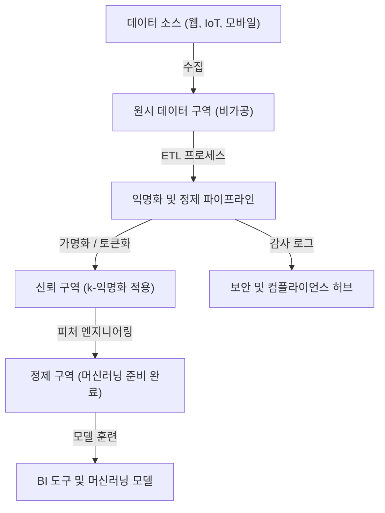
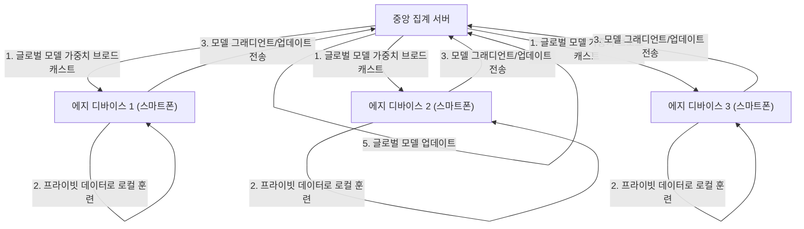

# 프라이버시와 편의성의 트레이드오프: 빅데이터 시대에서 개인정보의 행방

현대 디지털 사회에서 우리는 일상생활 속에서 방대한 양의 데이터를 생성하고 있습니다. 스마트폰의 위치 정보, SNS 게시물, 온라인 쇼핑의 구매 내역, 웨어러블 기기가 기록하는 건강 데이터 등 다양한 '빅데이터'가 끊임없이 수집되고 있습니다. 이러한 데이터는 AI(인공지능)의 진화와 개인화된 서비스 제공에 필수적이며, 우리의 삶을 더욱 편리하고 풍요롭게 만들어 주고 있습니다.

그러나 한편으로는 개인정보 수집 및 이용에 따른 프라이버시 침해 위험이 심각한 사회 문제로 대두되고 있습니다. 데이터 유출 사건, 사용자 동의 없는 데이터의 제3자 제공, 나아가 국가에 의한 감시 사회화에 대한 우려 등, 편의성 이면에 숨겨진 위험은 무시할 수 없는 규모에 이르렀습니다. 본 기사에서는 이러한 '프라이버시와 편의성의 트레이드오프'라는 현대의 딜레마에 대해, 기술 및 법적 규제 양면에서 어떻게 접근하고 있는지 최신 동향과 함께 매우 상세하게 기술적 해설을 진행합니다.

## 1. 데이터 주도형 사회의 패러다임과 데이터 아키텍처의 진화

데이터를 효율적으로 수집하고 활용하기 위해 기업들은 다양한 데이터 아키텍처를 채택하고 있습니다. 과거 주류였던 '데이터 웨어하우스(Data Warehouse)'에서 비정형 데이터를 포함한 모든 데이터를 통합 관리하는 '데이터 레이크(Data Lake)'로의 전환이 진행되었고, 현재는 분산형 아키텍처인 '데이터 메시(Data Mesh)'로의 패러다임 전환이 일어나고 있습니다.

### 중앙 집중형 데이터 레이크와 익명화 파이프라인

데이터 레이크는 원시 데이터(Raw Data)를 원래의 포맷 그대로 대량으로 저장하는 스토리지 리포지토리입니다. 그러나 개인 식별 정보(PII: Personally Identifiable Information)를 포함한 원시 데이터를 분석에 그대로 사용하는 것은 심각한 컴플라이언스 위반을 초래합니다. 따라서 데이터 레이크와 분석 환경 사이에는 엄격한 '익명화 파이프라인(Anonymization Pipeline)'이 구현됩니다.

다음 그림은 일반적인 중앙 집중형 데이터 레이크의 익명화 파이프라인 흐름을 보여줍니다.



이러한 파이프라인에서는 데이터 유입 시 해시화, 마스킹, 암호화 등의 처리가 자동으로 적용됩니다. 그러나 후술하는 바와 같이 단순한 마스킹이나 가명화(Pseudonymization)만으로는 다른 데이터 소스와의 대조를 통한 '재식별화(Re-identification)'의 위험을 완전히 배제할 수 없습니다.

## 2. 프라이버시 보호 기술(PETs)에 대한 깊은 이해

프라이버시와 데이터 활용의 양립을 목표로 하는 데 있어 핵심이 되는 것은 '프라이버시 강화 기술(Privacy-Enhancing Technologies: PETs)'입니다. 여기서는 현대의 빅데이터 분석 및 머신러닝에서 매우 중요한 역할을 하고 있는 주요 PETs에 대해, 수학적 정의와 기술적 구현을 상세히 해설합니다.

### 2.1 k-익명성 (K-Anonymity)과 그 확장

1998년 라타냐 스위니(Latanya Sweeney)와 피에란젤라 사마라티(Pierangela Samarati)가 제안한 'k-익명성'은 데이터 공개 시 프라이버시 보호의 기초가 되는 개념입니다. 데이터셋 내의 어떤 레코드도 최소한 $k-1$ 개의 다른 레코드와 구별되지 않는 상태로 만드는 것을 의미합니다.

데이터베이스 내의 속성은 다음 세 가지로 크게 나뉩니다:
1. **식별자 (Explicit Identifiers)**: 성명이나 주민등록번호 등, 개인을 직접 특정할 수 있는 정보(이들은 통상 삭제되거나 암호화됨).
2. **준식별자 (Quasi-Identifiers: QIs)**: 연령, 성별, 우편번호 등, 단독으로는 개인을 특정할 수 없지만 조합함으로써 특정이 가능해지는 정보.
3. **민감 속성 (Sensitive Attributes)**: 병명이나 연봉 등, 보호해야 할 정보.

k-익명성은 준식별자의 조합(동치류: Equivalence Class)이 반드시 $k$ 개 이상 존재함을 보장합니다. 그러나 k-익명성에는 '동질성 공격(Homogeneity Attack)'이나 '배경지식 공격(Background Knowledge Attack)'에 대한 취약성이 있습니다. 예를 들어, 특정 동치류에 속하는 $k$ 명 전원이 같은 병명(민감 속성)을 가지고 있을 경우, k-익명성이 유지되고 있더라도 병명이 특정되어 버립니다.

이를 극복하기 위해 제안된 것이 다음의 확장 모델입니다.

- **l-다양성 (l-diversity)**: 각 동치류에서 민감 속성이 최소한 $l$ 종류의 서로 다른 값을 가지도록 보장한다.
- **t-근접성 (t-closeness)**: 각 동치류에서의 민감 속성 분포와 데이터셋 전체의 민감 속성 분포 간의 거리(Earth Mover's Distance 등)가 임계값 $t$ 이하가 되도록 한다.

### 2.2 차분 프라이버시 (Differential Privacy: DP)

k-익명성 모델의 한계를 극복하고, 현재 가장 강력하며 수학적으로 엄밀한 프라이버시 기준으로 널리 채택되고 있는 것이 신시아 드워크(Cynthia Dwork) 등이 2006년에 제안한 '차분 프라이버시(Differential Privacy)'입니다. Apple, Google, Microsoft 등 거대 기술 기업들은 사용자로부터 원격 분석 데이터나 통계 데이터를 수집할 때 이 $\epsilon$-차분 프라이버시를 적용하고 있습니다.

#### 차분 프라이버시의 수학적 정의

무작위화 알고리즘(Randomized Algorithm) $\mathcal{M}$ 이 $\epsilon$-차분 프라이버시를 만족한다는 것은, 단 하나의 레코드만 다른 두 개의 인접한 데이터셋 $D$ 와 $D'$ (즉, $\|D - D'\|_1 = 1$), 그리고 출력의 임의의 부분 집합 $S \subseteq \text{Range}(\mathcal{M})$ 에 대해 다음 부등식이 성립하는 것입니다.

$$ \Pr[\mathcal{M}(D) \in S] \le e^\epsilon \Pr[\mathcal{M}(D') \in S] $$

여기서 $\epsilon$ (프라이버시 예산)은 프라이버시 보호 수준을 제어하는 음수가 아닌 파라미터입니다. $\epsilon$ 이 작을수록 프라이버시 보호는 강력해지지만, 데이터의 유용성(유틸리티)은 저하됩니다.

또한, 아주 적은 확률 $\delta$ 로 프라이버시 보장이 깨지는 것을 허용하는 완화된 모델인 $(\epsilon, \delta)$-차분 프라이버시도 널리 사용됩니다.

$$ \Pr[\mathcal{M}(D) \in S] \le e^\epsilon \Pr[\mathcal{M}(D') \in S] + \delta $$

#### 라플라스 메커니즘 (Laplace Mechanism)

차분 프라이버시를 구현하기 위한 대표적인 방법이 쿼리의 실제 출력 결과에 특정 분포를 따르는 노이즈(난수)를 의도적으로 더하는 '라플라스 메커니즘'입니다. 얼마나 많은 노이즈를 추가해야 하는지는 함수 $f$ 의 '글로벌 민감도(Global Sensitivity)' $\Delta f$ 에 의존합니다.

글로벌 민감도 $\Delta f$ 는 임의의 인접 데이터셋 $D, D'$ 에 대한 함수 $f$ 출력의 최대 변화량으로 정의됩니다.

$$ \Delta f = \max_{D, D'} \| f(D) - f(D') \|_1 $$

라플라스 메커니즘은 함수 $f(D)$ 의 결과에 대해, 척도 파라미터 $b = \frac{\Delta f}{\epsilon}$ 인 라플라스 분포 $\text{Lap}(b)$ 에서 샘플링한 노이즈 $Y$ 를 더합니다.

$$ \mathcal{M}(D) = f(D) + Y, \quad Y \sim \text{Lap}\left(\frac{\Delta f}{\epsilon}\right) $$

라플라스 분포의 확률 밀도 함수는 다음과 같습니다.

$$ p(x \mid b) = \frac{1}{2b} \exp\left( - \frac{|x|}{b} \right) $$

이러한 노이즈 주입을 통해 특정 개인이 데이터셋에 포함되어 있는지 여부를 출력 결과로부터 추론할 수 없게 됩니다. 기업들은 데이터 전체의 통계적인 경향(평균, 분산, 카운트 등)의 유용성을 유지하면서 개인의 데이터 자체는 마스킹하는 기술로 DP를 활용하고 있습니다.

### 2.3 연합 학습 (Federated Learning: FL)

기존의 머신러닝은 앞서 언급한 데이터 레이크처럼 중앙 서버에 대량의 데이터를 모아 모델을 훈련하는 중앙 집중형 방식을 취했습니다. 그러나 의료 이미지나 스마트폰의 입력 기록 등의 민감 데이터를 중앙 서버로 전송하는 것은 심각한 프라이버시 위험을 수반합니다.

그래서 Google이 2016년에 제안한 것이 '연합 학습(Federated Learning)'입니다. 연합 학습에서는 데이터 자체를 이동시키는 것이 아니라 '모델의 계산 처리'를 데이터가 존재하는 에지 디바이스 측(스마트폰이나 병원의 서버 등)으로 이동시킵니다.



#### Federated Averaging (FedAvg) 알고리즘

연합 학습의 대표적인 집계 알고리즘이 FedAvg입니다. 각 클라이언트 $k$ 는 자신이 보유한 데이터셋 $D_k$ (크기 $n_k$)를 사용하여, 로컬에서 확률적 경사 하강법(SGD)을 통한 학습을 여러 에포크(epoch) 수행하고, 업데이트된 가중치 $w_{t+1}^k$ 를 계산합니다.

중앙 서버는 참여한 $K$ 개의 클라이언트로부터 가중치를 받아, 그 가중치들을 데이터 크기에 따라 가중 평균함으로써 글로벌 모델의 가중치 $w_{t+1}$ 을 업데이트합니다. 총 데이터 수를 $n = \sum_{k=1}^K n_k$ 라고 하면 업데이트 식은 다음과 같습니다.

$$ w_{t+1} = \sum_{k=1}^K \frac{n_k}{n} w_{t+1}^k $$

이를 통해 개인의 원시 데이터(메시지 기록이나 사진 등)는 기기 밖으로 한 발짝도 나가지 않고 똑똑한 AI 모델을 구축하는 것이 가능해집니다. 대표적인 응용 사례로 Google Keyboard(Gboard)의 다음 단어 예측 기능이나, Apple의 FaceID, 'Siri야'의 음성 인식 모델 개선을 들 수 있습니다.

### 2.4 동형 암호 (Homomorphic Encryption: HE)

데이터를 암호화한 상태 그대로 계산(덧셈이나 곱셈 등)을 수행할 수 있게 하는 '마법과 같은' 암호 기술이 동형 암호입니다. 일반적인 암호화 기법에서는 데이터에 대해 계산 처리를 수행할 경우 한 번 복호화(평문으로 되돌림)해야 하지만, 클라우드 서버에서 복호화를 수행하는 것은 보안상 취약점이 됩니다.

동형 암호를 사용하면 다음과 같은 특성이 구현됩니다. 암호화 함수를 $E(\cdot)$ 라고 했을 때, 평문 $m_1$ 과 $m_2$ 의 덧셈이나 곱셈이 암호문 그대로의 연산($\oplus$ 나 $\otimes$)으로 가능해집니다.

$$ E(m_1 + m_2) = E(m_1) \oplus E(m_2) $$
$$ E(m_1 \times m_2) = E(m_1) \otimes E(m_2) $$

동형 암호는 덧셈 또는 곱셈 중 하나만 가능한 '부분 동형 암호(Partially Homomorphic Encryption: PHE)'와 덧셈과 곱셈 모두 무한 번 가능한 '완전 동형 암호(Fully Homomorphic Encryption: FHE)'로 나뉩니다. 2009년 크레이그 젠트리(Craig Gentry)가 격자 기반 암호(Lattice-based cryptography)를 사용한 최초의 FHE 체계를 구축한 이후 암호학에서 큰 돌파구가 되었습니다.

현재 계산 비용이나 암호문 크기의 증가(오버헤드)라는 과제는 남아 있지만, 클라우드 상에서의 의료 데이터의 안전한 분석이나 금융 기관 간의 비밀 계산 등에 응용될 것으로 기대되고 있습니다.

## 3. 법적 규제와 컴플라이언스의 동향: GDPR vs CCPA

기술적인 진화와 병행하여 법적 프레임워크의 정비도 전 세계적으로 급속히 진행되고 있습니다. 기업이 빅데이터를 활용할 때 이러한 법적 규제를 준수하는 것은 필수 조건이 되었습니다. 가장 영향력이 큰 두 가지 규제 프레임워크를 비교해 보겠습니다.

### EU 일반 데이터 보호 규칙 (GDPR)

2018년 5월에 시행된 EU의 GDPR(General Data Protection Regulation)은 개인 데이터 보호의 '세계 표준(골드 스탠다드)'으로 인식되고 있습니다. GDPR은 EU 권역 내의 개인 데이터를 다루는 모든 조직에 적용되며, 위반할 경우 전 세계 연간 매출액의 최대 4% 또는 2000만 유로 중 더 높은 금액의 막대한 과징금이 부과됩니다.

**GDPR의 주요 특징:**
- **옵트인(Opt-in) 원칙**: 데이터 수집 및 처리에는 사용자로부터의 명시적이고 자유로운 사전 동의가 필요합니다.
- **잊힐 권리 (Right to be Forgotten/Right to Erasure)**: 사용자는 기업에 대해 자신의 개인 데이터의 완전한 삭제를 요구할 권리를 가집니다. 데이터 레이크의 백업에서도 데이터를 삭제해야 하므로 기술적으로 난이도가 매우 높은 요구 사항입니다.
- **데이터 컨트롤러와 데이터 프로세서**: 데이터의 이용 목적을 결정하는 자(컨트롤러)와 그 지시에 따라 데이터를 처리하는 자(프로세서)의 책임을 엄격하게 정의하고 있습니다.

### 캘리포니아주 소비자 프라이버시법 (CCPA/CPRA)

미국에서는 연방 수준의 포괄적인 프라이버시법이 존재하지 않는 가운데, 캘리포니아주에서 2020년에 시행된 CCPA(California Consumer Privacy Act)가 사실상의 전미 기준으로 기능하고 있습니다. 이후 CPRA(California Privacy Rights Act)에 의해 더욱 강화되었습니다.

**CCPA의 주요 특징:**
- **옵트아웃(Opt-out) 원칙**: GDPR의 '사전 동의'와는 달리 사전 동의 없이 데이터 수집이 가능하지만, 사용자에게 "내 개인정보를 판매하지 마십시오(Do Not Sell My Personal Information)"라는 명확한 옵트아웃 링크를 제공할 의무가 있습니다.
- **데이터 접근 권리**: 소비자는 기업이 수집한 특정 정보나 그 범주, 정보 출처, 제3자 판매 여부의 공개를 청구할 수 있습니다.

이러한 법적 규제는 기업에게 시스템이나 프로세스의 설계 단계부터 프라이버시 보호를 통합하는 '프라이버시 바이 디자인(Privacy by Design)'을 강력히 요구하고 있습니다.

## 4. 데이터 생태계에서의 구현 과제

프라이버시 보호 기술과 법적 규제를 실제 빅데이터 환경에 적용할 때의 구현 관점을 살펴보겠습니다. 예를 들어, 데이터 레이크에서 Python과 Pandas, 또는 PySpark를 사용하여 k-익명화나 차분 프라이버시를 구현하는 상황을 가정합니다.

```python
# 차분 프라이버시를 적용한 데이터 집계의 개념 구현 (Python)
import numpy as np
import pandas as pd

def laplace_mechanism(true_value, sensitivity, epsilon):
    """
    실제 값에 라플라스 노이즈를 부여하는 함수
    """
    scale = sensitivity / epsilon
    noise = np.random.laplace(loc=0, scale=scale)
    return true_value + noise

def get_dp_average_salary(dataframe, epsilon=1.0):
    """
    차분 프라이버시를 보장한 평균 급여 계산
    """
    # 실제 계산
    true_sum = dataframe['salary'].sum()
    true_count = len(dataframe)
    
    # 차분 프라이버시 적용 (민감도 가정에 기반)
    # 가령 최대 급여의 변동을 민감도로 삼는다 (더 엄밀하게는 클리핑이 필요)
    max_salary_diff = 100000 
    
    # 노이즈 부여 (합계값과 카운트 각각에 DP를 적용하는 것도 가능)
    noisy_sum = laplace_mechanism(true_sum, max_salary_diff, epsilon / 2)
    noisy_count = laplace_mechanism(true_count, 1, epsilon / 2)
    
    return noisy_sum / noisy_count

# 데이터 파이프라인 내에서의 실행
# dp_avg_salary = get_dp_average_salary(raw_df, epsilon=0.5)
```

이 코드 스니펫에서 볼 수 있듯이 차분 프라이버시의 구현 자체는 노이즈의 덧셈이라는 단순한 것이지만, 실제 운영에 있어서는 '프라이버시 예산($\epsilon$)'의 관리가 매우 어려워집니다. 동일한 데이터셋에 대해 여러 번 쿼리를 실행하면 프라이버시 예산이 소비(합성 정리에 기반)되며, 최종적으로는 데이터셋 전체를 잠그거나 쿼리를 거부하는 메커니즘(Privacy Budget Management)을 구축할 필요가 있습니다.

## 5. 미래를 향한 전망과 윤리적 과제

빅데이터와 프라이버시의 트레이드오프는 제로섬 게임이 아닙니다. 차분 프라이버시나 연합 학습, 동형 암호와 같은 PETs의 진화로 인해 '데이터를 공유하지 않고 인사이트를 공유하는' 새로운 데이터 활용 패러다임이 현실이 되어가고 있습니다.

더 나아가 최근에는 '데이터 메시(Data Mesh)'나 'Web3(분산형 웹)'의 개념과 결합하여 데이터의 주권(Data Sovereignty)을 거대 플랫폼 기업으로부터 개인에게 되찾으려는 움직임도 가속화되고 있습니다. 개인의 데이터를 개인 데이터 저장소(PDS)나 데이터 지갑에 보관하고, 사용자 자신이 데이터 이용 허락과 수익화를 통제하는 미래가 논의되고 있습니다.

그러나 기술적 해결책이 완벽한 것은 아닙니다. 연합 학습에서는 악의적인 클라이언트가 부정확한 모델 업데이트를 전송하여 글로벌 모델을 오염시키는 '포이즈닝 공격(Poisoning Attack)'의 위협이 존재합니다. 차분 프라이버시에서는 소수파(마이너리티)의 데이터가 노이즈에 의해 묻혀버려 AI 모델에 편향을 발생시킨다는 윤리적인 문제도 지적되고 있습니다.

## 결론

빅데이터 시대에서 개인정보의 행방은 단순한 기술적인 과제를 넘어, 우리가 어떠한 사회를 원하는가라는 근본적인 질문을 던지고 있습니다. 편의성을 누리면서 개인의 존엄과 프라이버시를 어떻게 지켜낼 것인가. 그것은 법적 규제의 정비, 프라이버시 보호 기술의 끊임없는 혁신, 그리고 데이터를 제공하는 우리 각자의 높은 리터러시라는 삼위일체를 통해서만 지속 가능한 해답에 도달할 수 있을 것입니다. 프라이버시와 편의성은 더 이상 트레이드오프가 아니며, 최신 테크놀로지에 의해 양립 가능한 '필수 요건'으로 진화해 나갈 것입니다.


