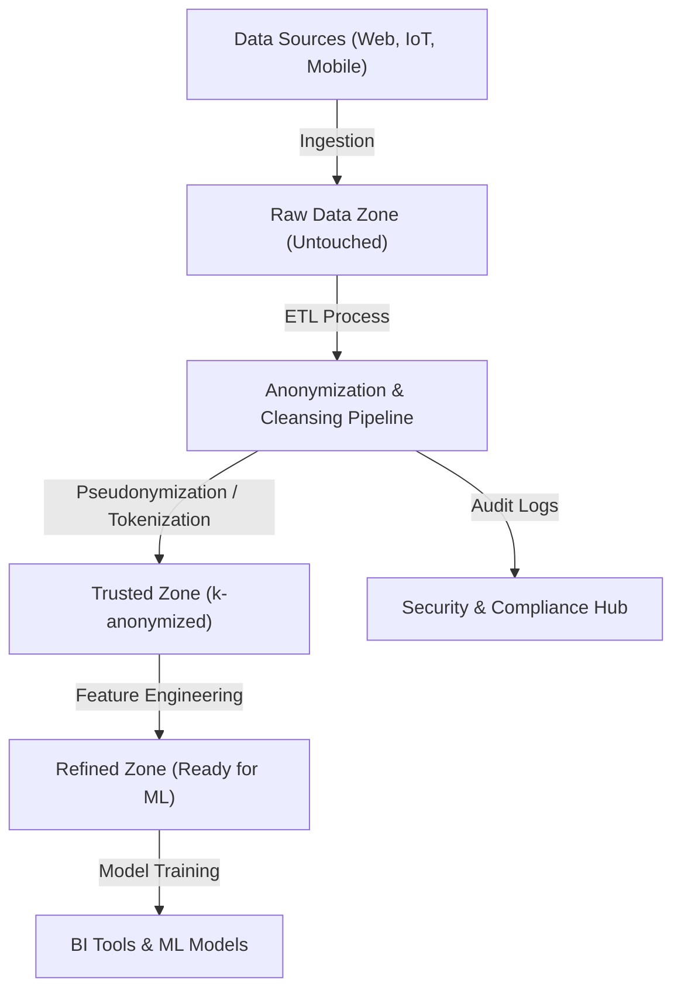
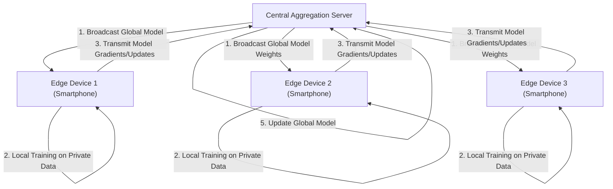

# プライバシーと利便性のトレードオフ：ビッグデータ時代における個人情報の行方

現代のデジタル社会において、私たちは日々の生活の中で膨大な量のデータを生成しています。スマートフォンの位置情報、SNSへの投稿、オンラインショッピングの購買履歴、ウェアラブルデバイスが記録する健康データなど、多岐にわたる「ビッグデータ」が絶え間なく収集されています。これらのデータは、AI（人工知能）の進化やパーソナライズされたサービスの提供に不可欠であり、私たちの生活をより便利で豊かなものにしています。

しかし、その一方で、個人情報の収集と利用に伴うプライバシーの侵害リスクが深刻な社会問題として浮上しています。データ漏洩事件や、ユーザーの同意なきデータの第三者提供、さらには国家による監視社会化への懸念など、利便性の裏に潜むリスクは無視できない規模に達しています。本記事では、この「プライバシーと利便性のトレードオフ」という現代のジレンマに対して、テクノロジーと法規制の両面からどのようにアプローチされているのか、最新の動向を交えて極めて詳細に技術的解説を行います。

## 1. データ駆動型社会のパラダイムとデータアーキテクチャの進化

データを効率的に収集・活用するため、企業は様々なデータアーキテクチャを採用しています。かつて主流であった「データウェアハウス（Data Warehouse）」から、非構造化データを含むあらゆるデータを一元管理する「データレイク（Data Lake）」への移行が進み、現在では分散型アーキテクチャである「データメッシュ（Data Mesh）」へのパラダイムシフトが起きています。

### 中央集権型データレイクと匿名化パイプライン

データレイクは、生データをそのままのフォーマットで大量に保存するストレージリポジトリです。しかし、個人情報（PII: Personally Identifiable Information）を含む生データをそのまま分析に利用することは、重大なコンプライアンス違反を引き起こします。そのため、データレイクと分析環境の間には、厳格な「匿名化パイプライン（Anonymization Pipeline）」が実装されます。

以下の図は、一般的な中央集権型データレイクにおける匿名化パイプラインのフローを示しています。



このようなパイプラインでは、データの流入時にハッシュ化、マスキング、暗号化などの処理が自動的に適用されます。しかし、後述するように、単純なマスキングや仮名化（Pseudonymization）だけでは、他のデータソースとの突き合わせによる「再識別化（Re-identification）」のリスクを完全に排除することはできません。

## 2. プライバシー保護技術（PETs）の深い理解

プライバシーとデータ活用の両立を目指す上で鍵となるのが、「プライバシー強化技術（Privacy-Enhancing Technologies: PETs）」です。ここでは、現代のビッグデータ解析や機械学習において極めて重要な役割を果たしている主要なPETsについて、数学的な定義と技術的な実装を詳細に解説します。

### 2.1 k-匿名性 (K-Anonymity) とその拡張

1998年にLatanya SweeneyとPierangela Samaratiによって提唱された「k-匿名性」は、データ公開におけるプライバシー保護の基礎となる概念です。データセット内のどのレコードも、少なくとも $k-1$ 個の他のレコードと区別がつかない状態にすることを意味します。

データベース内の属性は以下の3つに大別されます：
1. **識別子 (Explicit Identifiers)**：氏名やマイナンバーなど、個人を直接特定できる情報（これらは通常削除または暗号化される）。
2. **準識別子 (Quasi-Identifiers: QIs)**：年齢、性別、郵便番号など、単体では個人を特定できないが、組み合わせることで特定可能になる情報。
3. **機密属性 (Sensitive Attributes)**：病名や年収など、保護すべき情報。

k-匿名性は、準識別子の組み合わせ（同値類：Equivalence Class）が必ず $k$ 個以上存在することを保証します。しかし、k-匿名性には「同質性攻撃（Homogeneity Attack）」や「背景知識攻撃（Background Knowledge Attack）」に対する脆弱性があります。例えば、ある同値類に属する $k$ 人全員が同じ病名（機密属性）を持っていた場合、k-匿名性が保たれていても病名が特定されてしまいます。

これを克服するために提案されたのが以下の拡張モデルです。

- **l-多様性 (l-diversity)**：各同値類において、機密属性が少なくとも $l$ 種類の異なる値を持つことを保証する。
- **t-近接性 (t-closeness)**：各同値類における機密属性の分布と、データセット全体の機密属性の分布との距離（Earth Mover's Distanceなど）が、閾値 $t$ 以下になるようにする。

### 2.2 差分プライバシー (Differential Privacy: DP)

k-匿名性モデルの限界を克服し、現在最も強力で数学的に厳密なプライバシー基準として広く採用されているのが、Cynthia Dworkらによって2006年に提唱された「差分プライバシー（Differential Privacy）」です。Apple、Google、Microsoftなどのテックジャイアントは、ユーザーからテレメトリデータや統計データを収集する際に、この $\epsilon$-差分プライバシーを適用しています。

#### 差分プライバシーの数学的定義

無作為化アルゴリズム（Randomized Algorithm） $\mathcal{M}$ が $\epsilon$-差分プライバシーを満たすとは、任意の1レコードのみが異なる2つの隣接するデータセット $D$ と $D'$ （すなわち $\|D - D'\|_1 = 1$）、および出力の任意の部分集合 $S \subseteq \text{Range}(\mathcal{M})$ に対して、以下の不等式が成立することです。

$$ \Pr[\mathcal{M}(D) \in S] \le e^\epsilon \Pr[\mathcal{M}(D') \in S] $$

ここで、$\epsilon$ （プライバシーバジェット）は、プライバシーの保護レベルを制御する非負のパラメータです。$\epsilon$ が小さいほどプライバシー保護は強力になりますが、データの有用性（ユーティリティ）は低下します。

さらに、ごくわずかな確率 $\delta$ でプライバシーの保証が破れることを許容する緩和モデルである $(\epsilon, \delta)$-差分プライバシーも広く用いられます。

$$ \Pr[\mathcal{M}(D) \in S] \le e^\epsilon \Pr[\mathcal{M}(D') \in S] + \delta $$

#### ラプラスメカニズム (Laplace Mechanism)

差分プライバシーを実現するための代表的な手法が、クエリの真の出力結果に特定の分布に従うノイズ（乱数）を意図的に加算する「ラプラスメカニズム」です。どれだけのノイズを加えるべきかは、関数 $f$ の「グローバル感度（Global Sensitivity）」 $\Delta f$ に依存します。

グローバル感度 $\Delta f$ は、任意の隣接データセット $D, D'$ に対する関数 $f$ の出力の最大変化量として定義されます。

$$ \Delta f = \max_{D, D'} \| f(D) - f(D') \|_1 $$

ラプラスメカニズムは、関数 $f(D)$ の結果に対して、尺度パラメータ $b = \frac{\Delta f}{\epsilon}$ のラプラス分布 $\text{Lap}(b)$ からサンプリングしたノイズ $Y$ を加算します。

$$ \mathcal{M}(D) = f(D) + Y, \quad Y \sim \text{Lap}\left(\frac{\Delta f}{\epsilon}\right) $$

ラプラス分布の確率密度関数は以下の通りです。

$$ p(x \mid b) = \frac{1}{2b} \exp\left( - \frac{|x|}{b} \right) $$

このノイズ注入によって、特定の個人がデータセットに含まれているかどうかが、出力結果から推測できなくなります。企業は、データ全体の統計的な傾向（平均、分散、カウントなど）の有用性を維持しつつ、個人のデータそのものはマスキングする技術としてDPを活用しています。

### 2.3 連合学習 (Federated Learning: FL)

従来の機械学習は、前述のデータレイクのように中央サーバーに大量のデータを集約してモデルを訓練する中央集権型のアプローチをとっていました。しかし、医療画像やスマートフォンの入力履歴などの機密データを中央サーバーに送信することは、重大なプライバシーリスクを伴います。

そこでGoogleが2016年に提唱したのが「連合学習（Federated Learning）」です。連合学習では、データそのものを移動させるのではなく、「モデルの計算処理」をデータが存在するエッジデバイス側（スマートフォンや病院のサーバーなど）に移動させます。



#### Federated Averaging (FedAvg) アルゴリズム

連合学習における代表的な集約アルゴリズムがFedAvgです。各クライアント $k$ は、自身の保有するデータセット $D_k$ （サイズ $n_k$）を用いて、ローカルで確率的勾配降下法（SGD）による学習を複数エポック行い、更新された重み $w_{t+1}^k$ を計算します。

中央サーバーは、参加した $K$ 個のクライアントから重みを受け取り、それらの重みをデータサイズに応じて加重平均することで、グローバルモデルの重み $w_{t+1}$ を更新します。総データ数を $n = \sum_{k=1}^K n_k$ とすると、更新式は以下のようになります。

$$ w_{t+1} = \sum_{k=1}^K \frac{n_k}{n} w_{t+1}^k $$

これにより、個人の生データ（メッセージ履歴や写真など）はデバイスから一歩も外に出ることなく、賢いAIモデルを構築することが可能になります。代表的な応用例として、Google Keyboard（Gboard）の次単語予測機能や、AppleのFaceID、Hey Siriの音声認識モデルの改善が挙げられます。

### 2.4 準同型暗号 (Homomorphic Encryption: HE)

データを暗号化したままの状態で計算（加算や乗算など）を行うことを可能にする「魔法のような」暗号技術が準同型暗号です。通常の暗号化手法では、データに対して計算処理を行う場合、一度復号化（平文に戻す）する必要がありますが、クラウドサーバー上で復号化を行うことはセキュリティ上の脆弱性となります。

準同型暗号を用いれば、以下のような特性が実現されます。暗号化関数を $E(\cdot)$ としたとき、平文 $m_1$ と $m_2$ の加算や乗算が、暗号文のままの演算（$\oplus$ や $\otimes$）で可能になります。

$$ E(m_1 + m_2) = E(m_1) \oplus E(m_2) $$
$$ E(m_1 \times m_2) = E(m_1) \otimes E(m_2) $$

準同型暗号は、加算または乗算のどちらか一方のみが可能な「部分準同型暗号（Partially Homomorphic Encryption: PHE）」と、加算と乗算の両方が無限回可能な「完全準同型暗号（Fully Homomorphic Encryption: FHE）」に分けられます。2009年にCraig Gentryが格子暗号（Lattice-based cryptography）を用いた最初のFHEスキームを構築して以来、暗号学において大きなブレイクスルーとなりました。

現在、計算コストや暗号文のサイズ増大（オーバーヘッド）という課題は残されていますが、医療データのクラウド上でのセキュアな解析や、金融機関同士の秘密計算などへの応用が期待されています。

## 3. 法規制とコンプライアンスの動向：GDPR vs CCPA

技術的な進化と並行して、法的枠組みの整備も世界的に急速に進んでいます。企業がビッグデータを活用する際、これらの法規制を遵守することは必須条件となっています。最も影響力の大きい2つの規制フレームワークを比較してみましょう。

### EU一般データ保護規則 (GDPR)

2018年5月に施行されたEUのGDPR（General Data Protection Regulation）は、個人データ保護の「世界標準（ゴールドスタンダード）」として認識されています。GDPRは、EU圏内の個人のデータを扱うすべての組織に適用され、違反した場合には全世界年間売上高の最大4%、または2000万ユーロのいずれか高い方の莫大な制裁金が科されます。

**GDPRの主な特徴:**
- **オプトイン（Opt-in）原則**: データの収集・処理には、ユーザーからの明示的で自由な事前の同意が必要です。
- **忘れられる権利 (Right to be Forgotten/Right to Erasure)**: ユーザーは企業に対し、自身の個人データの完全な消去を要求する権利を持ちます。データレイクのバックアップからもデータを削除する必要があり、技術的に極めて難易度の高い要件です。
- **データ・コントローラーとデータ・プロセッサー**: データの利用目的を決定する者（コントローラー）と、その指示に従ってデータを処理する者（プロセッサー）の責任を厳密に定義しています。

### カリフォルニア州消費者プライバシー法 (CCPA/CPRA)

米国では連邦レベルの包括的なプライバシー法が存在しない中、カリフォルニア州で2020年に施行されたCCPA（California Consumer Privacy Act）が事実上の全米基準として機能しています。その後、CPRA（California Privacy Rights Act）によってさらに強化されました。

**CCPAの主な特徴:**
- **オプトアウト（Opt-out）原則**: GDPRの「事前同意」とは異なり、事前の同意なしでデータ収集が可能ですが、ユーザーに対して「私の個人情報を販売しないでください (Do Not Sell My Personal Information)」という明確なオプトアウトのリンクを提供することが義務付けられています。
- **データアクセスの権利**: 消費者は、企業が収集した特定の情報やそのカテゴリ、情報源、第三者への販売有無の開示を請求できます。

これらの法規制は、企業に対して「プライバシー・バイ・デザイン（Privacy by Design）」— システムやプロセスの設計段階からプライバシー保護を組み込むこと — を強く要求しています。

## 4. データエコシステムにおける実装課題

プライバシー保護技術と法規制を実際のビッグデータ環境に適用する際の実装の観点を見てみましょう。例えば、データレイクにおいてPythonとPandas、あるいはPySparkを用いてk-匿名化や差分プライバシーを実装するケースを想定します。

```python
# 差分プライバシーを適用したデータ集計の概念実装 (Python)
import numpy as np
import pandas as pd

def laplace_mechanism(true_value, sensitivity, epsilon):
    """
    真の値に対してラプラスノイズを付与する関数
    """
    scale = sensitivity / epsilon
    noise = np.random.laplace(loc=0, scale=scale)
    return true_value + noise

def get_dp_average_salary(dataframe, epsilon=1.0):
    """
    差分プライバシーを保証した平均給与の計算
    """
    # 実際の計算
    true_sum = dataframe['salary'].sum()
    true_count = len(dataframe)
    
    # 差分プライバシーの適用（感度の仮定に基づく）
    # 仮に最大給与の変動を感度とする（より厳密にはクリッピングが必要）
    max_salary_diff = 100000 
    
    # ノイズ付与（合計値とカウントのそれぞれにDPを適用することも可能）
    noisy_sum = laplace_mechanism(true_sum, max_salary_diff, epsilon / 2)
    noisy_count = laplace_mechanism(true_count, 1, epsilon / 2)
    
    return noisy_sum / noisy_count

# データパイプライン内での実行
# dp_avg_salary = get_dp_average_salary(raw_df, epsilon=0.5)
```

このコードスニペットに見られるように、差分プライバシーの実装自体はノイズの加算というシンプルなものですが、実運用においては「プライバシーバジェット（$\epsilon$）」の管理が極めて困難になります。同じデータセットに対して複数回のクエリを発行すると、プライバシーバジェットは消費（合成定理に基づく）され、最終的にはデータセット全体をロックするか、クエリを拒否する仕組み（Privacy Budget Management）を構築する必要があります。

## 5. 未来に向けた展望と倫理的課題

ビッグデータとプライバシーのトレードオフは、ゼロサムゲームではありません。差分プライバシーや連合学習、準同型暗号といったPETsの進化により、「データを共有せずにインサイトを共有する」新しいデータ活用のパラダイムが現実のものとなりつつあります。

さらに、近年では「データメッシュ（Data Mesh）」や「Web3（分散型ウェブ）」の概念と結びつき、データの主権（Data Sovereignty）を巨大プラットフォーマーから個人へと取り戻す動きも加速しています。個人のデータをパーソナルデータストア（PDS）やデータウォレットに保管し、ユーザー自身がデータの利用許諾と収益化をコントロールする未来が議論されています。

しかしながら、技術的解決策は完全ではありません。連合学習においては、悪意のあるクライアントが不正なモデルのアップデートを送信してグローバルモデルを汚染する「ポイズニング攻撃（Poisoning Attack）」の脅威が存在します。差分プライバシーにおいては、マイノリティ（少数派）のデータがノイズによってかき消され、AIモデルにバイアスを生じさせるという倫理的な課題も指摘されています。

## 結論

ビッグデータ時代における個人情報の行方は、単なる技術的な課題を超え、私たちがどのような社会を望むかという根本的な問いを投げかけています。利便性を享受しつつ、個人の尊厳とプライバシーをどのように守り抜くか。それは、法規制の整備、プライバシー保護技術の絶え間ない革新、そしてデータを提供する私たち一人ひとりの高いリテラシーの三位一体によってのみ、持続可能な解に到達することができるのです。プライバシーと利便性はもはやトレードオフではなく、最新のテクノロジーによって両立可能な「必須の要件」へと進化していくことでしょう。
