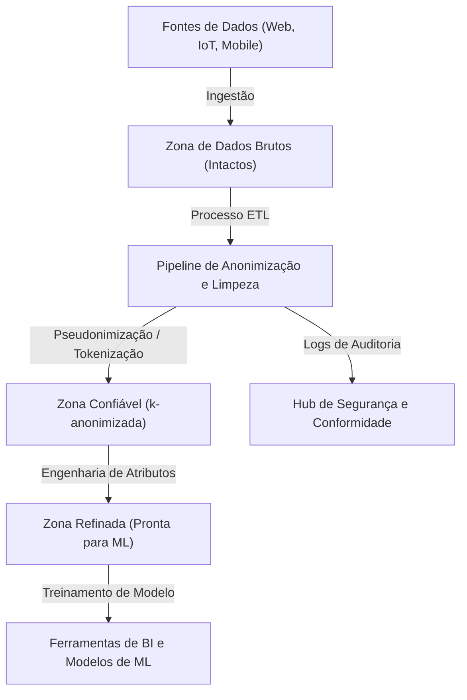
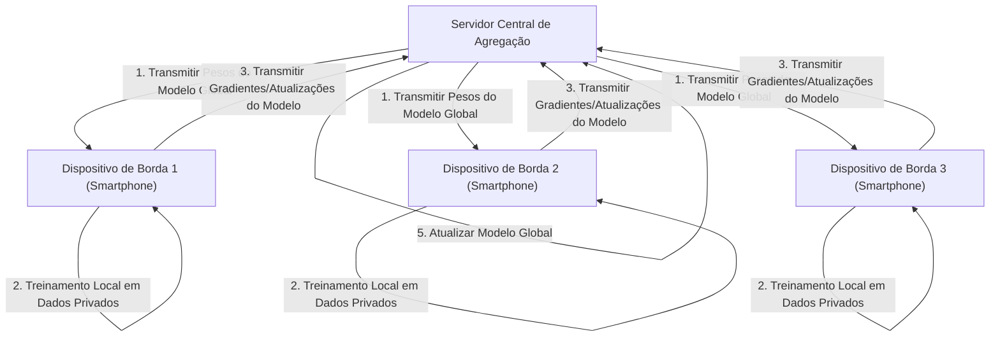

# O Trade-off entre Privacidade e Conveniência: O Destino das Informações Pessoais na Era do Big Data

Na sociedade digital moderna, geramos uma quantidade massiva de dados em nossas vidas diárias. Informações de localização de smartphones, postagens em redes sociais, histórico de compras em lojas online e dados de saúde registrados por dispositivos vestíveis — uma ampla variedade de "big data" é coletada incessantemente. Esses dados são essenciais para a evolução da IA (Inteligência Artificial) e para a prestação de serviços personalizados, tornando nossas vidas mais convenientes e ricas.

No entanto, por outro lado, o risco de violação de privacidade associado à coleta e uso de informações pessoais emergiu como um grave problema social. Incidentes de vazamento de dados, o fornecimento de dados a terceiros sem o consentimento do usuário e até mesmo as preocupações com a transformação em uma sociedade de vigilância pelo Estado — os riscos escondidos por trás da conveniência atingiram uma escala que não pode ser ignorada. Neste artigo, abordaremos este dilema moderno do "trade-off entre privacidade e conveniência", fornecendo uma explicação técnica extremamente detalhada de como as abordagens tecnológica e regulatória estão lidando com a questão, juntamente com as tendências mais recentes.

## 1. O Paradigma da Sociedade Orientada a Dados e a Evolução da Arquitetura de Dados

Para coletar e utilizar dados de forma eficiente, as empresas adotam várias arquiteturas de dados. Houve uma transição do "Data Warehouse" (Armazém de Dados), que costumava ser o principal, para o "Data Lake" (Lago de Dados), que gerencia centralmente todos os dados, incluindo dados não estruturados, e atualmente está ocorrendo uma mudança de paradigma em direção a uma arquitetura distribuída, o "Data Mesh" (Malha de Dados).

### Data Lake Centralizado e [Pipeline](https://kenji.blog/pt/p/cicd-pipeline-github-actions-best-practices/) de Anonimização

Um data lake é um repositório de armazenamento que guarda grandes volumes de dados brutos em seu formato original. No entanto, o uso direto de dados brutos contendo informações pessoais (PII: Personally Identifiable Information) para análise resulta em sérias violações de conformidade. Portanto, um rigoroso "Pipeline de Anonimização" (Anonymization Pipeline) é implementado entre o data lake e o ambiente de análise.

A figura a seguir ilustra o fluxo de um pipeline de anonimização em um data lake centralizado típico.



Em tais pipelines, processos como hash, mascaramento e criptografia são aplicados automaticamente durante a entrada dos dados. Contudo, como será discutido mais adiante, o simples mascaramento ou pseudonimização (Pseudonymization) não pode eliminar completamente o risco de "reidentificação" (Re-identification) por meio do cruzamento com outras fontes de dados.

## 2. Compreensão Profunda das Tecnologias de Melhoria da Privacidade (PETs)

A chave para alcançar um equilíbrio entre privacidade e utilização de dados são as "Tecnologias de Melhoria da Privacidade" (Privacy-Enhancing Technologies: PETs). Aqui, explicaremos detalhadamente as definições matemáticas e implementações técnicas das principais PETs, que desempenham um papel extremamente importante na análise de big data e no aprendizado de máquina modernos.

### 2.1 k-anonimato (K-Anonymity) e suas Extensões

Proposto em 1998 por Latanya Sweeney e Pierangela Samarati, o "k-anonimato" é um conceito fundamental para a proteção da privacidade na publicação de dados. Isso significa que nenhum registro em um conjunto de dados pode ser distinguido de pelo menos $k-1$ outros registros.

Os atributos em um banco de dados são divididos em três categorias principais:
1. **Identificadores (Explicit Identifiers)**: Informações que podem identificar um indivíduo diretamente, como nome ou número de identidade (geralmente são removidos ou criptografados).
2. **Quase-identificadores (Quasi-Identifiers: QIs)**: Informações como idade, sexo ou código postal que, sozinhas, não podem identificar um indivíduo, mas podem fazê-lo quando combinadas.
3. **Atributos Sensíveis (Sensitive Attributes)**: Informações que devem ser protegidas, como diagnóstico médico ou renda anual.

O k-anonimato garante que sempre existam pelo menos $k$ combinações de quase-identificadores (classes de equivalência: Equivalence Class). No entanto, o k-anonimato possui vulnerabilidades a "Ataques de Homogeneidade" (Homogeneity Attack) e "Ataques de Conhecimento Prévio" (Background Knowledge Attack). Por exemplo, se todas as $k$ pessoas pertencentes a uma classe de equivalência tiverem a mesma doença (atributo sensível), a doença será identificada mesmo que o k-anonimato seja mantido.

Os seguintes modelos de extensão foram propostos para superar isso:

- **l-diversidade (l-diversity)**: Garante que o atributo sensível tenha pelo menos $l$ valores distintos em cada classe de equivalência.
- **t-proximidade (t-closeness)**: Garante que a distância (como a Earth Mover's Distance) entre a distribuição do atributo sensível em cada classe de equivalência e a distribuição no conjunto de dados como um todo seja igual ou inferior a um limite $t$.

### 2.2 Privacidade Diferencial (Differential Privacy: DP)

Superando as limitações do modelo de k-anonimato, a "Privacidade Diferencial" (Differential Privacy), proposta por Cynthia Dwork e outros em 2006, é atualmente o padrão de privacidade mais forte e matematicamente rigoroso amplamente adotado. Gigantes da tecnologia como Apple, Google e Microsoft aplicam essa $\epsilon$-privacidade diferencial ao coletar dados de telemetria e dados estatísticos dos usuários.

#### Definição Matemática da Privacidade Diferencial

Um algoritmo aleatorizado (Randomized Algorithm) $\mathcal{M}$ satisfaz a $\epsilon$-privacidade diferencial se, para quaisquer dois conjuntos de dados adjacentes $D$ e $D'$ que diferem em apenas um registro (ou seja, $\|D - D'\|_1 = 1$), e para qualquer subconjunto de saídas $S \subseteq \text{Range}(\mathcal{M})$, a seguinte desigualdade for mantida:

$$ \Pr[\mathcal{M}(D) \in S] \le e^\epsilon \Pr[\mathcal{M}(D') \in S] $$

Aqui, $\epsilon$ (orçamento de privacidade ou privacy budget) é um parâmetro não-negativo que controla o nível de proteção da privacidade. Quanto menor for o $\epsilon$, mais forte será a proteção da privacidade, mas a utilidade dos dados (utility) diminuirá.

Além disso, a $(\epsilon, \delta)$-privacidade diferencial, um modelo relaxado que permite que a garantia de privacidade seja quebrada com uma probabilidade muito pequena $\delta$, também é amplamente utilizado:

$$ \Pr[\mathcal{M}(D) \in S] \le e^\epsilon \Pr[\mathcal{M}(D') \in S] + \delta $$

#### Mecanismo de Laplace (Laplace Mechanism)

Um método representativo para alcançar a privacidade diferencial é o "Mecanismo de Laplace", que adiciona intencionalmente ruído (números aleatórios) seguindo uma distribuição específica ao resultado real de uma consulta. A quantidade de ruído a ser adicionada depende da "sensibilidade global" (Global Sensitivity) $\Delta f$ da função $f$.

A sensibilidade global $\Delta f$ é definida como a variação máxima na saída da função $f$ para quaisquer conjuntos de dados adjacentes $D, D'$.

$$ \Delta f = \max_{D, D'} \| f(D) - f(D') \|_1 $$

O Mecanismo de Laplace adiciona um ruído $Y$ amostrado de uma distribuição de Laplace $\text{Lap}(b)$ com o parâmetro de escala $b = \frac{\Delta f}{\epsilon}$ ao resultado da função $f(D)$.

$$ \mathcal{M}(D) = f(D) + Y, \quad Y \sim \text{Lap}\left(\frac{\Delta f}{\epsilon}\right) $$

A função de densidade de probabilidade da distribuição de Laplace é a seguinte:

$$ p(x \mid b) = \frac{1}{2b} \exp\left( - \frac{|x|}{b} \right) $$

Com essa injeção de ruído, torna-se impossível deduzir a partir dos resultados de saída se um indivíduo específico está incluído no conjunto de dados. As empresas utilizam a DP como uma tecnologia para mascarar os dados individuais em si, ao mesmo tempo que mantêm a utilidade das tendências estatísticas (média, variância, contagem, etc.) de todos os dados.

### 2.3 Aprendizado Federado (Federated Learning: FL)

O aprendizado de máquina tradicional adotava uma abordagem centralizada, em que enormes volumes de dados eram agregados em um servidor central para treinar modelos, de forma semelhante ao data lake mencionado anteriormente. No entanto, enviar dados sensíveis, como imagens médicas ou histórico de digitação de smartphones, para um servidor central acarreta sérios riscos de privacidade.

Para resolver isso, o Google propôs em 2016 o "Aprendizado Federado" (Federated Learning). No aprendizado federado, em vez de mover os dados, o "processamento de cálculo do modelo" é movido para o lado dos dispositivos de borda onde os dados residem (como smartphones e servidores hospitalares).



#### Algoritmo Federated Averaging (FedAvg)

Um algoritmo de agregação representativo no aprendizado federado é o FedAvg. Cada cliente $k$ utiliza seu próprio conjunto de dados $D_k$ (de tamanho $n_k$) para realizar localmente várias épocas de aprendizado usando a descida de gradiente estocástica (SGD) e calcula os pesos atualizados $w_{t+1}^k$.

O servidor central recebe os pesos dos $K$ clientes participantes e atualiza os pesos do modelo global $w_{t+1}$ calculando uma média ponderada desses pesos com base no tamanho dos dados. Se o número total de dados for $n = \sum_{k=1}^K n_k$, a fórmula de atualização será a seguinte:

$$ w_{t+1} = \sum_{k=1}^K \frac{n_k}{n} w_{t+1}^k $$

Isso permite a construção de modelos de IA inteligentes sem que os dados brutos das pessoas (como histórico de mensagens e fotos) precisem sair do dispositivo. Exemplos típicos de aplicações incluem melhorias no recurso de previsão da próxima palavra do Google Keyboard (Gboard), e nos modelos de reconhecimento de voz FaceID e Hey Siri da Apple.

### 2.4 Criptografia Homomórfica (Homomorphic Encryption: HE)

A criptografia homomórfica é uma tecnologia criptográfica "quase mágica" que permite que os dados sejam processados (como adição e multiplicação) enquanto permanecem criptografados. Com os métodos normais de criptografia, quando se processa dados, é necessário descriptografá-los (retorná-los ao texto simples) primeiro, mas realizar a descriptografia em servidores na nuvem representa uma vulnerabilidade de segurança.

Ao usar a criptografia homomórfica, as seguintes propriedades são alcançadas: Se a função de criptografia for $E(\cdot)$, a adição ou multiplicação dos textos simples $m_1$ e $m_2$ pode ser realizada com operações ($\oplus$ ou $\otimes$) enquanto eles ainda são textos cifrados.

$$ E(m_1 + m_2) = E(m_1) \oplus E(m_2) $$
$$ E(m_1 \times m_2) = E(m_1) \otimes E(m_2) $$

A criptografia homomórfica é dividida em "Criptografia Parcialmente Homomórfica" (Partially Homomorphic Encryption: PHE), que permite apenas adição ou multiplicação, e "Criptografia Totalmente Homomórfica" (Fully Homomorphic Encryption: FHE), que permite infinitas operações de adição e multiplicação. Desde que Craig Gentry construiu o primeiro esquema FHE usando criptografia baseada em reticulados (Lattice-based cryptography) em 2009, tem havido um grande avanço na criptografia.

Atualmente, embora ainda existam desafios como o custo computacional e o aumento do tamanho dos textos cifrados (overhead), espera-se que seja aplicado na análise segura de dados médicos na nuvem e em cálculos secretos entre instituições financeiras.

## 3. Tendências de Regulamentação e Conformidade: GDPR vs CCPA

Paralelamente à evolução técnica, o desenvolvimento de marcos legais também está avançando rapidamente em todo o mundo. Cumprir com essas regulamentações tornou-se um pré-requisito para as empresas que aproveitam o big data. Vamos comparar as duas estruturas regulatórias de maior impacto.

### Regulamento Geral sobre a Proteção de Dados da UE (GDPR)

O GDPR (General Data Protection Regulation) da UE, implementado em maio de 2018, é reconhecido como o "padrão ouro" mundial para a proteção de dados pessoais. O GDPR se aplica a todas as organizações que lidam com dados de indivíduos dentro da União Europeia. Em caso de violação, são impostas enormes multas de até 4% da receita anual global ou 20 milhões de euros, o que for maior.

**Principais características do GDPR:**
- **Princípio de Opt-in**: É necessário o consentimento prévio, explícito e livre dos usuários para a coleta e o processamento de dados.
- **Direito ao Esquecimento (Right to be Forgotten/Right to Erasure)**: Os usuários têm o direito de solicitar às empresas o apagamento total de seus dados pessoais. Os dados também devem ser removidos dos backups do data lake, o que é um requisito tecnicamente bastante difícil de alcançar.
- **Controlador de Dados e Processador de Dados**: Define estritamente a responsabilidade de quem determina o propósito do uso dos dados (controlador) e de quem processa os dados de acordo com essas instruções (processador).

### Lei de Privacidade do Consumidor da Califórnia (CCPA/CPRA)

Na ausência de uma lei de privacidade abrangente a nível federal nos Estados Unidos, a CCPA (California Consumer Privacy Act), implementada na Califórnia em 2020, atua como o padrão nacional de facto. Posteriormente, ela foi ainda mais fortalecida pela CPRA (California Privacy Rights Act).

**Principais características da CCPA:**
- **Princípio de Opt-out**: Ao contrário do "consentimento prévio" do GDPR, a coleta de dados pode ocorrer sem consentimento prévio, mas exige-se que seja fornecido um link de exclusão claro para os usuários com os dizeres "Não venda minhas informações pessoais" (Do Not Sell My Personal Information).
- **Direito de Acesso aos Dados**: Os consumidores podem solicitar a divulgação de informações específicas coletadas pela empresa e de suas categorias, de suas fontes e se foram vendidas a terceiros.

Tais regulamentações exigem fortemente das empresas "Privacidade desde a Concepção" (Privacy by Design) — integrando a proteção de privacidade desde a fase de concepção e projeto de sistemas e processos.

## 4. Desafios de Implementação no Ecossistema de Dados

Vejamos do ponto de vista da implementação ao aplicar tecnologias de proteção de privacidade e marcos legais em um ambiente real de big data. Por exemplo, vamos considerar o caso de implementação de k-anonimização e privacidade diferencial usando Python e Pandas, ou PySpark em um data lake.

```python
# Implementação conceitual de agregação de dados aplicando privacidade diferencial (Python)
import numpy as np
import pandas as pd

def laplace_mechanism(true_value, sensitivity, epsilon):
    """
    Função para adicionar ruído de Laplace ao valor real
    """
    scale = sensitivity / epsilon
    noise = np.random.laplace(loc=0, scale=scale)
    return true_value + noise

def get_dp_average_salary(dataframe, epsilon=1.0):
    """
    Cálculo do salário médio garantindo privacidade diferencial
    """
    # Cálculo real
    true_sum = dataframe['salary'].sum()
    true_count = len(dataframe)
    
    # Aplicação de privacidade diferencial (com base na suposição de sensibilidade)
    # Suponha que a flutuação máxima do salário seja a sensibilidade (mais estritamente, requer recorte/clipping)
    max_salary_diff = 100000 
    
    # Adição de ruído (também é possível aplicar DP à soma e contagem separadamente)
    noisy_sum = laplace_mechanism(true_sum, max_salary_diff, epsilon / 2)
    noisy_count = laplace_mechanism(true_count, 1, epsilon / 2)
    
    return noisy_sum / noisy_count

# Execução no pipeline de dados
# dp_avg_salary = get_dp_average_salary(raw_df, epsilon=0.5)
```

Como visto neste trecho de código, a própria implementação da privacidade diferencial é tão simples quanto adicionar ruído, mas gerenciar o "orçamento de privacidade" (privacy budget, $\epsilon$) torna-se extremamente difícil em operações reais. Ao emitir múltiplas consultas para o mesmo conjunto de dados, o orçamento de privacidade é consumido (com base no teorema da composição) e, por fim, é necessário construir um mecanismo para bloquear o conjunto de dados inteiro ou rejeitar as consultas (Privacy Budget Management).

## 5. Perspectivas Futuras e Desafios Éticos

O trade-off entre big data e privacidade não é um jogo de soma zero. Graças à evolução das PETs, como privacidade diferencial, aprendizado federado e criptografia homomórfica, o novo paradigma de uso de dados para "compartilhar insights sem compartilhar dados" está se tornando uma realidade.

Além disso, em conexão com os conceitos de "Data Mesh" (Malha de Dados) e "Web3" (Web Descentralizada) nos últimos anos, o movimento para devolver a Soberania dos Dados (Data Sovereignty) das gigantes plataformas de tecnologia aos indivíduos também está acelerando. Está em debate um futuro onde os dados individuais serão armazenados em armazenamentos de dados pessoais (PDS) ou carteiras de dados, e o próprio usuário controlará o licenciamento e a monetização de seus dados.

No entanto, as soluções tecnológicas não são perfeitas. No aprendizado federado, existe a ameaça de "Ataque de Envenenamento" (Poisoning Attack), no qual clientes mal-intencionados enviam atualizações de modelo incorretas para contaminar o modelo global. Na privacidade diferencial, os desafios éticos também têm sido apontados, já que os dados da minoria podem ser abafados pelo ruído, causando vieses nos modelos de IA.

## Conclusão

O destino das informações pessoais na era do big data vai além de um simples desafio tecnológico; lança a questão fundamental de que tipo de sociedade queremos. Como podemos aproveitar a conveniência enquanto salvaguardamos implacavelmente a dignidade e a privacidade de cada indivíduo? Somente através da trindade de estruturas legais bem desenvolvidas, inovação constante em tecnologias de proteção de privacidade e alta alfabetização de dados por parte de cada um de nós, poderemos chegar a uma solução sustentável. A privacidade e a conveniência não são mais um trade-off, mas certamente evoluirão para "requisitos essenciais" que podem coexistir através da tecnologia mais recente.


