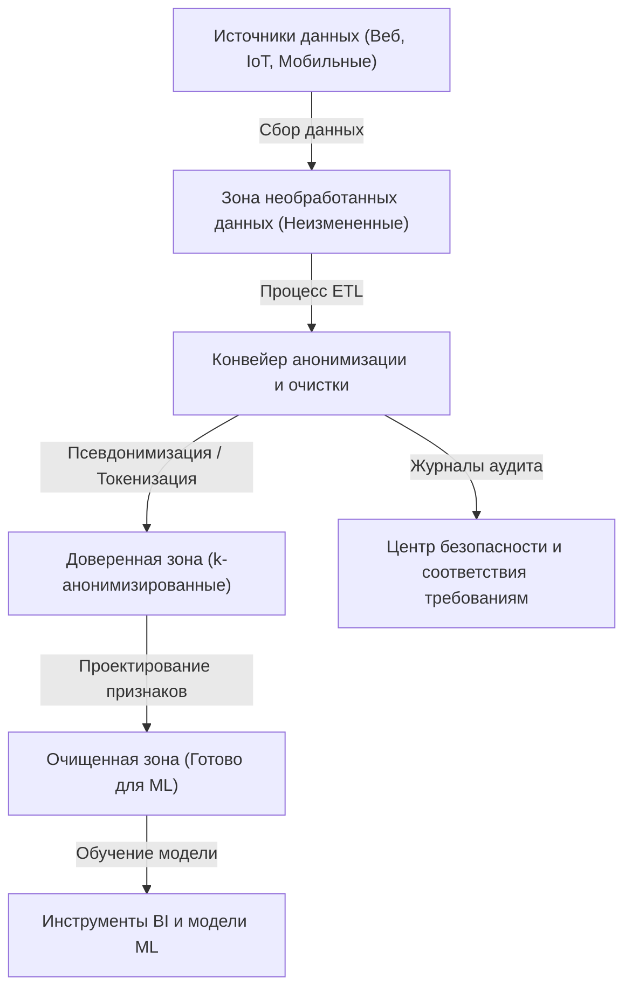
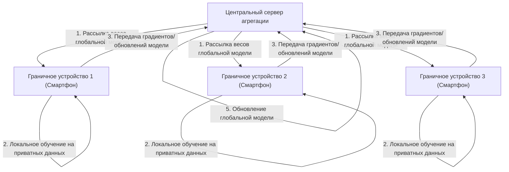

# Компромисс между конфиденциальностью и удобством: судьба персональных данных в эпоху больших данных

В современном цифровом обществе мы генерируем огромные объемы данных в нашей повседневной жизни. Непрерывно собираются разнообразные «большие данные», такие как данные о местоположении со смартфонов, публикации в социальных сетях, история покупок в интернет-магазинах и данные о здоровье, фиксируемые носимыми устройствами. Эти данные необходимы для развития ИИ (искусственного интеллекта) и предоставления персонализированных услуг, что делает нашу жизнь более удобной и насыщенной.

Однако, с другой стороны, риск нарушения конфиденциальности, связанный со сбором и использованием персональных данных, стал серьезной социальной проблемой. Риски, скрывающиеся за удобством, такие как утечки данных, передача данных третьим лицам без согласия пользователей и опасения по поводу создания государства тотального контроля, достигли масштабов, которые невозможно игнорировать. В этой статье мы дадим чрезвычайно подробное техническое объяснение того, как решается эта современная дилемма — «компромисс между конфиденциальностью и удобством» — с точки зрения как технологий, так и законодательства, с учетом последних тенденций.

## 1. Парадигма общества, управляемого данными, и эволюция архитектуры данных

Для эффективного сбора и использования данных компании внедряют различные архитектуры данных. Произошел переход от ранее доминирующих «хранилищ данных» (Data Warehouse) к «озерам данных» (Data Lake), которые централизованно управляют всеми данными, включая неструктурированные, а в настоящее время происходит сдвиг парадигмы в сторону распределенной архитектуры — «сетки данных» (Data Mesh).

### Централизованное озеро данных и конвейер анонимизации

Озеро данных — это репозиторий хранилища, в котором хранятся огромные объемы необработанных данных в их исходном формате. Однако использование необработанных данных, содержащих персональные данные (PII: Personally Identifiable Information), напрямую для анализа приводит к серьезным нарушениям нормативных требований. Поэтому между озером данных и средой анализа внедряется строгий «конвейер анонимизации» (Anonymization Pipeline).

На следующем рисунке показан процесс работы конвейера анонимизации в типичном централизованном озере данных.



В таком конвейере при поступлении данных автоматически применяются такие процессы, как хеширование, маскирование и шифрование. Однако, как будет показано ниже, простое маскирование или псевдонимизация (Pseudonymization) не могут полностью исключить риск «повторной идентификации» (Re-identification) путем сопоставления с другими источниками данных.

## 2. Глубокое понимание технологий защиты конфиденциальности (PETs)

Ключом к достижению баланса между конфиденциальностью и использованием данных являются «технологии повышения конфиденциальности» (Privacy-Enhancing Technologies: PETs). Здесь мы подробно объясним математические определения и техническую реализацию основных технологий PETs, которые играют чрезвычайно важную роль в современном анализе больших данных и машинном обучении.

### 2.1 k-анонимность (K-Anonymity) и ее расширения

Предложенная Латаньей Суини и Пьеранджелой Самарати в 1998 году «k-анонимность» является основополагающей концепцией защиты конфиденциальности при публикации данных. Это означает, что любая запись в наборе данных должна быть неотличима как минимум от $k-1$ других записей.

Атрибуты в базе данных можно разделить на три основные категории:
1. **Идентификаторы (Explicit Identifiers)**: информация, позволяющая напрямую идентифицировать человека, например, имя или идентификационный номер (обычно удаляются или шифруются).
2. **Квази-идентификаторы (Quasi-Identifiers: QIs)**: информация, которая сама по себе не может идентифицировать человека, но позволяет сделать это в комбинации, например, возраст, пол, почтовый индекс.
3. **Конфиденциальные атрибуты (Sensitive Attributes)**: информация, подлежащая защите, такая как название заболевания или годовой доход.

k-анонимность гарантирует, что существует как минимум $k$ одинаковых комбинаций квази-идентификаторов (класс эквивалентности: Equivalence Class). Однако k-анонимность уязвима для «атаки однородности» (Homogeneity Attack) и «атаки с использованием фоновых знаний» (Background Knowledge Attack). Например, если все $k$ человек в определенном классе эквивалентности имеют одно и то же заболевание (конфиденциальный атрибут), название заболевания будет раскрыто, даже если сохраняется k-анонимность.

Для преодоления этой проблемы были предложены следующие расширенные модели:

- **l-разнообразие (l-diversity)**: гарантирует, что конфиденциальный атрибут в каждом классе эквивалентности принимает как минимум $l$ различных значений.
- **t-близость (t-closeness)**: гарантирует, что расстояние (например, расстояние землекопа - Earth Mover's Distance) между распределением конфиденциального атрибута в каждом классе эквивалентности и его распределением во всем наборе данных не превышает порог $t$.

### 2.2 Дифференциальная приватность (Differential Privacy: DP)

Преодолев ограничения модели k-анонимности, «дифференциальная приватность» (Differential Privacy), предложенная Синтией Дворк и ее коллегами в 2006 году, сегодня широко применяется как наиболее строгий математический стандарт конфиденциальности. Технологические гиганты, такие как Apple, Google и Microsoft, применяют эту $\epsilon$-дифференциальную приватность при сборе телеметрических и статистических данных от пользователей.

#### Математическое определение дифференциальной приватности

Рандомизированный алгоритм (Randomized Algorithm) $\mathcal{M}$ удовлетворяет $\epsilon$-дифференциальной приватности, если для любых двух соседних наборов данных $D$ и $D'$, отличающихся ровно на одну запись (то есть $\|D - D'\|_1 = 1$), и любого подмножества возможных результатов $S \subseteq \text{Range}(\mathcal{M})$ выполняется следующее неравенство:

$$ \Pr[\mathcal{M}(D) \in S] \le e^\epsilon \Pr[\mathcal{M}(D') \in S] $$

Здесь $\epsilon$ (бюджет приватности) — это неотрицательный параметр, контролирующий уровень защиты конфиденциальности. Чем меньше $\epsilon$, тем сильнее защита конфиденциальности, но при этом снижается полезность (утилитарность) данных.

Кроме того, широко используется ослабленная модель — $(\epsilon, \delta)$-дифференциальная приватность, которая допускает нарушение гарантии конфиденциальности с очень малой вероятностью $\delta$.

$$ \Pr[\mathcal{M}(D) \in S] \le e^\epsilon \Pr[\mathcal{M}(D') \in S] + \delta $$

#### Механизм Лапласа (Laplace Mechanism)

Типичным методом реализации дифференциальной приватности является «механизм Лапласа», который преднамеренно добавляет шум (случайные числа), подчиняющийся определенному распределению, к истинному результату запроса. То, сколько шума следует добавить, зависит от «глобальной чувствительности» (Global Sensitivity) $\Delta f$ функции $f$.

Глобальная чувствительность $\Delta f$ определяется как максимальное изменение результата функции $f$ для любых соседних наборов данных $D, D'$.

$$ \Delta f = \max_{D, D'} \| f(D) - f(D') \|_1 $$

Механизм Лапласа добавляет к результату функции $f(D)$ шум $Y$, выбранный из распределения Лапласа $\text{Lap}(b)$ с параметром масштаба $b = \frac{\Delta f}{\epsilon}$.

$$ \mathcal{M}(D) = f(D) + Y, \quad Y \sim \text{Lap}\left(\frac{\Delta f}{\epsilon}\right) $$

Функция плотности вероятности распределения Лапласа имеет следующий вид:

$$ p(x \mid b) = \frac{1}{2b} \exp\left( - \frac{|x|}{b} \right) $$

Благодаря внедрению этого шума становится невозможно по результатам сделать вывод о том, присутствует ли конкретный человек в наборе данных. Компании используют DP как технологию, маскирующую сами персональные данные, сохраняя при этом полезность статистических тенденций всех данных (среднее значение, дисперсия, количество и т. д.).

### 2.3 Федеративное обучение (Federated Learning: FL)

Традиционное машинное обучение использовало централизованный подход, при котором огромные объемы данных собирались на центральном сервере, как в упомянутом ранее озере данных, для обучения модели. Однако отправка конфиденциальных данных, таких как медицинские изображения или история ввода на смартфоне, на центральный сервер сопряжена с серьезным риском для конфиденциальности.

В связи с этим в 2016 году Google предложил «федеративное обучение» (Federated Learning). При федеративном обучении вместо перемещения самих данных вычислительный процесс для модели переносится на граничные устройства (например, смартфоны или серверы больниц), где эти данные находятся.



#### Алгоритм Federated Averaging (FedAvg)

Типичным алгоритмом агрегации в федеративном обучении является FedAvg. Каждый клиент $k$ использует свой собственный набор данных $D_k$ (размером $n_k$) для локального обучения методом стохастического градиентного спуска (SGD) в течение нескольких эпох, вычисляя обновленные веса $w_{t+1}^k$.

Центральный сервер получает веса от участвующих $K$ клиентов и обновляет веса глобальной модели $w_{t+1}$ путем их усреднения с весом, пропорциональным размеру данных. Если общее количество данных равно $n = \sum_{k=1}^K n_k$, формула обновления выглядит следующим образом:

$$ w_{t+1} = \sum_{k=1}^K \frac{n_k}{n} w_{t+1}^k $$

Благодаря этому можно создавать интеллектуальные модели ИИ, не перемещая исходные персональные данные (такие как история сообщений или фотографии) за пределы устройства. В качестве типичных примеров применения можно привести функцию прогнозирования следующего слова в Google Keyboard (Gboard), а также улучшение моделей распознавания голоса Apple FaceID и «Привет, Siri».

### 2.4 Гомоморфное шифрование (Homomorphic Encryption: HE)

«Волшебная» криптографическая технология, которая позволяет выполнять вычисления (такие как сложение и умножение) с данными, оставляя их в зашифрованном состоянии, — это гомоморфное шифрование. При использовании обычных методов шифрования для обработки данных их необходимо сначала расшифровать (вернуть в открытый текст), но расшифровка на облачном сервере является уязвимостью с точки зрения безопасности.

С использованием гомоморфного шифрования реализуются следующие свойства: если функция шифрования — $E(\cdot)$, то сложение или умножение открытых текстов $m_1$ и $m_2$ становится возможным через операции над зашифрованными текстами ($\oplus$ и $\otimes$).

$$ E(m_1 + m_2) = E(m_1) \oplus E(m_2) $$
$$ E(m_1 \times m_2) = E(m_1) \otimes E(m_2) $$

Гомоморфное шифрование делится на «частично гомоморфное шифрование» (Partially Homomorphic Encryption: PHE), которое позволяет выполнять только сложение или только умножение, и «полностью гомоморфное шифрование» (Fully Homomorphic Encryption: FHE), которое позволяет выполнять и сложение, и умножение бесконечное число раз. С тех пор как в 2009 году Крейг Джентри построил первую схему FHE с использованием криптографии на решетках (Lattice-based cryptography), это стало большим прорывом в криптографии.

В настоящее время остаются проблемы, такие как вычислительные затраты и увеличение размера зашифрованного текста (накладные расходы), но ожидается, что эта технология найдет применение в безопасном анализе медицинских данных в облаке и конфиденциальных вычислениях между финансовыми учреждениями.

## 3. Законодательство и тенденции комплаенса: GDPR против CCPA

Параллельно с технологической эволюцией во всем мире также стремительно развивается правовая база. Соблюдение этих законов и нормативных актов стало обязательным условием для компаний при использовании больших данных. Давайте сравним две наиболее влиятельные нормативные базы.

### Общий регламент по защите данных ЕС (GDPR)

Вступивший в силу в мае 2018 года Общий регламент ЕС по защите данных (GDPR) признан «мировым стандартом (золотым стандартом)» в области защиты персональных данных. GDPR применяется ко всем организациям, обрабатывающим данные лиц на территории ЕС, и в случае его нарушения налагается огромный штраф в размере до 4% от мирового годового оборота или 20 миллионов евро, в зависимости от того, какая сумма больше.

**Основные особенности GDPR:**
- **Принцип согласия (Opt-in)**: Сбор и обработка данных требуют явного, свободного и предварительного согласия пользователя.
- **Право на забвение (Right to be Forgotten/Right to Erasure)**: Пользователь имеет право требовать от компании полного удаления своих персональных данных. Данные также должны быть удалены из резервных копий озера данных, что является технически чрезвычайно сложным требованием.
- **Контроллер данных и процессор данных**: Строго определяет ответственность того, кто определяет цели использования данных (контроллер), и того, кто обрабатывает данные в соответствии с его инструкциями (процессор).

### Закон Калифорнии о конфиденциальности потребителей (CCPA/CPRA)

Хотя в Соединенных Штатах нет всеобъемлющего закона о конфиденциальности на федеральном уровне, Закон Калифорнии о конфиденциальности потребителей (CCPA), вступивший в силу в Калифорнии в 2020 году, служит де-факто национальным стандартом. Позже он был дополнительно усилен Законом о правах на конфиденциальность Калифорнии (CPRA).

**Основные особенности CCPA:**
- **Принцип отказа (Opt-out)**: В отличие от «предварительного согласия» GDPR, сбор данных возможен без предварительного согласия, но требуется предоставить пользователю четкую ссылку для отказа с текстом «Не продавать мою персональную информацию (Do Not Sell My Personal Information)».
- **Право доступа к данным**: Потребители могут потребовать раскрытия конкретной информации, собранной компанией, ее категорий, источников и факта продажи третьим лицам.

Эти законы строго требуют от компаний реализации концепции «конфиденциальность на этапе проектирования» (Privacy by Design), то есть внедрения защиты конфиденциальности еще на этапе разработки систем и процессов.

## 4. Проблемы внедрения в экосистеме данных

Давайте рассмотрим с точки зрения реализации применение технологий защиты конфиденциальности и законодательных актов в реальной среде больших данных. Например, предположим случай реализации k-анонимизации или дифференциальной приватности в озере данных с использованием Python и Pandas или PySpark.

```python
# Концептуальная реализация агрегирования данных с применением дифференциальной приватности (Python)
import numpy as np
import pandas as pd

def laplace_mechanism(true_value, sensitivity, epsilon):
    """
    Функция для добавления шума Лапласа к истинному значению
    """
    scale = sensitivity / epsilon
    noise = np.random.laplace(loc=0, scale=scale)
    return true_value + noise

def get_dp_average_salary(dataframe, epsilon=1.0):
    """
    Вычисление средней зарплаты с гарантией дифференциальной приватности
    """
    # Фактическое вычисление
    true_sum = dataframe['salary'].sum()
    true_count = len(dataframe)
    
    # Применение дифференциальной приватности (на основе предположения о чувствительности)
    # Предположим, что колебание максимальной зарплаты является чувствительностью (более строго требуется клиппинг)
    max_salary_diff = 100000 
    
    # Добавление шума (также возможно применение DP отдельно к сумме и количеству)
    noisy_sum = laplace_mechanism(true_sum, max_salary_diff, epsilon / 2)
    noisy_count = laplace_mechanism(true_count, 1, epsilon / 2)
    
    return noisy_sum / noisy_count

# Выполнение внутри конвейера данных
# dp_avg_salary = get_dp_average_salary(raw_df, epsilon=0.5)
```

Как видно из этого фрагмента кода, сама реализация дифференциальной приватности проста и заключается в добавлении шума, но в реальной эксплуатации управление «бюджетом приватности» ($\epsilon$) становится чрезвычайно сложной задачей. При выполнении нескольких запросов к одному и тому же набору данных бюджет приватности расходуется (на основе теоремы композиции), и в конечном итоге необходимо создать механизм (Privacy Budget Management), который будет блокировать весь набор данных или отклонять запросы.

## 5. Перспективы на будущее и этические проблемы

Компромисс между большими данными и конфиденциальностью не является игрой с нулевой суммой. С развитием PETs, таких как дифференциальная приватность, федеративное обучение и гомоморфное шифрование, новая парадигма использования данных — «обмен инсайтами без обмена данными» — становится реальностью.

Кроме того, в последние годы движение за возвращение суверенитета данных (Data Sovereignty) от гигантских платформ к частным лицам ускорилось благодаря связи с концепциями «Сетки данных» (Data Mesh) и «Web3» (децентрализованной сети). Обсуждается будущее, в котором персональные данные будут храниться в персональных хранилищах данных (PDS) или кошельках данных, а сами пользователи будут контролировать разрешения на использование и монетизацию данных.

Однако технические решения не идеальны. В федеративном обучении существует угроза «атаки отравления» (Poisoning Attack), при которой злоумышленный клиент отправляет некорректные обновления модели, чтобы испортить глобальную модель. В случае с дифференциальной приватностью также указывается на этическую проблему: данные меньшинств могут быть стерты шумом, что приводит к появлению систематической ошибки (предвзятости) в моделях ИИ.

## Заключение

Судьба персональных данных в эпоху больших данных выходит за рамки простой технической проблемы и ставит фундаментальный вопрос о том, в каком обществе мы хотим жить. Как нам защитить человеческое достоинство и конфиденциальность, продолжая наслаждаться удобствами? К устойчивому решению можно прийти только благодаря триединству: совершенствованию правовых норм, непрерывным инновациям в технологиях защиты конфиденциальности и высокой грамотности каждого из нас, предоставляющего данные. Конфиденциальность и удобство больше не будут компромиссом, а превратятся в «обязательное требование», которое можно будет удовлетворить с помощью новейших технологий.


