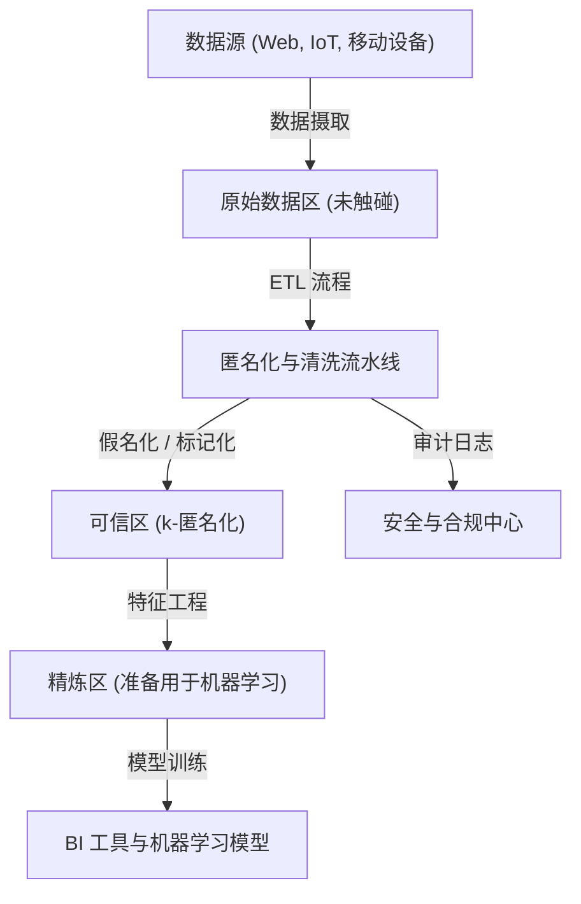
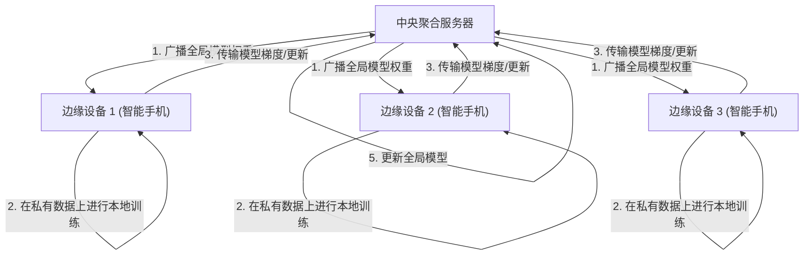

# 隐私与便利性的权衡：大数据时代个人信息的去向

在现代数字社会中，我们在日常生活中生成了海量的数据。智能手机的位置信息、社交网络的帖子、在线购物的购买记录、可穿戴设备记录的健康数据等各种“大数据”被源源不断地收集。这些数据对于AI（人工智能）的进化和提供个性化服务是不可或缺的，使我们的生活变得更加便利和丰富。

然而，另一方面，伴随个人信息收集和利用而来的隐私侵犯风险，作为严重的社会问题已浮出水面。数据泄露事件、未经用户同意向第三方提供数据，乃至对国家监控社会化的担忧，隐藏在便利性背后的风险已达到无法忽视的规模。本文将针对“隐私与便利性的权衡”这一现代困境，从技术和法律法规两方面探讨如何应对，并结合最新动向，进行极其详细的技术解析。

## 1. 数据驱动型社会的范式与数据架构的演进

为了高效地收集和利用数据，企业采用了各种数据架构。从过去主流的“数据仓库（Data Warehouse）”，逐渐过渡到统一管理包括非结构化数据在内所有数据的“数据湖（Data Lake）”，如今正在发生向分布式架构“数据网格（Data Mesh）”的范式转变。

### 集中式数据湖与匿名化流水线

数据湖是一种以原始格式大量保存原始数据的存储库。但是，将包含个人信息（PII: Personally Identifiable Information）的原始数据直接用于分析，将导致严重的合规违规行为。因此，在数据湖和分析环境之间，会部署严格的“匿名化流水线（Anonymization Pipeline）”。

下图展示了一般集中式数据湖中匿名化流水线的流程。



在这样的流水线中，数据流入时会自动应用哈希化、脱敏、加密等处理。然而，正如后文所述，仅靠简单的脱敏或假名化（Pseudonymization），无法完全消除通过与其他数据源核对而产生的“再识别（Re-identification）”风险。

## 2. 深入理解隐私保护技术（PETs）

在追求隐私和数据利用两者兼顾的过程中，关键在于“隐私增强技术（Privacy-Enhancing Technologies: PETs）”。这里将详细讲解在现代大数据分析和机器学习中发挥极其重要作用的主要PETs，包括其数学定义和技术实现。

### 2.1 k-匿名性 (K-Anonymity) 及其扩展

1998年由Latanya Sweeney和Pierangela Samarati提出的“k-匿名性”，是数据发布中隐私保护的基础概念。它意味着数据集中的任何一条记录，至少与 $k-1$ 条其他记录无法区分。

数据库中的属性大致可分为以下三类：
1. **标识符 (Explicit Identifiers)** ：姓名、身份证号等可直接识别个人的信息（这些通常会被删除或加密）。
2. **准标识符 (Quasi-Identifiers: QIs)** ：年龄、性别、邮政编码等单独无法识别个人，但组合起来可识别个人的信息。
3. **敏感属性 (Sensitive Attributes)** ：疾病名称、年收入等需要保护的信息。

k-匿名性保证了准标识符的组合（等价类：Equivalence Class）必然存在 $k$ 个以上。但是，k-匿名性对“同质性攻击（Homogeneity Attack）”和“背景知识攻击（Background Knowledge Attack）”具有脆弱性。例如，如果属于某个等价类的 $k$ 个人全部患有相同的疾病（敏感属性），即使保持了k-匿名性，疾病名称也会被确定。

为了克服这一问题，提出了以下扩展模型：

- **l-多样性 (l-diversity)** ：在每个等价类中，保证敏感属性至少具有 $l$ 种不同的值。
- **t-贴近性 (t-closeness)** ：使每个等价类中敏感属性的分布与整个数据集敏感属性分布之间的距离（如推土机距离 Earth Mover's Distance）小于等于阈值 $t$。

### 2.2 差分隐私 (Differential Privacy: DP)

克服了k-匿名性模型的局限性，并且作为目前最强大、数学上最严谨的隐私标准而被广泛采用的，是Cynthia Dwork等人在2006年提出的“差分隐私（Differential Privacy）”。Apple、Google、Microsoft等科技巨头在收集用户的遥测数据或统计数据时，都应用了这种 $\epsilon$-差分隐私。

#### 差分隐私的数学定义

随机化算法（Randomized Algorithm） $\mathcal{M}$ 满足 $\epsilon$-差分隐私，是指对于只有一条记录不同的任意两个相邻数据集 $D$ 和 $D'$（即 $\|D - D'\|_1 = 1$），以及输出的任意子集 $S \subseteq \text{Range}(\mathcal{M})$，以下不等式成立：

$$ \Pr[\mathcal{M}(D) \in S] \le e^\epsilon \Pr[\mathcal{M}(D') \in S] $$

其中，$\epsilon$（隐私预算）是控制隐私保护水平的非负参数。$\epsilon$ 越小，隐私保护越强，但数据的有用性（效用）会降低。

此外，还广泛使用允许以极小概率 $\delta$ 破坏隐私保证的放宽模型，即 $(\epsilon, \delta)$-差分隐私：

$$ \Pr[\mathcal{M}(D) \in S] \le e^\epsilon \Pr[\mathcal{M}(D') \in S] + \delta $$

#### 拉普拉斯机制 (Laplace Mechanism)

实现差分隐私的代表性方法是“拉普拉斯机制”，即在查询的真实输出结果中有意添加服从特定分布的噪声（随机数）。应该添加多少噪声，取决于函数 $f$ 的“全局敏感度（Global Sensitivity）” $\Delta f$。

全局敏感度 $\Delta f$ 定义为函数 $f$ 在任意相邻数据集 $D, D'$ 上输出的最大变化量：

$$ \Delta f = \max_{D, D'} \| f(D) - f(D') \|_1 $$

拉普拉斯机制对函数 $f(D)$ 的结果，添加从尺度参数为 $b = \frac{\Delta f}{\epsilon}$ 的拉普拉斯分布 $\text{Lap}(b)$ 中采样的噪声 $Y$：

$$ \mathcal{M}(D) = f(D) + Y, \quad Y \sim \text{Lap}\left(\frac{\Delta f}{\epsilon}\right) $$

拉普拉斯分布的概率密度函数如下：

$$ p(x \mid b) = \frac{1}{2b} \exp\left( - \frac{|x|}{b} \right) $$

通过注入这种噪声，从输出结果中无法推测出特定个人是否包含在数据集中。企业在保持整体数据统计趋势（平均值、方差、计数等）的有用性的同时，利用DP作为掩盖个人数据本身的技术。

### 2.3 联邦学习 (Federated Learning: FL)

传统的机器学习采用的是集中式方法，如前述数据湖那样将大量数据汇集到中央服务器来训练模型。然而，将医疗影像或智能手机的输入历史等机密数据发送到中央服务器，伴随着严重的隐私风险。

因此，Google在2016年提出了“联邦学习（Federated Learning）”。在联邦学习中，移动的不是数据本身，而是将“模型的计算处理”移动到数据所在的边缘设备端（智能手机或医院服务器等）。



#### Federated Averaging (FedAvg) 算法

联邦学习中代表性的聚合算法是FedAvg。每个客户端 $k$ 使用自己拥有的数据集 $D_k$（大小为 $n_k$），在本地通过随机梯度下降（SGD）进行多个epoch的训练，计算更新后的权重 $w_{t+1}^k$。

中央服务器接收来自参与的 $K$ 个客户端的权重，并根据数据大小对这些权重进行加权平均，从而更新全局模型的权重 $w_{t+1}$。假设总数据量为 $n = \sum_{k=1}^K n_k$，更新公式如下：

$$ w_{t+1} = \sum_{k=1}^K \frac{n_k}{n} w_{t+1}^k $$

借此，个人的原始数据（消息记录或照片等）无需离开设备半步，就能构建出智能的AI模型。典型的应用案例包括改进Google键盘（Gboard）的下一个词预测功能，以及Apple的FaceID和“Hey Siri”的语音识别模型。

### 2.4 同态加密 (Homomorphic Encryption: HE)

允许在保持数据加密状态下进行计算（如加法和乘法）的“魔法般的”加密技术就是同态加密。在普通的加密方法中，如果要对数据进行计算处理，必须先解密（还原为明文），但在云服务器上进行解密会成为安全漏洞。

使用同态加密，可以实现以下特性。假设加密函数为 $E(\cdot)$，明文 $m_1$ 和 $m_2$ 的加法和乘法，可以通过密文状态下的运算（$\oplus$ 和 $\otimes$）来实现：

$$ E(m_1 + m_2) = E(m_1) \oplus E(m_2) $$
$$ E(m_1 \times m_2) = E(m_1) \otimes E(m_2) $$

同态加密分为只能进行加法或乘法其中之一的“部分同态加密（Partially Homomorphic Encryption: PHE）”，以及可以进行无限次加法和乘法的“全同态加密（Fully Homomorphic Encryption: FHE）”。自2009年Craig Gentry构建了首个基于格密码（Lattice-based cryptography）的FHE方案以来，这成为了密码学上的一次重大突破。

目前，虽然仍面临计算成本和密文体积增大（开销）的挑战，但其在云端安全分析医疗数据、金融机构间的安全计算等领域的应用备受期待。

## 3. 法律法规与合规动向：GDPR vs CCPA

与技术进步并行，全球范围内法律框架的完善也在快速推进。企业在利用大数据时，遵守这些法律法规已成为先决条件。让我们比较一下影响力最大的两个监管框架。

### 欧盟通用数据保护条例 (GDPR)

2018年5月生效的欧盟GDPR（General Data Protection Regulation）被认为是个人数据保护的“全球标准（黄金标准）”。GDPR适用于处理欧盟境内个人数据的所有组织，一旦违规，将面临高达全球年营业额4%或2000万欧元的巨额罚款（取两者中较高者）。

**GDPR的主要特点:**
- **选择加入（Opt-in）原则**: 收集和处理数据必须获得用户明确且自由的事前同意。
- **被遗忘权 (Right to be Forgotten/Right to Erasure)**: 用户有权要求企业彻底删除其个人数据。甚至需要从数据湖的备份中删除数据，这在技术上是难度极高的要求。
- **数据控制者与数据处理者**: 严格界定了决定数据使用目的的控制者（Controller）和按照其指示处理数据的处理者（Processor）的责任。

### 加利福尼亚州消费者隐私法 (CCPA/CPRA)

在美国尚无联邦级别全面隐私法的情况下，加利福尼亚州于2020年施行的CCPA（California Consumer Privacy Act）实际上起到了全美标准的作用。此后，通过CPRA（California Privacy Rights Act）得到了进一步强化。

**CCPA的主要特点:**
- **选择退出（Opt-out）原则**: 与GDPR的“事前同意”不同，它允许在未经事前同意的情况下收集数据，但有义务向用户提供明确的“不要出售我的个人信息 (Do Not Sell My Personal Information)”的选择退出链接。
- **数据访问权**: 消费者可以要求企业披露收集的特定信息及其类别、信息来源以及是否出售给第三方。

这些法律法规强烈要求企业采取“隐私设计（Privacy by Design）”——即从系统和流程的设计阶段就将隐私保护融入其中。

## 4. 数据生态系统中的实现挑战

让我们来看看将隐私保护技术和法律法规应用于实际大数据环境时的实现观点。例如，假设在数据湖中使用Python和Pandas，或者PySpark来实现k-匿名化或差分隐私。

```python
# 应用了差分隐私的数据聚合概念实现 (Python)
import numpy as np
import pandas as pd

def laplace_mechanism(true_value, sensitivity, epsilon):
    """
    向真实值添加拉普拉斯噪声的函数
    """
    scale = sensitivity / epsilon
    noise = np.random.laplace(loc=0, scale=scale)
    return true_value + noise

def get_dp_average_salary(dataframe, epsilon=1.0):
    """
    保证差分隐私的平均工资计算
    """
    # 实际计算
    true_sum = dataframe['salary'].sum()
    true_count = len(dataframe)
    
    # 差分隐私的应用（基于敏感度的假设）
    # 假设以最大工资的波动作为敏感度（更严谨的话需要进行截断）
    max_salary_diff = 100000 
    
    # 添加噪声（也可以对总和和计数分别应用DP）
    noisy_sum = laplace_mechanism(true_sum, max_salary_diff, epsilon / 2)
    noisy_count = laplace_mechanism(true_count, 1, epsilon / 2)
    
    return noisy_sum / noisy_count

# 在数据流水线中执行
# dp_avg_salary = get_dp_average_salary(raw_df, epsilon=0.5)
```

正如这个代码片段所示，差分隐私的实现本身只是添加噪声这样简单的操作，但在实际运行中，“隐私预算（$\epsilon$）”的管理将变得极其困难。如果对同一个数据集发出多次查询，隐私预算就会被消耗（基于组合定理），最终需要建立锁定整个数据集或拒绝查询的机制（Privacy Budget Management）。

## 5. 面向未来的展望与伦理挑战

大数据与隐私的权衡并非零和游戏。通过差分隐私、联邦学习、同态加密等PETs的进化，“不共享数据而共享洞察”的全新数据利用范式正在成为现实。

此外，近年来与“数据网格（Data Mesh）”和“Web3（去中心化网络）”的概念相结合，将数据主权（Data Sovereignty）从大型平台手中交还给个人的运动也在加速。人们正在讨论一种未来，即个人的数据被保存在个人数据存储（PDS）或数据钱包中，由用户自己控制数据的使用许可和货币化。

然而，技术解决方案并非完美无缺。在联邦学习中，存在恶意客户端发送伪造的模型更新以污染全局模型的“投毒攻击（Poisoning Attack）”威胁。在差分隐私中，也有人指出少数群体（Minority）的数据会被噪声淹没，从而导致AI模型产生偏见的伦理挑战。

## 结论

大数据时代个人信息的去向，超越了单纯的技术课题，抛出了我们希望拥有怎样的一个社会这一根本性问题。在享受便利性的同时，如何捍卫个人的尊严与隐私。这只有通过法律法规的完善、隐私保护技术的不断创新、以及提供数据的我们每一个人拥有高度的素养，这三位一体的结合，才能达成可持续的解决方案。隐私与便利性将不再是权衡关系，而是通过最新技术演进为可以两者兼顾的“必要条件”。


