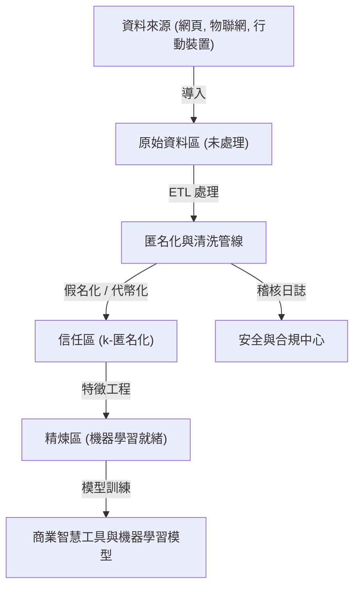
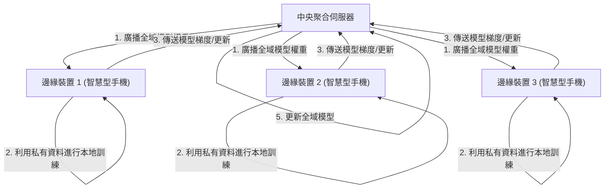

# 隱私與便利性的權衡：大數據時代下個人資訊的去向

在現代數位社會中，我們在日常生活中不斷產生龐大數量的資料。智慧型手機的位置資訊、社群媒體上的貼文、線上購物的消費紀錄、穿戴式裝置記錄的健康數據等，各式各樣的「大數據」正被源源不絕地收集。這些資料對於人工智慧（AI）的發展以及提供個人化服務不可或缺，使我們的生活變得更加便利且豐富。

然而，另一方面，伴隨收集和使用個人資訊而來的隱私侵犯風險，已成為一個嚴重的社會問題。資料外洩事件、未經使用者同意將資料提供給第三方、甚至對國家轉變為監控社會的擔憂等，潛藏在便利性背後的風險已達到無法忽視的規模。本文將針對「隱私與便利性的權衡」這個現代兩難，從技術和法規兩方面探討目前的應對方式，並結合最新動態進行極為詳細的技術解說。

## 1. 數據驅動社會的典範與資料架構的演進

為了更有效率地收集與活用資料，企業採用了各種資料架構。從過去主流的「資料倉儲（Data Warehouse）」轉向統一管理包含非結構化資料等所有數據的「資料湖（Data Lake）」，如今更正經歷向分散式架構「資料網格（Data Mesh）」的典範轉移。

### 集中式資料湖與匿名化管線

資料湖是一種將原始數據以其原始格式大量儲存的儲存庫。然而，將包含個人識別資訊（PII: Personally Identifiable Information）的原始數據直接用於分析，會導致嚴重的違規行為。因此，在資料湖與分析環境之間，會實作嚴格的「匿名化管線（Anonymization Pipeline）」。

下圖展示了一般集中式資料湖中的匿名化管線流程。



在這樣的管線中，資料流入時會自動應用雜湊化、遮蔽、加密等處理。但如後文所述，單純的遮蔽或假名化（Pseudonymization）並不能完全排除與其他資料來源比對而產生「重新識別化（Re-identification）」的風險。

## 2. 深入理解隱私保護技術 (PETs)

在致力於兼顧隱私與資料活用的過程中，關鍵在於「隱私強化技術（Privacy-Enhancing Technologies: PETs）」。在這裡，我們將詳細解說現代大數據分析與機器學習中扮演極重要角色的主要 PETs 之數學定義與技術實作。

### 2.1 k-匿名性 (K-Anonymity) 及其擴充

1998 年由 Latanya Sweeney 和 Pierangela Samarati 提出的「k-匿名性」，是資料公開中隱私保護的基礎概念。它指的是確保資料集中的任何一筆紀錄，都至少與其他 $k-1$ 筆紀錄無法區分。

資料庫中的屬性大致可分為以下三類：
1. **識別碼 (Explicit Identifiers)**：姓名或身分證字號等，可直接辨識個人的資訊（這些通常會被刪除或加密）。
2. **準識別碼 (Quasi-Identifiers: QIs)**：年齡、性別、郵遞區號等，單獨無法辨識個人，但組合起來就有可能辨識的資訊。
3. **機密屬性 (Sensitive Attributes)**：病名或年收入等，應受保護的資訊。

k-匿名性保證了準識別碼的組合（等價類：Equivalence Class）必定存在至少 $k$ 個以上。然而，k-匿名性對於「同質性攻擊（Homogeneity Attack）」和「背景知識攻擊（Background Knowledge Attack）」具有脆弱性。例如，如果某個等價類中的 $k$ 人皆患有相同的病名（機密屬性），即使維持了 k-匿名性，病名也會被特定出來。

為克服此問題，提出了以下的擴充模型：

- **l-多樣性 (l-diversity)**：確保各個等價類中，機密屬性至少擁有 $l$ 種不同的值。
- **t-貼近性 (t-closeness)**：確保各個等價類中機密屬性的分佈，與整體資料集機密屬性分佈之間的距離（如 Earth Mover's Distance）小於等於閾值 $t$。

### 2.2 差分隱私 (Differential Privacy: DP)

克服 k-匿名性模型的限制，目前被廣泛採用作為最強大且數學上最嚴謹的隱私標準，是 2006 年由 Cynthia Dwork 等人提出的「差分隱私（Differential Privacy）」。Apple、Google、Microsoft 等科技巨頭在收集使用者的遙測資料或統計資料時，都會應用這種 $\epsilon$-差分隱私。

#### 差分隱私的數學定義

一個隨機化演算法（Randomized Algorithm） $\mathcal{M}$ 若滿足 $\epsilon$-差分隱私，表示對於僅有一筆紀錄不同的任何兩個相鄰資料集 $D$ 和 $D'$（即 $\|D - D'\|_1 = 1$），以及輸出的任何子集 $S \subseteq \text{Range}(\mathcal{M})$，以下不等式皆成立：

$$ \Pr[\mathcal{M}(D) \in S] \le e^\epsilon \Pr[\mathcal{M}(D') \in S] $$

這裡的 $\epsilon$（隱私預算）是一個控制隱私保護等級的非負參數。$\epsilon$ 越小，隱私保護越強，但資料的有用性（效用）就會降低。

此外，允許以極小機率 $\delta$ 破壞隱私保證的放寬模型 $(\epsilon, \delta)$-差分隱私也被廣泛使用。

$$ \Pr[\mathcal{M}(D) \in S] \le e^\epsilon \Pr[\mathcal{M}(D') \in S] + \delta $$

#### 拉普拉斯機制 (Laplace Mechanism)

實現差分隱私的代表性手法，是故意在查詢的真實輸出結果上，加入服從特定分佈的雜訊（亂數），稱為「拉普拉斯機制」。應該加入多少雜訊，取決於函數 $f$ 的「全域敏感度（Global Sensitivity）」 $\Delta f$。

全域敏感度 $\Delta f$ 定義為對於任何相鄰資料集 $D, D'$，函數 $f$ 輸出的最大變化量：

$$ \Delta f = \max_{D, D'} \| f(D) - f(D') \|_1 $$

拉普拉斯機制會在函數 $f(D)$ 的結果上，加入從尺度參數 $b = \frac{\Delta f}{\epsilon}$ 的拉普拉斯分佈 $\text{Lap}(b)$ 中抽樣出的雜訊 $Y$。

$$ \mathcal{M}(D) = f(D) + Y, \quad Y \sim \text{Lap}\left(\frac{\Delta f}{\epsilon}\right) $$

拉普拉斯分佈的機率密度函數如下：

$$ p(x \mid b) = \frac{1}{2b} \exp\left( - \frac{|x|}{b} \right) $$

透過這種注入雜訊的方式，便無法從輸出結果推測出特定個人是否包含在資料集中。企業利用 DP 技術，在維持整體資料統計趨勢（平均、變異數、計數等）有用性的同時，遮蔽個人的原始資料。

### 2.3 聯邦學習 (Federated Learning: FL)

傳統的機器學習採用如同前述資料湖般的集中式方法，將大量資料匯集到中央伺服器以訓練模型。然而，將醫療影像或智慧型手機輸入紀錄等機密資料傳送至中央伺服器，伴隨著嚴重的隱私風險。

因此，Google 在 2016 年提出了「聯邦學習（Federated Learning）」。在聯邦學習中，並不是移動資料本身，而是將「模型的運算處理」轉移到資料所在的邊緣裝置端（如智慧型手機或醫院的伺服器等）。



#### Federated Averaging (FedAvg) 演算法

聯邦學習中的代表性聚合演算法是 FedAvg。各個客戶端 $k$ 使用自身擁有的資料集 $D_k$（大小為 $n_k$），在本地透過隨機梯度下降法（SGD）進行多個週期的訓練，計算出更新後的權重 $w_{t+1}^k$。

中央伺服器從參與的 $K$ 個客戶端接收權重，並根據資料大小對這些權重進行加權平均，藉此更新全域模型的權重 $w_{t+1}$。若總資料量為 $n = \sum_{k=1}^K n_k$，則更新公式如下：

$$ w_{t+1} = \sum_{k=1}^K \frac{n_k}{n} w_{t+1}^k $$

如此一來，個人的原始資料（如訊息紀錄或照片等）完全不需要離開裝置，就能建構出聰明的 AI 模型。代表性的應用範例包括 Google 鍵盤（Gboard）的下一個詞彙預測功能，以及 Apple 的 FaceID 和 Hey Siri 語音辨識模型的改良。

### 2.4 同態加密 (Homomorphic Encryption: HE)

「同態加密」是一種能夠在資料保持加密狀態下執行運算（加法或乘法等）的「魔法般」加密技術。在一般的加密方法中，若要對資料執行運算處理，必須先解密（還原為明文），但在雲端伺服器上進行解密將會造成安全性漏洞。

若使用同態加密，則可實現以下特性。假設加密函數為 $E(\cdot)$，明文 $m_1$ 和 $m_2$ 的加法或乘法，可以維持密文狀態下透過運算（$\oplus$ 或 $\otimes$）完成。

$$ E(m_1 + m_2) = E(m_1) \oplus E(m_2) $$
$$ E(m_1 \times m_2) = E(m_1) \otimes E(m_2) $$

同態加密可分為僅支援加法或乘法其中一種的「部分同態加密（Partially Homomorphic Encryption: PHE）」，以及可無限次進行加法和乘法的「完全同態加密（Fully Homomorphic Encryption: FHE）」。自 2009 年 Craig Gentry 使用晶格密碼學（Lattice-based cryptography）建構出第一個 FHE 方案以來，已成為密碼學領域的重大突破。

目前，雖然仍面臨運算成本與密文大小增加（開銷）等挑戰，但有望應用於醫療資料在雲端上的安全分析，以及金融機構之間的多方安全計算等領域。

## 3. 法規與合規趨勢：GDPR vs CCPA

與技術演進並行，全球的法律框架也正迅速建立。當企業運用大數據時，遵守這些法規已成為必要條件。讓我們來比較最具影響力的兩個法規框架。

### 歐盟一般資料保護規則 (GDPR)

2018 年 5 月生效的歐盟 GDPR（General Data Protection Regulation），被視為個人資料保護的「世界標準（黃金標準）」。GDPR 適用於所有處理歐盟境內個人資料的組織，一旦違規，將面臨高達全球年營業額 4% 或 2000 萬歐元（取其高者）的鉅額罰款。

**GDPR 的主要特徵:**
- **選擇同意 (Opt-in) 原則**: 收集和處理資料時，必須事先獲得使用者明確且自由的同意。
- **被遺忘權 (Right to be Forgotten/Right to Erasure)**: 使用者有權要求企業徹底刪除其個人資料。甚至必須從資料湖的備份中刪除資料，這是技術上難度極高的要求。
- **資料控制者與資料處理者 (Data Controller and Data Processor)**: 嚴格定義了決定資料使用目的者（控制者）與依其指示處理資料者（處理者）的責任。

### 加州消費者隱私法 (CCPA/CPRA)

在美國缺乏聯邦層級全面性隱私法的情況下，加州於 2020 年生效的 CCPA（California Consumer Privacy Act）實質上發揮了全美標準的作用。隨後更透過 CPRA（California Privacy Rights Act）進一步強化。

**CCPA 的主要特徵:**
- **選擇退出 (Opt-out) 原則**: 與 GDPR 的「事前同意」不同，可以在沒有事前同意的情況下收集資料，但企業有義務提供給使用者一個明確的選擇退出連結：「請勿販售我的個人資訊 (Do Not Sell My Personal Information)」。
- **資料存取權**: 消費者可以要求企業揭露其收集的特定資訊或類別、資訊來源，以及是否出售給第三方。

這些法規強烈要求企業實施「隱私設計（Privacy by Design）」— 即從系統與流程的設計階段就納入隱私保護。

## 4. 資料生態系統中的實作挑戰

讓我們來看看將隱私保護技術與法規應用於實際大數據環境時的實作觀點。例如，假設在資料湖中使用 Python 和 Pandas，或是 PySpark 來實作 k-匿名化或差分隱私。

```python
# 應用差分隱私的資料彙整概念實作 (Python)
import numpy as np
import pandas as pd

def laplace_mechanism(true_value, sensitivity, epsilon):
    """
    對真實數值加入拉普拉斯雜訊的函數
    """
    scale = sensitivity / epsilon
    noise = np.random.laplace(loc=0, scale=scale)
    return true_value + noise

def get_dp_average_salary(dataframe, epsilon=1.0):
    """
    保證差分隱私的平均薪資計算
    """
    # 實際計算
    true_sum = dataframe['salary'].sum()
    true_count = len(dataframe)
    
    # 應用差分隱私（基於敏感度的假設）
    # 假設以最高薪資的變動作為敏感度（更嚴格來說需要裁切）
    max_salary_diff = 100000 
    
    # 加入雜訊（也可以對總和值和計數分別應用 DP）
    noisy_sum = laplace_mechanism(true_sum, max_salary_diff, epsilon / 2)
    noisy_count = laplace_mechanism(true_count, 1, epsilon / 2)
    
    return noisy_sum / noisy_count

# 在資料管線中執行
# dp_avg_salary = get_dp_average_salary(raw_df, epsilon=0.5)
```

如這段程式碼片段所示，差分隱私的實作本身雖然只是簡單地加入雜訊，但在實際營運中，「隱私預算（$\epsilon$）」的管理卻極為困難。如果對同一個資料集發出多次查詢，隱私預算就會被消耗（基於合成定理），最終必須建立一套鎖定整體資料集或拒絕查詢的機制（Privacy Budget Management）。

## 5. 邁向未來的展望與倫理挑戰

大數據與隱私之間的權衡並非零和遊戲。隨著差分隱私、聯邦學習和同態加密等 PETs 的發展，「不分享資料，而是分享洞察」的新型資料活用典範正逐漸成為現實。

此外，近年來結合「資料網格（Data Mesh）」和「Web3（去中心化網路）」的概念，將資料主權（Data Sovereignty）從大型平台巨頭手中奪回並交還給個人的運動也正在加速。將個人資料儲存於個人資料儲存庫（PDS）或資料錢包中，由使用者自行控制資料的授權和變現，這種未來的願景正在被廣泛討論。

然而，技術解決方案並非完美無缺。在聯邦學習中，存在著惡意客戶端傳送偽造模型更新以污染全域模型的「下毒攻擊（Poisoning Attack）」威脅。在差分隱私中，少數派的資料可能被雜訊所掩蓋，導致 AI 模型產生偏見，這也是被指出的倫理挑戰。

## 結論

在大數據時代，個人資訊的去向已超越了單純的技術問題，而是向我們拋出了一個根本性的疑問：我們究竟渴望一個什麼樣的社會？在享受便利性的同時，該如何堅守個人的尊嚴與隱私。唯有透過完善法規、隱私保護技術的持續創新，以及提升每一位提供資料的使用者素養，這三者的三位一體，我們才能達成永續的解決方案。隱私與便利性將不再是權衡關係，而是透過最新科技演變為可兼顧的「必要條件」。

