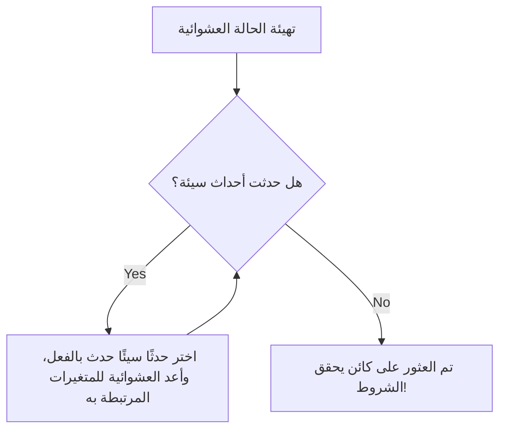

# مقدمة: "العشوائية" كَسِحر لإثبات الوجود

في الرياضيات، هناك طريقتان رئيسيتان لإثبات "وجود كائن يحقق شرطًا معينًا". الطريقة الأولى هي "الإثبات البنائي" (Constructive Proof)، حيث يتم بناء الكائن بشكل ملموس وعرضه. أما الطريقة الثانية فهي "الإثبات غير البنائي" (Non-constructive Proof)، حيث يتم إثبات وجود الكائن منطقيًا وحتميًا دون توضيح ماهيته بشكل صريح ومحدد.

أحدث عالم الرياضيات العبقري المتجول الذي يمثل القرن العشرين، بول إيردوش (Paul Erdős, 1913-1996)، ثورة في هذا الإثبات غير البنائي. وهذا ما يُعرف بالطريقة المذهلة المسماة "الطريقة الاحتمالية" (The Probabilistic Method). الفكرة الأساسية لهذه الطريقة التي أسسها إيردوش يمكن التعبير عنها باختصار على النحو التالي:

**"لإثبات وجود كائن يحقق شرطًا ما، ما عليك سوى اختيار كائن بشكل عشوائي وإثبات أن احتمال تحقيقه للشرط أكبر من 0."**

هذه الفكرة التي تبدو بديهية للوهلة الأولى تُظهر قوة هائلة في مجالات متنوعة مثل الرياضيات المتقطعة (Discrete Mathematics)، نظرية المخططات (Graph Theory)، علوم الحاسوب، ونظرية المعلومات. في هذا المقال، سنشرح بالتفصيل ونتعمق في أسس الطريقة الاحتمالية، وتطبيقاتها الشهيرة في [نظرية رامزي](/ar/p/ramsey-theory/) (Ramsey Theory)، بالإضافة إلى توطئة لوفاش المحلية (Lovász Local Lemma)، وتطورها إلى نظرية المخططات العشوائية، وأخيرًا المحاكاة باستخدام بايثون (Python).

---

## بول إيردوش: العبقري المتجول الذي كرس حياته للرياضيات

قبل الخوض في موضوع الطريقة الاحتمالية، لا بد من الإشارة إلى مؤسسها بول إيردوش. وُلد إيردوش في بودابست بالمجر، وعاش حياته كلها بلا منزل أو ممتلكات، حيث تنقل بين منازل علماء الرياضيات في جميع أنحاء العالم لمواصلة أبحاثه المشتركة. بلغ عدد الأوراق البحثية التي نشرها حوالي 1500 ورقة، ويُعرف بأنه ثاني أكثر علماء الرياضيات غزارة في الإنتاج عبر التاريخ بعد ليونهارت أويلر.

كان إيردوش يعتقد أن الرياضيات هي اكتشاف للكائنات الرياضية من "الكتاب الذي يحتوي على البراهين المطلقة (The Book)" والذي يملكه الإله. بالنسبة له، الإثبات الجميل، الموجز، والذي يلامس الجوهر هو "إثبات موجود في The Book". الطريقة الاحتمالية تمتلك أناقة ساحرة تجعلها جديرة حقًا بأن تكون في هذا الكتاب.

---

## المبدأ الأساسي للطريقة الاحتمالية

المنطق الجوهري للطريقة الاحتمالية بسيط للغاية.
لنفترض أن لدينا مجموعة منتهية $S$ ومجموعة جزئية منها $A$ (مجموعة الكائنات "الجيدة" التي نبحث عنها). ونريد إثبات أن $A$ ليست فارغة (أي أن هناك كائنًا "جيدًا" واحدًا على الأقل).

نُدخل فضاء احتماليًا، ونختار عنصرًا من $S$ عشوائيًا وفقًا لتوزيع احتمالي معين. ليكن العنصر المختار هو $X$. في هذه الحالة، إذا تمكنا من إثبات أن احتمال أن يكون $X \in A$، أي $P(X \in A)$، أكبر تمامًا من $0$، بمعنى:
$$ P(X \in A) > 0 $$
فيمكننا منطقيًا الاستنتاج أن $A$ ليست فارغة، أي "يوجد كائن جيد".

السبب هو أنه إذا لم يكن هناك أي "كائن جيد" على الإطلاق، فإن احتمال أن يكون العنصر المختار عشوائيًا "كائنًا جيدًا" يجب أن يكون $0$ تمامًا. كون الاحتمال موجبًا يعني أنه يمكن أن يحدث كاحتمال، وهذا لا يعني سوى أنه "موجود".

---

## الحد الأدنى لعدد رامزي $R(k, k)$: قمة الطريقة الاحتمالية

### ما هي نظرية رامزي؟

فلسفة [نظرية رامزي](/ar/p/ramsey-theory/) هي أنه "لا توجد فوضى تامة". إنها نظرية تنص على أنه مهما كان الهيكل معقدًا ويبدو عشوائيًا، فإنه إذا كان الحجم كبيرًا بما فيه الكفاية، يجب أن يحتوي بالضرورة على نوع من الهياكل الجزئية المنتظمة.

تنص "مبرهنة الحفلة (مبرهنة الأصدقاء والغرباء)" الشهيرة على أن $R(3, 3) = 6$. بعبارة أخرى، إذا اجتمع 6 أشخاص، فإنه يجب أن يوجد بالضرورة مجموعة من 3 أشخاص يعرفون بعضهم البعض (مثلث أحمر)، أو مجموعة من 3 أشخاص غرباء تمامًا عن بعضهم البعض (مثلث أزرق).

بشكل عام، يُعرّف عدد رامزي $R(k, l)$ على أنه أصغر عدد صحيح $N$ بحيث أنه مهما قمنا بتلوين حواف المخطط الكامل (Complete Graph) $K_N$ ذي $N$ من الرؤوس باللونين الأحمر والأزرق، فإنه يجب أن يحتوي بالضرورة على مخطط كامل أحمر $K_k$ أو مخطط كامل أزرق $K_l$.

### إثبات إيردوش (1947)

قدم إيردوش الحد الأدنى المذهل التالي لعدد رامزي القطري $R(k, k)$.

**مبرهنة (إيردوش، 1947):**
عندما يكون $k \ge 3$، فإن:
$$ R(k, k) > \lfloor 2^{k/2} \rfloor $$
تتحقق.

**شرح الإثبات:**
محاولة إثبات هذه المبرهنة بطريقة "بنائية" هي أمر في غاية الصعوبة. بمعنى أنه سيتعين علينا تلوين حواف مخطط يحتوي على $N = \lfloor 2^{k/2} \rfloor$ من الرؤوس باللونين الأحمر والأزرق وفقًا لقاعدة محددة، وتقديم طريقة تلوين ملموسة بحيث "لا يحتوي المخطط على مخطط كامل أحادي اللون بحجم $k$". هذا يؤدي إلى انفجار توافقي هائل عندما يصبح $k$ كبيرًا.

هنا تظهر الطريقة الاحتمالية لإيردوش.

1. **تكوين الفضاء الاحتمالي:**
   نعتبر مخططًا كاملًا $K_N$ يحتوي على $N$ من الرؤوس. نقوم بتلوين جميع حوافه (وعددها الإجمالي $\binom{N}{2}$) بشكل مستقل باحتمال $1/2$ باللون الأحمر، وباحتمال $1/2$ باللون الأزرق (تلوين عشوائي عن طريق رمي عملة معدنية).

2. **تعريف الأحداث:**
   لتكن $V$ هي مجموعة رؤوس $K_N$. لنرمز للمجموعات الجزئية من $V$ التي تحتوي على $k$ عنصرًا بالرمز $S_i$. يوجد إجمالي $\binom{N}{k}$ من هذه المجموعات الجزئية.
   لكل $S_i$، نُعرّف الحدث $A_i$ على أنه "المخطط الكامل الجزئي المكون من رؤوس تنتمي إلى $S_i$ يصبح أحادي اللون (كلها حمراء أو كلها زرقاء)".

3. **حساب الاحتمال:**
   نركز على مجموعة محددة $S_i$. نظرًا لأن $S_i$ تحتوي على $k$ من الرؤوس، فإن بداخلها $\binom{k}{2}$ من الحواف. احتمال أن تكون جميعها من نفس اللون هو:
   $$ P(A_i) = 2 \times \left( \frac{1}{2} \right)^{\binom{k}{2}} = 2^{1 - \binom{k}{2}} $$
   (وهو مجموع احتمال أن تكون كلها حمراء واحتمال أن تكون كلها زرقاء).

4. **تطبيق حد الاتحاد (Union Bound - متباينة بول):**
   الحدث القائل بوجود "مخطط $K_k$ أحادي اللون *واحد على الأقل*" يمكن التعبير عنه بـ $\bigcup A_i$. يمكن تقييم هذا الاحتمال من الأعلى باستخدام حد الاتحاد:
   $$ P\left( \bigcup A_i \right) \le \sum_{i} P(A_i) = \binom{N}{k} 2^{1 - \binom{k}{2}} $$

5. **إثبات "الوجود":**
   إذا كان هذا الاحتمال أصغر تمامًا من $1$، فإن احتمال الحدث المكمل له وهو "لا توجد *أي* مجموعة $S_i$ أحادية اللون" يكون أكبر من $0$.
   $$ P\left( \bigcap \overline{A_i} \right) = 1 - P\left( \bigcup A_i \right) > 0 $$
   لإثبات ذلك، يكفي أن يتحقق:
   $$ \binom{N}{k} 2^{1 - \binom{k}{2}} < 1 $$
   
   باستخدام المتباينة $\binom{N}{k} < \frac{N^k}{k!}$ ومتابعة الحسابات، نجد أن المتباينة أعلاه تتحقق إذا كان $N \le 2^{k/2}$.
   وبالتالي، عندما يكون $N = \lfloor 2^{k/2} \rfloor$، فإن طريقة التلوين التي لا تتضمن $K_k$ أحادي اللون "موجودة احتماليًا". لذلك، يجب أن يكون $R(k, k)$ أكبر تمامًا من هذا العدد. نهاية الإثبات.

هذا الإثبات يثبت ببراعة وجود الكائن دون تكوينه على الإطلاق. وهذا هو بالضبط سحر إيردوش.

---

## خطية التوقع (Linearity of Expectation) وقوتها

سلاح قوي آخر في الطريقة الاحتمالية هو "خطية التوقع". وهي الخاصية التي تنص على أنه، سواء كانت المتغيرات العشوائية $X, Y$ مستقلة أو تابعة، فإن المعادلة التالية تتحقق دائمًا:
$$ E[X + Y] = E[X] + E[Y] $$

### مسارات هاملتونيان في مخططات البطولات (Tournament Graphs)
مخطط البطولة (Tournament) هو مخطط موجه يتم فيه إعطاء اتجاه لكل حافة من حواف المخطط الكامل (يمثل نتائج دورة روبن - Round-robin tournament).
المبرهنة: لكل $n$، يوجد مخطط بطولة ذو $n$ من الرؤوس يحتوي على $n! 2^{-(n-1)}$ أو أكثر من مسارات هاملتونيان (مسار موجه يمر عبر جميع الرؤوس مرة واحدة بالضبط).

لإثبات ذلك، نعتبر بطولة عشوائية يتم فيها تعيين اتجاهات الحواف بشكل عشوائي على مجموعة الرؤوس. احتمال أن يكون تبديل معين للرؤوس [مسار](/ar/p/windows-%E3%81%A7%D9%85%D8%B3%D8%A7%D8%B1%E3%81%AE%E9%80%9A%E3%81%A3%E3%81%9F%D9%85%D9%84%D9%81-%D8%AA%D9%86%D9%81%D9%8A%D8%B0%D9%8A%E3%81%AE%E5%A0%B4%E6%89%80%E3%82%92%E8%A6%8B%E3%81%A4%E3%81%91%E3%82%8B%E6%96%B9%E6%B3%95/) هاملتونيان هو $2^{-(n-1)}$. نظرًا لأن هناك $n!$ من التباديل الإجمالية، فإن القيمة المتوقعة لعدد مسارات هاملتونيان هي $n! 2^{-(n-1)}$.
إذا كان لمتغير عشوائي قيمة متوقعة $E$، فإنه يوجد بالضرورة حدث يأخذ فيه هذا المتغير العشوائي قيمة أكبر من أو تساوي $E$. لذلك، يُستنتج على الفور "وجود" بطولة تحقق الشروط. هنا أيضًا، تتألق خطية التوقع التي تسمح بالجمع دون القلق بشأن "التبعية" على الإطلاق.

---

## طريقة التعديل (The Alteration Method)

في الطريقة الاحتمالية الأساسية، نحسب "احتمال أن يحقق ما تم إنشاؤه عشوائيًا الشروط كما هو". ولكن في بعض الأحيان، يكون من الفعال استخدام نهج حيث نقوم بإنشاء شيء "قريب من المطلوب"، ثم إجراء تعديل طفيف عليه (Alteration) لإنتاج شيء يحقق الشروط.

تُستخدم طريقة التعديل هذه عند إيجاد الحد الأدنى للمجموعات المستقلة (Independent Sets - مجموعة من الرؤوس حيث لا يرتبط أي رأسين فيها بحافة). من خلال اختيار الرؤوس عشوائيًا، ثم التخلص من أحد الرأسين إذا كان هناك زوج مرتبط بحافة ضمن مجموعة الرؤوس المختارة، يمكننا الحصول على مجموعة مستقلة بشكل مؤكد.

---

## توطئة لوفاش المحلية (Lovász Local Lemma)

أحد أكبر الاختراقات في تطور الطريقة الاحتمالية هو "توطئة لوفاش المحلية (LLL)"، والتي أثبتها بول إيردوش ولازلو لوفاش (László Lovász) في عام 1975.

حد الاتحاد قوي، ولكن له نقطة ضعف تتمثل في أنه إذا كان عدد الأحداث كبيرًا، فإن الحد الأعلى للاحتمال سيتجاوز 1 ويصبح غير مفيد. ومع ذلك، إذا كانت الأحداث السيئة "مستقلة تقريبًا"، فيجب أن يكون احتمال تجنب جميع الأحداث السيئة في نفس الوقت موجبًا. ما قام بصياغة هذه الفكرة هو LLL.

**ادعاء شكل LLL المتماثل (Symmetric LLL):**
لتكن $A_1, A_2, \dots, A_n$ مجموعة من الأحداث. نفترض أن احتمال كل حدث هو $P(A_i) \le p$، وأن كل حدث يعتمد على ما يصل إلى $d$ من الأحداث الأخرى فقط (أي أنه مستقل عن بقية الأحداث).
إذا كان:
$$ e \cdot p \cdot (d + 1) \le 1 $$
(حيث $e$ هو العدد النيبيري أو ثابت أويلر) يتحقق، فإن:
$$ P\left( \bigcap_{i=1}^n \overline{A_i} \right) > 0 $$
أي أن إمكانية تجنب جميع الأحداث السيئة في نفس الوقت موجودة بالضرورة.

هذه التوطئة تُظهر تأثيرًا هائلاً في مشاكل تلوين المخططات، مشكلة قابلية الإرضاء (SAT)، ومشاكل التعبئة (Packing Problems). والمدهش أنه في عام 2009، أثبتوزر وطاردوش (Moser and Tardos) أن LLL لا يقتصر على كونه إثباتًا للوجود فحسب، بل يمكنه خوارزميًا (وبكفاءة) العثور على تلك الحلول (خوارزمية Moser-Tardos)، مما أحدث صدمة كبيرة في علوم الحاسوب.


*الشكل: مخطط مفاهيمي لخوارزمية Moser-Tardos. إذا تم استيفاء شروط LLL، فقد تم إثبات أن هذه الخوارزمية تتوقف في وقت متعدد الحدود.*

---

## نظرية المخططات العشوائية: نموذج إيردوش-رينيي

تطبيق الطريقة الاحتمالية على دراسة المخططات نفسها هو ما يُعرف بـ "نظرية المخططات العشوائية". قدم إيردوش وألفريد رينيي (Alfréd Rényi) نموذج المخطط العشوائي $G(n, p)$ في عام 1959. وهو مخطط يحتوي على $n$ من الرؤوس، وتوجد حافة بين كل زوجين بشكل مستقل باحتمال $p$.

لقد اكتشفوا أنه عند تغيير الاحتمال $p$ كدالة لعدد الرؤوس $n$، وهي $p(n)$، توجد عتبة (Threshold) تتغير عندها خصائص المخطط فجأة كما لو كانت "انتقال طوري (Phase Transition)".

- عندما $p(n) \ll 1/n$، يصبح المخطط عبارة عن مجموعة من الأشجار (Trees) الصغيرة.
- عندما $p(n) = c/n$ ($c > 1$)، يظهر "مكون متصل عملاق" (Giant Component) فجأة.
- عندما $p(n) = \frac{\ln n}{n}$، يصبح المخطط بأكمله مكونًا متصلًا واحدًا.

يتمتع هذا ببنية رياضية متطابقة تمامًا مع ظواهر الانتقال الطوري في الفيزياء مثل تجمد الماء أو غليانه.

### محاكاة الانتقال الطوري للمخططات العشوائية باستخدام Python

لفهم الخصائص الاحتمالية، من الفعال كتابة كود فعلي وإجراء محاكاة. فيما يلي مثال على كود يحاكي ظهور المكون المتصل العملاق باستخدام Python ومكتبة `networkx`.

```python
import networkx as nx
import matplotlib.pyplot as plt
import numpy as np

def simulate_giant_component(n, p_values):
    """
    في المخطط العشوائي G(n, p) ذي n من الرؤوس،
    تحاكي هذه الدالة كيف يتغير حجم أكبر مكون متصل بناءً على الاحتمال p.
    """
    max_component_sizes = []
    
    for p in p_values:
        # إنشاء مخطط إيردوش-رينيي العشوائي
        G = nx.erdos_renyi_graph(n, p)
        # الحصول على المكونات المتصلة مرتبة حسب الحجم تنازليًا
        components = sorted(nx.connected_components(G), key=len, reverse=True)
        if components:
            # تسجيل حجم أكبر مكون متصل (عدد الرؤوس) كنسبة من الإجمالي
            max_size = len(components[0]) / n
        else:
            max_size = 0
        max_component_sizes.append(max_size)
        
    return max_component_sizes

# عدد الرؤوس n = 1000
n = 1000
# تغيير الاحتمال p من 0.000 إلى 0.005 (العتبة هي 1/1000 = 0.001)
p_values = np.linspace(0, 0.005, 50)
sizes = simulate_giant_component(n, p_values)

# رسم النتائج
plt.figure(figsize=(10, 6))
plt.plot(p_values * n, sizes, marker='o', linestyle='-', color='b')
plt.axvline(x=1.0, color='r', linestyle='--', label='عتبة الانتقال الطوري (p = 1/n)')
plt.title("الانتقال الطوري للمكون المتصل العملاق في مخطط إيردوش-رينيي", fontsize=14)
plt.xlabel("متوسط الدرجة (p * n)", fontsize=12)
plt.ylabel("نسبة أكبر مكون متصل", fontsize=12)
plt.legend()
plt.grid(True)
plt.show()
```

عند تشغيل هذا الكود، يمكنك أن ترى بصريًا على الرسم البياني كيف أنه بمجرد تجاوز $p \cdot n = 1$، يرتفع حجم أكبر مكون متصل فجأة من حالة قريبة من الصفر ليحتل معظم المخطط بأكمله.

---

## تطبيقات الطريقة الاحتمالية في العصر الحديث

لقد أزهرت البذور التي زرعها إيردوش كأدوات لا غنى عنها في علوم الحاسوب الحديثة.

1. **الخوارزميات العشوائية (Randomized Algorithms):**
   من اختيار المحور في خوارزمية الترتيب السريع (Quicksort)، إلى خوارزميات اختبار الأولية (مثل اختبار ميلر-رابين)، وحتى دوال التجزئة (Hash Functions) لمجموعات البيانات الضخمة، تستخدم الخوارزميات الحديثة العشوائية لتحسين سرعة الحساب ودقة التقريب بشكل كبير.

2. **رموز تصحيح الأخطاء (Error Correcting Codes):**
   في نظرية المعلومات لشانون، تم إثبات "وجود" رموز ممتازة تصل إلى حدود سعة قناة الاتصال باستخدام الطريقة الاحتمالية. حيث تبين أن الرموز المولدة عشوائياً تمتلك، باحتمال عالٍ، قدرات ممتازة على تصحيح الأخطاء.

3. **التعلم الآلي والذكاء الاصطناعي (Machine Learning & AI):**
   تعتمد الكثير من تقنيات الذكاء الاصطناعي الحديثة، مثل تهيئة الشبكات العصبية، والتنظيم (Regularization) باستخدام تقنية الإسقاط (Dropout)، وطريقة الانحدار العشوائي (SGD)، بشكل عميق على الخصائص الاحتمالية. ويتم تحليل خصائص المتجهات العشوائية في الفضاءات عالية الأبعاد (لعنة الأبعاد وبركاتها) باستخدام الطريقة الاحتمالية.

---

## الخاتمة: ما هو الوجود؟

لقد غيرت الطريقة الاحتمالية لبول إيردوش فهمنا لمفهوم "الوجود"، وهو مفهوم جذري في الرياضيات، بشكل كبير.
حتى دون إعطاء شكل محدد، من خلال إيجاد النظام وسط الفوضى العشوائية، والقول بأن "احتمال وجوده ليس صفرًا"، يتم إثبات الوجود بشكل مؤكد. إنها تحمل سحراً رومانسياً يشبه التحدث عن وجود كوكب كالأرض في مكان ما في هذا الكون الشاسع باستخدام معادلات الاحتمال.

إذا كان هناك "The Book" في الرياضيات، فإن فصل الطريقة الاحتمالية سيكون بلا شك مكتوبًا بأحرف من ذهب بالقرب من بدايته. العشوائية ليست مجرد فوضى، بل هي ضوء ينير حقائق عميقة.
