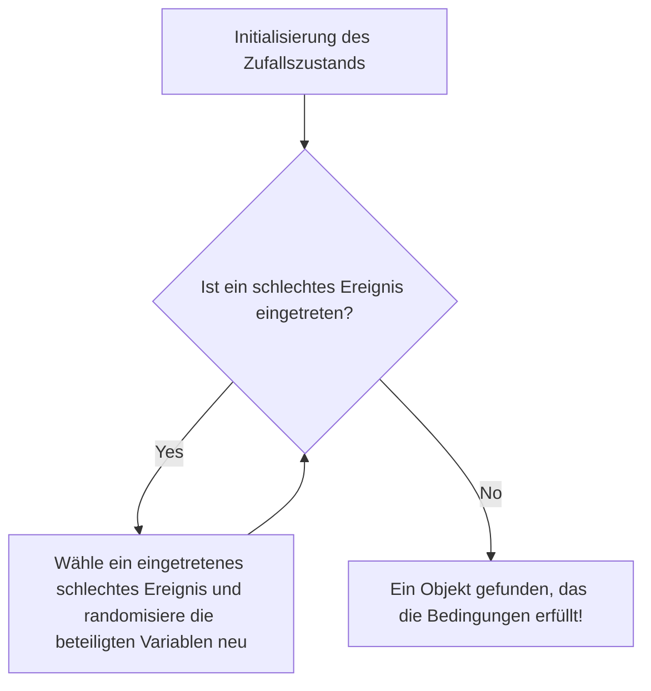

# Einführung: Die Magie des "Zufalls" zum Beweis von Existenz

In der Mathematik gibt es im Großen und Ganzen zwei Ansätze, um zu beweisen, dass "ein Objekt existiert, das eine bestimmte Bedingung erfüllt". Der erste ist ein "konstruktiver Beweis", bei dem das Objekt konkret konstruiert und gezeigt wird. Der zweite ist ein "nicht-konstruktiver Beweis", der nicht ausdrücklich angibt, was das Objekt konkret ist, aber logisch zeigt, dass es notwendigerweise existieren muss.

Paul Erdős (1913-1996), das wandernde Mathematik-Genie, das das 20. Jahrhundert repräsentiert, revolutionierte diese nicht-konstruktiven Beweise. Das ist die erstaunliche Technik, die als "Die Probabilistische Methode" (The Probabilistic Method) bekannt ist. Die grundlegende Idee dieser von Erdős etablierten Methode lässt sich kurz wie folgt ausdrücken:

**"Um zu zeigen, dass ein Objekt existiert, das eine Bedingung erfüllt, reicht es aus, ein Objekt zufällig auszuwählen und zu zeigen, dass die Wahrscheinlichkeit, dass es die Bedingung erfüllt, größer als 0 ist."**

Diese auf den ersten Blick offensichtliche Idee entfaltet in einer Vielzahl von Bereichen wie der diskreten Mathematik, der [Graphentheorie](/de/p/graph-theory-dijkstra-a-star/), der Informatik und der Informationstheorie eine gewaltige Kraft. In diesem Artikel werden wir tief und detailliert eintauchen: von den Grundlagen dieser probabilistischen Methode über berühmte Anwendungen in der [Ramsey-Theorie](/de/p/ramsey-theory/), das Lovász-Local-Lemma (Lovász Local Lemma), Erweiterungen zur Theorie von Zufallsgraphen bis hin zu Simulationen mit Python.

---

## Paul Erdős: Das wandernde Genie, das sein Leben der Mathematik widmete

Bevor wir auf das Thema der probabilistischen Methode eingehen, müssen wir ihren Begründer, Paul Erdős, erwähnen. Erdős wurde in Budapest, Ungarn, geboren. Er besaß zeitlebens weder ein Haus noch Eigentum, sondern reiste von einem Mathematikerhaus zum anderen auf der ganzen Welt, um gemeinsame Forschungen durchzuführen. Die Anzahl der von ihm veröffentlichten Arbeiten beläuft sich auf etwa 1500, womit er nach [Leonhard Euler](/de/p/euler/) als der zweitproduktivste Mathematiker der Geschichte bekannt ist.

Erdős glaubte, dass es bei mathematischen Entdeckungen darum geht, mathematische Objekte aus "Dem Buch" (The Book), in dem Gott die ultimativen Beweise aufgeschrieben hat, zu finden. Für ihn war ein schöner, prägnanter Beweis, der den Kern der Sache trifft, ein "Beweis aus dem Buch". Die probabilistische Methode besitzt eine solch magische Eleganz, dass sie es wahrlich verdient, in "Dem Buch" zu stehen.

---

## Grundprinzip der Probabilistischen Methode

Die Kernlogik der probabilistischen Methode ist extrem einfach.
Angenommen, wir haben eine endliche Menge $S$ und eine Teilmenge $A$ davon (die Menge der "guten" Objekte, die wir suchen). Wir wollen zeigen, dass $A$ nicht leer ist (das heißt, es existiert mindestens ein "gutes" Objekt).

Wir führen einen Wahrscheinlichkeitsraum ein und wählen zufällig ein Element aus $S$ gemäß einer bestimmten Wahrscheinlichkeitsverteilung. Das ausgewählte Element sei $X$. Wenn wir beweisen können, dass die Wahrscheinlichkeit, dass $X \in A$ gilt, also $P(X \in A)$, strikt größer als $0$ ist, d.h.
$$ P(X \in A) > 0 $$
dann können wir logisch schlussfolgern, dass $A$ nicht leer ist, was bedeutet: "Ein gutes Objekt existiert."

Der Grund dafür ist: Wenn kein einziges "gutes Objekt" existieren würde, müsste die Wahrscheinlichkeit, dass ein zufällig ausgewähltes Element ein "gutes Objekt" ist, exakt $0$ betragen. Eine positive Wahrscheinlichkeit bedeutet, dass es als Möglichkeit eintreten kann, was wiederum nichts anderes heißt, als dass es "existiert".

---

## Die untere Schranke der Ramsey-Zahl $R(k, k)$: Ein Meilenstein der Probabilistischen Methode

Die Arbeit von Erdős aus dem Jahr 1947, die die Macht der probabilistischen Methode der Welt bekannt machte, befasste sich mit der unteren Schranke der Ramsey-Zahl $R(k, k)$ in der [Ramsey-Theorie](/de/p/ramsey-theory/).

### Was ist die Ramsey-Theorie?

Die Philosophie der [Ramsey-Theorie](/de/p/ramsey-theory/) lautet: "Es gibt keine vollkommene Unordnung." Es ist eine Theorie, die besagt, dass in jeder noch so komplex oder zufällig erscheinenden Struktur immer eine gewisse Art von regulärer Teilstruktur existieren muss, wenn das Objekt nur groß genug ist.

Das berühmte "Party-Theorem (Freund-Fremder-Theorem)" zeigt, dass $R(3, 3) = 6$. Das heißt, wenn sich 6 Personen versammeln, gibt es immer eine Gruppe von 3 Personen, die sich gegenseitig kennen (ein rotes Dreieck), oder eine Gruppe von 3 Personen, die einander völlig fremd sind (ein blaues Dreieck).

Im Allgemeinen ist die Ramsey-Zahl $R(k, l)$ definiert als die kleinste ganze Zahl $N$, für die gilt: Wie auch immer man die Kanten des vollständigen Graphen $K_N$ mit $N$ Knoten in die zwei Farben Rot und Blau färbt, er wird immer einen roten vollständigen Graphen $K_k$ oder einen blauen vollständigen Graphen $K_l$ enthalten.

### Erdős' Beweis (1947)

Erdős gab die folgende erstaunliche untere Schranke für die diagonale Ramsey-Zahl $R(k, k)$ an.

**Theorem (Erdős, 1947):**
Für $k \ge 3$ gilt:
$$ R(k, k) > \lfloor 2^{k/2} \rfloor $$

**Erklärung des Beweises:**
Der Versuch, diesen Satz "konstruktiv" zu beweisen, ist äußerst schwierig. Das heißt, man müsste eine spezifische Färbemethode präsentieren, bei der die Kanten eines Graphen mit $N = \lfloor 2^{k/2} \rfloor$ Knoten nach einer bestimmten Regel rot und blau gefärbt werden, sodass "kein einfarbiger vollständiger Graph der Größe $k$ enthalten ist". Wenn $k$ groß wird, führt dies zu einer enormen kombinatorischen Explosion.

Hier kommt Erdős' probabilistische Methode ins Spiel.

1. **Konstruktion des Wahrscheinlichkeitsraums:**
   Betrachten wir den vollständigen Graphen $K_N$ mit $N$ Knoten. Nehmen wir an, dass alle seine Kanten (insgesamt $\binom{N}{2}$) unabhängig voneinander mit einer Wahrscheinlichkeit von $1/2$ rot und mit einer Wahrscheinlichkeit von $1/2$ blau gefärbt werden (eine zufällige Färbung wie durch Münzwurf).

2. **Definition der Ereignisse:**
   Sei $V$ die Knotenmenge von $K_N$. Sei $S_i$ eine Teilmenge von $V$ mit $k$ Elementen. Es gibt insgesamt $\binom{N}{k}$ solcher Teilmengen.
   Für jedes $S_i$ definieren wir das Ereignis $A_i$ als: "Der von den Knoten in $S_i$ gebildete vollständige Teilgraph ist einfarbig (alles rot oder alles blau)."

3. **Berechnung der Wahrscheinlichkeit:**
   Konzentrieren wir uns auf ein bestimmtes $S_i$. Da $S_i$ aus $k$ Knoten besteht, gibt es in seinem Inneren $\binom{k}{2}$ Kanten. Die Wahrscheinlichkeit, dass alle dieselbe Farbe haben, ist:
   $$ P(A_i) = 2 \times \left( \frac{1}{2} \right)^{\binom{k}{2}} = 2^{1 - \binom{k}{2}} $$
   (Die Summe aus der Wahrscheinlichkeit, dass alle rot sind, und der Wahrscheinlichkeit, dass alle blau sind.)

4. **Anwendung der Union Bound (Boolesche Ungleichung):**
   Das Ereignis, dass "mindestens ein einfarbiger $K_k$ existiert", kann als $\bigcup A_i$ geschrieben werden. Diese Wahrscheinlichkeit kann durch die Union Bound (Subadditivität) nach oben abgeschätzt werden:
   $$ P\left( \bigcup A_i \right) \le \sum_{i} P(A_i) = \binom{N}{k} 2^{1 - \binom{k}{2}} $$

5. **Beweis der "Existenz":**
   Wenn diese Wahrscheinlichkeit strikt kleiner als $1$ ist, bedeutet dies, dass die Wahrscheinlichkeit ihres Komplementärereignisses, d.h. "kein $S_i$ wird einfarbig", größer als $0$ ist:
   $$ P\left( \bigcap \overline{A_i} \right) = 1 - P\left( \bigcup A_i \right) > 0 $$
   Um dies zu zeigen, muss gelten:
   $$ \binom{N}{k} 2^{1 - \binom{k}{2}} < 1 $$
   
   Wenn wir die Berechnung mit $\binom{N}{k} < \frac{N^k}{k!}$ fortsetzen, sehen wir, dass die obige Ungleichung erfüllt ist, wenn $N \le 2^{k/2}$.
   Daher existiert für $N = \lfloor 2^{k/2} \rfloor$ "probabilistisch" eine Färbungsmethode, die keinen einfarbigen $K_k$ enthält. Folglich muss $R(k, k)$ strikt größer sein. Quod erat demonstrandum (Q.E.D.).

Dieser Beweis zeigt auf brillante Weise die bloße Existenz auf, ohne das Objekt überhaupt zu konstruieren. Das ist genau die Magie von Erdős.

---

## Linearität des Erwartungswerts (Linearity of Expectation) und ihre Macht

Eine weitere mächtige Waffe der probabilistischen Methode ist die "Linearität des Erwartungswerts". Dies ist die Eigenschaft, dass unabhängig davon, ob Zufallsvariablen $X, Y$ unabhängig oder abhängig sind, immer Folgendes gilt:
$$ E[X + Y] = E[X] + E[Y] $$

### Hamiltonpfade in Turniergraphen
Ein Turnier ist ein gerichteter Graph, bei dem jeder Kante in einem vollständigen Graphen eine Richtung zugewiesen wurde (es repräsentiert die Ergebnisse eines Jeder-gegen-jeden-Turniers).
Theorem: Für alle $n$ existiert ein Turnier mit $n$ Knoten, das $n! 2^{-(n-1)}$ oder mehr Hamiltonpfade (gerichtete Pfade, die jeden Knoten genau einmal besuchen) besitzt.

Um dies zu beweisen, betrachten wir ein Zufallsturnier, bei dem den Kanten auf der Knotenmenge zufällig Richtungen zugewiesen werden. Die Wahrscheinlichkeit, dass eine bestimmte Permutation von Knoten zu einem Hamiltonpfad wird, beträgt $2^{-(n-1)}$. Da es insgesamt $n!$ Permutationen gibt, beträgt der Erwartungswert der Anzahl von Hamiltonpfaden $n! 2^{-(n-1)}$.
Wenn eine Zufallsvariable einen Erwartungswert $E$ hat, muss es ein Ereignis geben, bei dem diese Zufallsvariable einen Wert annimmt, der größer oder gleich $E$ ist. Daraus folgt sofort, dass ein Turnier, das die Bedingung erfüllt, "existiert". Auch hier glänzt die Linearität des Erwartungswerts, die summiert werden kann, ohne sich überhaupt um "Abhängigkeit" zu kümmern.

---

## Die Alterationsmethode (The Alteration Method)

In der grundlegenden probabilistischen Methode berechnen wir "die Wahrscheinlichkeit, dass ein zufällig erzeugtes Objekt die Bedingungen sofort erfüllt". Manchmal ist es jedoch effektiver, zuerst etwas zu erzeugen, das "knapp" daneben liegt, und es dann leicht zu modifizieren (Alteration), um ein Objekt zu schaffen, das die Bedingungen erfüllt.

Diese Alterationsmethode wird verwendet, um eine untere Schranke für die Größe unabhängiger Mengen (eine Menge von Knoten, in der keine zwei durch eine Kante verbunden sind) zu finden. Indem man zufällig Knoten auswählt und für jedes Paar von ausgewählten Knoten, das durch eine Kante verbunden ist, einen der beiden Knoten verwirft, kann man mit Sicherheit eine unabhängige Menge erhalten.

---

## Lovász'sches Lokales Lemma (Lovász Local Lemma)

Einer der größten Durchbrüche in der Entwicklung der probabilistischen Methode ist das "Lovász-Local-Lemma (LLL)", das 1975 von Paul Erdős und László Lovász bewiesen wurde.

Die Union Bound ist mächtig, hat jedoch die Schwäche, dass sie nutzlos wird, wenn die Anzahl der Ereignisse so groß ist, dass die obere Schranke der Wahrscheinlichkeit 1 überschreitet. Wenn jedoch die schlechten Ereignisse "fast unabhängig" sind, sollte die Wahrscheinlichkeit, alle schlechten Ereignisse gleichzeitig zu vermeiden, positiv sein. Das LLL formalisiert dies.

**Aussage der symmetrischen Form des LLL:**
Seien $A_1, A_2, \dots, A_n$ Ereignisse. Angenommen, die Wahrscheinlichkeit jedes Ereignisses ist $P(A_i) \le p$, und jedes Ereignis hängt von höchstens $d$ anderen ab (das heißt, es ist unabhängig von allen übrigen Ereignissen).
Wenn
$$ e \cdot p \cdot (d + 1) \le 1 $$
gilt (wobei $e$ die Eulersche Zahl ist), dann gilt:
$$ P\left( \bigcap_{i=1}^n \overline{A_i} \right) > 0 $$
Das heißt, es besteht immer die Möglichkeit, dass alle schlechten Ereignisse gleichzeitig vermieden werden können.

Dieses Lemma ist extrem effektiv bei Problemen wie der Graphenfärbung, dem Erfüllbarkeitsproblem (SAT) und bei Packungsproblemen. Erstaunlicherweise bewiesen Moser und Tardos im Jahr 2009, dass dieses LLL nicht nur ein Existenzbeweis bleibt, sondern dass seine Lösung algorithmisch (und zwar effizient) gefunden werden kann (Moser-Tardos-Algorithmus), was einen gewaltigen Eindruck in der Informatik hinterließ.


*Abbildung: Konzeptdiagramm des Moser-Tardos-Algorithmus. Es wurde bewiesen, dass dieser Algorithmus in polynomieller Zeit stoppt, wenn die Bedingungen des LLL erfüllt sind.*

---

## Theorie der Zufallsgraphen: Das Erdős-Rényi-Modell

Die Anwendung der probabilistischen Methode auf das Studium der Graphen selbst ist die "Theorie der Zufallsgraphen". Erdős und Alfréd Rényi führten 1959 das Modell des Zufallsgraphen $G(n, p)$ ein. Dies ist ein Graph mit $n$ Knoten, bei dem zwischen jedem Paar unabhängig mit einer Wahrscheinlichkeit $p$ eine Kante existiert.

Sie entdeckten, dass, wenn die Wahrscheinlichkeit $p$ als Funktion der Knotenanzahl $n$, also als $p(n)$, variiert wird, Schwellenwerte (Thresholds) existieren, bei denen sich die Eigenschaften des Graphen abrupt verändern, ähnlich wie bei einem "Phasenübergang" (Phase Transition).

- Wenn $p(n) \ll 1/n$, besteht der Graph aus einer Ansammlung kleiner Bäume (trees).
- Wenn $p(n) = c/n$ ($c > 1$), taucht plötzlich eine gigantische Zusammenhangskomponente (Giant Component) auf.
- Wenn $p(n) = \frac{\ln n}{n}$, wird der gesamte Graph zu einer einzigen Zusammenhangskomponente.

Dies hat genau die gleiche mathematische Struktur wie Phasenübergangsphänomene in der Physik, wie das Gefrieren oder Sieden von Wasser.

### Simulation des Phasenübergangs in Zufallsgraphen mit Python

Um probabilistische Eigenschaften zu verstehen, ist es effektiv, tatsächlich Code zu schreiben und Simulationen durchzuführen. Unten ist ein Code-Beispiel unter Verwendung von Python und der Bibliothek `networkx`, das das Auftreten einer riesigen Zusammenhangskomponente simuliert.

```python
import networkx as nx
import matplotlib.pyplot as plt
import numpy as np

def simulate_giant_component(n, p_values):
    """
    Simuliert, wie sich die Größe der größten Zusammenhangskomponente 
    in einem Zufallsgraphen G(n, p) mit n Knoten in Abhängigkeit 
    von der Wahrscheinlichkeit p verändert.
    """
    max_component_sizes = []
    
    for p in p_values:
        # Generiere Erdős-Rényi-Zufallsgraphen
        G = nx.erdos_renyi_graph(n, p)
        # Erhalte die Zusammenhangskomponenten, absteigend nach Größe sortiert
        components = sorted(nx.connected_components(G), key=len, reverse=True)
        if components:
            # Speichere die Größe (Knotenanzahl) der größten Zusammenhangskomponente 
            # als Anteil der Gesamtgröße
            max_size = len(components[0]) / n
        else:
            max_size = 0
        max_component_sizes.append(max_size)
        
    return max_component_sizes

# Anzahl der Knoten n = 1000
n = 1000
# Variiere Wahrscheinlichkeit p von 0.000 bis 0.005 (Schwellenwert ist 1/1000 = 0.001)
p_values = np.linspace(0, 0.005, 50)
sizes = simulate_giant_component(n, p_values)

# Plotten der Ergebnisse
plt.figure(figsize=(10, 6))
plt.plot(p_values * n, sizes, marker='o', linestyle='-', color='b')
plt.axvline(x=1.0, color='r', linestyle='--', label='Phasenübergangsschwelle (p = 1/n)')
plt.title("Phasenübergang der gigantischen Zusammenhangskomponente im Erdős-Rényi-Graphen", fontsize=14)
plt.xlabel("Durchschnittlicher Grad (p * n)", fontsize=12)
plt.ylabel("Anteil der größten Zusammenhangskomponente", fontsize=12)
plt.legend()
plt.grid(True)
plt.show()
```

Wenn dieser Code ausgeführt wird, kann man visuell in einem Diagramm bestätigen, wie die Größe der maximalen Zusammenhangskomponente, beginnend bei einem Zustand nahe null, ab der Grenze $p \cdot n = 1$ abrupt ansteigt und beginnt, den größten Teil des gesamten Graphen einzunehmen.

---

## Moderne Anwendungen der Probabilistischen Methode

Die von Erdős gesäten Samen sind zu unverzichtbaren Werkzeugen in der modernen Informatik erblüht.

1. **Randomisierte Algorithmen (Randomized Algorithms):**
   Von der Pivot-Auswahl bei Quicksort über Primzahltest-Algorithmen (wie den Miller-Rabin-Test) bis hin zu Hash-Funktionen für riesige Datensätze: Moderne Algorithmen nutzen Zufälligkeit, um die Berechnungsgeschwindigkeit und die Approximationsgenauigkeit dramatisch zu verbessern.

2. **Fehlerkorrekturcodes (Error Correcting Codes):**
   In Shannons Informationstheorie wurde ebenfalls mithilfe der probabilistischen Methode bewiesen, dass hervorragende Codes "existieren", die das Limit der Kanalkapazität erreichen. Es wurde gezeigt, dass zufällig erzeugte Codes mit hoher Wahrscheinlichkeit hervorragende Fehlerkorrekturfähigkeiten besitzen.

3. **Maschinelles Lernen und KI:**
   Viele moderne KI-Technologien wie die Initialisierung neuronaler Netze, Regularisierung durch Dropout und Stochastischer Gradientenabstieg (SGD) hängen tiefgreifend von probabilistischen Eigenschaften ab. Eigenschaften von Zufallsvektoren in hochdimensionalen Räumen (Fluch und Segen der Dimensionalität) werden mithilfe der probabilistischen Methode analysiert.

---

## Fazit: Was bedeutet Existenz?

Die probabilistische Methode von Paul Erdős hat unser Verständnis des grundlegenden mathematischen Konzepts der "Existenz" drastisch verändert.
Selbst wenn einem Objekt keine konkrete Form gegeben wird, indem man in einem zufälligen Chaos Ordnung findet und sagt "die Wahrscheinlichkeit, dass es existiert, ist nicht null", wird dessen Existenz mit Sicherheit bewiesen. Das birgt eine Romantik in sich, ähnlich als würde man mit Wahrscheinlichkeitsgleichungen davon sprechen, dass irgendwo im weiten Universum ein erdähnlicher Stern existiert.

Wenn es in der Mathematik "Das Buch" (The Book) gibt, dann steht das Kapitel über die probabilistische Methode zweifellos ganz vorne mit goldenen Buchstaben geschrieben. Zufälligkeit ist nicht nur bloße Unordnung, sondern ein Licht, das tiefe Wahrheiten erhellt.
