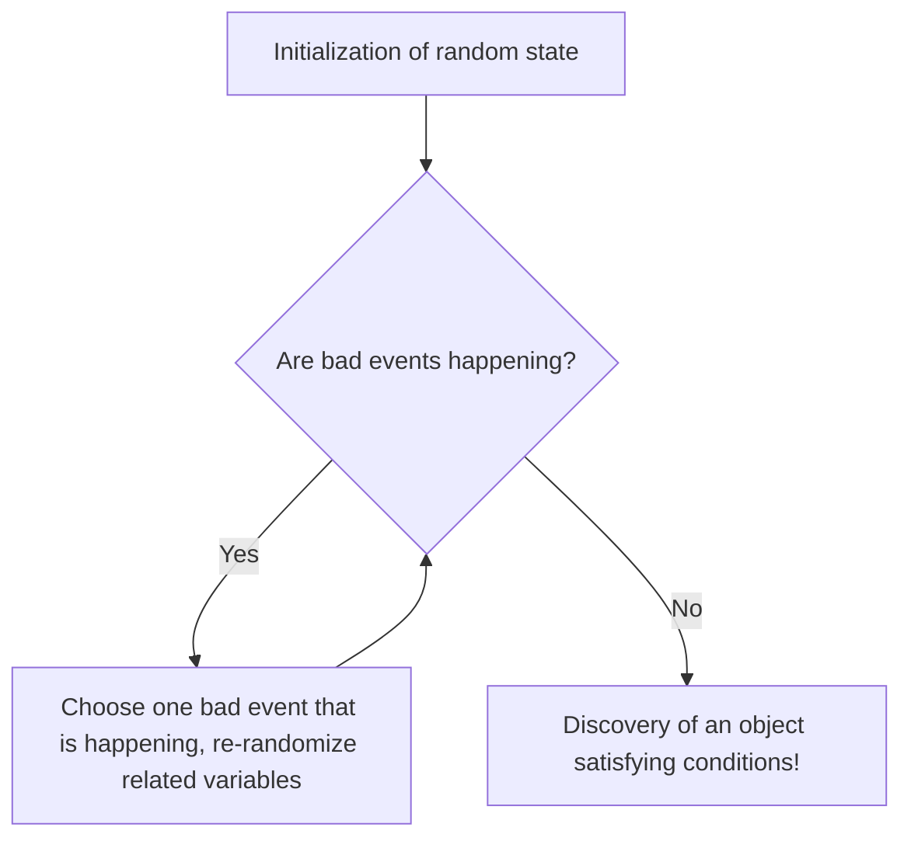

# Introduction: The Magic of "Randomness" for Proving Existence

In mathematics, there are broadly two approaches to proving that "an object satisfying certain conditions exists". One is a "constructive proof", which concretely constructs and shows the object. The other is a "non-constructive proof", which logically demonstrates its necessary existence without explicitly specifying what the object is.

Paul Erdős (1913-1996), the wandering genius mathematician representing the 20th century, brought a revolution to this non-constructive proof. This is an astonishing technique called "The Probabilistic Method". The fundamental idea of this technique established by Erdős can be expressed in a single phrase as follows:

**"To show that an object satisfying a condition exists, one only needs to select an object at random and show that the probability of it satisfying the condition is strictly greater than 0."**

This seemingly obvious idea exerts tremendous power across diverse fields such as discrete mathematics, [graph theory](/en/p/graph-theory-dijkstra-a-star/), computer science, and information theory. In this article, we will explain the Probabilistic Method in very deep detail, from its basics to its famous application in [Ramsey Theory](/en/p/ramsey-theory/), and further expanding to the Lovász Local Lemma, random [graph theory](/en/p/graph-theory-dijkstra-a-star/), and simulations using Python.

---

## Paul Erdős: The Wandering Genius Who Dedicated His Life to Mathematics

Before delving into the Probabilistic Method, we must mention its founder, Paul Erdős. Born in Budapest, Hungary, Erdős lived his entire life without a home or property, continuously collaborating on research while wandering between the homes of mathematicians around the world. The number of papers he published reached about 1,500, making him known as the second most prolific mathematician in history, second only to [Leonhard Euler](/en/p/euler/).

Erdős believed that mathematical objects were to be found in "The Book" held by God, which contains the ultimate proofs. To him, a beautiful, concise proof that captured the essence was a "proof from The Book". The Probabilistic Method possesses a magical elegance that makes it truly worthy of being in The Book.

---

## The Fundamental Principle of the Probabilistic Method

The core logic of the Probabilistic Method is extremely simple.
Suppose there is a finite set $S$ and a subset $A$ of it (the set of "good" objects we are looking for). We want to show that $A$ is not empty (that is, at least one "good" object exists).

We introduce a probability space and randomly select an element of $S$ according to some probability distribution. Let $X$ be the chosen element. At this time, if we can prove that the probability $P(X \in A)$ that $X \in A$ is strictly greater than $0$, i.e.,
$$ P(X \in A) > 0 $$
then logically we can conclude that $A$ is not empty, meaning "a good object exists".

Because if no "good object" exists at all, the probability that a randomly chosen one becomes a "good object" should be exactly $0$. A positive probability means that it can possibly happen, which is nothing other than saying "it exists".

---

## The Lower Bound of the Ramsey Number $R(k, k)$: A Monument of the Probabilistic Method

Erdős's 1947 paper, which made the world aware of the power of the Probabilistic Method, was about the lower bound of the Ramsey number $R(k, k)$ in [Ramsey Theory](/en/p/ramsey-theory/).

### What is Ramsey Theory?

The philosophy of [Ramsey Theory](/en/p/ramsey-theory/) is that "complete disorder does not exist". It is a theory stating that no matter how complex and random a structure may seem, if the object is large enough, a certain kind of regular substructure will always exist.

The famous "Party Theorem (Theorem on Friends and Strangers)" shows that $R(3, 3) = 6$. That is, if 6 people gather, there will always be a group of 3 people who all know each other (a red triangle), or a group of 3 people who are all complete strangers to each other (a blue triangle).

In general, the Ramsey number $R(k, l)$ is defined as the minimum integer $N$ such that no matter how the edges of a complete graph $K_N$ with $N$ elements are colored with two colors, red and blue, it always contains a red complete graph $K_k$ or a blue complete graph $K_l$.

### Erdős's Proof (1947)

Erdős gave the following astonishing lower bound for the diagonal Ramsey number $R(k, k)$.

**Theorem (Erdős, 1947):**
For $k \ge 3$,
$$ R(k, k) > \lfloor 2^{k/2} \rfloor $$
holds.

**Explanation of the Proof:**
Attempting to prove this theorem "constructively" is extremely difficult. That is, one would have to color the edges of a graph with $N = \lfloor 2^{k/2} \rfloor$ vertices red and blue according to a specific rule, and present a concrete coloring method that "does not contain a monochromatic complete graph of size $k$". This causes an enormous combinatorial explosion as $k$ gets larger.

Here, Erdős's Probabilistic Method comes into play.

1. **Construction of the Probability Space:**
   Consider a complete graph $K_N$ with $N$ vertices. Suppose all its edges (a total of $\binom{N}{2}$ edges) are independently colored red with probability $1/2$ and blue with probability $1/2$ (a random coloring by flipping a coin).

2. **Definition of Events:**
   Let $V$ be the vertex set of $K_N$. Let $S_i$ be the subsets of $V$ that have exactly $k$ elements. There are exactly $\binom{N}{k}$ such subsets in total.
   For each $S_i$, we define an event $A_i$ as "the complete subgraph consisting of the vertices in $S_i$ is monochromatic (all red, or all blue)".

3. **Calculation of Probability:**
   Let's focus on a specific $S_i$. Since $S_i$ has $k$ vertices, there are $\binom{k}{2}$ edges inside it. The probability that all of these have the same color is:
   $$ P(A_i) = 2 \times \left( \frac{1}{2} \right)^{\binom{k}{2}} = 2^{1 - \binom{k}{2}} $$
   (The sum of the probability of being all red and the probability of being all blue.)

4. **Application of the Union Bound (Boole's Inequality):**
   The event that "*at least one* monochromatic $K_k$ exists" can be expressed as $\bigcup A_i$. This probability can be bounded from above by the union bound.
   $$ P\left( \bigcup A_i \right) \le \sum_{i} P(A_i) = \binom{N}{k} 2^{1 - \binom{k}{2}} $$

5. **Proof of "Existence":**
   If this probability is strictly less than $1$, then the probability of its complementary event, "*no* $S_i$ is monochromatic", is greater than $0$.
   $$ P\left( \bigcap \overline{A_i} \right) = 1 - P\left( \bigcup A_i \right) > 0 $$
   To show this, we just need
   $$ \binom{N}{k} 2^{1 - \binom{k}{2}} < 1 $$
   
   Using $\binom{N}{k} < \frac{N^k}{k!}$ to proceed with the calculation, we find that if $N \le 2^{k/2}$, the above inequality is satisfied.
   Therefore, when $N = \lfloor 2^{k/2} \rfloor$, a coloring method that does not contain a monochromatic $K_k$ "probabilistically exists". Thus, $R(k, k)$ must be strictly larger than that. End of proof.

This proof vividly demonstrates the existence of the object without constructing it at all. This is exactly Erdős's magic.

---

## Linearity of Expectation and Its Power

Another powerful weapon of the Probabilistic Method is the "linearity of expectation". This is the property that whether random variables $X$ and $Y$ are independent or dependent,
$$ E[X + Y] = E[X] + E[Y] $$
always holds.

### Hamiltonian Paths in Tournament Graphs
A tournament is a directed graph obtained by assigning a direction to each edge of a complete graph (representing the results of a round-robin tournament).
Theorem: For all $n$, there exists a tournament on $n$ vertices that has at least $n! 2^{-(n-1)}$ Hamiltonian paths (directed paths that visit every vertex exactly once).

To prove this, we consider a random tournament where directions are randomly assigned to the edges on the vertex set. The probability that a specific permutation of vertices forms a Hamiltonian path is $2^{-(n-1)}$. Since there are $n!$ permutations in total, the expected number of Hamiltonian paths is $n! 2^{-(n-1)}$.
If a random variable has an expectation $E$, there must exist an event where the random variable takes a value of $E$ or more. Therefore, it is immediately derived that a tournament satisfying the condition "exists". Here too, the linearity of expectation, which allows addition without worrying about "dependence" at all, shines brightly.

---

## The Alteration Method

In the basic Probabilistic Method, we calculate "the probability that a randomly created object satisfies the condition as is". However, sometimes an approach is effective where we first create an "almost good" object, and then slightly modify (Alteration) it to create one that satisfies the condition.

This alteration method is used when finding a lower bound for an independent set (a set of vertices where no two vertices are connected by an edge). By randomly selecting vertices, and if there is a connected pair in the chosen vertex set, discarding one of them, we can reliably obtain an independent set.

---

## Lovász Local Lemma

One of the greatest breakthroughs in the evolution of the Probabilistic Method is the "Lovász Local Lemma (LLL)", proved by Paul Erdős and László Lovász in 1975.

The union bound is powerful, but it has a weakness: if there are many events, the upper bound of the probability exceeds 1 and becomes useless. However, if the bad events are "mostly independent", the probability that all bad events can be avoided simultaneously should be positive. The LLL formulated this.

**Statement of the Symmetric LLL:**
Let $A_1, A_2, \dots, A_n$ be events. Suppose the probability of each event is $P(A_i) \le p$, and each event is dependent on at most $d$ of the other events (i.e., independent of the rest).
If
$$ e \cdot p \cdot (d + 1) \le 1 $$
(where $e$ is Napier's constant) holds, then
$$ P\left( \bigcap_{i=1}^n \overline{A_i} \right) > 0 $$
That is, there always exists a possibility to simultaneously avoid all bad events.

This lemma exhibits tremendous effect in graph coloring problems, the Boolean satisfiability problem (SAT), packing problems, etc. Surprisingly, in 2009, Moser and Tardos proved that this LLL is not merely an existence proof, but it can algorithmically (and efficiently) find the solution (the Moser-Tardos algorithm), which gave a huge shock to computer science.


*Figure: Conceptual diagram of the Moser-Tardos algorithm. If the conditions of the LLL are met, this algorithm is proven to stop in polynomial time.*

---

## Random Graph Theory: Erdős-Rényi Model

The application of the Probabilistic Method to the study of graphs themselves is "Random [Graph Theory](/en/p/graph-theory-dijkstra-a-star/)". Erdős and Alfréd Rényi introduced the random graph model $G(n, p)$ in 1959. This is a graph with $n$ vertices, where an edge exists independently with probability $p$ between each pair.

They discovered that when the probability $p$ is varied as a function $p(n)$ of the number of vertices $n$, there exists a threshold where the properties of the graph suddenly change like a "Phase Transition".

- When $p(n) \ll 1/n$, the graph becomes a collection of small trees.
- When $p(n) = c/n$ ($c > 1$), a Giant Component suddenly emerges.
- When $p(n) = \frac{\ln n}{n}$, the entire graph becomes a single connected component.

This has exactly the same mathematical structure as phase transition phenomena in physics, such as the freezing or boiling of water.

### Phase Transition Simulation of Random Graphs in Python

To understand probabilistic properties, it is effective to actually write code and perform simulations. Below is an example code that simulates the emergence of a giant connected component using Python and the `networkx` library.

```python
import networkx as nx
import matplotlib.pyplot as plt
import numpy as np

def simulate_giant_component(n, p_values):
    """
    In a random graph G(n, p) with n vertices,
    simulates how the size of the largest connected component changes with probability p.
    """
    max_component_sizes = []
    
    for p in p_values:
        # Generate Erdos-Renyi random graph
        G = nx.erdos_renyi_graph(n, p)
        # Get connected components sorted by size in descending order
        components = sorted(nx.connected_components(G), key=len, reverse=True)
        if components:
            # Record the size of the largest connected component (number of vertices) as a fraction of the total
            max_size = len(components[0]) / n
        else:
            max_size = 0
        max_component_sizes.append(max_size)
        
    return max_component_sizes

# Number of vertices n = 1000
n = 1000
# Vary probability p from 0.000 to 0.005 (threshold is 1/1000 = 0.001)
p_values = np.linspace(0, 0.005, 50)
sizes = simulate_giant_component(n, p_values)

# Plot the results
plt.figure(figsize=(10, 6))
plt.plot(p_values * n, sizes, marker='o', linestyle='-', color='b')
plt.axvline(x=1.0, color='r', linestyle='--', label='Phase transition threshold (p = 1/n)')
plt.title("Phase Transition of the Giant Component in Erdős-Rényi Graphs", fontsize=14)
plt.xlabel("Average Degree (p * n)", fontsize=12)
plt.ylabel("Fraction of Largest Connected Component", fontsize=12)
plt.legend()
plt.grid(True)
plt.show()
```

When this code is executed, you can visually confirm on the graph that at the boundary of $p \cdot n = 1$, the size of the largest connected component rises sharply from a state close to zero, coming to occupy most of the entire graph.

---

## Modern Applications of the Probabilistic Method

The seeds sown by Erdős have blossomed as indispensable tools in modern computer science.

1. **Randomized Algorithms:**
   From pivot selection in Quicksort, primality testing algorithms (like the Miller-Rabin primality test), and even hash functions for massive datasets, modern algorithms utilize randomness to dramatically improve computational speed and approximation accuracy.

2. **Error Correcting Codes:**
   In Shannon's information theory, the Probabilistic Method was also used to prove that excellent codes reaching the limit of channel capacity "exist". It was shown that randomly generated codes have superior error-correcting capabilities with high probability.

3. **Machine Learning and AI:**
   Many modern AI technologies, such as the initialization of neural networks, regularization through Dropout, and Stochastic Gradient Descent (SGD), depend heavily on probabilistic properties deep down. The properties of random vectors in high-dimensional spaces (the curse and blessing of dimensionality) are analyzed using the Probabilistic Method.

---

## Conclusion: What is Existence?

Paul Erdős's Probabilistic Method fundamentally changed our perception of the deeply rooted mathematical concept of "existence".
Even without being given a concrete form, by finding order within random chaos and stating "the probability of its existence is not zero", one can reliably prove existence. It is like harboring the romance of talking about the existence of an Earth-like planet somewhere in the vast universe using a probabilistic equation.

If there were a "The Book" in mathematics, the chapter on the Probabilistic Method would undoubtedly be written in golden letters near its beginning. Randomness is not mere disorder, but a light that illuminates profound truths.
