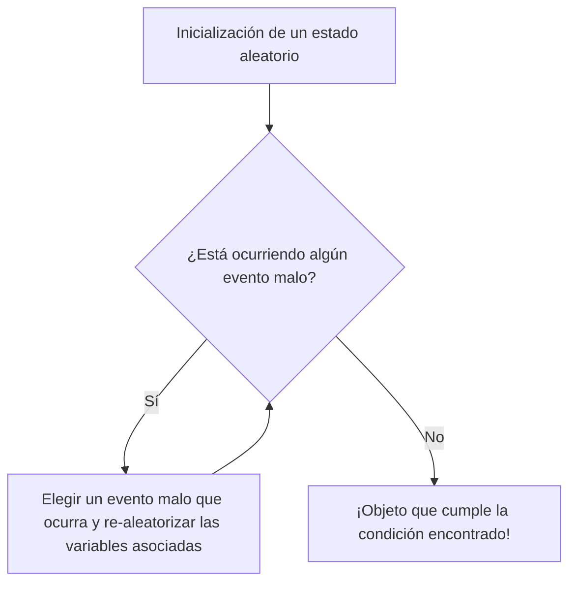

# Introducción: La magia de la "aleatoriedad" para demostrar la existencia

En matemáticas, hay principalmente dos enfoques para demostrar que "existe un objeto que cumple ciertas condiciones". Uno es la "demostración constructiva", donde se construye y muestra el objeto específicamente. El otro es la "demostración no constructiva", que muestra lógicamente que el objeto debe existir sin especificar explícitamente cuál es.

El genio errante que definió el siglo XX, Paul Erdős (1913-1996), revolucionó estas demostraciones no constructivas. Esta asombrosa técnica se conoce como "El método probabilístico" (The Probabilistic Method). La idea básica de este método establecido por Erdős se puede expresar en una sola frase:

**"Para demostrar que existe un objeto que cumple una condición, basta con elegir un objeto al azar y demostrar que la probabilidad de que cumpla la condición es mayor que cero."**

Esta idea aparentemente obvia demuestra ser sumamente poderosa en una amplia gama de campos, como la matemática discreta, la [teoría de grafos](/es/p/graph-theory-dijkstra-a-star/), las ciencias de la computación y la teoría de la información. En este artículo, profundizaremos exhaustivamente desde los fundamentos del método probabilístico hasta sus famosas aplicaciones en la [teoría de Ramsey](/es/p/ramsey-theory/), el Lema Local de Lovász (Lovász Local Lemma), el desarrollo de la [teoría de grafos](/es/p/graph-theory-dijkstra-a-star/) aleatorios y simulaciones usando Python.

---

## Paul Erdős: El genio errante que dedicó su vida a las matemáticas

Antes de adentrarnos en el método probabilístico, no podemos dejar de mencionar a su creador, Paul Erdős. Nacido en Budapest, Hungría, Erdős nunca tuvo casa ni propiedades en toda su vida. Viajó por el mundo alojándose en las casas de otros matemáticos mientras continuaba su investigación colaborativa. Publicó alrededor de 1500 artículos, lo que lo convierte en el segundo matemático más prolífico de la historia, solo superado por [Leonhard Euler](/es/p/euler/).

Erdős creía que encontrar objetos matemáticos era como extraerlos del "Libro" (The Book), un volumen imaginario donde Dios guarda las pruebas perfectas. Para él, una prueba hermosa, concisa y que iba al núcleo del asunto era una "prueba del Libro". El método probabilístico posee precisamente la elegancia mágica digna de aparecer en "The Book".

---

## Principios básicos del método probabilístico

La lógica central del método probabilístico es extremadamente simple.
Supongamos que tenemos un conjunto finito $S$ y un subconjunto $A$ (el conjunto de objetos "buenos" que buscamos). Queremos demostrar que $A$ no está vacío (es decir, que existe al menos un objeto "bueno").

Introducimos un espacio de probabilidad y seleccionamos aleatoriamente un elemento de $S$ según una cierta distribución de probabilidad. Sea $X$ el elemento seleccionado. Si podemos demostrar que la probabilidad $P(X \in A)$ de que $X \in A$ es estrictamente mayor que $0$, es decir:
$$ P(X \in A) > 0 $$
entonces podemos concluir lógicamente que $A$ no está vacío, o en otras palabras, que "el objeto bueno existe".

Esto se debe a que, si no existiera ningún "objeto bueno", la probabilidad de que un objeto seleccionado al azar sea "bueno" sería exactamente $0$. Que la probabilidad sea positiva significa que es una posibilidad que puede ocurrir, lo cual es equivalente a decir que "existe".

---

## Límite inferior del número de Ramsey $R(k, k)$: Un hito del método probabilístico

El artículo de Erdős de 1947, que dio a conocer al mundo el poder del método probabilístico, trataba sobre el límite inferior del número de Ramsey $R(k, k)$ en la [teoría de Ramsey](/es/p/ramsey-theory/).

### ¿Qué es la teoría de Ramsey?

La filosofía de la [teoría de Ramsey](/es/p/ramsey-theory/) es que "el desorden absoluto no existe". Postula que, sin importar cuán compleja o aleatoria parezca una estructura, si es lo suficientemente grande, siempre contendrá algún tipo de subestructura regular.

El famoso "teorema de la fiesta" (el problema de los amigos y desconocidos) muestra que $R(3, 3) = 6$. Esto significa que en cualquier grupo de 6 personas, siempre habrá al menos 3 personas que se conocen mutuamente (un triángulo rojo) o 3 personas que son completas desconocidas entre sí (un triángulo azul).

En general, el número de Ramsey $R(k, l)$ se define como el número entero mínimo $N$ tal que, independientemente de cómo se coloreen las aristas de un grafo completo $K_N$ de $N$ vértices con dos colores, digamos rojo y azul, siempre contendrá un grafo completo rojo $K_k$ o un grafo completo azul $K_l$.

### La demostración de Erdős (1947)

Erdős proporcionó el siguiente límite inferior sorprendente para el número de Ramsey diagonal $R(k, k)$.

**Teorema (Erdős, 1947):**
Para $k \ge 3$, se cumple que:
$$ R(k, k) > \lfloor 2^{k/2} \rfloor $$

**Explicación de la demostración:**
Intentar demostrar este teorema de forma "constructiva" es extremadamente difícil. Esto requeriría tomar un grafo con $N = \lfloor 2^{k/2} \rfloor$ vértices, colorear sus aristas de rojo y azul según reglas específicas y proporcionar un método de coloración concreto que "no contenga ningún grafo completo monocromático de tamaño $k$". A medida que $k$ crece, esto provoca una explosión combinatoria inmanejable.

Aquí es donde entra en juego el método probabilístico de Erdős.

1. **Construcción del espacio de probabilidad:**
   Consideremos un grafo completo $K_N$ con $N$ vértices. Asumimos que todas sus aristas (un total de $\binom{N}{2}$) se colorean aleatoriamente de rojo con probabilidad $1/2$ y de azul con probabilidad $1/2$ (como lanzar una moneda de forma independiente para cada arista).

2. **Definición de los eventos:**
   Sea $V$ el conjunto de vértices de $K_N$. Sean $S_i$ los subconjuntos de $V$ que tienen exactamente $k$ elementos. Hay un total de $\binom{N}{k}$ de estos subconjuntos.
   Para cada $S_i$, definimos el evento $A_i$ como "el subgrafo completo formado por los vértices en $S_i$ es monocromático (todo rojo o todo azul)".

3. **Cálculo de la probabilidad:**
   Nos centramos en un $S_i$ específico. Como $S_i$ tiene $k$ vértices, contiene $\binom{k}{2}$ aristas en su interior. La probabilidad de que todas ellas sean del mismo color es:
   $$ P(A_i) = 2 \times \left( \frac{1}{2} \right)^{\binom{k}{2}} = 2^{1 - \binom{k}{2}} $$
   (La suma de la probabilidad de que todas sean rojas más la probabilidad de que todas sean azules).

4. **Aplicación de la cota de la unión (Desigualdad de Boole):**
   El evento de que exista "*al menos un* $K_k$ monocromático" se puede expresar como $\bigcup A_i$. Esta probabilidad se puede acotar superiormente usando la cota de la unión:
   $$ P\left( \bigcup A_i \right) \le \sum_{i} P(A_i) = \binom{N}{k} 2^{1 - \binom{k}{2}} $$

5. **Demostración de la "existencia":**
   Si esta probabilidad es estrictamente menor que $1$, entonces su evento complementario, la probabilidad de que "*ningún* $S_i$ sea monocromático", es mayor que $0$.
   $$ P\left( \bigcap \overline{A_i} \right) = 1 - P\left( \bigcup A_i \right) > 0 $$
   Para demostrar esto, basta con mostrar que:
   $$ \binom{N}{k} 2^{1 - \binom{k}{2}} < 1 $$
   
   Usando la aproximación $\binom{N}{k} < \frac{N^k}{k!}$, se puede calcular y ver que la desigualdad anterior se cumple si $N \le 2^{k/2}$.
   Por lo tanto, cuando $N = \lfloor 2^{k/2} \rfloor$, "existe probabilísticamente" una coloración que no contiene ningún $K_k$ monocromático. En consecuencia, $R(k, k)$ debe ser estrictamente mayor que eso. Q.E.D.

Esta demostración prueba brillantemente la existencia sin construir el objeto en absoluto. Es verdaderamente la magia de Erdős.

---

## La linealidad de la esperanza (Linearity of Expectation) y su poder

Otra herramienta poderosa del método probabilístico es la "linealidad de la esperanza matemática". Ésta establece que, independientemente de si las variables aleatorias $X$ e $Y$ son independientes o dependientes, siempre se cumple que:
$$ E[X + Y] = E[X] + E[Y] $$

### Caminos hamiltonianos en grafos de torneo
Un torneo es un grafo dirigido obtenido al asignar una dirección a cada arista de un grafo completo (representa los resultados de un torneo de todos contra todos).
Teorema: Para todo $n$, existe un torneo de $n$ vértices que contiene al menos $n! 2^{-(n-1)}$ caminos hamiltonianos (caminos dirigidos que visitan cada vértice exactamente una vez).

Para demostrar esto, consideramos un torneo aleatorio donde la dirección de cada arista se asigna de manera uniforme al azar. La probabilidad de que una permutación específica de vértices sea un camino hamiltoniano es $2^{-(n-1)}$. Como hay $n!$ permutaciones en total, el valor esperado del número de caminos hamiltonianos es $n! 2^{-(n-1)}$.
Si una variable aleatoria tiene una esperanza $E$, debe existir al menos un resultado donde la variable tome un valor mayor o igual a $E$. Por lo tanto, se deduce inmediatamente que "existe" un torneo que cumple esta condición. Aquí brilla nuevamente la linealidad de la esperanza, permitiéndonos sumar esperanzas sin preocuparnos en absoluto por la "dependencia".

---

## El método de alteración (The Alteration Method)

En el método probabilístico básico, calculamos la "probabilidad de que un objeto aleatorio cumpla directamente la condición". Sin embargo, a veces es más efectivo crear algo que esté "casi" bien y luego modificarlo ligeramente (alterarlo) para obtener algo que cumpla con la condición.

Este método de alteración se utiliza, por ejemplo, para encontrar un límite inferior para un conjunto independiente (un conjunto de vértices en el que no hay dos vértices conectados por una arista). Si elegimos un conjunto de vértices al azar y encontramos que algunos pares están conectados, podemos eliminar uno de los vértices de cada par conectado. Mediante esta operación, nos aseguramos de obtener un conjunto independiente válido.

---

## El Lema Local de Lovász (Lovász Local Lemma)

Uno de los mayores avances en la evolución del método probabilístico es el "Lema Local de Lovász (LLL)", demostrado por Paul Erdős y László Lovász en 1975.

La cota de la unión es poderosa, pero tiene la debilidad de que cuando el número de eventos es grande, la cota superior de la probabilidad puede exceder 1, perdiendo así su utilidad. Sin embargo, si los "eventos malos" son "casi independientes", la probabilidad de evitar todos los eventos malos simultáneamente debería ser positiva. El LLL formaliza esta idea.

**Declaración del LLL simétrico:**
Sean $A_1, A_2, \dots, A_n$ una serie de eventos. Supongamos que la probabilidad de cada evento está acotada por $P(A_i) \le p$, y que cada evento es dependiente de a lo sumo $d$ de los otros eventos (es decir, es independiente del resto).
Si se cumple que:
$$ e \cdot p \cdot (d + 1) \le 1 $$
(donde $e$ es la base de los logaritmos naturales), entonces:
$$ P\left( \bigcap_{i=1}^n \overline{A_i} \right) > 0 $$
Es decir, siempre existe la posibilidad de evitar todos los eventos malos al mismo tiempo.

Este lema tiene un impacto extraordinario en problemas de coloración de grafos, problemas de satisfacibilidad booleana (SAT) y problemas de empaquetamiento (packing). Sorprendentemente, en 2009, Moser y Tardos demostraron que el LLL no se limita a ser una prueba de existencia, sino que existe un algoritmo eficiente (el algoritmo de Moser-Tardos) para encontrar la solución, lo cual causó un gran impacto en las ciencias de la computación.


*Figura: Diagrama conceptual del algoritmo de Moser-Tardos. Se ha demostrado que si se cumplen las condiciones del LLL, este algoritmo termina en tiempo polinomial.*

---

## Teoría de grafos aleatorios: El modelo de Erdős-Rényi

La aplicación del método probabilístico al estudio de los grafos en sí es la "[teoría de grafos](/es/p/graph-theory-dijkstra-a-star/) aleatorios". Erdős y Alfréd Rényi introdujeron en 1959 el modelo de grafo aleatorio $G(n, p)$. Este modelo consta de un grafo de $n$ vértices, donde cada arista entre cualquier par de vértices existe con probabilidad $p$, de manera independiente.

Descubrieron que al variar la probabilidad $p$ como una función del número de vértices $n$, $p(n)$, existe un umbral (Threshold) donde las propiedades del grafo cambian repentinamente, de manera similar a una "transición de fase" (Phase Transition).

- Cuando $p(n) \ll 1/n$, el grafo se compone de una colección de árboles (trees) pequeños.
- Cuando $p(n) = c/n$ ($c > 1$), surge repentinamente una componente conectada gigante (Giant Component).
- Cuando $p(n) = \frac{\ln n}{n}$, todo el grafo se convierte en una sola componente conectada.

Esto comparte exactamente la misma estructura matemática que los fenómenos de transición de fase en física, como la congelación o la ebullición del agua.

### Simulación de transición de fase en grafos aleatorios con Python

Para comprender las propiedades probabilísticas, es muy útil escribir código y realizar simulaciones. A continuación, se muestra un ejemplo en Python utilizando la biblioteca `networkx` para simular la aparición de una componente gigante.

```python
import networkx as nx
import matplotlib.pyplot as plt
import numpy as np

def simulate_giant_component(n, p_values):
    """
    Simula cómo cambia el tamaño de la componente conectada más grande
    en un grafo aleatorio G(n, p) de n vértices, en función de la probabilidad p.
    """
    max_component_sizes = []
    
    for p in p_values:
        # Generar grafo aleatorio de Erdős-Rényi
        G = nx.erdos_renyi_graph(n, p)
        # Obtener componentes conectadas ordenadas por tamaño de mayor a menor
        components = sorted(nx.connected_components(G), key=len, reverse=True)
        if components:
            # Registrar el tamaño de la mayor componente (número de vértices) como fracción del total
            max_size = len(components[0]) / n
        else:
            max_size = 0
        max_component_sizes.append(max_size)
        
    return max_component_sizes

# Número de vértices n = 1000
n = 1000
# Variar la probabilidad p de 0.000 a 0.005 (el umbral es 1/1000 = 0.001)
p_values = np.linspace(0, 0.005, 50)
sizes = simulate_giant_component(n, p_values)

# Trazar los resultados
plt.figure(figsize=(10, 6))
plt.plot(p_values * n, sizes, marker='o', linestyle='-', color='b')
plt.axvline(x=1.0, color='r', linestyle='--', label='Umbral de transición de fase (p = 1/n)')
plt.title("Transición de fase de la componente gigante en grafos de Erdős-Rényi", fontsize=14)
plt.xlabel("Grado promedio (p * n)", fontsize=12)
plt.ylabel("Proporción de la máxima componente conectada", fontsize=12)
plt.legend()
plt.grid(True)
plt.show()
```

Al ejecutar este código, se puede observar visualmente en el gráfico que justo en el límite $p \cdot n = 1$, el tamaño de la componente conectada más grande aumenta abruptamente desde un estado cercano a cero hasta ocupar la mayor parte del grafo entero.

---

## Aplicaciones modernas del método probabilístico

Las semillas plantadas por Erdős han florecido como herramientas indispensables en las ciencias de la computación modernas.

1. **Algoritmos aleatorizados (Randomized Algorithms):**
   Desde la elección del pivote en Quicksort hasta los algoritmos de prueba de primalidad (como el test de primalidad de Miller-Rabin), pasando por las funciones hash para conjuntos de datos masivos; los algoritmos modernos utilizan la aleatoriedad para mejorar drásticamente la velocidad de cálculo y la precisión de la aproximación.

2. **Códigos de corrección de errores (Error Correcting Codes):**
   En la teoría de la información de Shannon, el método probabilístico también se usó para demostrar que "existen" códigos excelentes que alcanzan el límite de la capacidad del canal. Se demostró que un código generado aleatoriamente tiene una alta probabilidad de poseer una excelente capacidad de corrección de errores.

3. **Aprendizaje automático e IA (Machine Learning and AI):**
   Muchas de las tecnologías de inteligencia artificial actuales, como la inicialización de redes neuronales, la regularización mediante abandono (Dropout) y el descenso de gradiente estocástico (SGD), dependen profundamente de propiedades probabilísticas en su núcleo. Las propiedades de los vectores aleatorios en espacios de alta dimensión (la maldición y la bendición de la dimensionalidad) se analizan utilizando métodos probabilísticos.

---

## Conclusión: ¿Qué es la existencia?

El método probabilístico de Paul Erdős ha transformado fundamentalmente nuestra comprensión del concepto más básico en matemáticas: la "existencia".
Incluso sin darles una forma concreta, encuentra orden dentro del caos aleatorio, y al declarar que "la probabilidad de que exista no es cero", demuestra su existencia de manera incuestionable. Alberga el mismo encanto romántico que afirmar, mediante una ecuación de probabilidad, la existencia de un planeta como la Tierra en algún lugar de la inmensidad del universo.

Si existe "El Libro" en matemáticas, el capítulo del método probabilístico sin duda estará escrito en letras de oro, cerca del comienzo. La aleatoriedad no es simple desorden; es la luz que ilumina profundas verdades.
