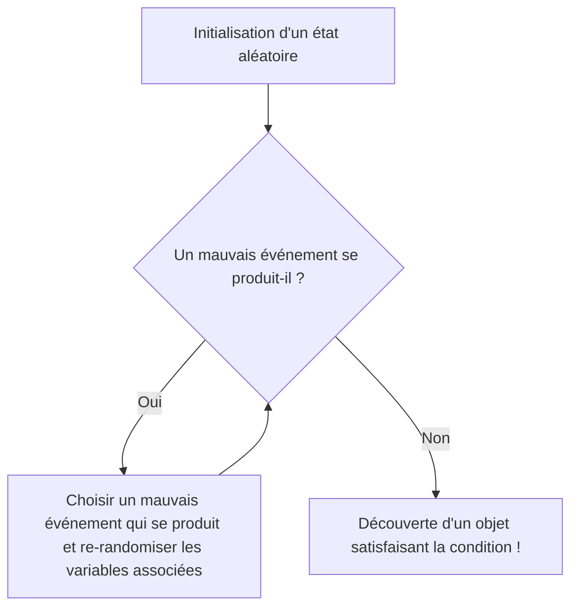

# Introduction : La Magie du "Hasard" pour Prouver l'Existence

En mathématiques, il existe deux grandes approches pour prouver qu'« un objet satisfaisant une certaine condition existe ». L'une est la « preuve constructive », qui consiste à construire explicitement l'objet et à le montrer. L'autre est la « preuve non constructive », qui démontre logiquement qu'un tel objet doit nécessairement exister, sans toutefois préciser explicitement ce qu'il est.

Paul Erdős (1913-1996), un génie mathématique itinérant qui a marqué le XXe siècle, a révolutionné cette preuve non constructive. Il s'agit de la méthode étonnante appelée « la méthode probabiliste » (The Probabilistic Method). L'idée fondamentale de cette méthode établie par Erdős peut se résumer en une phrase :

**« Pour démontrer l'existence d'un objet satisfaisant une condition, il suffit de choisir un objet au hasard et de montrer que la probabilité qu'il satisfasse la condition est strictement supérieure à 0. »**

Cette idée, d'apparence évidente, s'est avérée redoutablement puissante dans de nombreux domaines tels que les mathématiques discrètes, la [théorie des graphes](/fr/p/graph-theory-dijkstra-a-star/), l'informatique théorique et la théorie de l'information. Dans cet article, nous allons explorer en détail les fondements de cette méthode probabiliste, sa célèbre application dans la [théorie de Ramsey](/fr/p/ramsey-theory/), le lemme local de Lovász (Lovász Local Lemma), son extension à la [théorie des graphes](/fr/p/graph-theory-dijkstra-a-star/) aléatoires, ainsi que des simulations en Python.

---

## Paul Erdős : Le Génie Itinérant qui a Consacré sa Vie aux Mathématiques

Avant d'aborder la méthode probabiliste, il est impossible de ne pas mentionner son créateur, Paul Erdős. Né à Budapest en Hongrie, Erdős a vécu toute sa vie sans posséder ni maison ni biens, voyageant de maison de mathématicien en maison de mathématicien à travers le monde pour poursuivre ses recherches collaboratives. Avec environ 1500 articles publiés, il est connu comme le mathématicien le plus prolifique de l'histoire après [Leonhard Euler](/fr/p/euler/).

Erdős pensait que la recherche de théorèmes mathématiques consistait à trouver des objets dans « Le Livre » (The Book) que Dieu possédait, contenant les preuves ultimes. Pour lui, une preuve belle, concise et allant à l'essentiel était « une preuve digne du Livre ». La méthode probabiliste possède exactement cette élégance magique qui mérite de figurer dans Le Livre.

---

## Le Principe Fondamental de la Méthode Probabiliste

La logique au cœur de la méthode probabiliste est extrêmement simple.
Supposons que nous ayons un ensemble fini $S$ et un de ses sous-ensembles $A$ (l'ensemble des « bons » objets que nous recherchons). Nous voulons montrer que $A$ n'est pas vide (c'est-à-dire qu'il existe au moins un « bon » objet).

Nous introduisons un espace probabilisé et choisissons au hasard un élément de $S$ selon une certaine distribution de probabilité. Soit $X$ l'élément choisi. Alors, si nous pouvons prouver que la probabilité que $X \in A$, notée $P(X \in A)$, est strictement supérieure à $0$, c'est-à-dire
$$ P(X \in A) > 0 $$
nous pouvons logiquement conclure que $A$ n'est pas vide, donc que « le bon objet existe ».

En effet, si aucun « bon objet » n'existait, la probabilité qu'un objet choisi au hasard soit un « bon objet » serait strictement de $0$. Le fait que la probabilité soit positive signifie qu'il est possible que l'événement se produise, ce qui équivaut tout simplement à affirmer que l'objet « existe ».

---

## La Borne Inférieure du Nombre de Ramsey $R(k, k)$ : L'Apogée de la Méthode Probabiliste

L'article d'Erdős de 1947, qui a révélé au monde la puissance de la méthode probabiliste, portait sur la borne inférieure du nombre de Ramsey $R(k, k)$ dans la [théorie de Ramsey](/fr/p/ramsey-theory/).

### Qu'est-ce que la Théorie de Ramsey ?

La philosophie de la [théorie de Ramsey](/fr/p/ramsey-theory/) est que « le désordre absolu n'existe pas ». C'est une théorie qui affirme que, peu importe à quel point une structure semble complexe et aléatoire, si l'objet est suffisamment grand, il contient nécessairement une certaine sous-structure régulière.

Le célèbre « théorème des amis et des étrangers » (party problem) montre que $R(3, 3) = 6$. Cela signifie que dans un groupe de 6 personnes, il existe toujours soit 3 personnes qui se connaissent toutes mutuellement (un triangle rouge), soit 3 personnes qui sont toutes des étrangères les unes pour les autres (un triangle bleu).

En général, le nombre de Ramsey $R(k, l)$ est défini comme le plus petit entier $N$ tel que, quelle que soit la façon de colorier les arêtes du graphe complet $K_N$ de $N$ sommets avec deux couleurs (rouge et bleu), il contienne toujours un graphe complet rouge $K_k$ ou un graphe complet bleu $K_l$.

### La Preuve d'Erdős (1947)

Erdős a donné la remarquable borne inférieure suivante pour le nombre de Ramsey diagonal $R(k, k)$.

**Théorème (Erdős, 1947) :**
Pour $k \ge 3$,
$$ R(k, k) > \lfloor 2^{k/2} \rfloor $$
est vrai.

**Explication de la preuve :**
Si nous essayons de prouver ce théorème de manière « constructive », c'est extrêmement difficile. C'est-à-dire qu'il faudrait colorier les arêtes d'un graphe à $N = \lfloor 2^{k/2} \rfloor$ sommets en rouge et en bleu selon une règle spécifique, et présenter une méthode de coloration concrète telle qu'elle « ne contient pas de graphe complet monochromatique de taille $k$ ». Cela entraîne une explosion combinatoire phénoménale lorsque $k$ devient grand.

C'est ici qu'intervient la méthode probabiliste d'Erdős.

1. **Construction de l'espace probabilisé :**
   Considérons un graphe complet $K_N$ à $N$ sommets. Supposons que toutes ses arêtes (au nombre de $\binom{N}{2}$) soient coloriées indépendamment de manière aléatoire en rouge avec une probabilité de $1/2$ et en bleu avec une probabilité de $1/2$ (coloration aléatoire par tirage à pile ou face).

2. **Définition de l'événement :**
   Soit $V$ l'ensemble des sommets de $K_N$. Notons $S_i$ un sous-ensemble de $V$ de cardinal $k$. Il y a au total $\binom{N}{k}$ tels sous-ensembles.
   Pour chaque $S_i$, définissons l'événement $A_i$ comme « le sous-graphe complet formé par les sommets appartenant à $S_i$ est monochromatique (entièrement rouge ou entièrement bleu) ».

3. **Calcul de la probabilité :**
   Concentrons-nous sur un $S_i$ particulier. Comme $S_i$ possède $k$ sommets, il y a $\binom{k}{2}$ arêtes en son sein. La probabilité que celles-ci soient toutes de la même couleur est
   $$ P(A_i) = 2 \times \left( \frac{1}{2} \right)^{\binom{k}{2}} = 2^{1 - \binom{k}{2}} $$
   (C'est la somme de la probabilité qu'elles soient toutes rouges et de la probabilité qu'elles soient toutes bleues).

4. **Application de la borne de l'union (Inégalité de Boole) :**
   L'événement « *au moins un* $K_k$ monochromatique existe » peut être exprimé comme $\bigcup A_i$. Cette probabilité peut être majorée par la borne de l'union.
   $$ P\left( \bigcup A_i \right) \le \sum_{i} P(A_i) = \binom{N}{k} 2^{1 - \binom{k}{2}} $$

5. **Preuve de l'« existence » :**
   Si cette probabilité est strictement inférieure à $1$, alors la probabilité de son événement complémentaire, « *aucun* $S_i$ n'est monochromatique », est supérieure à $0$.
   $$ P\left( \bigcap \overline{A_i} \right) = 1 - P\left( \bigcup A_i \right) > 0 $$
   Pour montrer cela, il suffit que
   $$ \binom{N}{k} 2^{1 - \binom{k}{2}} < 1 $$
   soit vrai.
   
   En utilisant $\binom{N}{k} < \frac{N^k}{k!}$ pour poursuivre le calcul, on constate que si $N \le 2^{k/2}$, l'inégalité ci-dessus est satisfaite.
   Par conséquent, lorsque $N = \lfloor 2^{k/2} \rfloor$, une méthode de coloration qui ne contient pas de $K_k$ monochromatique « existe de manière probabiliste ». Ainsi, $R(k, k)$ doit être strictement supérieur à cela. Fin de la preuve.

Cette preuve démontre brillamment l'existence sans construire aucun objet. C'est précisément cela la magie d'Erdős.

---

## La Linéarité de l'Espérance (Linearity of Expectation) et sa Puissance

Une autre arme puissante de la méthode probabiliste est la « linéarité de l'espérance ». C'est la propriété selon laquelle, que les variables aléatoires $X$ et $Y$ soient indépendantes ou dépendantes, l'équation suivante est toujours vérifiée :
$$ E[X + Y] = E[X] + E[Y] $$

### Les Chemins Hamiltoniens dans les Graphes de Tournoi
Un tournoi est un graphe orienté obtenu en assignant une direction à chaque arête d'un graphe complet (représentant les résultats d'un tournoi toutes rondes).
Théorème : Pour tout $n$, il existe un tournoi à $n$ sommets possédant au moins $n! 2^{-(n-1)}$ chemins hamiltoniens (chemins orientés passant par chaque sommet exactement une fois).

Pour le prouver, considérons un tournoi aléatoire où l'orientation des arêtes est attribuée au hasard à l'ensemble des sommets. La probabilité qu'une permutation spécifique de sommets devienne un chemin hamiltonien est $2^{-(n-1)}$. Comme il y a au total $n!$ permutations, l'espérance du nombre de chemins hamiltoniens est $n! 2^{-(n-1)}$.
Si une variable aléatoire possède une espérance $E$, il existe toujours un événement où cette variable aléatoire prend une valeur supérieure ou égale à $E$. Par conséquent, il est immédiatement déduit qu'un tournoi remplissant la condition « existe ». Ici encore, la linéarité de l'espérance, qui permet d'additionner sans se soucier de la « dépendance », brille de mille feux.

---

## La Méthode de Modification (The Alteration Method)

Dans la méthode probabiliste de base, on calcule la probabilité que « ce qui a été créé au hasard satisfasse directement la condition ». Cependant, il est parfois efficace de créer quelque chose de « presque bon », puis de le modifier légèrement (Alteration) pour obtenir un objet qui satisfait la condition.

Cette méthode de modification est utilisée, par exemple, pour trouver la borne inférieure d'un ensemble indépendant (un ensemble de sommets où aucune paire n'est reliée par une arête). En choisissant un ensemble de sommets au hasard et en éliminant un sommet de chaque paire reliée par une arête au sein de cet ensemble, on peut être certain d'obtenir un ensemble indépendant.

---

## Le Lemme Local de Lovász (Lovász Local Lemma)

L'une des percées majeures dans l'évolution de la méthode probabiliste est le « Lemme Local de Lovász (LLL) », prouvé par Paul Erdős et László Lovász en 1975.

Bien que la borne de l'union soit puissante, elle a pour faiblesse que si le nombre d'événements est important, la limite supérieure de la probabilité peut dépasser 1 et devenir inutile. Cependant, si les mauvais événements sont « presque indépendants », la probabilité que tous les mauvais événements puissent être évités simultanément devrait être positive. C'est ce que formalise le LLL.

**L'énoncé du LLL symétrique :**
Soit $A_1, A_2, \dots, A_n$ des événements. Supposons que la probabilité de chaque événement soit $P(A_i) \le p$, et que chaque événement dépende d'au plus $d$ autres événements (c'est-à-dire qu'il est indépendant de tous les autres).
Si
$$ e \cdot p \cdot (d + 1) \le 1 $$
(où $e$ est la base du logarithme népérien) est satisfait, alors
$$ P\left( \bigcap_{i=1}^n \overline{A_i} \right) > 0 $$
est vrai. En d'autres termes, il existe toujours une possibilité d'éviter simultanément tous les mauvais événements.

Ce lemme est extrêmement efficace dans des problèmes tels que la coloration de graphes, le problème de satisfaisabilité (SAT), et les problèmes de remplissage (packing). Étonnamment, en 2009, Moser et Tardos ont prouvé que ce LLL n'était pas seulement une preuve d'existence, mais qu'il était possible de trouver la solution de manière algorithmique (et de plus, efficacement) (Algorithme de Moser-Tardos), ce qui a provoqué une onde de choc en informatique.


*Figure : Schéma conceptuel de l'algorithme de Moser-Tardos. Il a été prouvé que si les conditions du LLL sont remplies, cet algorithme s'arrête en temps polynomial.*

---

## Théorie des Graphes Aléatoires : Le Modèle d'Erdős-Rényi

La « [théorie des graphes](/fr/p/graph-theory-dijkstra-a-star/) aléatoires » est l'application de la méthode probabiliste à l'étude des graphes eux-mêmes. En 1959, Erdős et Alfréd Rényi ont introduit le modèle de graphe aléatoire $G(n, p)$. Il s'agit d'un graphe à $n$ sommets, où une arête existe indépendamment entre chaque paire de sommets avec une probabilité $p$.

Ils ont découvert qu'en faisant varier la probabilité $p$ en fonction du nombre de sommets $n$, notée $p(n)$, il existe un seuil (Threshold) où les propriétés du graphe changent soudainement, comme dans une « transition de phase » (Phase Transition).

- Lorsque $p(n) \ll 1/n$, le graphe est composé d'une collection de petits arbres (trees).
- Lorsque $p(n) = c/n$ ($c > 1$), une composante géante (Giant Component) apparaît soudainement.
- Lorsque $p(n) = \frac{\ln n}{n}$, l'ensemble du graphe devient une seule composante connexe.

Cela possède exactement la même structure mathématique que les phénomènes de transition de phase en physique, tels que le gel ou l'ébullition de l'eau.

### Simulation de Transition de Phase de Graphes Aléatoires avec Python

Pour comprendre les propriétés probabilistes, il est utile d'écrire du code et d'exécuter des simulations. Voici un exemple de code utilisant Python et la bibliothèque `networkx` pour simuler l'apparition d'une composante connexe géante.

```python
import networkx as nx
import matplotlib.pyplot as plt
import numpy as np

def simulate_giant_component(n, p_values):
    """
    Simule comment la taille de la composante connexe maximale varie en fonction
    de la probabilité p dans un graphe aléatoire G(n, p) de n sommets.
    """
    max_component_sizes = []
    
    for p in p_values:
        # Générer un graphe aléatoire d'Erdos-Renyi
        G = nx.erdos_renyi_graph(n, p)
        # Obtenir les composantes connexes par ordre décroissant de taille
        components = sorted(nx.connected_components(G), key=len, reverse=True)
        if components:
            # Enregistrer la taille de la composante maximale (nombre de sommets) en tant que proportion du total
            max_size = len(components[0]) / n
        else:
            max_size = 0
        max_component_sizes.append(max_size)
        
    return max_component_sizes

# Nombre de sommets n = 1000
n = 1000
# Faire varier la probabilité p de 0.000 à 0.005 (le seuil est de 1/1000 = 0.001)
p_values = np.linspace(0, 0.005, 50)
sizes = simulate_giant_component(n, p_values)

# Tracé des résultats
plt.figure(figsize=(10, 6))
plt.plot(p_values * n, sizes, marker='o', linestyle='-', color='b')
plt.axvline(x=1.0, color='r', linestyle='--', label='Seuil de transition de phase (p = 1/n)')
plt.title("Transition de phase de la composante géante dans les graphes d'Erdős-Rényi", fontsize=14)
plt.xlabel("Degré moyen (p * n)", fontsize=12)
plt.ylabel("Proportion de la composante connexe maximale", fontsize=12)
plt.legend()
plt.grid(True)
plt.show()
```

L'exécution de ce code permet de confirmer visuellement sur le graphique qu'autour de $p \cdot n = 1$, la taille de la composante connexe maximale passe d'un état proche de zéro à une augmentation drastique, finissant par occuper la majeure partie du graphe.

---

## Les Applications de la Méthode Probabiliste à l'Époque Contemporaine

Les graines semées par Erdős ont fleuri pour devenir des outils indispensables dans l'informatique moderne.

1. **Algorithmes Randomisés (Randomized Algorithms) :**
   Du choix du pivot dans le tri rapide (quicksort) aux algorithmes de test de primalité (comme le test de primalité de Miller-Rabin), en passant par les fonctions de hachage pour d'énormes ensembles de données, les algorithmes modernes utilisent l'aléatoire pour améliorer drastiquement la vitesse de calcul et la précision des approximations.

2. **Codes Correcteurs d'Erreurs (Error Correcting Codes) :**
   Dans la théorie de l'information de Shannon, la méthode probabiliste a également été utilisée pour prouver qu'il « existe » des codes exceptionnels atteignant la limite de la capacité du canal. Il a été démontré que des codes générés aléatoirement ont, avec une grande probabilité, d'excellentes capacités de correction d'erreurs.

3. **Apprentissage Automatique et IA :**
   Beaucoup des technologies d'IA modernes, telles que l'initialisation des réseaux de neurones, la régularisation par abandon (Dropout) et la descente de gradient stochastique (SGD), reposent profondément sur des propriétés probabilistes. Les propriétés des vecteurs aléatoires dans les espaces de grande dimension (le fléau et la bénédiction de la dimensionnalité) sont analysées à l'aide de méthodes probabilistes.

---

## Conclusion : Qu'est-ce que l'Existence ?

La méthode probabiliste de Paul Erdős a profondément modifié notre compréhension du concept fondamental de l'« existence » en mathématiques.
Même sans lui donner une forme concrète, trouver de l'ordre dans le chaos aléatoire et affirmer que « la probabilité de son existence n'est pas nulle » prouve avec certitude son existence. Cela recèle le même romantisme que d'utiliser des équations probabilistes pour dire qu'une planète semblable à la Terre existe quelque part dans le vaste univers.

S'il existe un « Livre » (The Book) en mathématiques, le chapitre sur la méthode probabiliste est sans doute écrit en lettres d'or près de son début. L'aléatoire n'est pas un simple désordre, c'est une lumière qui éclaire de profondes vérités.
