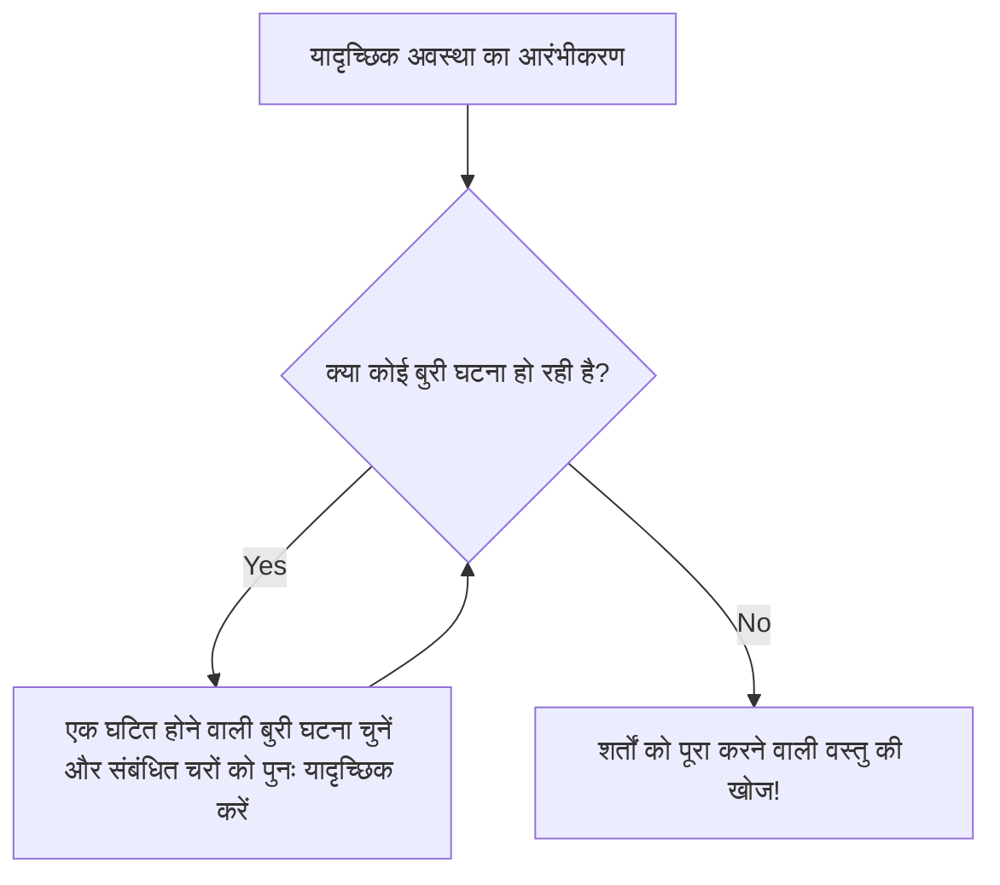

# परिचय: अस्तित्व सिद्ध करने के लिए 'यादृच्छिकता' (रैंडमनेस) का जादू

गणित में, यह सिद्ध करने के दो मुख्य तरीके हैं कि "एक विशिष्ट शर्त को पूरा करने वाली वस्तु मौजूद है"। पहला "रचनात्मक प्रमाण (Constructive proof)" है, जो उस वस्तु को विशेष रूप से निर्मित करके दिखाता है। दूसरा "गैर-रचनात्मक प्रमाण (Non-constructive proof)" है, जो स्पष्ट रूप से यह नहीं बताता कि वस्तु क्या है, लेकिन तार्किक रूप से यह दर्शाता है कि यह निश्चित रूप से मौजूद है।

20वीं सदी के महान घुमक्कड़ प्रतिभाशाली गणितज्ञ, पॉल एर्डोस (Paul Erdős, 1913-1996) ने इस गैर-रचनात्मक प्रमाण में एक क्रांति ला दी। इसे "प्रायिकता विधि (The Probabilistic Method)" नामक एक अद्भुत तकनीक के रूप में जाना जाता है। एर्डोस द्वारा स्थापित इस विधि के मूल विचार को एक वाक्य में इस प्रकार व्यक्त किया जा सकता है:

**"यह दिखाने के लिए कि शर्त को पूरा करने वाली वस्तु मौजूद है, वस्तुओं को यादृच्छिक (रैंडम) रूप से चुनें, और यह दिखाएं कि उसके शर्त को पूरा करने की प्रायिकता (संभावना) 0 से अधिक है।"**

यह विचार जो पहली नज़र में स्पष्ट लगता है, वह असतत गणित (Discrete mathematics), ग्राफ सिद्धांत (Graph theory), कंप्यूटर विज्ञान (Computer science) और सूचना सिद्धांत (Information theory) जैसे विभिन्न क्षेत्रों में शक्तिशाली प्रभाव डालता है। इस लेख में, हम प्रायिकता विधि के मूल सिद्धांतों से लेकर रैमसे सिद्धांत (Ramsey Theory) में इसके प्रसिद्ध अनुप्रयोगों, और इसके अलावा लोवाज़ लोकल लेम्मा (Lovász [Local](/hi/p/git%E3%81%A7%E3%82%BF%E3%82%B0%E3%82%92%E6%B6%88%E3%81%99/) Lemma), रैंडम ग्राफ थ्योरी (Random Graph Theory) के विकास, और पायथन (Python) का उपयोग करके सिमुलेशन तक विस्तार से चर्चा करेंगे।

---

## पॉल एर्डोस: एक घुमक्कड़ जीनियस जिसने अपना जीवन गणित को समर्पित कर दिया

प्रायिकता विधि के विषय में जाने से पहले, हमें इसके संस्थापक पॉल एर्डोस का उल्लेख करना होगा। एर्डोस का जन्म बुडापेस्ट, हंगरी में हुआ था, और उन्होंने जीवन भर कोई घर या संपत्ति नहीं रखी। वे दुनिया भर में गणितज्ञों के घरों में घूमते रहे और उनके साथ मिलकर शोध कार्य करते रहे। उनके द्वारा प्रकाशित शोध पत्रों की संख्या लगभग 1500 है, जिससे उन्हें [लियोनहार्ड यूलर](/hi/p/euler/) (Leonhard Euler) के बाद इतिहास में दूसरे सबसे विपुल (प्रोलिफिक) गणितज्ञ के रूप में जाना जाता है।

एर्डोस का मानना था कि गणितीय वस्तुओं की खोज ईश्वर की "परम प्रमाणों से लिखी पुस्तक (The Book)" से की जानी चाहिए। उनके लिए, एक सुंदर, संक्षिप्त और सारगर्भित प्रमाण "द बुक में लिखा गया प्रमाण" था। प्रायिकता विधि में एक जादुई लालित्य (elegance) है, जो वास्तव में द बुक में शामिल होने के योग्य है।

---

## प्रायिकता विधि के मूल सिद्धांत

प्रायिकता विधि का मूल तर्क अत्यंत सरल है।
मान लीजिए कि एक परिमित समुच्चय (finite set) $S$ है और उसका एक उपसमुच्चय (subset) $A$ है (जो "अच्छी" वस्तुओं का समुच्चय है जिसे हम खोज रहे हैं)। हम यह दिखाना चाहते हैं कि $A$ रिक्त नहीं है (अर्थात कम से कम एक "अच्छी" वस्तु मौजूद है)।

हम एक प्रायिकता समष्टि (probability space) प्रस्तुत करते हैं और एक निश्चित प्रायिकता वितरण (probability distribution) के अनुसार $S$ के तत्वों को यादृच्छिक (रैंडम) रूप से चुनते हैं। मान लें कि चुना गया तत्व $X$ है। इस समय, यदि हम यह सिद्ध कर सकें कि $X \in A$ होने की प्रायिकता $P(X \in A)$ शून्य से अधिक है, अर्थात
$$ P(X \in A) > 0 $$
तो हम तार्किक रूप से निष्कर्ष निकाल सकते हैं कि $A$ रिक्त नहीं है, यानी "अच्छी वस्तु मौजूद है"।

ऐसा इसलिए है क्योंकि यदि कोई "अच्छी वस्तु" अस्तित्व में नहीं है, तो यादृच्छिक रूप से चुनी गई वस्तु के "अच्छी वस्तु" होने की प्रायिकता पूरी तरह से $0$ होनी चाहिए। प्रायिकता का सकारात्मक होने का मतलब है कि यह संभावित रूप से हो सकता है, जिसका अर्थ है कि यह "अस्तित्व में" है।

---

## रैमसे संख्या $R(k, k)$ की निचली सीमा: प्रायिकता विधि का एक मील का पत्थर

एर्डोस का 1947 का शोध पत्र जिसने दुनिया को प्रायिकता विधि की शक्ति से परिचित कराया, रैमसे सिद्धांत (Ramsey Theory) में रैमसे संख्या $R(k, k)$ की निचली सीमा (lower bound) के बारे में था।

### रैमसे सिद्धांत क्या है

रैमसे सिद्धांत का दर्शन यह है कि "पूर्ण अव्यवस्था (Complete disorder) जैसी कोई चीज नहीं है"। यह एक ऐसा सिद्धांत है जो कहता है कि चाहे कोई संरचना कितनी भी जटिल और यादृच्छिक क्यों न लगे, यदि वह काफी बड़ी है, तो उसमें हमेशा किसी प्रकार की नियमित उप-संरचना (regular substructure) मौजूद होती है।

प्रसिद्ध "पार्टी प्रमेय (मित्र-अजनबी प्रमेय)" यह दर्शाता है कि $R(3, 3) = 6$ है। इसका अर्थ है कि यदि 6 लोग इकट्ठा होते हैं, तो हमेशा 3 लोगों का एक समूह होगा जो एक-दूसरे को जानते हैं (लाल त्रिकोण), या 3 लोगों का एक समूह होगा जो एक-दूसरे के लिए बिल्कुल अजनबी हैं (नीला त्रिकोण)।

आम तौर पर, रैमसे संख्या $R(k, l)$ को उस न्यूनतम पूर्णांक $N$ के रूप में परिभाषित किया जाता है, जिसके लिए $N$ तत्वों वाले पूर्ण ग्राफ (complete graph) $K_N$ के किनारों (edges) को लाल और नीले दो रंगों में कैसे भी रंगा जाए, उसमें हमेशा एक लाल पूर्ण ग्राफ $K_k$ या एक नीला पूर्ण ग्राफ $K_l$ मौजूद होता है।

### एर्डोस का प्रमाण (1947)

एर्डोस ने विकर्ण रैमसे संख्या (diagonal Ramsey number) $R(k, k)$ के लिए निम्नलिखित आश्चर्यजनक निचली सीमा प्रदान की:

**प्रमेय (Erdős, 1947):**
जब $k \ge 3$, तो
$$ R(k, k) > \lfloor 2^{k/2} \rfloor $$
सत्य है।

**प्रमाण की व्याख्या:**
यदि हम इस प्रमेय को "रचनात्मक" रूप से सिद्ध करने का प्रयास करते हैं, तो यह बहुत कठिन है। दूसरे शब्दों में, हमें $N = \lfloor 2^{k/2} \rfloor$ शीर्षों (vertices) वाले ग्राफ के किनारों को एक विशिष्ट नियम के साथ लाल और नीले रंग में रंगना होगा, और एक विशिष्ट रंग विधि प्रस्तुत करनी होगी जिससे "आकार $k$ का कोई मोनोक्रोमैटिक (एक ही रंग का) पूर्ण ग्राफ शामिल न हो"। जब $k$ बड़ा हो जाता है, तो यह संयोजनों का एक विशाल विस्फोट (combinatorial explosion) पैदा करता है।

यहीं एर्डोस की प्रायिकता विधि आती है।

1. **प्रायिकता समष्टि का निर्माण:**
   $N$ शीर्षों वाले एक पूर्ण ग्राफ $K_N$ पर विचार करें। मान लें कि इसके सभी किनारों (कुल $\binom{N}{2}$) को स्वतंत्र रूप से $1/2$ प्रायिकता के साथ लाल और $1/2$ प्रायिकता के साथ नीले रंग में रंगा गया है (सिक्का उछालने द्वारा यादृच्छिक रंग)।

2. **घटनाओं (Events) की परिभाषा:**
   मान लें $V$, $K_N$ के शीर्षों का समुच्चय है। $V$ के उन उपसमुच्चयों को $S_i$ मान लें जिनमें तत्वों की संख्या $k$ है। ऐसे कुल $\binom{N}{k}$ उपसमुच्चय हैं।
   प्रत्येक $S_i$ के लिए, घटना $A_i$ को इस प्रकार परिभाषित करें: "$S_i$ से संबंधित शीर्षों से बना उप-पूर्ण ग्राफ मोनोक्रोमैटिक (सभी लाल या सभी नीले) हो जाता है"।

3. **प्रायिकता की गणना:**
   एक विशिष्ट $S_i$ पर ध्यान दें। चूँकि $S_i$ में $k$ शीर्ष हैं, इसके अंदर $\binom{k}{2}$ किनारे हैं। इन सभी के एक ही रंग के होने की प्रायिकता है:
   $$ P(A_i) = 2 \times \left( \frac{1}{2} \right)^{\binom{k}{2}} = 2^{1 - \binom{k}{2}} $$
   (सभी के लाल होने की प्रायिकता और सभी के नीले होने की प्रायिकता का योग)।

4. **यूनियन बाउंड (बूल की असमानता) का अनुप्रयोग:**
   घटना कि "*कम से कम एक* मोनोक्रोमैटिक $K_k$ मौजूद है" को $\bigcup A_i$ के रूप में दर्शाया जा सकता है। इस प्रायिकता का मूल्यांकन यूनियन बाउंड (Union Bound) द्वारा ऊपर से किया जा सकता है।
   $$ P\left( \bigcup A_i \right) \le \sum_{i} P(A_i) = \binom{N}{k} 2^{1 - \binom{k}{2}} $$

5. **"अस्तित्व" का प्रमाण:**
   यदि यह प्रायिकता कड़ाई से $1$ से कम है, तो इसकी पूरक घटना कि "*कोई भी* $S_i$ मोनोक्रोमैटिक नहीं है" की प्रायिकता $0$ से अधिक होगी।
   $$ P\left( \bigcap \overline{A_i} \right) = 1 - P\left( \bigcup A_i \right) > 0 $$
   यह दिखाने के लिए, हमें यह चाहिए कि:
   $$ \binom{N}{k} 2^{1 - \binom{k}{2}} < 1 $$
   
   $\binom{N}{k} < \frac{N^k}{k!}$ का उपयोग करके गणना करने पर, हम देख सकते हैं कि यदि $N \le 2^{k/2}$ है, तो उपरोक्त असमानता संतुष्ट होती है।
   इसलिए, जब $N = \lfloor 2^{k/2} \rfloor$ होता है, तो रंगने की एक ऐसी विधि "संभावित रूप से मौजूद" होती है जिसमें कोई मोनोक्रोमैटिक $K_k$ शामिल नहीं होता। अतः, $R(k, k)$ का मान कड़ाई से इससे बड़ा होना चाहिए। प्रमाण समाप्त।

यह प्रमाण किसी भी वस्तु का निर्माण किए बिना, केवल उसके अस्तित्व को स्पष्ट रूप से प्रमाणित करता है। यह सचमुच एर्डोस का जादू है।

---

## प्रत्याशा की रैखिकता (Linearity of Expectation) और इसकी शक्ति

प्रायिकता विधि का एक और शक्तिशाली हथियार "प्रत्याशा की रैखिकता (Linearity of expectation)" है। यह वह गुण है जिसमें चाहे यादृच्छिक चर (random variables) $X, Y$ स्वतंत्र हों या निर्भर, हमेशा
$$ E[X + Y] = E[X] + E[Y] $$
सत्य होता है।

### टूर्नामेंट ग्राफ में हैमिल्टन पथ (Hamiltonian path)
एक टूर्नामेंट एक निर्देशित ग्राफ (directed graph) है जहां पूर्ण ग्राफ के प्रत्येक किनारे को एक दिशा दी जाती है (यह एक राउंड-रॉबिन टूर्नामेंट के परिणामों को दर्शाता है)।
प्रमेय: सभी $n$ के लिए, $n$ शीर्षों वाला एक टूर्नामेंट मौजूद है जिसमें $n! 2^{-(n-1)}$ या उससे अधिक हैमिल्टन पथ (Hamiltonian paths - निर्देशित पथ जो प्रत्येक शीर्ष से ठीक एक बार गुजरते हैं) होते हैं।

इसे सिद्ध करने के细, हम एक रैंडम टूर्नामेंट पर विचार करते हैं जिसमें शीर्षों के समुच्चय पर किनारों की दिशाएँ यादृच्छिक रूप से निर्धारित की गई हैं। एक विशिष्ट शीर्ष क्रमपरिवर्तन (permutation) के हैमिल्टन पथ होने की प्रायिकता $2^{-(n-1)}$ है। चूँकि कुल $n!$ क्रमपरिवर्तन हैं, हैमिल्टन पथों की संख्या का प्रत्याशित मूल्य (expected value) $n! 2^{-(n-1)}$ होगा।
यदि किसी यादृच्छिक चर का प्रत्याशित मूल्य $E$ है, तो ऐसी घटना हमेशा मौजूद होती है जहाँ वह यादृच्छिक चर $E$ या उससे अधिक मूल्य लेता है। इसलिए, यह तुरंत निष्कर्ष निकाला जा सकता है कि शर्तों को पूरा करने वाला एक टूर्नामेंट "मौजूद" है। यहाँ भी प्रत्याशा की रैखिकता चमकती है, जो "निर्भरता" की बिल्कुल परवाह किए बिना जोड़ने की अनुमति देती है।

---

## परिवर्तन विधि (The Alteration Method)

मूल प्रायिकता विधि में, हम "यादृच्छिक रूप से निर्मित किसी वस्तु के उसी रूप में शर्तों को पूरा करने की प्रायिकता" की गणना करते हैं। हालांकि, कभी-कभी ऐसी "लगभग सही" वस्तु बनाना और फिर उसे शर्तों को पूरा करने वाली वस्तु में बदलने के लिए थोड़ा "संशोधित (Alteration)" करने का दृष्टिकोण बहुत प्रभावी होता है।

स्वतंत्र समुच्चय (Independent set - शीर्षों का वह समुच्चय जिसमें कोई भी दो शीर्ष एक किनारे से जुड़े नहीं होते हैं) की निचली सीमा खोजने में इस परिवर्तन विधि का उपयोग किया जाता है। यदि हम यादृच्छिक रूप से शीर्षों को चुनते हैं, और यदि चुने गए शीर्षों के समुच्चय में किनारों से जुड़े जोड़े मौजूद हैं, तो हम उनमें से एक को हटा देने का संचालन करते हैं। ऐसा करके, हम निश्चित रूप से एक स्वतंत्र समुच्चय प्राप्त कर सकते हैं।

---

## लोवाज़ लोकल लेम्मा (Lovász Local Lemma)

प्रायिकता विधि के विकास में सबसे बड़ी सफलताओं में से एक "लोवाज़ लोकल लेम्मा (LLL)" है, जिसे 1975 में पॉल एर्डोस और लास्ज़लो लोवाज़ (László Lovász) द्वारा सिद्ध किया गया था।

यूनियन बाउंड शक्तिशाली है, लेकिन इसकी कमजोरी यह है कि जब घटनाओं की संख्या बड़ी होती है, तो प्रायिकता की ऊपरी सीमा 1 से अधिक हो जाती है और यह बेकार हो जाती है। हालांकि, यदि बुरी घटनाएँ (bad events) "लगभग स्वतंत्र" हैं, तो एक ही समय में सभी बुरी घटनाओं से बचने की प्रायिकता सकारात्मक होनी चाहिए। LLL ने इसी को सूत्रबद्ध किया।

**सममित (Symmetric) LLL का कथन:**
मान लें कि $A_1, A_2, \dots, A_n$ घटनाएँ हैं। प्रत्येक घटना की प्रायिकता $P(A_i) \le p$ है, और प्रत्येक घटना अन्य घटनाओं में से अधिकतम $d$ घटनाओं पर निर्भर करती है (अर्थात, यह अन्य सभी घटनाओं से स्वतंत्र है)।
यदि,
$$ e \cdot p \cdot (d + 1) \le 1 $$
(जहाँ $e$ नेपियर संख्या/यूलर संख्या है) सत्य है, तो
$$ P\left( \bigcap_{i=1}^n \overline{A_i} \right) > 0 $$
होगा। अर्थात्, हमेशा यह संभावना मौजूद होती है कि सभी बुरी घटनाओं से एक साथ बचा जा सके।

यह लेम्मा ग्राफ कलरिंग समस्या (Graph coloring problem), सैटिस्फायबिलिटी समस्या (SAT), और पैकिंग समस्या (Packing problem) आदि में अत्यधिक प्रभावी है। आश्चर्यजनक रूप से, 2009 में मोसर (Moser) और टार्डोस (Tardos) ने यह सिद्ध किया कि LLL न केवल अस्तित्व का प्रमाण देता है, बल्कि एल्गोरिथम रूप से (और कुशलता से) इसका समाधान भी खोजा जा सकता है (मोसर-टार्डोस एल्गोरिथम)। इसने कंप्यूटर विज्ञान में एक बड़ा प्रभाव डाला।


*चित्र: मोसर-टार्डोस एल्गोरिथम का अवधारणात्मक आरेख। यदि LLL की शर्तें पूरी होती हैं, तो यह प्रमाणित है कि यह एल्गोरिथम बहुपद समय (polynomial time) में रुक जाएगा।*

---

## रैंडम ग्राफ थ्योरी: एर्डोस-रेनी मॉडल (Erdős-Rényi model)

"रैंडम ग्राफ थ्योरी" ग्राफ के अध्ययन में प्रायिकता विधि का अनुप्रयोग है। 1959 में, एर्डोस और अल्फ्रेड रेनी (Alfréd Rényi) ने रैंडम ग्राफ मॉडल $G(n, p)$ पेश किया। यह एक ऐसा ग्राफ है जिसमें $n$ शीर्ष होते हैं, और प्रत्येक जोड़े के बीच एक किनारे के स्वतंत्र रूप से मौजूद होने की प्रायिकता $p$ होती है।

उन्होंने पाया कि जब प्रायिकता $p$ को शीर्षों की संख्या $n$ के फलन $p(n)$ के रूप में बदला जाता है, तो एक थ्रेशोल्ड (सीमा/Threshold) मौजूद होता है जहां ग्राफ के गुण अचानक "चरण संक्रमण (Phase Transition)" की तरह बदल जाते हैं।

- जब $p(n) \ll 1/n$, ग्राफ छोटे पेड़ों (trees) का एक संग्रह बन जाता है।
- जब $p(n) = c/n$ ($c > 1$), एक विशाल जुड़ा हुआ घटक (Giant Component) अचानक प्रकट होता है।
- जब $p(n) = \frac{\ln n}{n}$, संपूर्ण ग्राफ एक एकल जुड़ा हुआ घटक बन जाता है।

इसकी गणितीय संरचना भौतिकी में पानी के जमने या उबलने जैसी चरण संक्रमण घटनाओं के बिल्कुल समान है।

### पायथन (Python) द्वारा रैंडम ग्राफ के चरण संक्रमण का सिमुलेशन

प्रायिकतात्मक गुणों को समझने के लिए, वास्तव में कोड लिखना और सिमुलेशन चलाना प्रभावी होता है। विशाल जुड़े हुए घटक (giant component) की उपस्थिति को सिमुलेट करने के लिए पायथन और `networkx` लाइब्रेरी का उपयोग करने वाला कोड उदाहरण नीचे दिया गया है।

```python
import networkx as nx
import matplotlib.pyplot as plt
import numpy as np

def simulate_giant_component(n, p_values):
    """
    शीर्षों की संख्या n वाले रैंडम ग्राफ G(n, p) में,
    यह सिमुलेट करें कि अधिकतम जुड़े हुए घटक का आकार प्रायिकता p के आधार पर कैसे बदलता है।
    """
    max_component_sizes = []
    
    for p in p_values:
        # Erdos-Renyi रैंडम ग्राफ उत्पन्न करें
        G = nx.erdos_renyi_graph(n, p)
        # जुड़े हुए घटकों को आकार के घटते क्रम में प्राप्त करें
        components = sorted(nx.connected_components(G), key=len, reverse=True)
        if components:
            # अधिकतम जुड़े हुए घटक का आकार (शीर्षों की संख्या) समग्र अनुपात के रूप में रिकॉर्ड करें
            max_size = len(components[0]) / n
        else:
            max_size = 0
        max_component_sizes.append(max_size)
        
    return max_component_sizes

# शीर्षों की संख्या n = 1000
n = 1000
# प्रायिकता p को 0.000 से 0.005 तक बदलें (थ्रेशोल्ड 1/1000 = 0.001 है)
p_values = np.linspace(0, 0.005, 50)
sizes = simulate_giant_component(n, p_values)

# परिणाम का प्लॉट
plt.figure(figsize=(10, 6))
plt.plot(p_values * n, sizes, marker='o', linestyle='-', color='b')
plt.axvline(x=1.0, color='r', linestyle='--', label='चरण संक्रमण थ्रेशोल्ड (p = 1/n)')
plt.title("Erdős-Rényi ग्राफ में विशाल जुड़े हुए घटक का चरण संक्रमण", fontsize=14)
plt.xlabel("औसत डिग्री (p * n)", fontsize=12)
plt.ylabel("अधिकतम जुड़े हुए घटक का अनुपात", fontsize=12)
plt.legend()
plt.grid(True)
plt.show()
```

जब आप इस कोड को चलाते हैं, तो आप रेखांकन (graph) रूप में देख सकते हैं कि कैसे $p \cdot n = 1$ की सीमा पर, अधिकतम जुड़े हुए घटक का आकार शून्य के करीब की स्थिति से तेजी से बढ़ता है और पूरे ग्राफ के अधिकांश हिस्से पर कब्जा कर लेता है।

---

## आधुनिक समय में प्रायिकता विधि के अनुप्रयोग

एर्डोस द्वारा बोए गए बीज आधुनिक कंप्यूटर विज्ञान में अपरिहार्य (indispensable) उपकरणों के रूप में खिले हैं।

1. **यादृच्छिक एल्गोरिथम (Randomized Algorithms):**
   क्विकसॉर्ट (Quicksort) में पिवट (pivot) के चयन से लेकर, अभाज्य परीक्षण एल्गोरिदम (प्राइमलिटी टेस्टिंग जैसे मिलर-रैबिन प्राइमलिटी टेस्ट), और यहां तक कि विशाल डेटासेट के लिए हैश फ़ंक्शंस तक, आधुनिक एल्गोरिदम यादृच्छिकता का उपयोग करके गणना की गति और सन्निकटन सटीकता (approximation accuracy) में नाटकीय रूप से सुधार करते हैं।

2. **त्रुटि सुधार कोड (Error Correcting Codes):**
   शैनन (Shannon) के सूचना सिद्धांत में, यह भी प्रायिकता विधि द्वारा सिद्ध किया गया था कि ऐसे उत्कृष्ट कोड "अस्तित्व में हैं" जो चैनल क्षमता (channel capacity) की सीमा तक पहुंचते हैं। यह दिखाया गया था कि यादृच्छिक रूप से उत्पन्न कोड में उच्च प्रायिकता के साथ उत्कृष्ट त्रुटि-सुधार क्षमताएं होती हैं।

3. **मशीन लर्निंग और एआई (AI):**
   तंत्रिका नेटवर्क (Neural Networks) का आरंभीकरण (initialization), ड्रॉपआउट (Dropout) के माध्यम से नियमितीकरण (regularization), और स्टोकेस्टिक ग्रेडिएंट डिसेंट (SGD) जैसी कई आधुनिक AI तकनीकें भी गहराई में प्रायिकतात्मक गुणों पर निर्भर करती हैं। उच्च-आयामी (high-dimensional) स्थानों में यादृच्छिक वैक्टर के गुणों (आयामों का अभिशाप और आशीर्वाद / curse and blessing of dimensionality) का विश्लेषण प्रायिकता विधि का उपयोग करके किया जाता है।

---

## निष्कर्ष: अस्तित्व क्या है?

पॉल एर्डोस की प्रायिकता विधि ने "अस्तित्व" की मौलिक गणितीय अवधारणा के बारे में हमारी समझ को बहुत बदल दिया है।
भले ही इसे कोई ठोस आकार न दिया गया हो, यह यादृच्छिक अराजकता (random chaos) में व्यवस्था खोजता है, और यह कहकर कि "इसके मौजूद होने की प्रायिकता शून्य नहीं है", निश्चित रूप से इसके अस्तित्व को प्रमाणित करता है। यह बिल्कुल इस रहस्योद्घाटन जैसा है कि एक संभावना के समीकरण द्वारा बताया जाए कि इस विशाल ब्रह्मांड में कहीं पृथ्वी जैसा कोई ग्रह मौजूद है।

यदि गणित में "द बुक (The Book)" मौजूद है, तो प्रायिकता विधि का अध्याय निश्चित रूप से इसकी शुरुआत के पास सुनहरे अक्षरों में लिखा जाएगा। यादृच्छिकता केवल अव्यवस्था नहीं है; यह एक प्रकाश है जो गहरी सच्चाई को उजागर करता है。
