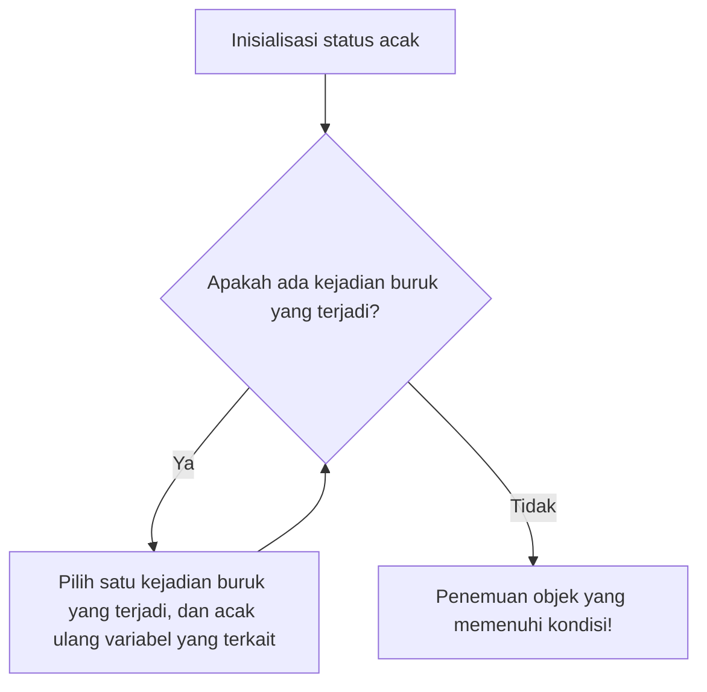

# Pendahuluan: Sihir "Keacakan" untuk Membuktikan Eksistensi

Dalam matematika, pendekatan untuk membuktikan bahwa "suatu objek yang memenuhi kondisi tertentu itu ada" secara garis besar dapat dibagi menjadi dua. Pertama adalah "bukti konstruktif", yang menunjukkan objek tersebut dengan mengkonstruksinya secara konkret. Kedua adalah "bukti non-konstruktif", yang secara logis menunjukkan bahwa objek tersebut pasti ada, tanpa secara eksplisit menentukan seperti apa objek tersebut secara konkret.

Matematikawan jenius yang sering berpindah-pindah dan merupakan salah satu tokoh paling representatif di abad ke-20, Paul Erdős (1913-1996), membawa revolusi pada bukti non-konstruktif ini. Itulah metode menakjubkan yang disebut "Metode Probabilistik" (The Probabilistic Method). Ide dasar dari metode yang dibangun oleh Erdős ini, dalam satu kalimat, dapat diekspresikan sebagai berikut:

**"Untuk menunjukkan bahwa ada objek yang memenuhi suatu kondisi, pilihlah objek secara acak, dan tunjukkan bahwa probabilitas objek tersebut memenuhi kondisi adalah lebih besar dari 0."**

Ide yang sekilas tampak sederhana ini menunjukkan kekuatan yang luar biasa dalam berbagai bidang, seperti matematika diskrit, [teori graf](/id/p/graph-theory-dijkstra-a-star/), ilmu komputer, dan teori informasi. Dalam artikel ini, kita akan membahas secara mendalam dan terperinci mulai dari dasar-dasar metode probabilistik, aplikasi terkenalnya dalam [Teori Ramsey](/id/p/ramsey-theory/), hingga Lemma Lokal Lovász (Lovász Local Lemma), perkembangannya ke [teori graf](/id/p/graph-theory-dijkstra-a-star/) acak, dan simulasi menggunakan Python.

---

## Paul Erdős: Sang Jenius Pengembara yang Mendedikasikan Hidupnya untuk Matematika

Sebelum masuk ke topik metode probabilistik, kita tidak bisa mengabaikan penciptanya, Paul Erdős. Erdős lahir di Budapest, Hungaria. Sepanjang hidupnya, ia tidak memiliki rumah atau harta benda, melainkan terus bepergian dan menginap di rumah para matematikawan di seluruh dunia sambil melanjutkan penelitian kolaboratif. Jumlah makalah yang diterbitkannya mencapai sekitar 1500, menjadikannya matematikawan paling produktif kedua dalam sejarah, setelah [Leonhard Euler](/id/p/euler/).

Erdős percaya bahwa melakukan matematika adalah menemukan objek matematika dari "Buku (The Book) yang berisi bukti-bukti pamungkas" yang dimiliki oleh Tuhan. Baginya, bukti yang indah, ringkas, dan menangkap esensi adalah "bukti yang tertulis di The Book". Metode probabilistik memiliki keanggunan magis yang benar-benar layak untuk dimasukkan ke dalam The Book tersebut.

---

## Prinsip Dasar Metode Probabilistik

Logika inti dari metode probabilistik sangatlah sederhana.
Misalkan ada suatu himpunan berhingga $S$, dan himpunan bagiannya $A$ (himpunan objek "baik" yang sedang kita cari). Kita ingin menunjukkan bahwa $A$ tidak kosong (artinya, setidaknya ada satu objek "baik").

Kita memperkenalkan ruang probabilitas, dan memilih elemen dari $S$ secara acak berdasarkan suatu distribusi probabilitas. Misalkan elemen yang terpilih adalah $X$. Pada saat ini, jika kita dapat membuktikan bahwa probabilitas terjadinya $X \in A$, yaitu $P(X \in A)$, secara ketat lebih besar dari $0$, dengan kata lain:
$$ P(X \in A) > 0 $$
maka secara logis dapat disimpulkan bahwa $A$ tidak kosong, yang berarti "objek yang baik itu ada".

Alasannya adalah, jika "objek baik" tidak ada satu pun, maka probabilitas bahwa objek yang dipilih secara acak adalah "objek baik" pasti sepenuhnya $0$. Fakta bahwa probabilitasnya positif berarti bahwa hal itu mungkin terjadi, yang dengan sendirinya berarti objek tersebut "ada".

---

## Batas Bawah Bilangan Ramsey $R(k, k)$: Mahakarya Metode Probabilistik

Makalah Erdős pada tahun 1947 yang memperkenalkan kekuatan metode probabilistik kepada dunia berkaitan dengan batas bawah dari bilangan Ramsey $R(k, k)$ dalam [Teori Ramsey](/id/p/ramsey-theory/) (Ramsey Theory).

### Apa itu Teori Ramsey?

Filosofi dari [Teori Ramsey](/id/p/ramsey-theory/) adalah bahwa "ketidakteraturan yang sempurna itu tidak ada". Teori ini menyatakan bahwa tidak peduli betapa rumit dan acaknya suatu struktur, jika objeknya cukup besar, maka pasti akan selalu ada struktur bagian (substruktur) teratur tertentu di dalamnya.

"Teorema Pesta" (Teorema Teman dan Orang Asing) yang terkenal menunjukkan bahwa $R(3, 3) = 6$. Artinya, jika 6 orang berkumpul, pasti selalu ada sekelompok 3 orang yang saling kenal satu sama lain (segitiga merah), atau sekelompok 3 orang yang sama sekali tidak saling kenal (segitiga biru).

Secara umum, bilangan Ramsey $R(k, l)$ didefinisikan sebagai bilangan bulat terkecil $N$ sedemikian rupa sehingga, bagaimanapun sisi-sisi dari graf lengkap $K_N$ dengan $N$ elemen (titik) diwarnai dengan 2 warna (merah dan biru), pasti akan selalu memuat graf lengkap merah $K_k$ atau graf lengkap biru $K_l$.

### Bukti Erdős (1947)

Erdős memberikan batas bawah yang mengejutkan berikut untuk bilangan Ramsey diagonal $R(k, k)$.

**Teorema (Erdős, 1947):**
Untuk $k \ge 3$, berlaku:
$$ R(k, k) > \lfloor 2^{k/2} \rfloor $$

**Penjelasan Bukti:**
Sangatlah sulit untuk mencoba membuktikan teorema ini secara "konstruktif". Yaitu, kita harus mewarnai sisi-sisi dari graf dengan $N = \lfloor 2^{k/2} \rfloor$ titik (simpul) menggunakan aturan tertentu dengan warna merah dan biru, lalu menyajikan metode pewarnaan spesifik sedemikian rupa sehingga "tidak mengandung graf lengkap monokromatik (satu warna) berukuran $k$". Ketika $k$ menjadi besar, ini akan menyebabkan ledakan kombinatorial yang luar biasa.

Di sinilah metode probabilistik Erdős muncul.

1. **Konstruksi Ruang Probabilitas:**
   Pertimbangkan sebuah graf lengkap $K_N$ dengan $N$ titik. Asumsikan semua sisinya (total $\binom{N}{2}$ sisi) masing-masing diwarnai merah dengan probabilitas $1/2$ dan biru dengan probabilitas $1/2$ secara independen (pewarnaan acak dengan lemparan koin).

2. **Definisi Kejadian:**
   Misalkan $V$ adalah himpunan titik dari $K_N$. Dari himpunan bagian $V$, misalkan $S_i$ adalah himpunan yang memiliki jumlah elemen (titik) sebanyak $k$. Secara keseluruhan, terdapat $\binom{N}{k}$ himpunan bagian seperti ini.
   Untuk setiap $S_i$, definisikan kejadian $A_i$ sebagai "graf lengkap bagian yang terbentuk dari titik-titik di $S_i$ bersifat monokromatik (semuanya merah, atau semuanya biru)".

3. **Perhitungan Probabilitas:**
   Kita fokus pada suatu $S_i$ tertentu. Karena $S_i$ memiliki $k$ titik, terdapat $\binom{k}{2}$ sisi di dalamnya. Probabilitas bahwa semua sisi ini memiliki warna yang sama adalah,
   $$ P(A_i) = 2 \times \left( \frac{1}{2} \right)^{\binom{k}{2}} = 2^{1 - \binom{k}{2}} $$
   (Ini adalah penjumlahan dari probabilitas semuanya menjadi merah dan probabilitas semuanya menjadi biru).

4. **Penerapan Batas Union (Ketidaksamaan Boole):**
   Kejadian bahwa "terdapat *setidaknya satu* $K_k$ monokromatik" dapat dinyatakan sebagai $\bigcup A_i$. Probabilitas ini dapat dibatasi dari atas oleh batas union (union bound).
   $$ P\left( \bigcup A_i \right) \le \sum_{i} P(A_i) = \binom{N}{k} 2^{1 - \binom{k}{2}} $$

5. **Bukti "Eksistensi":**
   Jika probabilitas ini secara ketat lebih kecil dari $1$, maka probabilitas dari kejadian komplemennya, yaitu "*tidak ada satupun* $S_i$ yang monokromatik", akan lebih besar dari $0$.
   $$ P\left( \bigcap \overline{A_i} \right) = 1 - P\left( \bigcup A_i \right) > 0 $$
   Untuk menunjukkan hal ini, cukup memastikan bahwa:
   $$ \binom{N}{k} 2^{1 - \binom{k}{2}} < 1 $$
   
   Dengan menggunakan $\binom{N}{k} < \frac{N^k}{k!}$ untuk melanjutkan perhitungan, kita dapat melihat bahwa ketidaksamaan di atas terpenuhi jika $N \le 2^{k/2}$.
   Oleh karena itu, ketika $N = \lfloor 2^{k/2} \rfloor$, metode pewarnaan yang tidak memuat $K_k$ monokromatik "secara probabilistik ada". Sehingga, $R(k, k)$ harus secara ketat lebih besar dari nilai tersebut. Bukti selesai.

Bukti ini dengan brilian menunjukkan eksistensinya saja, tanpa mengkonstruksi objeknya sama sekali. Inilah yang benar-benar disebut sihir Erdős.

---

## Linearitas Nilai Harapan (Linearity of Expectation) dan Kekuatannya

Senjata ampuh lain dari metode probabilistik adalah "linearitas nilai harapan". Ini adalah sifat di mana, tidak peduli apakah variabel acak $X, Y$ saling independen (bebas) atau dependen (bergantung), akan selalu berlaku:
$$ E[X + Y] = E[X] + E[Y] $$

### Lintasan Hamilton dalam Graf Turnamen
Turnamen adalah graf berarah di mana setiap sisi dari graf lengkap diberi arah (merepresentasikan hasil dari turnamen round-robin).
Teorema: Untuk semua $n$, terdapat turnamen dengan $n$ titik yang memiliki setidaknya $n! 2^{-(n-1)}$ lintasan Hamilton (lintasan berarah yang melewati setiap titik tepat satu kali).

Untuk membuktikan hal ini, kita mempertimbangkan turnamen acak di mana arah sisi di antara himpunan titik ditetapkan secara acak. Probabilitas bahwa suatu permutasi titik tertentu menjadi lintasan Hamilton adalah $2^{-(n-1)}$. Karena secara keseluruhan terdapat $n!$ permutasi, nilai harapan (ekspektasi) dari jumlah lintasan Hamilton adalah $n! 2^{-(n-1)}$.
Jika suatu variabel acak memiliki nilai harapan $E$, maka pasti ada kejadian di mana variabel acak tersebut mengambil nilai $E$ atau lebih besar. Oleh karena itu, kita dapat langsung menyimpulkan bahwa turnamen yang memenuhi kondisi tersebut "ada". Di sini juga, linearitas nilai harapan—yang memungkinkan penjumlahan tanpa perlu menghiraukan "ketergantungan" sama sekali—bersinar dengan cemerlang.

---

## Metode Perubahan (The Alteration Method)

Dalam metode probabilistik dasar, kita menghitung "probabilitas bahwa objek yang dibuat secara acak langsung memenuhi kondisi". Namun, terkadang lebih efektif menggunakan pendekatan di mana kita membuat sesuatu yang "hampir memenuhi", kemudian sedikit mengubahnya (Alteration) untuk menghasilkan sesuatu yang benar-benar memenuhi kondisi.

Metode perubahan ini digunakan saat mencari batas bawah dari himpunan independen (himpunan titik-titik di mana tidak ada dua titik yang dihubungkan oleh sebuah sisi). Dengan memilih titik-titik secara acak, dan kemudian melakukan operasi untuk membuang salah satu dari setiap pasangan titik yang terhubung oleh sisi dalam himpunan yang terpilih, kita pasti dapat memperoleh himpunan independen.

---

## Lemma Lokal Lovász (Lovász Local Lemma)

Salah satu terobosan terbesar dalam evolusi metode probabilistik adalah "Lemma Lokal Lovász (LLL)" yang dibuktikan oleh Paul Erdős dan László Lovász pada tahun 1975.

Batas union (union bound) sangat kuat, tetapi memiliki kelemahan yaitu ketika jumlah kejadian sangat banyak, batas atas probabilitasnya bisa melebihi 1 sehingga menjadi tidak berguna. Namun, jika kejadian-kejadian buruk itu "hampir independen", maka probabilitas untuk dapat menghindari semua kejadian buruk tersebut secara bersamaan seharusnya positif. LLL merumuskan hal tersebut.

**Klaim LLL Simetris:**
Misalkan $A_1, A_2, \dots, A_n$ adalah kejadian-kejadian. Asumsikan probabilitas setiap kejadian adalah $P(A_i) \le p$, dan setiap kejadian bergantung (dependen) dengan paling banyak $d$ kejadian lainnya (dengan kata lain, kejadian tersebut independen terhadap kejadian-kejadian selain itu).
Jika,
$$ e \cdot p \cdot (d + 1) \le 1 $$
(di mana $e$ adalah bilangan Euler) berlaku, maka
$$ P\left( \bigcap_{i=1}^n \overline{A_i} \right) > 0 $$
Artinya, pasti selalu ada kemungkinan untuk menghindari semua kejadian buruk secara bersamaan.

Lemma ini sangat efektif dalam masalah pewarnaan graf, masalah kepuasan Boolean (SAT), dan masalah pengepakan (packing). Hebatnya, pada tahun 2009, Moser dan Tardos membuktikan bahwa LLL tidak hanya terbatas pada pembuktian eksistensi, melainkan dapat digunakan untuk menemukan solusi tersebut secara algoritmik (dan secara efisien) (Algoritma Moser-Tardos), yang memberikan kejutan besar bagi ilmu komputer.


*Gambar: Diagram konsep Algoritma Moser-Tardos. Telah dibuktikan bahwa jika kondisi LLL terpenuhi, algoritma ini akan berhenti dalam waktu polinomial.*

---

## Teori Graf Acak: Model Erdős-Rényi

Penerapan metode probabilistik ke dalam penelitian tentang graf itu sendiri adalah "[Teori Graf](/id/p/graph-theory-dijkstra-a-star/) Acak". Erdős dan Alfréd Rényi memperkenalkan model graf acak $G(n, p)$ pada tahun 1959. Ini adalah sebuah graf yang memiliki $n$ titik, dan setiap pasang titik dihubungkan oleh sebuah sisi dengan probabilitas $p$ secara independen.

Mereka menemukan bahwa ketika probabilitas $p$ diubah sebagai fungsi $p(n)$ dari jumlah titik $n$, terdapat suatu ambang batas (Threshold) di mana sifat-sifat graf berubah secara tiba-tiba seperti sebuah "Transisi Fase" (Phase Transition).

- Ketika $p(n) \ll 1/n$, graf berupa sekumpulan pohon (tree) kecil.
- Ketika $p(n) = c/n$ ($c > 1$), sebuah komponen terhubung raksasa (Giant Component) tiba-tiba muncul.
- Ketika $p(n) = \frac{\ln n}{n}$, seluruh graf menjadi satu komponen terhubung tunggal.

Hal ini memiliki struktur matematika yang sama persis dengan fenomena transisi fase dalam fisika, seperti pembekuan dan pendidihan air.

### Simulasi Transisi Fase Graf Acak dengan Python

Untuk memahami sifat probabilistik, sangat efektif untuk benar-benar menulis kode dan melakukan simulasi. Berikut adalah contoh kode yang mensimulasikan munculnya komponen terhubung raksasa menggunakan Python dan pustaka `networkx`.

```python
import networkx as nx
import matplotlib.pyplot as plt
import numpy as np

def simulate_giant_component(n, p_values):
    """
    Pada graf acak G(n, p) dengan n titik,
    mensimulasikan bagaimana ukuran komponen terhubung terbesar berubah terhadap probabilitas p.
    """
    max_component_sizes = []
    
    for p in p_values:
        # Menghasilkan graf acak Erdos-Renyi
        G = nx.erdos_renyi_graph(n, p)
        # Mendapatkan komponen terhubung, diurutkan dari ukuran terbesar
        components = sorted(nx.connected_components(G), key=len, reverse=True)
        if components:
            # Mencatat ukuran komponen terhubung terbesar (jumlah titik) sebagai proporsi dari keseluruhan
            max_size = len(components[0]) / n
        else:
            max_size = 0
        max_component_sizes.append(max_size)
        
    return max_component_sizes

# Jumlah titik n = 1000
n = 1000
# Mengubah probabilitas p dari 0.000 menjadi 0.005 (Ambang batasnya adalah 1/1000 = 0.001)
p_values = np.linspace(0, 0.005, 50)
sizes = simulate_giant_component(n, p_values)

# Memplot hasil
plt.figure(figsize=(10, 6))
plt.plot(p_values * n, sizes, marker='o', linestyle='-', color='b')
plt.axvline(x=1.0, color='r', linestyle='--', label='Ambang batas transisi fase (p = 1/n)')
plt.title("Transisi Fase Komponen Terhubung Raksasa pada Graf Erdős-Rényi", fontsize=14)
plt.xlabel("Derajat rata-rata (p * n)", fontsize=12)
plt.ylabel("Proporsi komponen terhubung maksimal", fontsize=12)
plt.legend()
plt.grid(True)
plt.show()
```

Dengan menjalankan kode ini, kita dapat memvisualisasikan melalui grafik bagaimana ukuran komponen terhubung terbesar meningkat secara tajam dari kondisi yang mendekati nol, melintasi batas $p \cdot n = 1$, hingga akhirnya menempati sebagian besar keseluruhan graf.

---

## Aplikasi Metode Probabilistik di Era Modern

Benih yang ditabur oleh Erdős telah mekar menjadi alat yang sangat diperlukan dalam ilmu komputer modern.

1. **Algoritma Teracak (Randomized Algorithms):**
   Mulai dari pemilihan pivot pada Quicksort, hingga algoritma pengujian bilangan prima (seperti metode pengujian keprimaan Miller-Rabin), dan bahkan fungsi hash untuk kumpulan data yang sangat besar, algoritma modern memanfaatkan keacakan untuk meningkatkan kecepatan komputasi dan akurasi aproksimasi secara dramatis.

2. **Kode Koreksi Galat (Error Correcting Codes):**
   Dalam teori informasi Shannon, "eksistensi" kode yang sangat baik yang mencapai batas kapasitas saluran komunikasi juga dibuktikan dengan menggunakan metode probabilistik. Hal ini menunjukkan bahwa kode yang dihasilkan secara acak, dengan probabilitas yang tinggi, memiliki kemampuan koreksi galat yang luar biasa.

3. **Pembelajaran Mesin dan AI:**
   Inisialisasi jaringan saraf tiruan (neural networks), regularisasi melalui Dropout, hingga Penurunan Gradien Stokastik (Stochastic Gradient Descent / SGD), banyak teknologi AI modern juga sangat bergantung pada sifat-sifat probabilistik. Sifat dari vektor acak dalam ruang berdimensi tinggi (kutukan dan anugerah dimensionalitas) dianalisis menggunakan metode probabilistik.

---

## Kesimpulan: Apa itu Eksistensi?

Metode probabilistik dari Paul Erdős telah secara drastis mengubah pemahaman kita tentang konsep fundamental matematika, yaitu "eksistensi".
Bahkan tanpa mampu memberikan bentuk yang konkret, dengan menemukan keteraturan di dalam kekacauan acak, dan dengan menyatakan "probabilitas keberadaannya tidaklah nol", ia mampu membuktikan eksistensi secara pasti. Ini menyimpan romantisme yang mirip dengan menjelaskan kemungkinan adanya planet seperti Bumi di suatu tempat di alam semesta yang luas melalui persamaan probabilitas.

Jika ada "The Book" dalam matematika, bab tentang metode probabilistik tidak diragukan lagi akan tertulis dengan huruf emas, tepat di bagian awal buku tersebut. Keacakan bukanlah sekadar ketidakteraturan, melainkan cahaya yang menerangi kebenaran yang mendalam.
