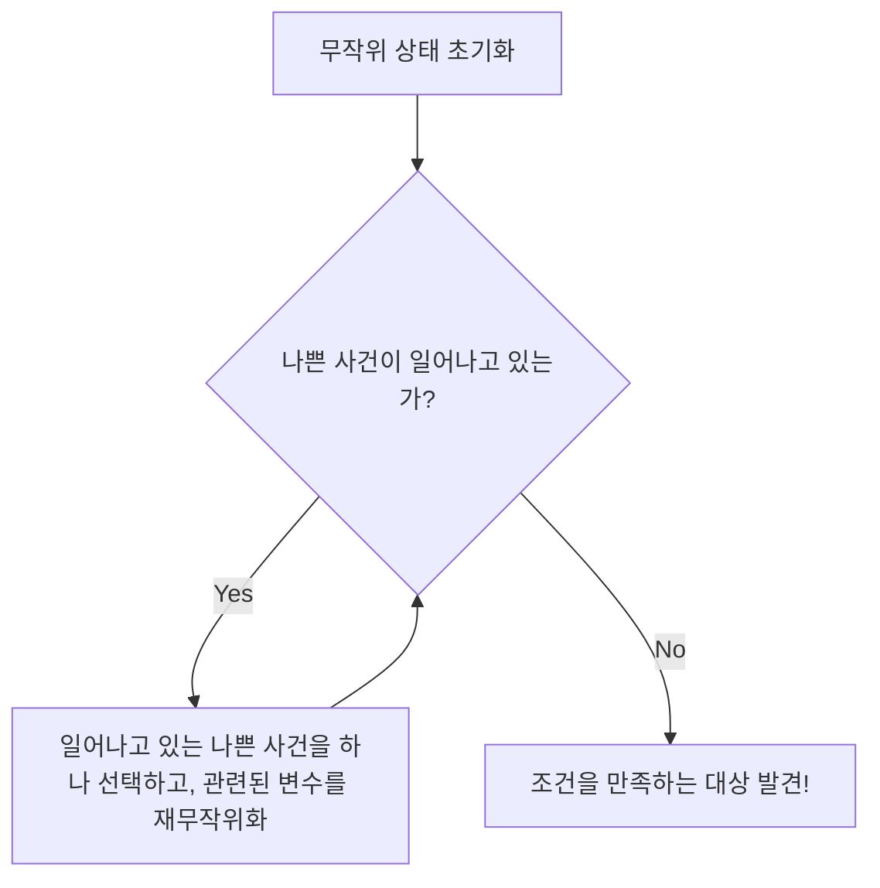

# 서론: 존재를 증명하기 위한 '랜덤'이라는 마법

수학에서 '어떤 조건을 만족하는 대상이 존재한다'는 것을 증명하는 방법에는 크게 두 가지 접근법이 있습니다. 하나는 그 대상을 구체적으로 구성해서 보여주는 '구성적 증명(Constructive proof)'입니다. 다른 하나는 그 대상이 구체적으로 무엇인지는 명시하지 않지만, 논리적으로 반드시 존재함을 보여주는 '비구성적 증명(Non-constructive proof)'입니다.

20세기를 대표하는 방랑의 천재 수학자, 폴 에르되시(Paul Erdős, 1913-1996)는 이 비구성적 증명에 혁명을 가져왔습니다. 그것이 바로 '확률적 방법(The Probabilistic Method)'이라고 불리는 놀라운 기법입니다. 에르되시가 확립한 이 기법의 기본 아이디어는 한마디로 다음과 같이 표현할 수 있습니다.

**"조건을 만족하는 대상이 존재함을 보여주기 위해, 대상을 무작위로 선택하고 그것이 조건을 만족할 확률이 0보다 큼을 보여주면 된다."**

이 언뜻 보기에 당연해 보이는 아이디어가 이산수학, [그래프 이론](/ko/p/graph-theory-dijkstra-a-star/), 컴퓨터 과학, 정보 이론 등 다방면에 걸쳐 강력한 위력을 발휘합니다. 본 기사에서는 이 확률적 방법의 기초부터 [램지 이론](/ko/p/ramsey-theory/)(Ramsey Theory)에서의 유명한 응용, 나아가 로바스 국소 보조정리(Lovász Local Lemma), 랜덤 [그래프 이론](/ko/p/graph-theory-dijkstra-a-star/)으로의 전개, 그리고 Python을 이용한 시뮬레이션까지 매우 상세하고 깊이 있게 파헤쳐 설명하겠습니다.

---

## 폴 에르되시: 수학에 인생을 바친 방랑의 천재

확률적 방법의 주제로 들어가기 전에, 그 창시자인 폴 에르되시에 대해 언급하지 않을 수 없습니다. 에르되시는 헝가리 부다페스트에서 태어나 평생 집이나 재산을 갖지 않고 전 세계 수학자들의 집을 전전하며 공동 연구를 계속했습니다. 그가 발표한 논문 수는 약 1500편에 달하며, [레온하르트 오일러](/ko/p/euler/)에 이어 역사상 두 번째로 다작한 수학자로 알려져 있습니다.

에르되시는 수학적 대상을 신이 가진 '궁극의 증명이 적힌 책(The Book)'에서 찾아내는 것이라고 생각했습니다. 그에게 있어 아름답고 간결하며 본질을 꿰뚫는 증명은 'The Book에 실려 있는 증명'이었습니다. 확률적 방법은 바로 The Book에 실리기에 합당한, 마법과도 같은 우아함을 지니고 있습니다.

---

## 확률적 방법의 기본 원리

확률적 방법의 핵심 논리는 지극히 단순합니다.
어떤 유한집합 $S$와 그 부분집합 $A$ (우리가 찾고 있는 '좋은' 대상의 집합)가 있다고 가정해 봅시다. $A$가 공집합이 아님(즉, '좋은' 대상이 적어도 1개 존재함)을 보이고 싶다고 합시다.

확률 공간을 도입하여, $S$의 원소를 어떤 확률 분포에 따라 무작위로 선택합니다. 선택된 원소를 $X$라고 합니다. 이때 $X \in A$가 될 확률 $P(X \in A)$가 엄밀하게 $0$보다 크다는 것, 즉
$$ P(X \in A) > 0 $$
임을 증명할 수 있다면, 논리적으로 $A$는 공집합이 아니다, 즉 '좋은 대상은 존재한다'고 결론지을 수 있습니다.

왜냐하면, 만약 '좋은 대상'이 단 하나도 존재하지 않는다면 무작위로 선택한 것이 '좋은 대상'이 될 확률은 완전히 $0$이 되어야 하기 때문입니다. 확률이 양수라는 것은 가능성으로서 일어날 수 있다는 뜻이며, 이는 곧 '존재한다'는 것과 다름없습니다.

---

## 램지 수 $R(k, k)$의 하한: 확률적 방법의 금자탑

확률적 방법의 위력을 세상에 알린 에르되시의 1947년 논문은 [램지 이론](/ko/p/ramsey-theory/)(Ramsey Theory)에서 램지 수 $R(k, k)$의 하한에 관한 것이었습니다.

### 램지 이론이란

[램지 이론](/ko/p/ramsey-theory/)의 철학은 "완전한 무질서는 존재하지 않는다"는 것입니다. 아무리 복잡하고 무작위해 보이는 구조 속에서도, 대상이 충분히 크다면 반드시 어떤 종류의 규칙적인 부분 구조가 존재한다는 이론입니다.

유명한 "파티 정리(친구와 낯선 사람 정리)"는 $R(3, 3) = 6$임을 보여줍니다. 즉, 6명이 모이면 서로 아는 사이인 3명(빨간 삼각형), 또는 서로 전혀 모르는 사이인 3명(파란 삼각형)이 반드시 존재한다는 것입니다.

일반적으로 램지 수 $R(k, l)$은 원소 수가 $N$인 완전 그래프 $K_N$의 간선을 빨간색과 파란색 2가지 색으로 어떻게 칠하더라도, 반드시 빨간색 완전 그래프 $K_k$ 또는 파란색 완전 그래프 $K_l$이 포함되도록 하는 최소의 정수 $N$으로 정의됩니다.

### 에르되시의 증명 (1947년)

에르되시는 대각 램지 수 $R(k, k)$에 대해 다음과 같은 놀라운 하한을 제시했습니다.

**정리 (Erdős, 1947):**
$k \ge 3$일 때,
$$ R(k, k) > \lfloor 2^{k/2} \rfloor $$
가 성립한다.

**증명 해설:**
이 정리를 '구성적'으로 증명하려고 하면 매우 어렵습니다. 즉, $N = \lfloor 2^{k/2} \rfloor$개의 정점을 가진 그래프의 간선을 특정 규칙으로 빨강과 파랑으로 칠하여, '크기가 $k$인 단색 완전 그래프가 포함되지 않는' 구체적인 채색 방법을 제시해야 합니다. 이는 $k$가 커지면 터무니없는 조합의 폭발을 일으킵니다.

여기서 에르되시의 확률적 방법이 등장합니다.

1. **확률 공간의 구성:**
   $N$개의 정점을 가진 완전 그래프 $K_N$을 생각합니다. 그 모든 간선(총 $\binom{N}{2}$개)을 각각 독립적으로 확률 $1/2$로 빨간색, 확률 $1/2$로 파란색으로 칠한다고 합시다 (동전 던지기에 의한 무작위 채색).

2. **사건의 정의:**
   $V$를 $K_N$의 정점 집합이라 합시다. $V$의 부분집합 중 원소의 개수가 $k$인 것을 $S_i$라고 합니다. 이러한 부분집합은 총 $\binom{N}{k}$개 있습니다.
   각 $S_i$에 대해, 사건 $A_i$를 '$S_i$에 속하는 정점으로 이루어진 부분 완전 그래프가 단색(모두 빨강, 또는 모두 파랑)이 된다'고 정의합니다.

3. **확률의 계산:**
   어떤 특정한 $S_i$에 주목합니다. $S_i$는 $k$개의 정점을 가지므로, 그 내부에는 $\binom{k}{2}$개의 간선이 있습니다. 이들이 모두 같은 색이 될 확률은,
   $$ P(A_i) = 2 \times \left( \frac{1}{2} \right)^{\binom{k}{2}} = 2^{1 - \binom{k}{2}} $$
   가 됩니다. (모두 빨간색이 될 확률과 모두 파란색이 될 확률을 더한 것)

4. **유니온 바운드(Boole의 부등식)의 적용:**
   '*적어도 하나의* 단색 $K_k$가 존재한다'는 사건은 $\bigcup A_i$로 나타낼 수 있습니다. 이 확률은 유니온 바운드에 의해 위에서 평가할 수 있습니다.
   $$ P\left( \bigcup A_i \right) \le \sum_{i} P(A_i) = \binom{N}{k} 2^{1 - \binom{k}{2}} $$

5. **'존재'의 증명:**
   만약 이 확률이 엄밀하게 $1$보다 작다면, 그 여사건인 '*어떤* $S_i$도 단색이 되지 않는다'는 확률이 $0$보다 큰 것이 됩니다.
   $$ P\left( \bigcap \overline{A_i} \right) = 1 - P\left( \bigcup A_i \right) > 0 $$
   이를 보이기 위해서는,
   $$ \binom{N}{k} 2^{1 - \binom{k}{2}} < 1 $$
   이 되면 됩니다.
   
   $\binom{N}{k} < \frac{N^k}{k!}$를 사용하여 계산을 진행하면, $N \le 2^{k/2}$이면 위 부등식이 만족됨을 알 수 있습니다.
   따라서 $N = \lfloor 2^{k/2} \rfloor$일 때, 단색 $K_k$를 포함하지 않는 채색 방법이 '확률적으로 존재'하는 것입니다. 그러므로 $R(k, k)$는 그보다 엄밀히 커야 합니다. 증명 끝.

이 증명은 대상을 전혀 구성하지 않고도 그 존재만을 선명하게 증명하고 있습니다. 이것이 바로 에르되시의 마법입니다.

---

## 선형성의 기댓값 (Linearity of Expectation)과 그 위력

확률적 방법의 또 다른 강력한 무기는 '기댓값의 선형성'입니다. 이는 확률 변수 $X, Y$가 독립이든 종속이든 관계없이 항상
$$ E[X + Y] = E[X] + E[Y] $$
가 성립한다는 성질입니다.

### 토너먼트 그래프에서의 해밀턴 경로
토너먼트란 완전 그래프의 각 간선에 방향을 부여한 유향 그래프를 말합니다 (리그전의 결과를 나타냅니다).
정리: 모든 $n$에 대해, $n! 2^{-(n-1)}$개 이상의 해밀턴 경로(모든 정점을 한 번씩 지나는 유향 경로)를 가지는 $n$ 정점의 토너먼트가 존재한다.

이를 증명하기 위해, 정점 집합에 무작위로 간선의 방향을 할당한 랜덤 토너먼트를 생각합니다. 어떤 특정한 정점의 순열이 해밀턴 경로가 될 확률은 $2^{-(n-1)}$입니다. 순열은 총 $n!$가지가 있으므로, 해밀턴 경로 수의 기댓값은 $n! 2^{-(n-1)}$이 됩니다.
어떤 확률 변수가 기댓값 $E$를 갖는다면, 그 확률 변수가 $E$ 이상의 값을 취하는 사건이 반드시 존재합니다. 따라서 조건을 만족하는 토너먼트가 '존재한다'는 것이 즉각적으로 도출됩니다. 여기서도 '종속성'을 전혀 신경 쓰지 않고 더할 수 있는 기댓값의 선형성이 빛을 발합니다.

---

## 수정법 (The Alteration Method)

기본적인 확률적 방법에서는 '무작위로 만든 것이 그대로 조건을 만족할 확률'을 계산합니다. 하지만 때로는 '아까운' 것을 만든 후, 그것을 약간 수정(Alteration)하여 조건을 만족하는 것을 만들어내는 접근법이 유효합니다.

독립 집합(어느 두 정점도 간선으로 연결되어 있지 않은 정점 집합)의 하한을 구할 때 이 수정법이 사용됩니다. 무작위로 정점을 선택하고, 선택된 정점 집합 내에서 간선으로 연결된 쌍이 있다면 한쪽을 버리는 조작을 수행함으로써 확실하게 독립 집합을 얻을 수 있습니다.

---

## 로바스 국소 보조정리 (Lovász Local Lemma)

확률적 방법 진화에 있어서 가장 큰 돌파구 중 하나가 1975년 Paul Erdős와 László Lovász에 의해 증명된 '로바스 국소 보조정리(LLL)'입니다.

유니온 바운드는 강력하지만, 사건의 수가 많으면 확률의 상한이 1을 넘어버려 쓸모가 없어진다는 약점이 있습니다. 하지만 만약 나쁜 사건들이 '거의 독립'이라면, 모든 나쁜 사건을 동시에 피할 수 있는 확률은 양수일 것입니다. 이를 정식화한 것이 LLL입니다.

**대칭형 LLL의 주장:**
$A_1, A_2, \dots, A_n$을 사건이라 하자. 각 사건의 확률이 $P(A_i) \le p$이고, 각 사건이 다른 사건 중 최대 $d$개와만 종속되어 있다(즉, 그 이외의 사건과는 독립이다)고 하자.
만약,
$$ e \cdot p \cdot (d + 1) \le 1 $$
(여기서 $e$는 자연로그의 밑)이 성립한다면,
$$ P\left( \bigcap_{i=1}^n \overline{A_i} \right) > 0 $$
이다. 즉, 모든 나쁜 사건을 동시에 피할 수 있는 가능성이 반드시 존재한다.

이 보조정리는 그래프의 채색 문제, 충족 가능성 문제(SAT), 패킹 문제 등에서 절대적인 효과를 발휘합니다. 놀랍게도 2009년에 Moser와 Tardos에 의해, 이 LLL이 단순한 존재 증명에 그치지 않고 알고리즘적으로(게다가 효율적으로) 그 해를 찾아낼 수 있음이 증명되어 (Moser-Tardos 알고리즘), 컴퓨터 과학에 큰 충격을 주었습니다.


*그림: Moser-Tardos 알고리즘의 개념도. LLL의 조건이 만족된다면, 이 알고리즘은 다항 시간에 정지함이 증명되어 있다.*

---

## 랜덤 그래프 이론: 에르되시-레니 모델

확률적 방법을 그래프 자체의 연구에 적용한 것이 '랜덤 [그래프 이론](/ko/p/graph-theory-dijkstra-a-star/)'입니다. 에르되시와 레니 알프레드는 1959년에 랜덤 그래프 모델 $G(n, p)$를 도입했습니다. 이는 $n$개의 정점을 가지고, 각 쌍 사이에 확률 $p$로 독립적으로 간선이 존재하는 그래프입니다.

그들은 확률 $p$를 정점 수 $n$의 함수 $p(n)$으로 변화시켰을 때, 그래프의 성질이 '상전이(Phase Transition)'처럼 갑자기 변화하는 임계값(Threshold)이 존재함을 발견했습니다.

- $p(n) \ll 1/n$일 때, 그래프는 작은 트리(tree)들의 모임이 됩니다.
- $p(n) = c/n$ ($c > 1$)일 때, 거대한 연결 성분(Giant Component)이 갑자기 출현합니다.
- $p(n) = \frac{\ln n}{n}$일 때, 그래프 전체가 하나의 연결 성분이 됩니다.

이는 물리학에서의 물의 결빙이나 비등과 같은 상전이 현상과 완전히 동일한 수학적 구조를 가지고 있습니다.

### Python을 이용한 랜덤 그래프의 상전이 시뮬레이션

확률적인 성질을 이해하기 위해서는 실제로 코드를 작성하여 시뮬레이션을 수행하는 것이 효과적입니다. 다음은 Python과 `networkx` 라이브러리를 사용하여 거대 연결 성분의 출현을 시뮬레이션하는 코드 예시입니다.

```python
import networkx as nx
import matplotlib.pyplot as plt
import numpy as np

def simulate_giant_component(n, p_values):
    """
    정점 수 n인 랜덤 그래프 G(n, p)에서,
    최대 연결 성분의 크기가 확률 p에 따라 어떻게 변화하는지 시뮬레이션한다.
    """
    max_component_sizes = []
    
    for p in p_values:
        # Erdos-Renyi 랜덤 그래프 생성
        G = nx.erdos_renyi_graph(n, p)
        # 연결 성분을 크기가 큰 순서대로 가져오기
        components = sorted(nx.connected_components(G), key=len, reverse=True)
        if components:
            # 최대 연결 성분의 크기(정점 수)를 전체의 비율로 기록
            max_size = len(components[0]) / n
        else:
            max_size = 0
        max_component_sizes.append(max_size)
        
    return max_component_sizes

# 정점 수 n = 1000
n = 1000
# 확률 p를 0.000에서 0.005까지 변화시킴 (임계값은 1/1000 = 0.001)
p_values = np.linspace(0, 0.005, 50)
sizes = simulate_giant_component(n, p_values)

# 결과 플롯
plt.figure(figsize=(10, 6))
plt.plot(p_values * n, sizes, marker='o', linestyle='-', color='b')
plt.axvline(x=1.0, color='r', linestyle='--', label='상전이 임계값 (p = 1/n)')
plt.title("Erdős-Rényi 그래프에서의 거대 연결 성분의 상전이", fontsize=14)
plt.xlabel("평균 차수 (p * n)", fontsize=12)
plt.ylabel("최대 연결 성분의 비율", fontsize=12)
plt.legend()
plt.grid(True)
plt.show()
```

이 코드를 실행하면, $p \cdot n = 1$을 기점으로 최대 연결 성분의 크기가 0에 가까운 상태에서 급격히 증가하여 그래프 전체의 대부분을 차지하게 되는 모습을 그래프로 시각적으로 확인할 수 있습니다.

---

## 현대에서의 확률적 방법의 응용

에르되시가 뿌린 씨앗은 현대 컴퓨터 과학에서 필수적인 도구로 꽃피우고 있습니다.

1. **무작위 알고리즘 (Randomized Algorithms):**
   퀵 정렬의 피벗 선택부터 소수 판별 알고리즘(밀러-라빈 소수 판별법 등), 나아가 거대한 데이터셋의 해시 함수까지, 현대의 알고리즘은 무작위성을 이용하여 계산 속도와 근사 정확도를 획기적으로 향상시키고 있습니다.

2. **오류 정정 부호 (Error Correcting Codes):**
   섀넌의 정보 이론에서 통신로 용량의 한계에 도달하는 우수한 부호가 '존재한다'는 것도 확률적 방법에 의해 증명되었습니다. 무작위로 생성된 부호가 높은 확률로 뛰어난 오류 정정 능력을 가짐이 밝혀진 것입니다.

3. **기계 학습과 AI:**
   신경망의 초기화, 드롭아웃(Dropout)에 의한 정규화, 확률적 경사 하강법(SGD) 등 현대 AI 기술의 대부분도 깊은 곳에서 확률론적인 성질에 의존하고 있습니다. 고차원 공간에서의 랜덤 벡터의 성질(차원의 저주와 축복)은 확률적 방법을 이용하여 해석됩니다.

---

## 결론: 존재란 무엇인가?

폴 에르되시의 확률적 방법은 '존재'라는 수학의 근원적인 개념에 대한 우리의 인식을 크게 바꿔놓았습니다.
구체적인 형태가 주어지지 않더라도, 무작위한 카오스 속에서 질서를 찾아내어 '그것이 존재할 확률은 영이 아니다'라고 말함으로써 확실하게 존재를 증명합니다. 이는 마치 광활한 우주 어딘가에 지구와 같은 별이 존재한다는 것을 확률 방정식으로 말하는 것과 같은 로망을 간직하고 있습니다.

수학에 'The Book'이 있다면, 확률적 방법의 장은 틀림없이 그 앞부분 즈음에 황금빛 글씨로 적혀 있을 것입니다. 무작위성은 단순한 무질서가 아니라, 깊은 진리를 비추는 빛인 것입니다.
