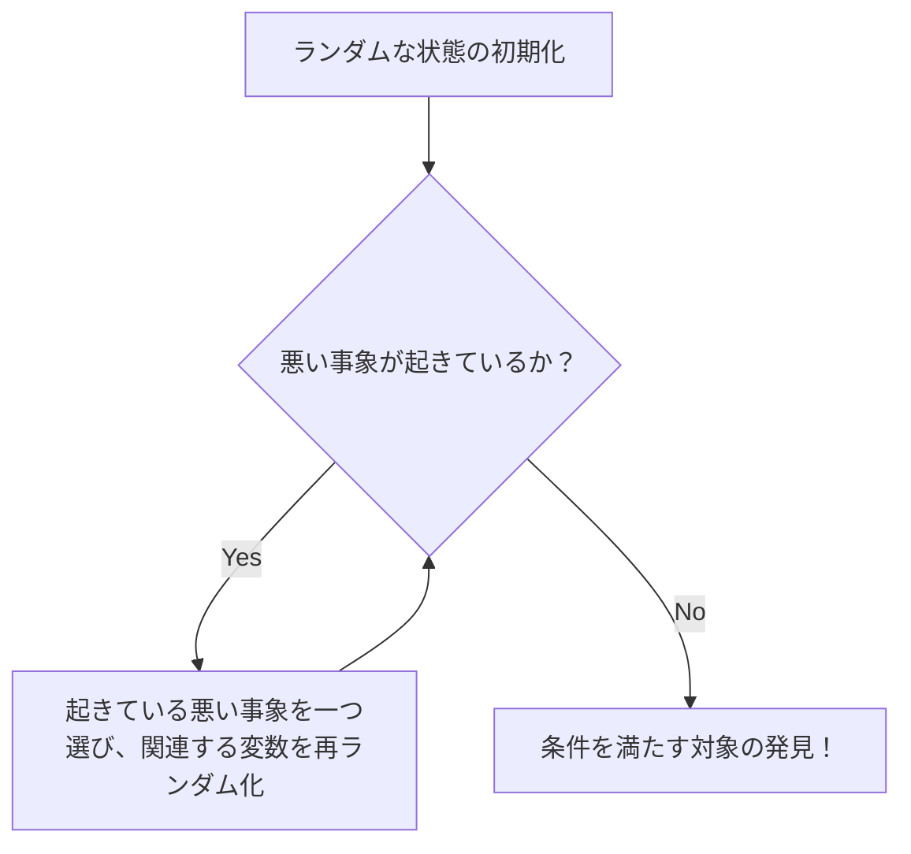

# はじめに：存在を証明するための「ランダム」という魔法

数学において、「ある条件を満たす対象が存在する」ことを証明する方法には、大きく分けて二つのアプローチがあります。一つは、その対象を具体的に構成して見せる「構成的証明」です。もう一つは、その対象が具体的に何であるかは明示しないものの、論理的に必ず存在することを示す「非構成的証明」です。

20世紀を代表する放浪の天才数学者、ポール・エルデシュ（Paul Erdős, 1913-1996）は、この非構成的証明に革命をもたらしました。それが「確率的方法（The Probabilistic Method）」と呼ばれる驚くべき手法です。エルデシュが確立したこの手法の基本的なアイデアは、一言で言えば次のように表現できます。

**「条件を満たす対象が存在することを示すために、対象をランダムに選び、それが条件を満たす確率が0より大きいことを示せばよい。」**

この一見すると当たり前のようなアイデアが、離散数学、グラフ理論、計算機科学、情報理論など、多岐にわたる分野で強力な威力を発揮します。本記事では、この確率的方法の基礎から、[ラムゼー理論](/p/ramsey-theory/)における有名な応用、さらにはロヴァースの局所補題（Lovász Local Lemma）、ランダムグラフ理論への展開、そしてPythonを用いたシミュレーションまで、非常に詳細かつ深く掘り下げて解説していきます。

---

## ポール・エルデシュ：数学に人生を捧げた放浪の天才

確率的方法の話題に入る前に、その創始者であるポール・エルデシュについて触れないわけにはいきません。エルデシュはハンガリーのブダペストに生まれ、生涯を通じて家や財産を持たず、世界中の数学者の家を渡り歩きながら共同研究を続けました。彼の発表した論文数は約1500編にのぼり、[レオンハルト・オイラー](/p/euler/)に次ぐ史上2位の多産な数学者として知られています。

エルデシュは、数学的対象を神の持つ「究極の証明が書かれた本（The Book）」から見つけ出すことだと考えていました。彼にとって、美しく簡潔で、本質を突いた証明は「The Bookに載っている証明」でした。確率的方法は、まさにThe Bookに載るにふさわしい、魔法のようなエレガントさを持っています。

---

## 確率的方法の基本原理

確率的方法の核となる論理は極めてシンプルです。
ある有限集合 $S$ と、その部分集合 $A$ （私たちが探している「良い」対象の集合）があるとします。$A$ が空でないこと（つまり「良い」対象が少なくとも1つ存在すること）を示したいとします。

確率空間を導入し、$S$ の要素をある確率分布に従ってランダムに選びます。選ばれた要素を $X$ とします。このとき、$X \in A$ となる確率 $P(X \in A)$ が厳密に $0$ より大きい、すなわち
$$ P(X \in A) > 0 $$
であることを証明できれば、論理的に $A$ は空ではない、つまり「良い対象は存在する」と結論づけられます。

なぜなら、もし「良い対象」が一つも存在しないならば、ランダムに選んだものが「良い対象」になる確率は完全に $0$ になるはずだからです。確率が正であるということは、可能性として起こり得るということであり、それはすなわち「存在する」ということに他なりません。

---

## ラムゼー数 $R(k, k)$ の下界：確率的方法の金字塔

確率的方法の威力を世界に知らしめたエルデシュの1947年の論文は、[ラムゼー理論](/p/ramsey-theory/)（Ramsey Theory）におけるラムゼー数 $R(k, k)$ の下界に関するものでした。

### ラムゼー理論とは

[ラムゼー理論](/p/ramsey-theory/)の哲学は「完全な無秩序は存在しない」というものです。どんなに複雑でランダムに見える構造の中にも、対象が十分に大きければ、必ずある種の規則的な部分構造が存在するという理論です。

有名な「パーティーの定理（友達・見知らぬ人定理）」は、$R(3, 3) = 6$ であることを示しています。すなわち、6人が集まれば、互いに知り合いである3人組（赤い三角形）、または互いに全く見知らぬ3人組（青い三角形）が必ず存在するというものです。

一般に、ラムゼー数 $R(k, l)$ は、要素数 $N$ の完全グラフ $K_N$ の辺を赤と青の2色でどのように塗り分けても、必ず赤の完全グラフ $K_k$ または青の完全グラフ $K_l$ が含まれるような最小の整数 $N$ として定義されます。

### エルデシュの証明（1947年）

エルデシュは、対角ラムゼー数 $R(k, k)$ に対し、以下の驚くべき下界を与えました。

**定理 (Erdős, 1947):**
$k \ge 3$ のとき、
$$ R(k, k) > \lfloor 2^{k/2} \rfloor $$
が成り立つ。

**証明の解説:**
この定理を「構成的」に証明しようとすると、非常に困難です。すなわち、$N = \lfloor 2^{k/2} \rfloor$ 個の頂点を持つグラフの辺を、特定のルールで赤と青に塗り分け、「サイズの $k$ の単色完全グラフが含まれない」ような具体的な彩色方法を提示しなければなりません。これは $k$ が大きくなると途方もない組み合わせの爆発を引き起こします。

ここでエルデシュの確率的方法が登場します。

1. **確率空間の構成:**
   $N$ 個の頂点を持つ完全グラフ $K_N$ を考えます。そのすべての辺（合計 $\binom{N}{2}$ 本）を、それぞれ独立に確率 $1/2$ で赤に、確率 $1/2$ で青に塗る（コイン投げによるランダムな彩色）とします。

2. **事象の定義:**
   $V$ を $K_N$ の頂点集合とします。$V$ の部分集合のうち、要素数が $k$ であるものを $S_i$ とします。このような部分集合は全部で $\binom{N}{k}$ 個あります。
   各 $S_i$ に対し、事象 $A_i$ を「$S_i$ に属する頂点からなる部分完全グラフが単色（すべて赤、またはすべて青）になる」と定義します。

3. **確率の計算:**
   ある特定の $S_i$ に着目します。$S_i$ は $k$ 個の頂点を持つので、その内部には $\binom{k}{2}$ 本の辺があります。これらがすべて同じ色になる確率は、
   $$ P(A_i) = 2 \times \left( \frac{1}{2} \right)^{\binom{k}{2}} = 2^{1 - \binom{k}{2}} $$
   となります。（すべて赤になる確率とすべて青になる確率を足したもの）

4. **ユニオンバウンド（Booleの不等式）の適用:**
   「*少なくとも1つの* 単色 $K_k$ が存在する」という事象は、$\bigcup A_i$ と表せます。この確率は、ユニオンバウンドによって上から評価できます。
   $$ P\left( \bigcup A_i \right) \le \sum_{i} P(A_i) = \binom{N}{k} 2^{1 - \binom{k}{2}} $$

5. **「存在」の証明:**
   もし、この確率が厳密に $1$ より小さければ、その補事象である「*どの* $S_i$ も単色にならない」確率が $0$ より大きいことになります。
   $$ P\left( \bigcap \overline{A_i} \right) = 1 - P\left( \bigcup A_i \right) > 0 $$
   これを示すには、
   $$ \binom{N}{k} 2^{1 - \binom{k}{2}} < 1 $$
   となればよいのです。
   
   $\binom{N}{k} < \frac{N^k}{k!}$ を用いて計算を進めると、$N \le 2^{k/2}$ であれば上記の不等式が満たされることが分かります。
   したがって、$N = \lfloor 2^{k/2} \rfloor$ のとき、単色 $K_k$ を含まないような彩色の方法が「確率的に存在」するのです。よって、$R(k, k)$ はそれよりも厳密に大きい必要があります。証明終わり。

この証明は、対象を一切構成せずに、その存在だけを鮮やかに証明しています。これぞまさにエルデシュの魔法です。

---

## 線形性の期待値（Linearity of Expectation）とその威力

確率的方法のもう一つの強力な武器は「期待値の線形性」です。これは、確率変数 $X, Y$ が独立であっても従属であっても、常に
$$ E[X + Y] = E[X] + E[Y] $$
が成り立つという性質です。

### トーナメントグラフにおけるハミルトンパス
トーナメントとは、完全グラフの各辺に向きを与えた有向グラフのことです（総当たり戦の結果を表します）。
定理：すべての $n$ に対し、$n! 2^{-(n-1)}$ 個以上のハミルトンパス（すべての頂点を1度ずつ通る有向パス）を持つ $n$ 頂点のトーナメントが存在する。

これを証明するために、頂点集合にランダムに辺の向きを割り当てたランダムトーナメントを考えます。ある特定の頂点の順列がハミルトンパスになる確率は $2^{-(n-1)}$ です。順列は全部で $n!$ 通りあるため、ハミルトンパスの数の期待値は $n! 2^{-(n-1)}$ となります。
ある確率変数が期待値 $E$ を持つなら、その確率変数が $E$ 以上の値をとるような事象が必ず存在します。したがって、条件を満たすトーナメントが「存在する」ことが即座に導かれます。ここでも「依存性」を全く気にせずに足し合わせができる期待値の線形性が輝いています。

---

## 修正法（The Alteration Method）

基本的な確率的方法では「ランダムに作ったものがそのまま条件を満たす確率」を計算します。しかし、時には「惜しい」ものを作ってから、それを少し修正（Alteration）して条件を満たすものを作り出すアプローチが有効です。

独立集合（どの2つの頂点も辺で結ばれていない頂点の集合）の下界を求める際にこの修正法が用いられます。ランダムに頂点を選び、選ばれた頂点集合の中で辺で結ばれているペアがあれば、片方を捨てるという操作を行うことで、確実に独立集合を得ることができます。

---

## ロヴァースの局所補題（Lovász Local Lemma）

確率的方法の進化における最大のブレイクスルーの一つが、1975年にPaul ErdősとLászló Lovászによって証明された「ロヴァースの局所補題（LLL）」です。

ユニオンバウンドは強力ですが、事象の数が多いと確率の上限が1を超えてしまい役に立たなくなるという弱点があります。しかし、もし悪い事象たちが「ほとんど独立」であるならば、すべての悪い事象が同時に回避できる確率は正であるはずです。それを定式化したのがLLLです。

**対称形 LLL の主張:**
$A_1, A_2, \dots, A_n$ を事象とする。各事象の確率が $P(A_i) \le p$ であり、各事象が他の事象のうち最大 $d$ 個とだけ従属している（つまり、それ以外の事象とは独立している）とする。
もし、
$$ e \cdot p \cdot (d + 1) \le 1 $$
（ここで $e$ はネイピア数）が成り立つならば、
$$ P\left( \bigcap_{i=1}^n \overline{A_i} \right) > 0 $$
である。すなわち、すべての悪い事象を同時に回避できる可能性が必ず存在する。

この補題は、グラフの彩色問題、充足可能性問題（SAT）、パッキング問題などにおいて、絶大な効果を発揮します。驚くべきことに、2009年にMoserとTardosによって、このLLLが単なる存在証明にとどまらず、アルゴリズム的に（しかも効率的に）その解を見つけ出すことができることが証明され（Moser-Tardos アルゴリズム）、計算機科学に大きな衝撃を与えました。


*図: Moser-Tardos アルゴリズムの概念図。LLLの条件が満たされていれば、このアルゴリズムは多項式時間で停止することが証明されている。*

---

## ランダムグラフ理論：エルデシュ・レーニモデル

確率的方法をグラフそのものの研究に適用したのが「ランダムグラフ理論」です。エルデシュとレーニ・アルフレードは、1959年にランダムグラフのモデル $G(n, p)$ を導入しました。これは、$n$ 個の頂点を持ち、各ペア間に確率 $p$ で独立に辺が存在するグラフです。

彼らは、確率 $p$ を頂点数 $n$ の関数 $p(n)$ として変化させたとき、グラフの性質が「相転移（Phase Transition）」のように突如として変化する閾値（Threshold）が存在することを発見しました。

- $p(n) \ll 1/n$ のとき、グラフは小さな木（tree）の集まりになります。
- $p(n) = c/n$ ($c > 1$) のとき、巨大な連結成分（Giant Component）が突如として出現します。
- $p(n) = \frac{\ln n}{n}$ のとき、グラフ全体が一つの連結成分になります。

これは物理学における水の氷結や沸騰といった相転移現象と全く同じ数学的構造を持っています。

### Pythonによるランダムグラフの相転移シミュレーション

確率的な性質を理解するためには、実際にコードを書いてシミュレーションを行うことが有効です。以下は Python と `networkx` ライブラリを使用して、巨大連結成分の出現をシミュレーションするコード例です。

```python
import networkx as nx
import matplotlib.pyplot as plt
import numpy as np

def simulate_giant_component(n, p_values):
    """
    頂点数 n のランダムグラフ G(n, p) において、
    最大の連結成分のサイズが確率 p によってどう変化するかをシミュレーションする。
    """
    max_component_sizes = []
    
    for p in p_values:
        # Erdos-Renyi ランダムグラフを生成
        G = nx.erdos_renyi_graph(n, p)
        # 連結成分をサイズの大きい順に取得
        components = sorted(nx.connected_components(G), key=len, reverse=True)
        if components:
            # 最大連結成分のサイズ（頂点数）を全体の割合として記録
            max_size = len(components[0]) / n
        else:
            max_size = 0
        max_component_sizes.append(max_size)
        
    return max_component_sizes

# 頂点数 n = 1000
n = 1000
# 確率 p を 0.000 から 0.005 まで変化させる (閾値は 1/1000 = 0.001)
p_values = np.linspace(0, 0.005, 50)
sizes = simulate_giant_component(n, p_values)

# 結果のプロット
plt.figure(figsize=(10, 6))
plt.plot(p_values * n, sizes, marker='o', linestyle='-', color='b')
plt.axvline(x=1.0, color='r', linestyle='--', label='相転移の閾値 (p = 1/n)')
plt.title("Erdős-Rényi グラフにおける巨大連結成分の相転移", fontsize=14)
plt.xlabel("平均次数 (p * n)", fontsize=12)
plt.ylabel("最大連結成分の割合", fontsize=12)
plt.legend()
plt.grid(True)
plt.show()
```

このコードを実行すると、$p \cdot n = 1$ を境に、最大連結成分のサイズがゼロに近い状態から急激に立ち上がり、グラフ全体の大部分を占めるようになる様子がグラフで視覚的に確認できます。

---

## 現代における確率的方法の応用

エルデシュが蒔いた種は、現代のコンピュータサイエンスにおいて不可欠なツールとして開花しています。

1. **乱択アルゴリズム (Randomized Algorithms):**
   クイックソートのピボット選択から、素数判定アルゴリズム（ミラー・ラビン素数判定法など）、さらには巨大なデータセットのハッシュ関数まで、現代のアルゴリズムはランダム性を利用して計算速度や近似精度を劇的に向上させています。

2. **[誤り訂正符号](/p/error-correcting-codes-explained/) (Error Correcting Codes):**
   シャノンの情報理論において、通信路容量の限界に達するような優れた符号が「存在する」ことも、確率的方法によって証明されました。ランダムに生成された符号が、高い確率で優れた誤り訂正能力を持つことが示されたのです。

3. **機械学習とAI:**
   ニューラルネットワークの初期化、ドロップアウト（Dropout）による正則化、確率的勾配降下法（SGD）など、現代のAI技術の多くも、深層で確率論的な性質に依存しています。高次元空間におけるランダムベクトルの性質（次元の呪いと祝福）は、確率的方法を用いて解析されます。

---

## 結論：存在とは何か？

ポール・エルデシュの確率的方法は、「存在」という数学の根源的な概念に対する私たちの認識を大きく変えました。
具体的な形を与えられなくても、無作為なカオスの中に秩序を見出し、「それが存在する確率はゼロではない」と語ることで、確実に存在を証明する。それはまるで、広大な宇宙のどこかに地球のような星が存在することを、確率の方程式で語るようなロマンを秘めています。

数学における「The Book」があるとすれば、確率的方法の章は間違いなくその冒頭近くに、黄金の文字で記されていることでしょう。ランダム性は単なる無秩序ではなく、深い真理を照らし出す光なのです。
