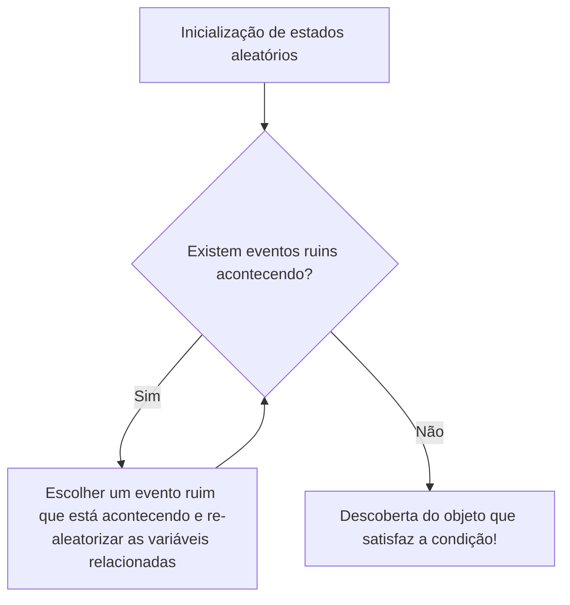

# Introdução: A magia do "aleatório" para provar a existência

Na matemática, os métodos para provar que "existe um objeto satisfazendo uma certa condição" podem ser amplamente divididos em duas abordagens. Uma é a "prova construtiva", onde o objeto é concretamente construído e mostrado. A outra é a "prova não construtiva", que demonstra logicamente que o objeto deve existir, embora sem especificar concretamente qual é.

O genial matemático errante representativo do século 20, Paul Erdős (1913-1996), revolucionou essas provas não construtivas. Isso é o surpreendente método chamado "O Método Probabilístico" (The Probabilistic Method). A ideia básica desse método estabelecido por Erdős pode ser expressa em uma palavra como a seguir.

**"Para mostrar que existe um objeto satisfazendo a condição, basta escolher um objeto aleatoriamente e mostrar que a probabilidade de ele satisfazer a condição é estritamente maior que 0."**

Essa ideia, que à primeira vista parece óbvia, demonstra um poder formidável em uma ampla gama de campos, incluindo matemática discreta, [teoria dos grafos](/pt/p/graph-theory-dijkstra-a-star/), ciência da computação, teoria da informação, etc. Neste artigo, exploraremos profundamente e em detalhes os fundamentos desse método probabilístico, desde suas famosas aplicações na [Teoria de Ramsey](/pt/p/ramsey-theory/), passando pelo Lema Local de Lovász (Lovász Local Lemma), desenvolvimentos na [teoria dos grafos](/pt/p/graph-theory-dijkstra-a-star/) aleatórios e simulações usando Python.

---

## Paul Erdős: O gênio errante que dedicou sua vida à matemática

Antes de entrar no tópico do Método Probabilístico, não podemos deixar de mencionar seu criador, Paul Erdős. Nascido em Budapeste, Hungria, Erdős não possuiu casa ou propriedades durante toda a sua vida, continuando suas pesquisas colaborativas enquanto vagava pelas casas de matemáticos ao redor do mundo. O número de artigos que publicou chega a cerca de 1500, tornando-o conhecido como o segundo matemático mais prolífico da história, perdendo apenas para [Leonhard Euler](/pt/p/euler/).

Erdős acreditava que fazer matemática era descobrir objetos do "O Livro" (The Book), mantido por Deus, onde as provas definitivas estão escritas. Para ele, uma prova bela, concisa e que atinge a essência era "uma prova do O Livro". O Método Probabilístico possui uma elegância mágica, sendo digno de constar no O Livro.

---

## Princípio Básico do Método Probabilístico

A lógica central do Método Probabilístico é extremamente simples.
Suponha que temos um conjunto finito $S$ e seu subconjunto $A$ (o conjunto de objetos "bons" que estamos procurando). Queremos mostrar que $A$ não é vazio (ou seja, existe pelo menos um objeto "bom").

Introduzimos um espaço de probabilidade e escolhemos aleatoriamente um elemento de $S$ de acordo com uma certa distribuição de probabilidade. Seja o elemento escolhido $X$. Se pudermos provar que a probabilidade $P(X \in A)$ de que $X \in A$ seja estritamente maior que $0$, ou seja,
$$ P(X \in A) > 0 $$
então podemos logicamente concluir que $A$ não é vazio, o que significa que "o objeto bom existe".

Isso ocorre porque, se não existisse nenhum "objeto bom", a probabilidade de que algo escolhido aleatoriamente seja um "objeto bom" seria completamente $0$. O fato de a probabilidade ser positiva significa que é uma possibilidade que pode ocorrer, e isso não é nada menos que dizer que ele "existe".

---

## O Limite Inferior do Número de Ramsey $R(k, k)$: O marco do Método Probabilístico

O artigo de 1947 de Erdős, que fez o mundo conhecer o poder do Método Probabilístico, tratava do limite inferior do número de Ramsey $R(k, k)$ na [Teoria de Ramsey](/pt/p/ramsey-theory/) (Ramsey Theory).

### O que é a Teoria de Ramsey?

A filosofia da [Teoria de Ramsey](/pt/p/ramsey-theory/) é que "a desordem completa não existe". É a teoria de que, por mais complexa e aleatória que uma estrutura possa parecer, se o objeto for grande o suficiente, sempre existirá algum tipo de subestrutura regular.

O famoso "Teorema da Festa" (Teorema dos Amigos e Estranhos) mostra que $R(3, 3) = 6$. Ou seja, se 6 pessoas se reunirem, sempre haverá um grupo de 3 pessoas que se conhecem mutuamente (um triângulo vermelho) ou um grupo de 3 pessoas que são completas estranhas umas para as outras (um triângulo azul).

Em geral, o número de Ramsey $R(k, l)$ é definido como o menor inteiro $N$ tal que, não importa como as arestas do grafo completo $K_N$ com $N$ vértices sejam coloridas com duas cores, vermelho e azul, sempre conterá um grafo completo vermelho $K_k$ ou um grafo completo azul $K_l$.

### A Prova de Erdős (1947)

Erdős forneceu o seguinte limite inferior surpreendente para o número de Ramsey diagonal $R(k, k)$.

**Teorema (Erdős, 1947):**
Para $k \ge 3$,
$$ R(k, k) > \lfloor 2^{k/2} \rfloor $$
é válido.

**Explicação da Prova:**
Tentar provar esse teorema de forma "construtiva" é extremamente difícil. Ou seja, teríamos que colorir as arestas de um grafo com $N = \lfloor 2^{k/2} \rfloor$ vértices de vermelho e azul sob regras específicas, e apresentar um método de coloração concreto onde "nenhum grafo completo monocromático de tamanho $k$ esteja contido". Isso causa uma explosão combinatória absurda à medida que $k$ aumenta.

Aqui entra o Método Probabilístico de Erdős.

1. **Construção do Espaço de Probabilidade:**
   Considere um grafo completo $K_N$ com $N$ vértices. Suponha que pintamos todas as suas arestas (um total de $\binom{N}{2}$) de forma independente com probabilidade $1/2$ para vermelho e probabilidade $1/2$ para azul (uma coloração aleatória através do lançamento de moedas).

2. **Definição dos Eventos:**
   Seja $V$ o conjunto de vértices de $K_N$. Sejam $S_i$ os subconjuntos de $V$ com $k$ elementos. Existem no total $\binom{N}{k}$ de tais subconjuntos.
   Para cada $S_i$, definimos o evento $A_i$ como "o subgrafo completo composto pelos vértices em $S_i$ é monocromático (todo vermelho ou todo azul)".

3. **Cálculo da Probabilidade:**
   Focamos em um $S_i$ específico. Como $S_i$ possui $k$ vértices, existem $\binom{k}{2}$ arestas dentro dele. A probabilidade de todas terem a mesma cor é:
   $$ P(A_i) = 2 \times \left( \frac{1}{2} \right)^{\binom{k}{2}} = 2^{1 - \binom{k}{2}} $$
   (A soma da probabilidade de ser todo vermelho com a probabilidade de ser todo azul).

4. **Aplicação do Limite de União (Desigualdade de Boole):**
   O evento de que "*pelo menos um* $K_k$ monocromático existe" pode ser expresso como $\bigcup A_i$. Essa probabilidade pode ser limitada superiormente pelo limite de união (union bound).
   $$ P\left( \bigcup A_i \right) \le \sum_{i} P(A_i) = \binom{N}{k} 2^{1 - \binom{k}{2}} $$

5. **Prova da "Existência":**
   Se essa probabilidade for estritamente menor que $1$, então o seu evento complementar de que "*nenhum* $S_i$ se torna monocromático" tem uma probabilidade estritamente maior que $0$.
   $$ P\left( \bigcap \overline{A_i} \right) = 1 - P\left( \bigcup A_i \right) > 0 $$
   Para mostrar isso, basta que:
   $$ \binom{N}{k} 2^{1 - \binom{k}{2}} < 1 $$
   
   Usando $\binom{N}{k} < \frac{N^k}{k!}$ e prosseguindo com os cálculos, pode-se ver que a desigualdade acima é satisfeita se $N \le 2^{k/2}$.
   Portanto, quando $N = \lfloor 2^{k/2} \rfloor$, existe "probabilisticamente" um método de coloração que não contém $K_k$ monocromático. Logo, $R(k, k)$ deve ser estritamente maior que isso. Fim da prova.

Esta prova não constrói nenhum objeto; ela brilhantemente prova apenas a sua existência. Isso é verdadeiramente a magia de Erdős.

---

## A Linearidade da Esperança (Linearity of Expectation) e seu Poder

Outra arma poderosa do Método Probabilístico é a "linearidade da esperança". Esta é a propriedade de que, quer as variáveis aleatórias $X, Y$ sejam independentes ou dependentes, sempre vale que
$$ E[X + Y] = E[X] + E[Y] $$

### Caminho Hamiltoniano em um Grafo de Torneio
Um torneio (tournament) é um grafo direcionado obtido ao atribuir uma direção a cada aresta de um grafo completo (representando os resultados de um torneio round-robin).
Teorema: Para todo $n$, existe um torneio de $n$ vértices com pelo menos $n! 2^{-(n-1)}$ caminhos Hamiltonianos (caminhos direcionados que visitam todos os vértices exatamente uma vez).

Para provar isso, considere um torneio aleatório onde a direção das arestas é atribuída aleatoriamente ao conjunto de vértices. A probabilidade de uma permutação específica de vértices ser um caminho Hamiltoniano é $2^{-(n-1)}$. Como existem $n!$ permutações no total, o valor esperado do número de caminhos Hamiltonianos é $n! 2^{-(n-1)}$.
Se uma variável aleatória tem uma esperança $E$, deve sempre existir um evento tal que essa variável assuma um valor maior ou igual a $E$. Portanto, conclui-se imediatamente que um torneio satisfazendo a condição "existe". Mais uma vez, brilha a linearidade da esperança, que permite somar sem se importar com a "dependência".

---

## O Método da Alteração (The Alteration Method)

No Método Probabilístico básico, calcula-se "a probabilidade de que algo criado aleatoriamente satisfaça a condição como está". No entanto, às vezes é eficaz usar a abordagem de criar algo que está "quase lá" e, em seguida, alterá-lo ligeiramente (Alteration) para criar algo que satisfaça a condição.

O Método da Alteração é usado ao buscar um limite inferior para conjuntos independentes (um conjunto de vértices em que não há dois vértices conectados por uma aresta). Ao selecionar vértices aleatoriamente e, se houver um par conectado por uma aresta dentro do conjunto de vértices selecionado, realizar a operação de descartar um deles, você pode obter com certeza um conjunto independente.

---

## O Lema Local de Lovász (Lovász Local Lemma)

Um dos maiores avanços na evolução do Método Probabilístico foi o "Lema Local de Lovász (LLL)", provado por Paul Erdős e László Lovász em 1975.

O limite de união é poderoso, mas tem a fraqueza de que, se o número de eventos for grande, o limite superior da probabilidade excede 1, tornando-se inútil. No entanto, se os eventos ruins forem "quase independentes", a probabilidade de que todos os eventos ruins possam ser evitados simultaneamente deve ser positiva. Isso é o que o LLL formaliza.

**Afirmação do LLL (versão simétrica):**
Sejam $A_1, A_2, \dots, A_n$ eventos. Suponha que a probabilidade de cada evento seja $P(A_i) \le p$, e que cada evento seja mutuamente dependente de no máximo $d$ outros eventos (ou seja, é independente dos demais eventos).
Se
$$ e \cdot p \cdot (d + 1) \le 1 $$
(onde $e$ é a base do logaritmo natural) é satisfeito, então
$$ P\left( \bigcap_{i=1}^n \overline{A_i} \right) > 0 $$
Ou seja, sempre existe a possibilidade de que todos os eventos ruins possam ser evitados simultaneamente.

Este lema demonstrou um efeito tremendo em problemas de coloração de grafos, problemas de satisfatibilidade (SAT), problemas de empacotamento, etc. Surpreendentemente, em 2009, Moser e Tardos provaram que este LLL não é apenas uma prova de existência, mas que a solução pode ser encontrada de forma algorítmica (e eficiente) (Algoritmo de Moser-Tardos), causando um grande impacto na ciência da computação.


*Figura: Diagrama conceitual do Algoritmo de Moser-Tardos. Está provado que, se as condições do LLL forem satisfeitas, esse algoritmo parará em tempo polinomial.*

---

## Teoria dos Grafos Aleatórios: O Modelo de Erdős-Rényi

A aplicação do Método Probabilístico ao próprio estudo dos grafos é a "[Teoria dos Grafos](/pt/p/graph-theory-dijkstra-a-star/) Aleatórios". Erdős e Alfréd Rényi introduziram o modelo de grafo aleatório $G(n, p)$ em 1959. Este é um grafo com $n$ vértices, onde uma aresta existe entre cada par de forma independente com probabilidade $p$.

Eles descobriram que, ao variar a probabilidade $p$ como uma função $p(n)$ do número de vértices $n$, existe um limite (Threshold) onde as propriedades do grafo mudam subitamente como em uma "Transição de Fase" (Phase Transition).

- Quando $p(n) \ll 1/n$, o grafo se torna uma coleção de pequenas árvores (trees).
- Quando $p(n) = c/n$ ($c > 1$), um componente conectado gigante (Giant Component) aparece repentinamente.
- Quando $p(n) = \frac{\ln n}{n}$, o grafo inteiro se torna um único componente conectado.

Isso tem a mesma estrutura matemática que fenômenos de transição de fase na física, como o congelamento e a ebulição da água.

### Simulação de Transição de Fase de Grafos Aleatórios com Python

Para entender as propriedades probabilísticas, é eficaz escrever códigos reais e fazer simulações. Abaixo está um exemplo de código que usa Python e a biblioteca `networkx` para simular o surgimento do componente conectado gigante.

```python
import networkx as nx
import matplotlib.pyplot as plt
import numpy as np

def simulate_giant_component(n, p_values):
    """
    Em um grafo aleatório G(n, p) com n vértices,
    simula como o tamanho do componente maximamente conectado muda com a probabilidade p.
    """
    max_component_sizes = []
    
    for p in p_values:
        # Gera o grafo aleatório de Erdős-Rényi
        G = nx.erdos_renyi_graph(n, p)
        # Obtém os componentes conectados em ordem decrescente de tamanho
        components = sorted(nx.connected_components(G), key=len, reverse=True)
        if components:
            # Registra o tamanho do maior componente conectado (número de vértices) como uma proporção do todo
            max_size = len(components[0]) / n
        else:
            max_size = 0
        max_component_sizes.append(max_size)
        
    return max_component_sizes

# Número de vértices n = 1000
n = 1000
# Variar a probabilidade p de 0.000 a 0.005 (o limite é 1/1000 = 0.001)
p_values = np.linspace(0, 0.005, 50)
sizes = simulate_giant_component(n, p_values)

# Plotagem dos resultados
plt.figure(figsize=(10, 6))
plt.plot(p_values * n, sizes, marker='o', linestyle='-', color='b')
plt.axvline(x=1.0, color='r', linestyle='--', label='Limite da transição de fase (p = 1/n)')
plt.title("Transição de Fase do Componente Conectado Gigante no Grafo de Erdős-Rényi", fontsize=14)
plt.xlabel("Grau médio (p * n)", fontsize=12)
plt.ylabel("Proporção do componente maximamente conectado", fontsize=12)
plt.legend()
plt.grid(True)
plt.show()
```

Ao executar este código, você pode ver visualmente no gráfico como o tamanho do maior componente conectado sobe acentuadamente a partir de um estado próximo a zero ao cruzar a fronteira de $p \cdot n = 1$, passando a ocupar a maior parte de todo o grafo.

---

## Aplicações do Método Probabilístico na Era Moderna

As sementes plantadas por Erdős floresceram como ferramentas indispensáveis na ciência da computação moderna.

1. **Algoritmos Randomizados (Randomized Algorithms):**
   Desde a seleção de pivôs do Quicksort e algoritmos de teste de primalidade (como o teste de primalidade de Miller-Rabin), até funções hash para conjuntos de dados gigantescos, algoritmos modernos utilizam a aleatoriedade para melhorar drasticamente a velocidade de computação e a precisão das aproximações.

2. **Códigos Corretores de Erros (Error Correcting Codes):**
   Na teoria da informação de Shannon, a "existência" de excelentes códigos que alcançam o limite da capacidade do canal também foi provada pelo Método Probabilístico. Demonstrou-se que os códigos gerados aleatoriamente têm, com alta probabilidade, uma excelente capacidade de correção de erros.

3. **Machine Learning e IA:**
   Muitas das tecnologias modernas de IA também dependem fortemente de propriedades probabilísticas subjacentes, como a inicialização de redes neurais, regularização por Dropout e Descida de Gradiente Estocástico (SGD). As propriedades de vetores aleatórios em espaços de alta dimensão (a maldição e a bênção da dimensionalidade) são analisadas utilizando o Método Probabilístico.

---

## Conclusão: O que é a Existência?

O Método Probabilístico de Paul Erdős alterou fundamentalmente nossa percepção do conceito elementar de "existência" na matemática.
Mesmo que não nos seja dada uma forma concreta, ao encontrar ordem no caos aleatório e afirmar que "a probabilidade disso existir não é zero", provamos com certeza a sua existência. Isso abriga um tipo de romantismo semelhante ao de usar equações de probabilidade para falar sobre a existência de um planeta como a Terra em algum lugar do vasto universo.

Se houver um "O Livro" em matemática, o capítulo sobre o Método Probabilístico sem dúvida estará escrito com letras douradas perto de seu início. A aleatoriedade não é simplesmente desordem, mas a luz que ilumina profundas verdades.
