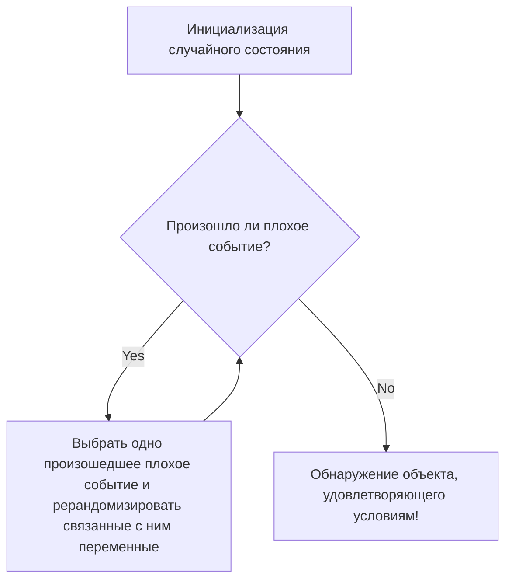

# Введение: магия "случайности" для доказательства существования

В математике методы доказательства того, что "существует объект, удовлетворяющий определенному условию", можно в общих чертах разделить на два подхода. Один из них — "конструктивное доказательство", при котором такой объект создается и демонстрируется конкретно. Другой подход — "неконструктивное доказательство", которое логически показывает, что объект обязательно существует, даже без явного указания на то, чем именно он является.

Выдающийся гений-бродяга XX века, математик Пол Эрдеш (Paul Erdős, 1913-1996), совершил революцию в неконструктивных доказательствах. Это удивительный метод, известный как "Вероятностный метод" (The Probabilistic Method). Основную идею этого метода, разработанного Эрдешем, в двух словах можно выразить так:

**"Чтобы показать существование объекта, удовлетворяющего условию, достаточно выбрать объект случайным образом и показать, что вероятность того, что он удовлетворяет этому условию, строго больше нуля."**

Эта, на первый взгляд, очевидная идея обладает огромной силой в самых разных областях, таких как дискретная математика, [теория графов](/ru/p/graph-theory-dijkstra-a-star/), информатика (computer science) и теория информации. В этой статье мы очень подробно и глубоко разберем всё: от основ вероятностного метода до его знаменитых применений в теории Рамсея (Ramsey Theory), а также локальную лемму Ловаса (Lovász Local Lemma), развитие теории случайных графов и симуляции на Python.

---

## Пол Эрдеш: бродячий гений, посвятивший жизнь математике

Прежде чем перейти к вероятностному методу, нельзя не упомянуть его создателя Пола Эрдеша. Эрдеш родился в Будапеште, Венгрия. Всю свою жизнь он не имел ни дома, ни имущества, путешествуя по домам математиков по всему миру и продолжая совместные исследования. Он опубликовал около 1500 статей и известен как второй по продуктивности математик в истории после Леонарда Эйлера.

Эрдеш считал, что математические объекты нужно находить в "Книге" (The Book), принадлежащей Богу, в которой записаны "идеальные доказательства". Для него красивое, лаконичное и отражающее суть доказательство было "доказательством из Книги". Вероятностный метод обладает той самой волшебной элегантностью, которая делает его достойным быть в этой Книге.

---

## Основной принцип вероятностного метода

Логика, лежащая в основе вероятностного метода, предельно проста.
Предположим, у нас есть конечное множество $S$ и его подмножество $A$ (множество "хороших" объектов, которые мы ищем). Мы хотим показать, что $A$ не пусто (то есть существует как минимум один "хороший" объект).

Мы вводим вероятностное пространство и выбираем элемент из $S$ случайным образом в соответствии с некоторым распределением вероятностей. Пусть выбранный элемент будет $X$. Если в этом случае мы сможем доказать, что вероятность того, что $X \in A$, обозначаемая как $P(X \in A)$, строго больше $0$, то есть
$$ P(X \in A) > 0 $$
то логически можно сделать вывод, что $A$ не пусто, а значит, "хороший объект существует".

Это происходит потому, что если бы не существовало ни одного "хорошего объекта", то вероятность того, что случайно выбранный объект окажется "хорошим", была бы абсолютно равна $0$. Тот факт, что вероятность положительна, означает, что это возможно, а значит — объект "существует".

---

## Нижняя оценка числа Рамсея $R(k, k)$: шедевр вероятностного метода

Статья Эрдеша 1947 года, продемонстрировавшая миру мощь вероятностного метода, касалась нижней оценки числа Рамсея $R(k, k)$ в теории Рамсея (Ramsey Theory).

### Что такое теория Рамсея

Философия теории Рамсея заключается в том, что "полного беспорядка не существует". Теория утверждает, что какими бы сложными и случайными ни казались структуры, если объект достаточно велик, в нем обязательно будет присутствовать некая упорядоченная подструктура.

Знаменитая "теорема о вечеринке" (теорема о друзьях и незнакомцах) показывает, что $R(3, 3) = 6$. Иными словами, если соберутся 6 человек, среди них обязательно найдутся либо 3 человека, которые знают друг друга (красный треугольник), либо 3 человека, которые абсолютно не знакомы друг с другом (синий треугольник).

В общем случае число Рамсея $R(k, l)$ определяется как минимальное целое число $N$, такое что при любой раскраске ребер полного графа $K_N$ с $N$ вершинами в два цвета (красный и синий), обязательно будет присутствовать либо красный полный граф $K_k$, либо синий полный граф $K_l$.

### Доказательство Эрдеша (1947 год)

Эрдеш дал следующую поразительную нижнюю оценку для диагонального числа Рамсея $R(k, k)$.

**Теорема (Erdős, 1947):**
Для $k \ge 3$ выполняется:
$$ R(k, k) > \lfloor 2^{k/2} \rfloor $$

**Пояснение к доказательству:**
Попытка доказать эту теорему "конструктивно" была бы чрезвычайно сложной. А именно, необходимо было бы взять граф с $N = \lfloor 2^{k/2} \rfloor$ вершинами и предложить конкретный метод раскраски его ребер в красный и синий цвета по определенному правилу так, чтобы "он не содержал монохроматического полного графа размера $k$". С ростом $k$ это приводит к колоссальному комбинаторному взрыву.

И здесь на сцену выходит вероятностный метод Эрдеша.

1. **Построение вероятностного пространства:**
   Рассмотрим полный граф $K_N$ с $N$ вершинами. Предположим, что все его ребра (всего $\binom{N}{2}$ штук) раскрашиваются независимо друг от друга в красный цвет с вероятностью $1/2$ и в синий цвет с вероятностью $1/2$ (случайная раскраска, подобная бросанию монетки).

2. **Определение событий:**
   Пусть $V$ — множество вершин графа $K_N$. Пусть $S_i$ — подмножество $V$, состоящее из $k$ элементов. Всего таких подмножеств существует $\binom{N}{k}$.
   Для каждого $S_i$ определим событие $A_i$ как "полный подграф, образованный вершинами из $S_i$, является монохроматическим (все его ребра только красные или только синие)".

3. **Вычисление вероятности:**
   Рассмотрим конкретное $S_i$. Поскольку в $S_i$ содержится $k$ вершин, внутри него имеется $\binom{k}{2}$ ребер. Вероятность того, что все они будут одного цвета, равна:
   $$ P(A_i) = 2 \times \left( \frac{1}{2} \right)^{\binom{k}{2}} = 2^{1 - \binom{k}{2}} $$
   (Сумма вероятности того, что все ребра станут красными, и вероятности того, что все станут синими).

4. **Применение границы объединения (неравенства Буля):**
   Событие "*существует хотя бы один* монохроматический $K_k$" можно выразить как $\bigcup A_i$. Эту вероятность можно оценить сверху с помощью границы объединения (union bound):
   $$ P\left( \bigcup A_i \right) \le \sum_{i} P(A_i) = \binom{N}{k} 2^{1 - \binom{k}{2}} $$

5. **Доказательство "существования":**
   Если эта вероятность строго меньше $1$, то вероятность противоположного события "*ни одно* $S_i$ не является монохроматическим" больше $0$.
   $$ P\left( \bigcap \overline{A_i} \right) = 1 - P\left( \bigcup A_i \right) > 0 $$
   Чтобы показать это, достаточно, чтобы:
   $$ \binom{N}{k} 2^{1 - \binom{k}{2}} < 1 $$
   
   Используя $\binom{N}{k} < \frac{N^k}{k!}$, при дальнейших вычислениях мы обнаружим, что это неравенство выполняется при $N \le 2^{k/2}$.
   Следовательно, при $N = \lfloor 2^{k/2} \rfloor$ способ раскраски, не содержащий монохроматического $K_k$, "вероятностно существует". Таким образом, $R(k, k)$ должно быть строго больше этого значения. Доказательство завершено.

Это доказательство блестяще доказывает только существование, вообще не конструируя сам объект. В этом и заключается магия Эрдеша.

---

## Линейность математического ожидания (Linearity of Expectation) и ее мощь

Еще одним мощным оружием вероятностного метода является "линейность математического ожидания". Это свойство заключается в том, что независимо от того, являются ли случайные величины $X, Y$ независимыми или зависимыми, всегда выполняется:
$$ E[X + Y] = E[X] + E[Y] $$

### Гамильтоновы пути в турнирных графах
Турнир — это ориентированный граф, полученный из полного графа путем назначения направления каждому ребру (он представляет результаты турнира по круговой системе).
Теорема: Для любого $n$ существует турнир на $n$ вершинах, имеющий не менее $n! 2^{-(n-1)}$ гамильтоновых путей (ориентированных путей, проходящих через каждую вершину ровно один раз).

Чтобы доказать это, рассмотрим случайный турнир, в котором направления ребер между вершинами назначаются случайным образом. Вероятность того, что определенная перестановка вершин образует гамильтонов путь, равна $2^{-(n-1)}$. Поскольку всего существует $n!$ перестановок, ожидаемое количество гамильтоновых путей равно $n! 2^{-(n-1)}$.
Если случайная величина имеет математическое ожидание $E$, то обязательно существует событие, при котором эта величина принимает значение, большее или равное $E$. Следовательно, из этого сразу следует, что турнир, удовлетворяющий условию, "существует". Здесь также блистает линейность математического ожидания, позволяющая складывать вероятности, совершенно не беспокоясь об их "зависимости".

---

## Метод модификации (The Alteration Method)

В базовом вероятностном методе вычисляется "вероятность того, что случайно созданный объект сразу удовлетворяет условиям". Однако иногда эффективен подход, при котором создается нечто "близкое" к нужному, а затем слегка модифицируется (Alteration), чтобы получить объект, удовлетворяющий условиям.

Этот метод модификации используется при поиске нижней оценки для независимого множества (множества вершин, никакие две из которых не соединены ребром). Выбрав случайное множество вершин и удалив по одной вершине из каждой пары вершин, соединенных ребром в выбранном множестве, можно гарантированно получить независимое множество.

---

## Локальная лемма Ловаса (Lovász Local Lemma)

Одним из крупнейших прорывов в развитии вероятностного метода стала "Локальная лемма Ловаса (LLL)", доказанная Полом Эрдешем (Paul Erdős) и Ласло Ловасом (László Lovász) в 1975 году.

Граница объединения (union bound) мощна, но у нее есть недостаток: если количество событий велико, верхний предел вероятности превышает 1, и она становится бесполезной. Однако, если плохие события "почти независимы", вероятность того, что удастся избежать всех плохих событий одновременно, должна быть положительной. LLL формализует эту идею.

**Утверждение симметричной формы LLL:**
Пусть $A_1, A_2, \dots, A_n$ — события. Предположим, что вероятность каждого события $P(A_i) \le p$, и каждое событие зависит не более чем от $d$ других событий (то есть не зависит от остальных).
Если выполняется условие:
$$ e \cdot p \cdot (d + 1) \le 1 $$
(где $e$ — число Эйлера), то
$$ P\left( \bigcap_{i=1}^n \overline{A_i} \right) > 0 $$
То есть всегда есть шанс избежать всех плохих событий одновременно.

Эта лемма демонстрирует огромную эффективность в задачах раскраски графов, проблемах выполнимости (SAT), задачах упаковки и т.д. Поразительно, но в 2009 году Мозер (Moser) и Тардош (Tardos) доказали, что LLL может не только доказывать существование, но и алгоритмически (и притом эффективно) находить само решение (Алгоритм Мозера-Тардоша). Это произвело огромный шок в информатике (computer science).


*Рис: Концептуальная схема алгоритма Мозера-Тардоша. Доказано, что если условия LLL выполняются, этот алгоритм останавливается за полиномиальное время.*

---

## Теория случайных графов: модель Эрдеша-Реньи

Применение вероятностного метода к изучению самих графов породило "теорию случайных графов". В 1959 году Эрдеш и Альфред Реньи ввели модель случайного графа $G(n, p)$. Это граф, имеющий $n$ вершин, где между каждой парой вершин независимо друг от друга существует ребро с вероятностью $p$.

Они обнаружили, что при изменении вероятности $p$ как функции $p(n)$ от числа вершин $n$, существует порог (Threshold), при котором свойства графа внезапно изменяются, подобно "фазовому переходу" (Phase Transition).

- Когда $p(n) \ll 1/n$, граф представляет собой набор маленьких деревьев (tree).
- Когда $p(n) = c/n$ ($c > 1$), внезапно появляется гигантская компонента связности (Giant Component).
- Когда $p(n) = \frac{\ln n}{n}$, весь граф становится одной связной компонентой.

Это имеет абсолютно ту же математическую структуру, что и явления фазового перехода в физике, такие как замерзание или кипение воды.

### Симуляция фазового перехода случайных графов на Python

Для понимания вероятностных свойств очень полезно написать код и провести симуляцию. Ниже приведен пример кода на Python с использованием библиотеки `networkx` для моделирования появления гигантской компоненты.

```python
import networkx as nx
import matplotlib.pyplot as plt
import numpy as np

def simulate_giant_component(n, p_values):
    """
    Симулирует, как изменяется размер наибольшей связной компоненты
    в зависимости от вероятности p в случайном графе G(n, p) с n вершинами.
    """
    max_component_sizes = []
    
    for p in p_values:
        # Генерация случайного графа Эрдеша-Реньи
        G = nx.erdos_renyi_graph(n, p)
        # Получение связных компонент, отсортированных по размеру по убыванию
        components = sorted(nx.connected_components(G), key=len, reverse=True)
        if components:
            # Запись размера максимальной связной компоненты (число вершин) как доли от общего числа
            max_size = len(components[0]) / n
        else:
            max_size = 0
        max_component_sizes.append(max_size)
        
    return max_component_sizes

# Число вершин n = 1000
n = 1000
# Изменение вероятности p от 0.000 до 0.005 (порог составляет 1/1000 = 0.001)
p_values = np.linspace(0, 0.005, 50)
sizes = simulate_giant_component(n, p_values)

# Построение графика результатов
plt.figure(figsize=(10, 6))
plt.plot(p_values * n, sizes, marker='o', linestyle='-', color='b')
plt.axvline(x=1.0, color='r', linestyle='--', label='Порог фазового перехода (p = 1/n)')
plt.title("Фазовый переход гигантской компоненты в графе Эрдеша-Реньи", fontsize=14)
plt.xlabel("Средняя степень (p * n)", fontsize=12)
plt.ylabel("Доля максимальной связной компоненты", fontsize=12)
plt.legend()
plt.grid(True)
plt.show()
```

Если запустить этот код, можно визуально на графике убедиться, как при прохождении границы $p \cdot n = 1$ размер максимальной связной компоненты резко возрастает от состояния, близкого к нулю, и начинает занимать большую часть всего графа.

---

## Применение вероятностного метода в наши дни

Семена, посеянные Эрдешем, расцвели в виде незаменимых инструментов в современной информатике.

1. **Рандомизированные алгоритмы (Randomized Algorithms):**
   От выбора опорного элемента в быстрой сортировке (quicksort) до алгоритмов проверки на простоту (таких как тест Миллера-Рабина) и хэш-функций для огромных наборов данных — современные алгоритмы используют случайность для радикального повышения скорости вычислений и точности аппроксимации.

2. **Коды с исправлением ошибок (Error Correcting Codes):**
   В теории информации Шеннона то, что "существуют" превосходные коды, достигающие предела пропускной способности канала связи, также было доказано с помощью вероятностного метода. Было показано, что случайно сгенерированные коды с высокой вероятностью обладают отличной способностью исправлять ошибки.

3. **Машинное обучение и ИИ (Machine Learning & AI):**
   Многие современные технологии ИИ, такие как инициализация нейронных сетей, регуляризация с помощью дропаута (Dropout) и стохастический градиентный спуск (SGD), на глубоком уровне опираются на вероятностные свойства. Свойства случайных векторов в многомерных пространствах (проклятие и благословение размерности) анализируются с использованием вероятностных методов.

---

## Заключение: что такое существование?

Вероятностный метод Пола Эрдеша кардинально изменил наше понимание фундаментального математического понятия "существования".
Даже не придавая объекту конкретной формы, находя порядок в случайном хаосе и говоря: "вероятность того, что это существует, не равна нулю", он достоверно доказывает его существование. Это таит в себе романтику, подобную описанию с помощью вероятностных уравнений того факта, что где-то в бескрайней Вселенной существует планета, похожая на Землю.

Если в математике и существует "Книга" (The Book), то глава о вероятностном методе, несомненно, написана золотыми буквами где-то в самом ее начале. Случайность — это не просто беспорядок, это свет, освещающий глубокие истины.
