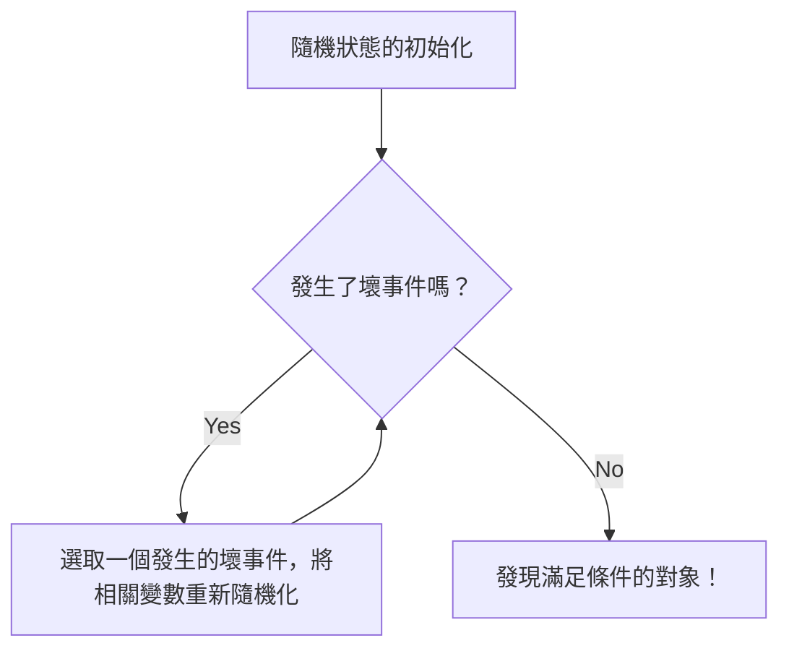

# 前言：證明存在性的「隨機」魔法

在數學中，證明「滿足某種條件的對象存在」的方法，大體上可以分為兩種途徑。第一種是具體建構出該對象的「構造性證明」（Constructive proof）。另一種則是雖然不明確指出該對象具體為何，但透過邏輯推導指出它必然存在的「非構造性證明」（Non-constructive proof）。

20世紀最具代表性的流浪天才數學家保羅·艾狄胥（Paul Erdős, 1913-1996），為這種非構造性證明帶來了革命性的突破。那就是被稱為「機率方法」（The Probabilistic Method）的驚人技術。艾狄胥所確立的這個方法的基本想法，簡而言之可以表達如下：

**「為了證明滿足條件的對象存在，只要隨機選取一個對象，並證明它滿足條件的機率大於0即可。」**

這個乍看之下理所當然的想法，在離散數學、圖論、計算機科學、資訊理論等廣泛領域中展現了強大的威力。本文將從機率方法的基礎開始，[深入淺出](/zh-tw/p/quantum-annealing-vs-gate-model-explained/)地解說它在[拉姆齊理論](/zh-tw/p/ramsey-theory/)（Ramsey Theory）中的著名應用，進而探討洛瓦茲局部引理（Lovász Local Lemma）、隨機圖論的發展，以及使用 Python 進行的模擬。

---

## 保羅·艾狄胥：將一生奉獻給數學的流浪天才

在進入機率方法的話題之前，我們不能不提及它的創始人保羅·艾狄胥。艾狄胥出生於匈牙利布達佩斯，他一生沒有房產與多餘財產，在全球各地數學家的家中漂泊，並持續進行共同研究。他發表過的論文數量高達約1500篇，被認為是史上多產程度僅次於李昂哈德·尤拉（Leonhard Euler）的數學家。

艾狄胥認為，數學對象是從上帝所擁有的「寫滿終極證明的書（The Book）」中尋找出來的。對他來說，優美、簡潔且直指本質的證明，就是「記載在The Book上的證明」。機率方法正擁有這種宛如魔法般優雅的特質，絕對有資格被收錄在The Book中。

---

## 機率方法的基本原理

機率方法的核心邏輯極其簡單。
假設有一個有限集合 $S$，以及它的一個子集 $A$（我們正在尋找的「好」對象集合）。我們想要證明 $A$ 不是空集合（也就是說至少存在一個「好」的對象）。

我們引入機率空間，並根據某種機率分佈隨機選取 $S$ 的元素。令選出的元素為 $X$。此時，如果我們能證明 $X \in A$ 的機率 $P(X \in A)$ 嚴格大於 $0$，即
$$ P(X \in A) > 0 $$
那麼在邏輯上，我們就能得出 $A$ 不是空集合的結論，也就是「好的對象是存在的」。

這是因為，如果「好的對象」連一個都不存在，那麼隨機選出的元素成為「好的對象」的機率必然完全是 $0$。機率為正數，意味著這是有可能發生的情況，這也就等同於「存在」。

---

## 拉姆齊數 $R(k, k)$ 的下界：機率方法的金字塔頂端

讓世界見識到機率方法威力的，是艾狄胥在1947年發表的一篇論文，內容關於[拉姆齊理論](/zh-tw/p/ramsey-theory/)（Ramsey Theory）中拉姆齊數 $R(k, k)$ 的下界。

### 什麼是拉姆齊理論

[拉姆齊理論](/zh-tw/p/ramsey-theory/)的哲學是「完全的無序是不存在的」。該理論指出，無論在多麼複雜且看似隨機的結構中，只要對象足夠大，就必然存在某種規則的子結構。

著名的「派對定理（朋友與陌生人定理）」指出 $R(3, 3) = 6$。也就是說，只要有6個人聚在一起，就必然存在互相認識的3人組（紅色三角形），或是互相完全不認識的3人組（藍色三角形）。

一般而言，拉姆齊數 $R(k, l)$ 的定義為：對於元素個數為 $N$ 的完全圖 $K_N$，無論將其邊以紅藍兩色如何塗色，必然包含紅色的完全圖 $K_k$ 或藍色的完全圖 $K_l$ 的最小整數 $N$。

### 艾狄胥的證明（1947年）

艾狄胥對對角拉姆齊數 $R(k, k)$ 給出了以下驚人的下界。

**定理 (Erdős, 1947):**
當 $k \ge 3$ 時，
$$ R(k, k) > \lfloor 2^{k/2} \rfloor $$
成立。

**證明解說:**
如果要以「構造性」的方式證明這個定理，將會非常困難。也就是說，我們必須提出一種具體的著色方法，將一個擁有 $N = \lfloor 2^{k/2} \rfloor$ 個頂點的圖的邊，依照特定規則塗成紅色與藍色，並確保「不包含大小為 $k$ 的單色完全圖」。當 $k$ 變大時，這會引發難以想像的組合爆炸。

這時艾狄胥的機率方法就登場了。

1. **建構機率空間:**
   考慮一個擁有 $N$ 個頂點的完全圖 $K_N$。我們將它的所有邊（共 $\binom{N}{2}$ 條），各自獨立地以 $1/2$ 的機率塗成紅色，以 $1/2$ 的機率塗成藍色（透過擲硬幣進行隨機著色）。

2. **定義事件:**
   令 $V$ 為 $K_N$ 的頂點集合。令 $V$ 的子集中，元素個數為 $k$ 的子集為 $S_i$。這樣的子集總共有 $\binom{N}{k}$ 個。
   對於每個 $S_i$，定義事件 $A_i$ 為「由屬於 $S_i$ 的頂點所構成的子完全圖是單色的（全紅或全藍）」。

3. **計算機率:**
   我們關注某個特定的 $S_i$。因為 $S_i$ 有 $k$ 個頂點，其內部有 $\binom{k}{2}$ 條邊。這些邊全部變成同色的機率為，
   $$ P(A_i) = 2 \times \left( \frac{1}{2} \right)^{\binom{k}{2}} = 2^{1 - \binom{k}{2}} $$
   （這是全為紅色的機率與全為藍色的機率之和）。

4. **套用聯集上界（Boole不等式）:**
   「*至少存在一個*單色 $K_k$」的事件可以表示為 $\bigcup A_i$。這個機率可以透過聯集上界（Union Bound）來評估上限。
   $$ P\left( \bigcup A_i \right) \le \sum_{i} P(A_i) = \binom{N}{k} 2^{1 - \binom{k}{2}} $$

5. **「存在」的證明:**
   如果這個機率嚴格小於 $1$，那麼其補事件「*沒有任何一個* $S_i$ 是單色的」的機率就必定大於 $0$。
   $$ P\left( \bigcap \overline{A_i} \right) = 1 - P\left( \bigcup A_i \right) > 0 $$
   為此，我們只要證明
   $$ \binom{N}{k} 2^{1 - \binom{k}{2}} < 1 $$
   即可。
   
   利用 $\binom{N}{k} < \frac{N^k}{k!}$ 繼續計算，我們可以發現只要 $N \le 2^{k/2}$，上述不等式就會成立。
   因此，當 $N = \lfloor 2^{k/2} \rfloor$ 時，不包含單色 $K_k$ 的著色方法是「在機率上存在」的。所以 $R(k, k)$ 必然嚴格大於這個值。證明完畢。

這個證明完全沒有建構出任何對象，卻極其漂亮地證明了它的存在。這正是艾狄胥的魔法。

---

## 期望值的線性性質（Linearity of Expectation）及其威力

機率方法的另一個強大武器是「期望值的線性性質」。這意味著，無論隨機變數 $X, Y$ 是獨立或相依，以下等式恆成立：
$$ E[X + Y] = E[X] + E[Y] $$

### 競賽圖中的漢密頓路徑
競賽圖（Tournament）是將完全圖的每條邊賦予方向的有向圖（代表循環賽的結果）。
定理：對於所有的 $n$，存在一個具有 $n$ 個頂點的競賽圖，其漢密頓路徑（每個頂點恰好經過一次的有向路徑）數量大於等於 $n! 2^{-(n-1)}$ 條。

為了證明這一點，我們考慮一個對頂點集合隨機分配邊的方向的隨機競賽圖。某個特定頂點排列成為漢密頓路徑的機率是 $2^{-(n-1)}$。因為排列總共有 $n!$ 種，所以漢密頓路徑數量的期望值為 $n! 2^{-(n-1)}$。
如果某個隨機變數具有期望值 $E$，那麼必然存在某個事件，使得該隨機變數的值大於等於 $E$。因此，我們立刻能推導出滿足條件的競賽圖「存在」。在這裡，完全不需要擔心「相依性」就能直接相加的期望值線性性質，展現了耀眼的光芒。

---

## 修正法（The Alteration Method）

在基本的機率方法中，我們計算的是「隨機構造出來的對象直接滿足條件的機率」。然而，有時先創造出「差一點」的對象，然後稍微對它進行修正（Alteration）以得出滿足條件的對象，這種方法會更有效。

在尋找獨立集（其中任意兩個頂點都沒有邊相連的頂點集合）的下界時，就會用到這個修正法。隨機選出一個頂點集合，如果在選出的集合中存在有邊相連的配對，我們就捨棄其中一個頂點，透過這樣的操作，我們必定能得到一個獨立集。

---

## 洛瓦茲局部引理（Lovász Local Lemma）

機率方法演進中最大的突破之一，是1975年由保羅·艾狄胥（Paul Erdős）和拉斯洛·洛瓦茲（László Lovász）共同證明的「洛瓦茲局部引理（LLL）」。

雖然聯集上界很強大，但它的弱點在於，當事件數量很多時，機率的上限會超過1而變得毫無用處。然而，如果那些壞事件「幾乎都是獨立的」，那麼所有壞事件同時被迴避的機率應該是正數。將這一定理公式化的便是LLL。

**對稱形式 LLL 的主張:**
令 $A_1, A_2, \dots, A_n$ 為事件。假設每個事件的機率 $P(A_i) \le p$，且每個事件最多只與其他 $d$ 個事件相依（即與其他所有事件獨立）。
如果
$$ e \cdot p \cdot (d + 1) \le 1 $$
（這裡的 $e$ 是自然對數的底數）成立，那麼
$$ P\left( \bigcap_{i=1}^n \overline{A_i} \right) > 0 $$
這表示，必定存在可以同時迴避所有壞事件的可能性。

這個引理在圖著色問題、布林可滿足性問題（SAT）、裝箱問題等領域發揮了巨大的作用。令人驚訝的是，在2009年，Moser 和 Tardos 證明了 LLL 不僅僅是存在性證明，我們甚至能以演算法的方式（而且是有效率地）找出解答（Moser-Tardos 演算法），這給計算機科學界帶來了巨大的震撼。


*圖：Moser-Tardos 演算法的概念圖。如果滿足LLL的條件，可以證明這個演算法會在其多項式時間內停止。*

---

## 隨機圖論：艾狄胥-雷尼模型

將機率方法應用於研究圖本身的是「隨機圖論」。艾狄胥與阿爾弗雷德·雷尼（Alfréd Rényi）在1959年引入了隨機圖的模型 $G(n, p)$。這是一個擁有 $n$ 個頂點的圖，每一對頂點之間以機率 $p$ 獨立地存在一條邊。

他們發現，當我們將機率 $p$ 視為頂點數 $n$ 的函數 $p(n)$ 進行變化時，會存在一個閾值（Threshold），在越過該閾值時圖的性質會像「相變（Phase Transition）」一樣突然發生改變。

- 當 $p(n) \ll 1/n$ 時，圖會是許多小樹（tree）的集合。
- 當 $p(n) = c/n$ ($c > 1$) 時，會突然出現一個巨大的連通分量（Giant Component）。
- 當 $p(n) = \frac{\ln n}{n}$ 時，整個圖會變成單一的連通分量。

這與物理學中的水結冰或沸騰等相變現象擁有完全相同的數學結構。

### 使用 Python 進行隨機圖相變的模擬

為了理解機率的性質，實際撰寫程式碼並進行模擬是十分有效的。以下是使用 Python 與 `networkx` 函式庫，模擬巨大連通分量出現的程式碼範例。

```python
import networkx as nx
import matplotlib.pyplot as plt
import numpy as np

def simulate_giant_component(n, p_values):
    """
    在頂點數為 n 的隨機圖 G(n, p) 中，
    模擬最大連通分量的大小如何隨著機率 p 而變化。
    """
    max_component_sizes = []
    
    for p in p_values:
        # 產生 Erdos-Renyi 隨機圖
        G = nx.erdos_renyi_graph(n, p)
        # 取得連通分量並依大小降冪排序
        components = sorted(nx.connected_components(G), key=len, reverse=True)
        if components:
            # 將最大連通分量的大小（頂點數）記錄為佔整體的比例
            max_size = len(components[0]) / n
        else:
            max_size = 0
        max_component_sizes.append(max_size)
        
    return max_component_sizes

# 頂點數 n = 1000
n = 1000
# 將機率 p 從 0.000 變化至 0.005 (閾值為 1/1000 = 0.001)
p_values = np.linspace(0, 0.005, 50)
sizes = simulate_giant_component(n, p_values)

# 繪製結果圖
plt.figure(figsize=(10, 6))
plt.plot(p_values * n, sizes, marker='o', linestyle='-', color='b')
plt.axvline(x=1.0, color='r', linestyle='--', label='相變閾值 (p = 1/n)')
plt.title("Erdős-Rényi 圖中巨大連通分量的相變", fontsize=14)
plt.xlabel("平均分支度 (p * n)", fontsize=12)
plt.ylabel("最大連通分量比例", fontsize=12)
plt.legend()
plt.grid(True)
plt.show()
```

執行這段程式碼，你可以從圖表中視覺化地看到：以 $p \cdot n = 1$ 為界線，最大連通分量的大小從趨近於零的狀態急劇攀升，並開始佔據整個圖的絕大部分。

---

## 機率方法在現代的應用

艾狄胥播下的種子，在現代計算機科學中已開花結果，成為不可或缺的工具。

1. **隨機演算法 (Randomized Algorithms):**
   從快速排序法（Quicksort）的樞紐選擇，到質數判定演算法（如 Miller-Rabin 質數測試），甚至是對龐大資料集使用的雜湊函數，現代演算法利用隨機性大幅提升了計算速度與近似精確度。

2. **錯誤更正碼 (Error Correcting Codes):**
   在夏農（Shannon）的資訊理論中，能夠達到通訊容量極限的優異編碼「存在」這件事，也是透過機率方法證明出來的。它證明了隨機生成的編碼在很高的機率下具備優秀的除錯能力。

3. **機器學習與人工智慧 (AI):**
   類神經網路的初始化、利用 Dropout 進行正則化、隨機梯度下降法（SGD）等，許多現代AI技術在深層邏輯上也依賴於機率論的性質。高維度空間中隨機向量的性質（維度的詛咒與祝福），也都是使用機率方法來進行分析的。

---

## 結論：存在究竟是什麼？

保羅·艾狄胥的機率方法，大大改變了我們對數學中最基本概念——「存在」——的認知。
即便無法給予具體的形體，也能在隨機的混沌中找出秩序，並藉由敘述「它存在的機率不為零」，來確切地證明它的存在。這就宛如用機率的方程式來訴說浩瀚宇宙某處存在著像地球一樣的星球般，蘊藏著無窮的浪漫。

如果數學中真的存在那本「The Book」，那麼關於機率方法的篇章，毫無疑問地會用金色的文字寫在非常前面的位置。隨機性不僅僅是無序，更是照亮深刻真理的一道光。
