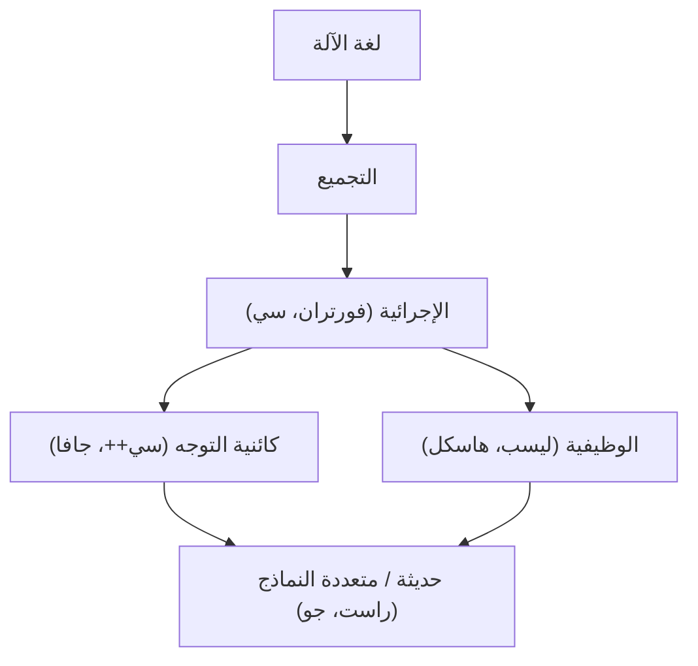
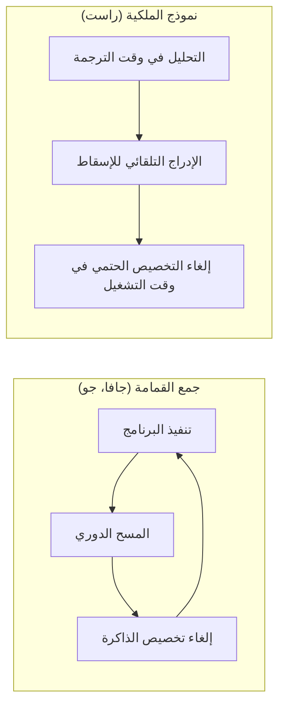

تاريخ لغات البرمجة هو بحد ذاته تاريخ كيف تفاعل البشر مع هذا الصندوق السحري المسمى بالحاسوب، وكيف تمكنوا من ترويض التعقيد.
في هذا المقال، سنشرح بشكل منهجي ومفصل للغاية تاريخ لغات البرمجة وتطور **النماذج** (Paradigms) الأساسية، بدءًا من لغة التجميع (Assembly)، مرورًا بلغة سي (C) وجافا (Java)، وصولاً إلى راست (Rust) وجو (Go) التي تقود برمجة الأنظمة الحديثة.

## 1. فجر لغات البرمجة: من لغة الآلة إلى التجميع

في الأيام الأولى لظهور الحواسيب، كان المبرمجون يستخدمون **لغة الآلة (Machine Language)** لإعطاء الأوامر مباشرة للأجهزة. كانت لغة الآلة عبارة عن سلسلة من البتات من "0" و"1"، وكانت معقدة للغاية بحيث يصعب على البشر فهمها وكتابتها مباشرة، مما أدى إلى كثرة الأخطاء.

وهنا ظهرت **لغة التجميع (Assembly Language)**. تقوم لغة التجميع بتخصيص سلاسل نصية قصيرة يسهل على البشر تذكرها (Mnemonic) لأوامر لغة الآلة (Opcode). على سبيل المثال، تم إعطاء اسم `MOV` لأمر نقل البيانات، و `ADD` لأمر الجمع.

```assembly
; مثال على لغة التجميع (x86)
section .text
global _start

_start:
    mov edx, len    ; تحديد طول الرسالة
    mov ecx, msg    ; تحديد عنوان الرسالة
    mov ebx, 1      ; تحديد الإخراج القياسي
    mov eax, 4      ; رقم استدعاء النظام لـ sys_write
    int 0x80        ; استدعاء النواة

    mov eax, 1      ; رقم استدعاء النظام لـ sys_exit
    int 0x80        ; استدعاء النواة

section .data
msg db 'Hello, World!', 0xa
len equ $ - msg
```

مع ظهور لغة التجميع، تحسنت إنتاجية المبرمجين بشكل كبير، ولكن ظلت هناك مشكلة الاعتماد القوي على بنية الأجهزة (مجموعة أوامر وحدة المعالجة المركزية). لتشغيل البرنامج على وحدة معالجة مركزية أخرى، كان يجب إعادة كتابة الكود من الصفر.


## 2. البرمجة المهيكلة واللغات الإجرائية: ولادة لغة سي

لتحقيق برمجة مستقلة عن الأجهزة، ظهرت لغات عالية المستوى. لغات مثل FORTRAN و COBOL كانت من رواد هذا المجال. ومع ذلك، مع زيادة حجم البرامج، انتشر الكود الذي يصعب تتبع تدفق التحكم فيه، والذي أطلق عليه اسم "كود السباغيتي". كان هذا ناتجًا بشكل أساسي عن الاستخدام العشوائي والمفرط لجمل `GOTO`.

تم حل هذه المشكلة من خلال نموذج **البرمجة المهيكلة (Structured Programming)**. اقترح إدجر ديكسترا وآخرون أنه يمكن كتابة البرامج باستخدام ثلاثة هياكل تحكم أساسية فقط: "التسلسل" (Sequence)، "الاختيار" (Selection / if)، و "التكرار" (Iteration / while/for).

اللغة التي جسدت نموذج البرمجة المهيكلة هذا وأحدثت ثورة في برمجة الأنظمة هي **لغة سي (C)**، التي طورها دينيس ريتشي في عام 1972.

تم إنشاء لغة سي لكتابة نظام التشغيل UNIX. كانت تتمتع بقدرات وصول منخفضة المستوى للذاكرة (مثل المؤشرات) قريبة من لغة التجميع، مع توفير قابلية النقل بغض النظر عن الأجهزة.

```c
#include <stdio.h>

// مثال على البرمجة المهيكلة: حساب المضروب
int factorial(int n) {
    int result = 1;
    for (int i = 1; i <= n; i++) {
        result *= i;
    }
    return result;
}

int main() {
    int num = 5;
    printf("Factorial of %d is %d\n", num, factorial(num));
    return 0;
}
```

بفضل نجاح لغة سي، ترسخت "البرمجة الإجرائية" كنموذج قياسي للبرمجة لفترة طويلة. ولكن مع تضخم الأنظمة وزيادة تعقيدها، أصبح فصل البيانات عن الإجراءات (الدوال) التي تتعامل معها يمثل تحديًا أدى إلى انخفاض قابلية الصيانة.


## 3. صعود التوجه الكائني: التعامل مع التعقيد وظهور جافا

ظهر نموذج **البرمجة كائنية التوجه ([OOP](https://kenji.blog/ar/p/object-oriented-programming-oop-solid-principles/))** الذي يجمع البيانات والإجراءات معًا، ويشكل البرنامج كتفاعل بين "الكائنات" (Objects).

قامت لغات مثل Simula و Smalltalk بتأسيس مفاهيم البرمجة كائنية التوجه، وانتشرت لغة **سي++ (C++)** التي أضافت ميزات البرمجة كائنية التوجه إلى لغة سي بشكل واسع. ومع ذلك، عانت لغة C++ من مواصفات لغة معقدة وصعوبة إدارة الذاكرة باستخدام المؤشرات (مثل تسرب الذاكرة وأخطاء التجزئة).

في عام 1995، أعلنت شركة صن ميكروسيستمز (أوراكل حاليًا) عن لغة **جافا (Java)**. رفعت جافا شعار "اكتب مرة واحدة، شغل في أي مكان" (Write Once, Run Anywhere)، وحققت استقلالاً كاملاً عن المنصات من خلال العمل على آلة جافا الافتراضية (JVM).

الميزة الأبرز لجافا هي أنها صممت كلغة كائنية التوجه خالصة، مع إزالة الميزات المعقدة لـ C++، وتقديم **جمع القمامة (Garbage Collection - GC)**. أدى ذلك إلى تحرير المبرمجين من مهمة تحرير الذاكرة المرهقة.

```java
// مثال على التوجه الكائني في جافا
public class Animal {
    private String name;

    public Animal(String name) {
        this.name = name;
    }

    public void speak() {
        System.out.println(this.name + " makes a sound.");
    }
}

public class Dog extends Animal {
    public Dog(String name) {
        super(name);
    }

    @Override
    public void speak() {
        System.out.println("Woof!");
    }

    public static void main(String[] args) {
        Animal myDog = new Dog("Buddy");
        myDog.speak(); // سيتم طباعة "Woof!"
    }
}
```

مع ظهور جافا، أصبحت البرمجة كائنية التوجه هي النموذج السائد تمامًا في تطوير أنظمة المؤسسات واسعة النطاق.

هنا، دعونا نتخيل تطور لغات البرمجة بصريًا.




## 4. عصر الإنترنت وتنوع النماذج

منذ العقد الأول من القرن الحادي والعشرين، مع انتشار الويب، برزت لغات البرمجة النصية (Python، Ruby، JavaScript، إلخ). ركزت هذه اللغات على سرعة التطوير، ووفرت كتابة ديناميكية وهياكل بيانات مدمجة غنية.
في الوقت نفسه، أعيد تقييم نموذج **البرمجة الوظيفية ([Functional Programming](https://kenji.blog/ar/p/functional-programming-concepts-pure-functions-monads/))** (مثل Haskell و Scala)، الذي يمثل الحوسبة كتقييم للدوال التي لا تمتلك حالة (Stateless)، وذلك لسهولة التعامل مع المعالجة المتزامنة.

تستند النظرية الأساسية لحساب التفاضل والتكامل لامدا في البرمجة الوظيفية إلى تطبيق الدوال وتجريدها كما هو موضح في المعادلة التالية:

$$
\text{تعبير لامدا: } e ::= x \mid \lambda x.e \mid e\ e
$$

تتمتع اللغات الوظيفية ذات الدقة الرياضية بميزة البناء حول دوال نقية بدون آثار جانبية، مما يسهل كتابة أكواد برمجية قوية وأقل عرضة للأخطاء.

## 5. برمجة الأنظمة الحديثة: ظهور راست وجو

مع انتشار الحوسبة السحابية ووحدات المعالجة المركزية متعددة النوى، أصبحت لغات البرمجة الحديثة مطالبة في وقت واحد بـ "الأداء العالي" و "سهولة المعالجة المتزامنة" و "أمان الذاكرة". لتلبية هذه المطالب، ظهرت لغتا **جو (Go)** و **راست (Rust)**.

### 5.1. لغة جو: البساطة والمعالجة المتزامنة القوية

تعتبر لغة **Go**، التي طورتها جوجل، لغة برمجة أنظمة تجمع بين بساطة لغة C وسهولة الكتابة في اللغات الديناميكية.
الميزة الأكبر في Go هي المعالجة المتزامنة باستخدام نموذج CSP (العمليات التسلسلية المتصلة) عبر **الروتينات الفرعية (Goroutine)** و **القنوات (Channel)**.

```go
package main

import (
	"fmt"
	"time"
)

// دالة العامل
func worker(id int, jobs <-chan int, results chan<- int) {
	for j := range jobs {
		fmt.Printf("Worker %d started job %d\n", id, j)
		time.Sleep(time.Second) // محاكاة المعالجة
		fmt.Printf("Worker %d finished job %d\n", id, j)
		results <- j * 2
	}
}

func main() {
	jobs := make(chan int, 100)
	results := make(chan int, 100)

	// بدء تشغيل 3 عمال (روتينات فرعية)
	for w := 1; w <= 3; w++ {
		go worker(w, jobs, results)
	}

	// إرسال 5 وظائف
	for j := 1; j <= 5; j++ {
		jobs <- j
	}
	close(jobs)

	// استقبال النتائج
	for a := 1; a <= 5; a++ {
		<-results
	}
}
```

تحتوي Go على نظام جمع القمامة (GC) وتقوم بأتمتة إدارة الذاكرة، ومع ذلك فإن سرعة تنفيذها عالية جدًا، مما جعلها لغة المعيار الفعلي في تطوير الخدمات المصغرة (Microservices) والبنية التحتية السحابية (مثل Kubernetes و Docker).

### 5.2. راست: أمان مطلق للذاكرة من خلال نظام الملكية

لغة **Rust**، التي طورتها موزيلا بشكل أساسي، هي لغة ثورية تجمع بين "أداء يعادل C و C++" و "أمان كامل للذاكرة". لا تحتوي Rust على نظام جمع القمامة، وبدلاً من ذلك تمنع أخطاء مثل سباق البيانات وتسرب الذاكرة من خلال التحقق من مفاهيمها الفريدة **"الملكية" (Ownership)**، و **"الاستعارة" (Borrowing)**، و **"دورة الحياة" (Lifetime)** في وقت الترجمة (Compile-time).

```rust
fn main() {
    let s1 = String::from("hello");
    // إذا تم نقل (Move) ملكية s1 إلى الدالة calculate_length، فلن يمكن استخدام s1 لاحقًا.
    // لذلك، نقوم بتمرير مرجع (استعارة).
    let len = calculate_length(&s1);

    println!("The length of '{}' is {}.", s1, len);
}

// استقبال المرجع (دون أخذ الملكية)
fn calculate_length(s: &String) -> usize {
    s.len()
}
```

يوضح الشكل التالي مقارنة بين نموذج إدارة الذاكرة في Rust وجمع القمامة (GC).



بفضل أمانها، يتم تبني Rust بسرعة في المجالات التي تتطلب موثوقية عالية للغاية، مثل تطوير نواة أنظمة التشغيل (تم إدخالها في نواة Linux)، ومحركات المتصفحات، وتقنيات البلوكشين (Blockchain).

## 6. اندماج النماذج والتوقعات المستقبلية

لم تعد لغات البرمجة الحديثة مقتصرة على نموذج واحد، بل تتجه نحو **النماذج المتعددة (Multi-paradigm)** التي تدمج الميزات الممتازة من عدة نماذج.

على سبيل المثال، تتضمن Rust و Go عناصر من البرمجة الوظيفية (مثل الإغلاقات والدوال عالية المستوى)، كما أضافت Java و C++ في الإصدارات اللاحقة ميزات تشبه البرمجة الوظيفية (مثل تعبيرات لامدا).

يتأثر تطور نماذج البرمجة بشدة بتطور أجهزة الحواسيب (مثل الانتقال من النواة المفردة إلى متعددة النوى) وطبيعة المشكلات التي يجب حلها (مثل الانتقال من التطبيقات المحلية إلى الأنظمة الموزعة).

كما يوضح قانون أمدال (Amdahl's Law)، هناك حد لتحسين الأداء من خلال الموازاة (Parallelization).

$$
\text{تسريع} = \frac{1}{(1 - P) + \frac{P}{N}}
$$
(حيث $P$ هي نسبة المعالجة القابلة للموازاة، و $N$ هو عدد المعالجات)

لدفع هذا الحد إلى أقصى حد واستخراج أقصى أداء من النوى المتعددة، أصبحت لغتا Rust و Go، اللتان توفران نماذج معالجة متزامنة آمنة وفعالة، هي السائدة.

## 7. الخاتمة

بدءًا من التفاعل المباشر مع الأجهزة باستخدام لغة التجميع، ثم اكتساب الهيكلة وقابلية النقل مع لغة سي، وصولاً إلى التوجه الكائني وتجريد إدارة الذاكرة في جافا، ومؤخرًا السعي وراء المعالجة المتزامنة والأمان في راست وجو، تستمر لغات البرمجة في التطور باستمرار.

**إن تعلم لغة جديدة يعني تعلم إطار تفكير (نموذج) جديد.** من خلال فهم نظام الملكية في Rust أو نموذج CSP في Go، ستتمكن من تصميم أنظمة أكثر أمانًا وذات تزامن أعلى حتى عند كتابة التعليمات البرمجية بلغة سي أو جافا.

إن النظر إلى التاريخ هو أفضل بوصلة للتنبؤ باتجاهات التكنولوجيا المستقبلية. رحلة لغات البرمجة لن تنتهي أبدًا.
