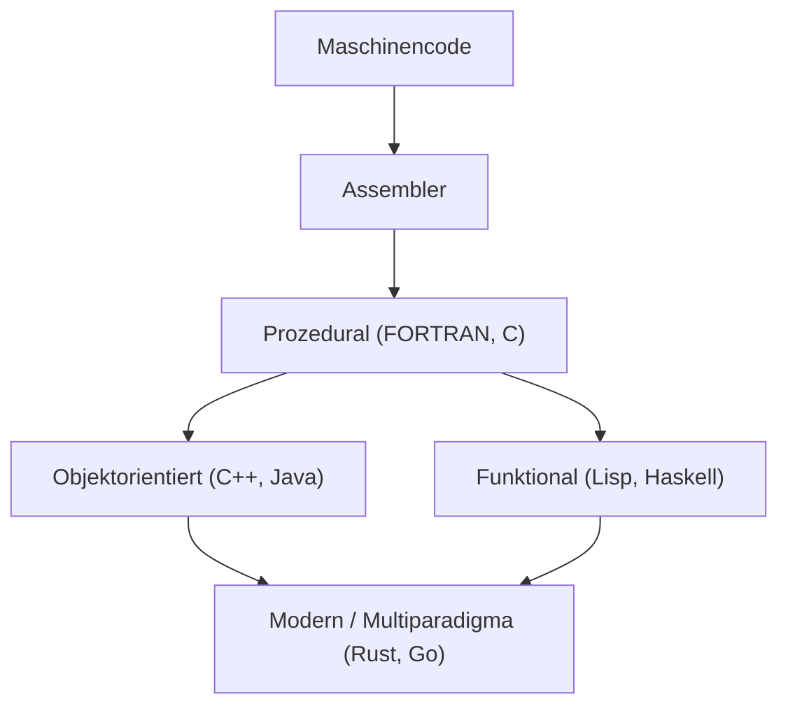
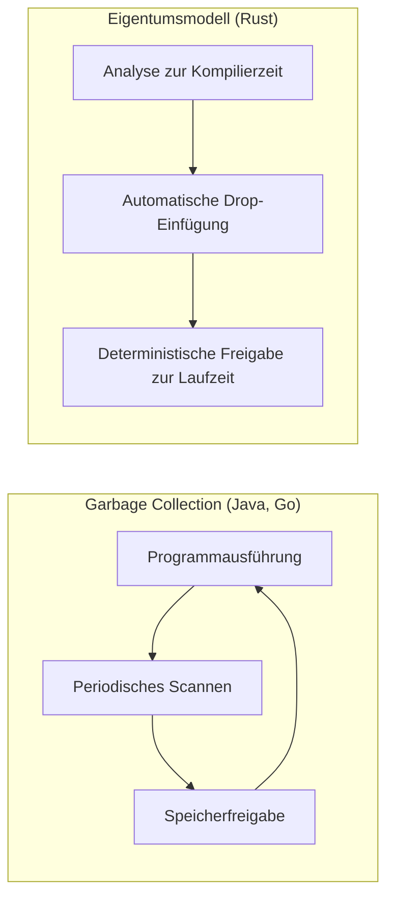

Die Geschichte der Programmiersprachen ist im Grunde die Geschichte davon, wie die Menschheit mit den magischen Kisten namens Computer interagiert hat und wie sie die Komplexität gebändigt hat.
In diesem Artikel werden wir die Geschichte der Programmiersprachen und die Evolution der zugrunde liegenden **Paradigmen** äußerst detailliert und systematisch erklären, beginnend mit der Assemblersprache über C und Java bis hin zu Rust und Go, die die moderne Systemprogrammierung antreiben.

## 1. Die Anfänge der Programmiersprachen: Vom Maschinencode zur Assemblersprache

In den frühen Tagen der Computer nutzten Programmierer **Maschinensprache (Maschinencode)**, um der Hardware direkt Befehle zu erteilen. Maschinensprache ist eine Bitfolge aus "0" und "1", was für Menschen viel zu schwer verständlich und fehleranfällig war, um direkt geschrieben zu werden.

Hier trat die **Assemblersprache** in Erscheinung. Die Assemblersprache weist den Anweisungen (Opcodes) der Maschinensprache kurze, für Menschen leicht zu merkende Zeichenfolgen (Mnemonics) zu. Zum Beispiel wurde einer Anweisung zum Verschieben von Daten der Name `MOV` und einer Anweisung zur Addition der Name `ADD` zugewiesen.

```assembly
; Beispiel für Assemblersprache (x86)
section .text
global _start

_start:
    mov edx, len    ; Länge der Nachricht angeben
    mov ecx, msg    ; Adresse der Nachricht angeben
    mov ebx, 1      ; Standardausgabe angeben
    mov eax, 4      ; Systemaufrufnummer für sys_write
    int 0x80        ; Kernel-Aufruf

    mov eax, 1      ; Systemaufrufnummer für sys_exit
    int 0x80        ; Kernel-Aufruf

section .data
msg db 'Hallo, Welt!', 0xa
len equ $ - msg
```

Mit dem Aufkommen der Assemblersprache verbesserte sich die Produktivität der Programmierer dramatisch, aber es blieb das Problem der starken Abhängigkeit von der Hardwarearchitektur (dem Befehlssatz der CPU). Um den Code auf einer anderen CPU auszuführen, musste er von Grund auf neu geschrieben werden.


## 2. Strukturierte Programmierung und prozedurale Sprachen: Die Geburt von C

Um hardwareunabhängige Programmierung zu realisieren, tauchten Hochsprachen auf. FORTRAN und COBOL waren Vorreiter auf diesem Gebiet. Mit zunehmender Größe der Programme verbreitete sich jedoch sogenannter "Spaghetticode", dessen Kontrollfluss nicht mehr nachvollziehbar war. Dies war hauptsächlich auf den exzessiven, unkontrollierten Einsatz von `GOTO`-Anweisungen zurückzuführen.

Dieses Problem wurde durch das Paradigma der **strukturierten Programmierung** gelöst. Edsger Dijkstra und andere postulierten, dass Programme mit nur drei grundlegenden Kontrollstrukturen geschrieben werden können: "Sequenz", "Auswahl (if)" und "Iteration (while/for)".

Die **C-Sprache**, die 1972 von Dennis Ritchie entwickelt wurde, verkörperte dieses Paradigma der strukturierten Programmierung und revolutionierte zudem die Systemprogrammierung.

C wurde entwickelt, um das UNIX-Betriebssystem zu schreiben. Es verfügte über systemnahe Speicherzugriffsfähigkeiten (wie Zeiger) ähnlich der Assemblersprache, behielt aber gleichzeitig eine hardwareunabhängige Portabilität bei.

```c
#include <stdio.h>

// Beispiel für strukturierte Programmierung: Berechnung der Fakultät
int factorial(int n) {
    int result = 1;
    for (int i = 1; i <= n; i++) {
        result *= i;
    }
    return result;
}

int main() {
    int num = 5;
    printf("Die Fakultät von %d ist %d\n", num, factorial(num));
    return 0;
}
```

Durch den Erfolg von C etablierte sich die "prozedurale Programmierung" lange Zeit als das Standardparadigma der Programmierung. Als die Systeme jedoch weiter an Größe und Komplexität zunahmen, wurde die Trennung von Daten und den Prozeduren (Funktionen), die auf sie einwirken, zu einem Problem für die Wartbarkeit.


## 3. Der Aufstieg der Objektorientierung: Umgang mit Komplexität und die Einführung von Java

Das Paradigma der **objektorientierten Programmierung ([OOP](https://kenji.blog/de/p/object-oriented-programming-oop-solid-principles/))**, das Daten und Prozeduren zusammenfasst und Programme als Interaktionen von "Objekten" modelliert, gewann an Aufmerksamkeit.

Sprachen wie Simula und Smalltalk schufen die Konzepte der OOP, und **C++**, das OOP-Funktionen zur C-Sprache hinzufügte, fand weite Verbreitung. C++ hatte jedoch Probleme mit komplexen Sprachspezifikationen und der Schwierigkeit der Speicherverwaltung durch Zeiger (wie Speicherlecks und Speicherzugriffsfehler).

1995 wurde **Java** von Sun Microsystems (jetzt Oracle) angekündigt. Java warb mit dem Slogan "Write Once, Run Anywhere (Einmal schreiben, überall ausführen)" und erreichte durch die Ausführung auf der Java Virtual Machine (JVM) eine vollständige Plattformunabhängigkeit.

Das wichtigste Merkmal von Java war, dass die komplexen Funktionen von C++ entfernt wurden und es als reine objektorientierte Sprache entworfen wurde, sowie die Einführung der **Garbage Collection (GC)**. Dies befreite Programmierer von der mühsamen Aufgabe der Speicherfreigabe.

```java
// Beispiel für Objektorientierung in Java
public class Animal {
    private String name;

    public Animal(String name) {
        this.name = name;
    }

    public void speak() {
        System.out.println(this.name + " macht ein Geräusch.");
    }
}

public class Dog extends Animal {
    public Dog(String name) {
        super(name);
    }

    @Override
    public void speak() {
        System.out.println("Wuff!");
    }

    public static void main(String[] args) {
        Animal myDog = new Dog("Buddy");
        myDog.speak(); // "Wuff!" wird ausgegeben
    }
}
```

Mit der Einführung von Java wurde die Objektorientierung zum absoluten Mainstream-Paradigma in der groß angelegten Entwicklung von Enterprise-Systemen.

Lassen Sie uns hier die Entwicklung der Programmiersprachen visualisieren.




## 4. Das Internet-Zeitalter und die Diversifizierung der Paradigmen

Ab den 2000er Jahren, mit der Verbreitung des Webs, gewannen Skriptsprachen (wie Python, Ruby, JavaScript) an Bedeutung. Diese Sprachen legten Wert auf Entwicklungsgeschwindigkeit und boten dynamische Typisierung und reichhaltige integrierte Datenstrukturen.
Gleichzeitig wurde das Paradigma der **funktionalen Programmierung** (wie Haskell oder Scala), das Berechnungen als Auswertung zustandsloser Funktionen modelliert, aufgrund seiner Erleichterung der Nebenläufigkeit neu bewertet.

Die grundlegende Theorie des Lambda-Kalküls in der funktionalen Programmierung basiert auf der Anwendung und Abstraktion von Funktionen, wie sie in der folgenden Formel dargestellt sind.

$$
\text{Lambda-Ausdruck: } e ::= x \mid \lambda x.e \mid e\ e
$$

Funktionale Sprachen mit mathematischer Strenge sind um reine Funktionen ohne Seiteneffekte aufgebaut und bieten den Vorteil, dass es einfacher ist, robusten, fehlerresistenten Code zu schreiben.

## 5. Moderne Systemprogrammierung: Die Einführung von Rust und Go

Mit der Verbreitung von Cloud-Computing und Multi-Core-CPUs müssen moderne Programmiersprachen gleichzeitig "hohe Leistung", "einfache Nebenläufigkeit" und "Speichersicherheit" bieten. **Go** und **Rust** entstanden, um diese Anforderungen zu erfüllen.

### 5.1. Go-Sprache: Einfachheit und leistungsstarke Nebenläufigkeit

**Go**, das von Google entwickelt wurde, ist eine Systemprogrammiersprache, die die Einfachheit von C mit der Leichtigkeit dynamischer Sprachen verbindet.
Das wichtigste Merkmal von Go ist die Nebenläufigkeit, die das Modell CSP (Communicating Sequential Processes) mithilfe von **Goroutinen (Goroutines)** und **Kanälen (Channels)** übernimmt.

```go
package main

import (
	"fmt"
	"time"
)

// Worker-Funktion
func worker(id int, jobs <-chan int, results chan<- int) {
	for j := range jobs {
		fmt.Printf("Worker %d hat Job %d gestartet\n", id, j)
		time.Sleep(time.Second) // Verarbeitung simulieren
		fmt.Printf("Worker %d hat Job %d beendet\n", id, j)
		results <- j * 2
	}
}

func main() {
	jobs := make(chan int, 100)
	results := make(chan int, 100)

	// 3 Worker (Goroutinen) starten
	for w := 1; w <= 3; w++ {
		go worker(w, jobs, results)
	}

	// 5 Jobs senden
	for j := 1; j <= 5; j++ {
		jobs <- j
	}
	close(jobs)

	// Ergebnisse empfangen
	for a := 1; a <= 5; a++ {
		<-results
	}
}
```

Go verfügt über Garbage Collection und automatisiert die Speicherverwaltung, ist aber in der Ausführung sehr schnell und hat sich als De-facto-Standardsprache für die Entwicklung von Microservices und Cloud-Infrastruktur (wie Kubernetes und Docker) etabliert.

### 5.2. Rust: Ultimative Speichersicherheit durch das Eigentumssystem

**Rust**, das hauptsächlich von Mozilla entwickelt wurde, ist eine bahnbrechende Sprache, die sowohl "Leistung auf Augenhöhe mit C oder C++" als auch "vollständige Speichersicherheit" bietet. Rust hat keine Garbage Collection, sondern verhindert stattdessen Bugs wie Data Races und Speicherlecks, indem es die einzigartigen Konzepte von **"Eigentum (Ownership)", "Ausleihen (Borrowing)" und "Lebenszeit (Lifetime)"** zur Kompilierzeit validiert.

```rust
fn main() {
    let s1 = String::from("hallo");
    // Wenn das Eigentum von s1 auf die Funktion calculate_length übergeht (Move), kann s1 später nicht mehr verwendet werden.
    // Daher übergeben wir eine Referenz (Ausleihen).
    let len = calculate_length(&s1);

    println!("Die Länge von '{}' ist {}.", s1, len);
}

// Empfängt eine Referenz (nimmt das Eigentum nicht an sich)
fn calculate_length(s: &String) -> usize {
    s.len()
}
```

Ein Vergleich zwischen dem Speichermanagementmodell von Rust und der Garbage Collection (GC) wird in der folgenden Abbildung gezeigt.



Aufgrund seiner Sicherheit wird Rust in Bereichen, in denen extrem hohe Zuverlässigkeit erforderlich ist, wie der Entwicklung von OS-Kerneln (Einführung in den Linux-Kernel), Browser-Engines und Blockchain-Technologie, schnell übernommen.

## 6. Fusion von Paradigmen und Zukunftsaussichten

Moderne Programmiersprachen sind nicht an ein einziges Paradigma gebunden, sondern werden **Multiparadigma**, indem sie die besten Eigenschaften mehrerer Paradigmen integrieren.

Beispielsweise haben Rust und Go Elemente der funktionalen Programmierung (wie Closures, Funktionen höherer Ordnung) integriert, und Java und C++ haben in späteren Versionen funktionsähnliche Merkmale (wie Lambda-Ausdrücke) hinzugefügt.

Die Evolution der Programmierparadigmen wird stark von der Evolution der Computerhardware (wie dem Übergang von Single-Core zu Multi-Core) und der Art der zu lösenden Probleme (wie dem Übergang von lokalen Anwendungen zu verteilten Systemen) beeinflusst.

Wie das Amdahlsche Gesetz (Amdahl's Law) zeigt, gibt es eine Grenze für die Leistungssteigerung durch Parallelisierung.

$$
\text{Beschleunigung} = \frac{1}{(1 - P) + \frac{P}{N}}
$$
(Wobei $P$ der Anteil der parallelisierbaren Verarbeitung und $N$ die Anzahl der Prozessoren ist)

Um diese Grenze zu erweitern und die Leistung von Multi-Core-Prozessoren zu maximieren, sind Rust und Go, die sichere und effiziente Nebenläufigkeitsmodelle bieten, zum Mainstream geworden.

## 7. Fazit

Angefangen bei der direkten Interaktion mit Hardware in Assemblersprache, über die Strukturierung und Portabilität mit C, die Objektorientierung und Abstraktion der Speicherverwaltung mit Java bis hin zum Streben nach Nebenläufigkeit und Sicherheit mit Rust und Go, haben sich Programmiersprachen kontinuierlich weiterentwickelt.

**Das Erlernen einer neuen Sprache bedeutet das Erlernen eines neuen Denkrahmens (Paradigmas).** Durch das Verständnis des Eigentumssystems von Rust oder des CSP-Modells von Go werden Sie in der Lage sein, sichere und hochgradig nebenläufige Designs zu entwerfen, selbst wenn Sie in C oder Java schreiben.

Der Blick in die Geschichte ist der beste Kompass, um zukünftige technologische Trends vorherzusagen. Die Reise der Programmiersprachen wird auch in Zukunft niemals enden.
