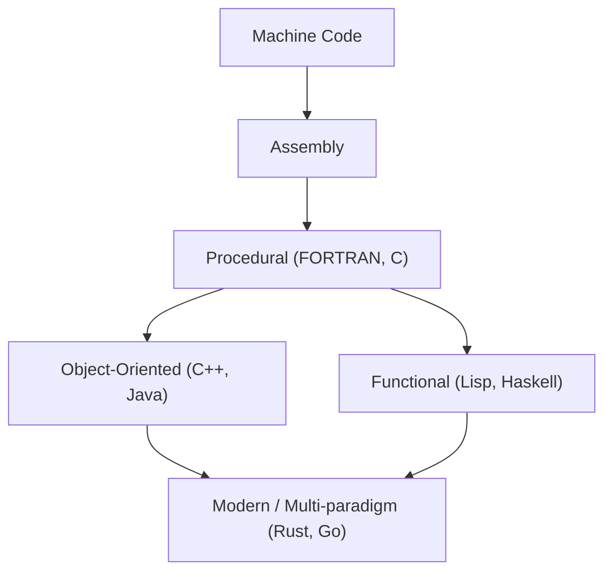
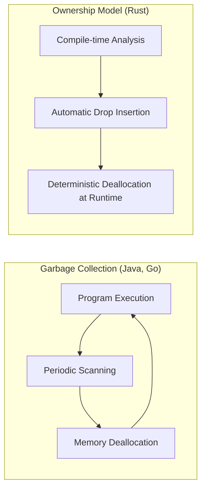

The history of programming languages is the history of how humanity has interacted with the magical boxes known as computers, and how we have tamed their complexity.
In this article, we provide a highly detailed and systematic explanation of the history of programming languages and the underlying **paradigm** shifts, starting from assembly language, to C, Java, and leading up to modern system programming languages like Rust and Go.

## 1. The Dawn of Programming Languages: From Machine Code to Assembly

In the early days of computing, programmers gave instructions directly to the hardware using **machine code**. Machine code consists of bit sequences of "0"s and "1"s, making it extremely difficult for humans to understand and write directly, and highly prone to errors.

This led to the emergence of **assembly language**. Assembly language assigns short, easy-to-remember character strings (mnemonics) to machine code instructions (opcodes). For example, it named the instruction to move data `MOV` and the instruction to add `ADD`.

```assembly
; Example of assembly language (x86)
section .text
global _start

_start:
    mov edx, len    ; Specify message length
    mov ecx, msg    ; Specify message address
    mov ebx, 1      ; Specify standard output
    mov eax, 4      ; System call number for sys_write
    int 0x80        ; Kernel call

    mov eax, 1      ; System call number for sys_exit
    int 0x80        ; Kernel call

section .data
msg db 'Hello, World!', 0xa
len equ $ - msg
```

The introduction of assembly language dramatically improved programmer productivity, but it still suffered from the problem of strong dependency on hardware architecture (CPU instruction sets). To run the code on a different CPU, it had to be rewritten from scratch.

## 2. Structured Programming and Procedural Languages: The Birth of C

To achieve hardware-independent programming, high-level languages emerged. FORTRAN and COBOL were the pioneers in this area. However, as programs grew larger, untraceable control flow code known as "spaghetti code" became rampant. This was mainly caused by the chaotic overuse of `GOTO` statements.

This issue was solved by the **structured programming** paradigm. Edsger W. Dijkstra and others proposed that programs could be written using only three basic control structures: "sequence", "selection (if)", and "iteration (while/for)".

Embodying this structured programming paradigm and further revolutionizing system programming was the **C language**, developed by Dennis Ritchie in 1972.

The C language was created to write the UNIX operating system. It possessed low-level memory access capabilities (such as pointers) close to assembly language while maintaining portability independent of hardware.

```c
#include <stdio.h>

// Example of structured programming: calculating factorial
int factorial(int n) {
    int result = 1;
    for (int i = 1; i <= n; i++) {
        result *= i;
    }
    return result;
}

int main() {
    int num = 5;
    printf("Factorial of %d is %d\n", num, factorial(num));
    return 0;
}
```

With the success of the C language, "procedural programming" firmly established itself as the standard paradigm for a long time. However, as systems became even larger and more complex, the separation of data and the procedures (functions) that manipulate it led to decreased maintainability.

## 3. The Rise of [Object-Oriented](https://kenji.blog/en/p/object-oriented-programming-oop-solid-principles/) Programming: Dealing with Complexity and the Emergence of Java

The **Object-Oriented Programming ([OOP](https://kenji.blog/en/p/object-oriented-programming-oop-solid-principles/))** paradigm gained attention by grouping data and procedures together and modeling programs as interactions between "objects".

Languages like Simula and Smalltalk built the concepts of OOP, and **C++**, which added OOP features to C, became widely used. However, C++ suffered from complex language specifications and the difficulties of memory management using pointers (such as memory leaks and segmentation faults).

In 1995, Sun Microsystems (now Oracle) announced **Java**. Java championed the slogan "Write Once, Run Anywhere," achieving complete platform independence by running on the Java Virtual Machine (JVM).

Java's most significant feature was that it stripped away the complex features of C++, was designed as a pure object-oriented language, and introduced **Garbage Collection (GC)**. This freed programmers from the tedious task of manually releasing memory.

```java
// Example of object-oriented programming in Java
public class Animal {
    private String name;

    public Animal(String name) {
        this.name = name;
    }

    public void speak() {
        System.out.println(this.name + " makes a sound.");
    }
}

public class Dog extends Animal {
    public Dog(String name) {
        super(name);
    }

    @Override
    public void speak() {
        System.out.println("Woof!");
    }

    public static void main(String[] args) {
        Animal myDog = new Dog("Buddy");
        myDog.speak(); // Outputs "Woof!"
    }
}
```

With the advent of Java, object-oriented programming became the absolute mainstream paradigm in large-scale enterprise system development.

Now, let's visualize the evolution of programming languages.




## 4. The Internet Era and Paradigm Diversification

Since the 2000s, with the spread of the Web, scripting languages (like Python, Ruby, and JavaScript) gained prominence. These languages prioritized development speed and provided dynamic typing and rich built-in data structures.
Simultaneously, the **functional programming** paradigm (like Haskell and Scala), which models computation as the evaluation of stateless functions, was re-evaluated for its ease in concurrent processing.

The foundational theory of lambda calculus in functional programming is based on function application and abstraction, as represented by the following mathematical formula.

$$
\text{Lambda Expression: } e ::= x \mid \lambda x.e \mid e\ e
$$

Functionally rigorous functional languages are built around pure functions with no side effects, offering the advantage of making it easier to write robust, bug-free code.

## 5. Modern System Programming: The Advent of Rust and Go

With the spread of cloud computing and multi-core CPUs, modern programming languages are simultaneously required to deliver "high performance", "ease of concurrency", and "memory safety". **Go** and **Rust** emerged to meet these demands.

### 5.1. Go Language: Simplicity and Powerful Concurrency

**Go**, developed by Google, is a system programming language that combines the simplicity of C with the ease of writing found in dynamic languages.
Go's most significant feature is its concurrency using the CSP (Communicating Sequential Processes) model through **Goroutines** and **Channels**.

```go
package main

import (
	"fmt"
	"time"
)

// Worker function
func worker(id int, jobs <-chan int, results chan<- int) {
	for j := range jobs {
		fmt.Printf("Worker %d started job %d\n", id, j)
		time.Sleep(time.Second) // Simulate processing
		fmt.Printf("Worker %d finished job %d\n", id, j)
		results <- j * 2
	}
}

func main() {
	jobs := make(chan int, 100)
	results := make(chan int, 100)

	// Start 3 workers (goroutines)
	for w := 1; w <= 3; w++ {
		go worker(w, jobs, results)
	}

	// Send 5 jobs
	for j := 1; j <= 5; j++ {
		jobs <- j
	}
	close(jobs)

	// Receive results
	for a := 1; a <= 5; a++ {
		<-results
	}
}
```

Although Go has garbage collection to automate memory management, its execution speed is extremely fast, and it has become the de facto standard language for developing microservices and cloud infrastructure (like Kubernetes and Docker).

### 5.2. Rust: Ultimate Memory Safety via the Ownership System

**Rust**, developed primarily by Mozilla, is a groundbreaking language that balances "performance comparable to C and C++" with "complete memory safety." Rust does not have garbage collection; instead, it prevents bugs like data races and memory leaks by verifying its unique concepts of **"Ownership"**, **"Borrowing"**, and **"Lifetime"** at compile time.

```rust
fn main() {
    let s1 = String::from("hello");
    // If ownership of s1 moves to the calculate_length function, s1 cannot be used later.
    // Therefore, a reference (borrow) is passed.
    let len = calculate_length(&s1);

    println!("The length of '{}' is {}.", s1, len);
}

// Accepts a reference (does not take ownership)
fn calculate_length(s: &String) -> usize {
    s.len()
}
```

A comparison between Rust's memory management model and Garbage Collection (GC) is shown in the diagram below.



Due to its safety, Rust is rapidly being adopted in areas that require extremely high reliability, such as OS kernel development (introduced into the Linux kernel), browser engines, and blockchain technology.

## 6. Paradigm Fusion and Future Prospects

Modern programming languages are moving towards **multi-paradigm** approaches, incorporating excellent features from multiple paradigms without being bound to a single one.

For example, Rust and Go incorporate elements of functional programming (such as closures and higher-order functions), while Java and C++ have added functional-like features (such as lambda expressions) in later versions.

The evolution of programming paradigms is strongly influenced by the advancement of computing hardware (such as the shift from single-core to multi-core) and the nature of the problems to be solved (such as the shift from local applications to distributed systems).

As Amdahl's Law demonstrates, there is a limit to performance improvement through parallelization.

$$
\text{Speedup} = \frac{1}{(1 - P) + \frac{P}{N}}
$$
(Where $P$ is the proportion of parallelizable processing, and $N$ is the number of processors)

To push this limit and maximize multi-core performance, Rust and Go, which provide safe and efficient concurrent processing models, have become mainstream.

## 7. Conclusion

Starting from direct dialogue with hardware via assembly language, moving to structure and portability with C, object orientation and memory management abstraction with Java, and pursuing concurrency and safety with Rust and Go, programming languages have constantly evolved.

**Learning a new language means learning a new framework of thought (paradigm).** Understanding Rust's ownership system or Go's CSP model will allow you to design safer and more concurrent systems even when writing C or Java.

Reflecting on history serves as the best compass for predicting the tides of future technology. The journey of programming languages will continue to unfold.
