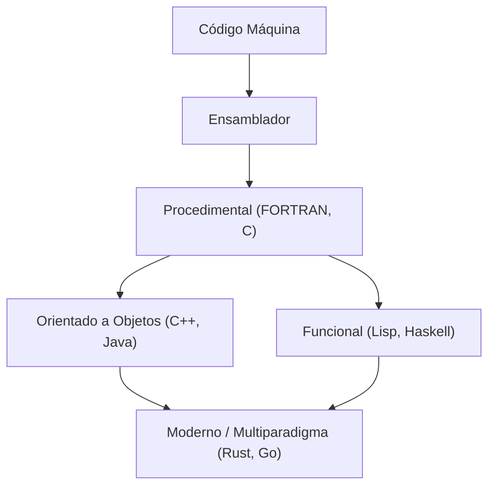
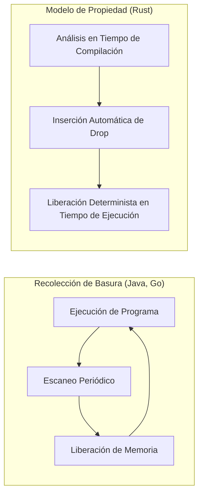

La historia de los lenguajes de programación es la historia de cómo la humanidad ha interactuado con esa caja mágica llamada computadora, y cómo ha logrado domar su complejidad.
En este artículo, explicaremos de manera sistemática y muy detallada la historia de los lenguajes de programación y la evolución de los **paradigmas** subyacentes, comenzando por el lenguaje ensamblador, pasando por C y Java, hasta llegar a Rust y Go, que lideran la programación de sistemas modernos.

## 1. Los albores de los lenguajes de programación: Del código máquina al ensamblador

En los inicios del desarrollo de las computadoras, los programadores daban órdenes directamente al hardware utilizando **código máquina**. El código máquina es una secuencia de bits de "0" y "1", que era demasiado difícil de entender y escribir para los humanos, lo que provocaba errores con facilidad.

Ahí es donde apareció el **lenguaje ensamblador**. El lenguaje ensamblador asigna cadenas cortas (mnemónicos) fáciles de recordar por los humanos a las instrucciones (códigos de operación) del código máquina. Por ejemplo, se asignó el nombre `MOV` a la instrucción para mover datos y `ADD` a la instrucción para sumar.

```assembly
; Ejemplo en lenguaje ensamblador (x86)
section .text
global _start

_start:
    mov edx, len    ; Especifica la longitud del mensaje
    mov ecx, msg    ; Especifica la dirección del mensaje
    mov ebx, 1      ; Especifica la salida estándar
    mov eax, 4      ; Número de llamada al sistema para sys_write
    int 0x80        ; Llamada al kernel

    mov eax, 1      ; Número de llamada al sistema para sys_exit
    int 0x80        ; Llamada al kernel

section .data
msg db 'Hello, World!', 0xa
len equ $ - msg
```

Con la llegada del lenguaje ensamblador, la productividad de los programadores mejoró dramáticamente, pero aún existía el problema de depender fuertemente de la arquitectura del hardware (el conjunto de instrucciones de la CPU). Para ejecutar el código en otra CPU, había que reescribirlo desde cero.


## 2. Programación estructurada y lenguajes procedimentales: El nacimiento del lenguaje C

Para lograr una programación independiente del hardware, surgieron los lenguajes de alto nivel. Pioneros de esto fueron FORTRAN y COBOL. Sin embargo, a medida que los programas se volvían más grandes, proliferaba el "código espagueti", cuyo flujo de control era imposible de seguir. Esto se debía principalmente al uso abusivo y desordenado de la sentencia `GOTO`.

Esto se resolvió con el paradigma de la **programación estructurada**. Edsger Dijkstra y otros propusieron que los programas podían describirse utilizando solo tres estructuras de control básicas: "secuencia", "selección (if)" e "iteración (while/for)".

El **lenguaje C**, desarrollado por Dennis Ritchie en 1972, encarnó este paradigma de programación estructurada y además revolucionó la programación de sistemas.

El lenguaje C fue creado para escribir el sistema operativo UNIX. Tenía capacidades de acceso a memoria de bajo nivel (como punteros) cercanas a las del lenguaje ensamblador, al mismo tiempo que poseía portabilidad independiente del hardware.

```c
#include <stdio.h>

// Ejemplo de programación estructurada: Cálculo factorial
int factorial(int n) {
    int result = 1;
    for (int i = 1; i <= n; i++) {
        result *= i;
    }
    return result;
}

int main() {
    int num = 5;
    printf("Factorial of %d is %d\n", num, factorial(num));
    return 0;
}
```

Gracias al éxito del lenguaje C, la "programación procedimental" se consolidó durante mucho tiempo como el paradigma de programación estándar. Sin embargo, a medida que los sistemas se volvían aún más masivos y complejos, la separación entre los datos y los procedimientos (funciones) que los operaban generaba un problema de disminución en la mantenibilidad.


## 3. El auge de la orientación a objetos: Manejando la complejidad y la llegada de Java

El paradigma de la **programación orientada a objetos (POO)**, que agrupa datos y procedimientos y modela un programa como interacciones entre "objetos", comenzó a llamar la atención.

Lenguajes como Simula y Smalltalk sentaron las bases del concepto de POO, y **C++**, que añadió capacidades de POO a C, se hizo ampliamente popular. Sin embargo, C++ sufría de especificaciones de lenguaje complejas y dificultades en la gestión de memoria debido a los punteros (como fugas de memoria y fallos de segmentación).

En 1995, Sun Microsystems (ahora Oracle) anunció **Java**. Con el eslogan "Write Once, Run Anywhere" (Escríbelo una vez, ejecútalo en cualquier lugar), Java logró una independencia total de la plataforma al ejecutarse en la Máquina Virtual de Java (JVM).

La característica principal de Java fue que eliminó las funcionalidades complejas de C++, se diseñó como un lenguaje puro orientado a objetos, e introdujo la **recolección de basura (GC)**. Esto liberó a los programadores de la tediosa tarea de liberar memoria.

```java
// Ejemplo de orientación a objetos en Java
public class Animal {
    private String name;

    public Animal(String name) {
        this.name = name;
    }

    public void speak() {
        System.out.println(this.name + " makes a sound.");
    }
}

public class Dog extends Animal {
    public Dog(String name) {
        super(name);
    }

    @Override
    public void speak() {
        System.out.println("Woof!");
    }

    public static void main(String[] args) {
        Animal myDog = new Dog("Buddy");
        myDog.speak(); // Imprime "Woof!"
    }
}
```

Con la llegada de Java, la orientación a objetos se convirtió en el paradigma principal indiscutible en el desarrollo a gran escala de sistemas empresariales.

Aquí, visualicemos la evolución de los lenguajes de programación.




## 4. La era de Internet y la diversificación de paradigmas

A partir de la década del 2000, junto con la difusión de la Web, los lenguajes de scripting (Python, Ruby, JavaScript, etc.) ganaron prominencia. Estos lenguajes priorizaban la velocidad de desarrollo y ofrecían tipado dinámico y ricas estructuras de datos integradas.
Al mismo tiempo, el paradigma de la **programación funcional** (como Haskell o Scala), que modela la computación como la evaluación de funciones sin estado, comenzó a ser reevaluado debido a su facilidad para la concurrencia.

La teoría fundamental del cálculo lambda en la programación funcional se basa en la aplicación y abstracción de funciones, como lo expresan las siguientes fórmulas matemáticas:

$$
\text{Expresión Lambda: } e ::= x \mid \lambda x.e \mid e\ e
$$

Los lenguajes funcionales, que poseen rigor matemático, se construyen en torno a funciones puras sin efectos secundarios y tienen la ventaja de facilitar la escritura de código robusto y menos propenso a errores.

## 5. Programación de sistemas moderna: La llegada de Rust y Go

Con la difusión de la computación en la nube y las CPU multinúcleo, hoy en día se exige a los lenguajes de programación que posean al mismo tiempo "alto rendimiento", "facilidad para la concurrencia" y "seguridad de memoria". **Go** y **Rust** han surgido para satisfacer esta demanda.

### 5.1. El lenguaje Go: Simplicidad y poderosa concurrencia

**Go**, desarrollado por Google, es un lenguaje de programación de sistemas que combina la simplicidad de C con la facilidad de escritura de los lenguajes dinámicos.
La mayor característica de Go es su procesamiento concurrente utilizando el modelo CSP (Communicating Sequential Processes) a través de **Gorutinas (Goroutines)** y **Canales (Channels)**.

```go
package main

import (
	"fmt"
	"time"
)

// Función del trabajador
func worker(id int, jobs <-chan int, results chan<- int) {
	for j := range jobs {
		fmt.Printf("Worker %d started job %d\n", id, j)
		time.Sleep(time.Second) // Simula procesamiento
		fmt.Printf("Worker %d finished job %d\n", id, j)
		results <- j * 2
	}
}

func main() {
	jobs := make(chan int, 100)
	results := make(chan int, 100)

	// Inicia 3 trabajadores (gorutinas)
	for w := 1; w <= 3; w++ {
		go worker(w, jobs, results)
	}

	// Envía 5 trabajos
	for j := 1; j <= 5; j++ {
		jobs <- j
	}
	close(jobs)

	// Recibe los resultados
	for a := 1; a <= 5; a++ {
		<-results
	}
}
```

Go tiene recolección de basura, lo que automatiza la gestión de memoria, pero su velocidad de ejecución es extremadamente rápida, convirtiéndolo en el lenguaje estándar de facto en el desarrollo de microservicios e infraestructuras en la nube (como Kubernetes o Docker).

### 5.2. Rust: Máxima seguridad de memoria gracias a su sistema de propiedad

**Rust**, desarrollado principalmente por Mozilla, es un lenguaje revolucionario que combina "un rendimiento equivalente al de C o C++" con "una total seguridad de memoria". Rust carece de recolección de basura y, en su lugar, utiliza conceptos propios como **"Propiedad (Ownership)", "Préstamo (Borrowing)" y "Tiempo de vida (Lifetime)"**, los cuales verifica durante la compilación, previniendo así errores como las condiciones de carrera y las fugas de memoria de antemano.

```rust
fn main() {
    let s1 = String::from("hello");
    // Cuando la propiedad de s1 se mueve a la función calculate_length, s1 ya no puede usarse después.
    // Por eso, se pasa una referencia (préstamo).
    let len = calculate_length(&s1);

    println!("The length of '{}' is {}.", s1, len);
}

// Recibe una referencia (no toma la propiedad)
fn calculate_length(s: &String) -> usize {
    s.len()
}
```

La comparación entre el modelo de gestión de memoria de Rust y la recolección de basura (GC) se muestra en el siguiente diagrama.



Debido a su seguridad, Rust está siendo rápidamente adoptado en áreas donde se exige una fiabilidad extremadamente alta, como el desarrollo del kernel del sistema operativo (su introducción en el kernel de Linux), motores de navegadores y tecnología blockchain.

## 6. Fusión de paradigmas y perspectivas futuras

Los lenguajes de programación modernos ya no están limitados por un único paradigma; en su lugar, tienden a ser **multiparadigma**, incorporando características excelentes de varios de ellos.

Por ejemplo, Rust y Go incorporan elementos de la programación funcional (closures, funciones de orden superior, etc.), y lenguajes como Java o C++ han añadido características similares a las funcionales (como expresiones lambda) en versiones posteriores.

La evolución de los paradigmas de programación está fuertemente influenciada por los avances en el hardware de las computadoras (como la transición de un solo núcleo a múltiples núcleos) y la naturaleza de los problemas a resolver (como la transición de aplicaciones locales a sistemas distribuidos).

Como señala la ley de Amdahl, existe un límite en la mejora del rendimiento mediante la paralelización.

$$
\text{Aceleración} = \frac{1}{(1 - P) + \frac{P}{N}}
$$
(Donde $P$ es la proporción de procesamiento paralelizable y $N$ es el número de procesadores)

Para expandir este límite y maximizar el rendimiento de los múltiples núcleos, los lenguajes como Rust y Go, que ofrecen modelos de concurrencia seguros y eficientes, se están volviendo predominantes.

## 7. Conclusión

Comenzando desde la interacción directa con el hardware a través del lenguaje ensamblador, pasando por la obtención de estructuración y portabilidad mediante el lenguaje C, la abstracción de la gestión de memoria y la orientación a objetos a través de Java, hasta la búsqueda de concurrencia y seguridad de la mano de Rust y Go; los lenguajes de programación no han dejado de evolucionar.

**Aprender un nuevo lenguaje es aprender un nuevo marco de pensamiento (paradigma).** Comprender el sistema de propiedad de Rust o el modelo CSP de Go también te permitirá diseñar aplicaciones de manera más segura y con mayor concurrencia al escribir en C o Java.

Mirar hacia atrás en la historia es la mejor brújula para predecir las tendencias tecnológicas del futuro. El viaje de los lenguajes de programación continuará indefinidamente.
