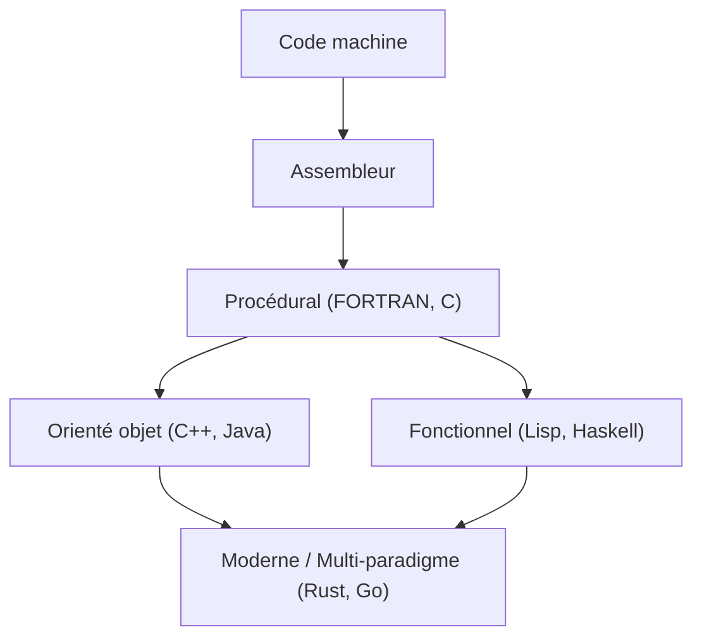
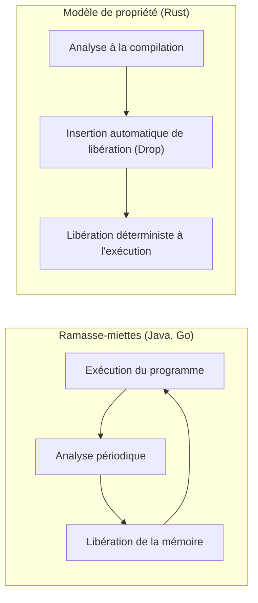

L'histoire des langages de programmation est l'histoire même de la façon dont l'humanité a interagi avec ces boîtes magiques que sont les ordinateurs, et comment elle a réussi à maîtriser leur complexité.
Dans cet article, nous expliquerons de manière extrêmement détaillée et systématique l'histoire des langages de programmation et l'évolution des **paradigmes** sous-jacents, en commençant par le langage assembleur, puis C, Java, et enfin Rust et Go, qui sont à la pointe de la programmation système moderne.

## 1. Les débuts des langages de programmation : du langage machine à l'assembleur

À l'aube des ordinateurs, les programmeurs utilisaient le **langage machine** pour donner directement des instructions au matériel. Le langage machine est une série de bits composés de "0" et de "1", ce qui était beaucoup trop complexe à comprendre et à écrire directement pour un humain, et entraînait facilement des erreurs.

C'est alors qu'est apparu le **langage assembleur**. Le langage assembleur attribue des chaînes de caractères courtes et faciles à mémoriser pour les humains (mnémoniques) aux instructions en langage machine (codes d'opération). Par exemple, l'instruction pour déplacer des données a été nommée `MOV`, et l'instruction pour additionner a été nommée `ADD`.

```assembly
; Exemple de langage assembleur (x86)
section .text
global _start

_start:
    mov edx, len    ; Spécifier la longueur du message
    mov ecx, msg    ; Spécifier l'adresse du message
    mov ebx, 1      ; Spécifier la sortie standard
    mov eax, 4      ; Numéro d'appel système pour sys_write
    int 0x80        ; Appel au noyau

    mov eax, 1      ; Numéro d'appel système pour sys_exit
    int 0x80        ; Appel au noyau

section .data
msg db 'Bonjour le monde !', 0xa
len equ $ - msg
```

L'apparition du langage assembleur a considérablement amélioré la productivité des programmeurs, mais il restait un problème de forte dépendance à l'architecture matérielle (jeu d'instructions du processeur). Pour l'exécuter sur un autre processeur, il fallait réécrire le code depuis le début.


## 2. Programmation structurée et langages procéduraux : la naissance du langage C

Pour permettre une programmation indépendante du matériel, les langages de haut niveau sont apparus. FORTRAN et COBOL en sont les précurseurs. Cependant, à mesure que les programmes devenaient plus volumineux, un code dont le flux de contrôle était impossible à suivre, appelé "code spaghetti", s'est répandu. Cela était principalement dû à l'utilisation excessive et désordonnée de l'instruction `GOTO`.

Ce problème a été résolu par le paradigme de la **programmation structurée**. Edsger Dijkstra et d'autres ont proposé qu'un programme puisse être décrit en utilisant uniquement trois structures de contrôle de base : "séquence", "sélection (if)" et "itération (while/for)".

Le langage qui a incarné ce paradigme de programmation structurée et a de plus révolutionné la programmation système est le **langage C**, développé par Dennis Ritchie en 1972.

Le langage C a été créé pour écrire le système d'exploitation UNIX. Il possédait une capacité d'accès à la mémoire de bas niveau (comme les pointeurs) proche du langage assembleur, tout en offrant une portabilité indépendante du matériel.

```c
#include <stdio.h>

// Exemple de programmation structurée : calcul de la factorielle
int factorial(int n) {
    int result = 1;
    for (int i = 1; i <= n; i++) {
        result *= i;
    }
    return result;
}

int main() {
    int num = 5;
    printf("La factorielle de %d est %d\n", num, factorial(num));
    return 0;
}
```

Grâce au succès du langage C, la "programmation procédurale" s'est longtemps imposée comme le paradigme standard en programmation. Cependant, à mesure que les systèmes devenaient encore plus vastes et complexes, la séparation des données et des procédures (fonctions) qui les manipulent a entraîné une baisse de la maintenabilité, devenant ainsi un défi.


## 3. L'essor de l'orientation objet : gérer la complexité et l'apparition de Java

Le paradigme de la **programmation orientée objet (POO)**, qui regroupe les données et les procédures et modélise les programmes sous forme d'interactions d'"objets", a attiré l'attention.

Des langages comme Simula et Smalltalk ont posé les concepts de la POO, et le **C++**, qui a ajouté les fonctionnalités de la POO au langage C, s'est largement répandu. Cependant, le C++ souffrait de spécifications linguistiques complexes et de la difficulté de gestion de la mémoire par le biais de pointeurs (fuites de mémoire, défauts de segmentation, etc.).

En 1995, Sun Microsystems (aujourd'hui Oracle) a annoncé **Java**. Java a mis en avant le slogan "Write Once, Run Anywhere" (Écrire une fois, exécuter partout) et a permis une indépendance totale de la plate-forme en s'exécutant sur la machine virtuelle Java (JVM).

La principale caractéristique de Java est qu'il a été conçu comme un langage orienté objet pur, débarrassé des fonctionnalités complexes du C++, et qu'il a introduit le **ramasse-miettes (Garbage Collection, GC)**. Grâce à cela, les programmeurs ont été libérés de la tâche fastidieuse de libération de la mémoire.

```java
// Exemple d'orientation objet en Java
public class Animal {
    private String name;

    public Animal(String name) {
        this.name = name;
    }

    public void speak() {
        System.out.println(this.name + " fait un son.");
    }
}

public class Dog extends Animal {
    public Dog(String name) {
        super(name);
    }

    @Override
    public void speak() {
        System.out.println("Ouaf !");
    }

    public static void main(String[] args) {
        Animal myDog = new Dog("Buddy");
        myDog.speak(); // Affiche "Ouaf !"
    }
}
```

Avec l'arrivée de Java, l'orientation objet est devenue le paradigme dominant absolu dans le développement à grande échelle de systèmes d'entreprise.

À présent, visualisons l'évolution des langages de programmation.




## 4. L'ère d'Internet et la diversification des paradigmes

Depuis les années 2000, avec la popularisation du Web, les langages de script (Python, Ruby, JavaScript, etc.) ont pris de l'importance. Ces langages ont mis l'accent sur la vitesse de développement, offrant un typage dynamique et de riches structures de données intégrées.
Dans le même temps, le paradigme de la **programmation fonctionnelle** (comme Haskell et Scala), qui modélise le calcul comme l'évaluation de fonctions sans état, a été réévalué pour sa facilité de traitement parallèle.

La théorie fondamentale du calcul lambda en programmation fonctionnelle repose sur l'application et l'abstraction de fonctions telles qu'exprimées par les formules suivantes.

$$
\text{Expression Lambda : } e ::= x \mid \lambda x.e \mid e\ e
$$

Les langages fonctionnels, avec leur rigueur mathématique, s'articulent autour de fonctions pures sans effets secondaires, et présentent l'avantage de faciliter l'écriture d'un code robuste et peu sujet aux bogues.

## 5. La programmation système moderne : l'émergence de Rust et Go

Avec la démocratisation du cloud computing et des processeurs multicœurs, les langages de programmation modernes doivent désormais offrir simultanément "hautes performances", "facilité de traitement parallèle" et "sécurité de la mémoire". **Go** et **Rust** sont apparus pour répondre à cette demande.

### 5.1. Le langage Go : simplicité et traitement parallèle puissant

Développé par Google, **Go** est un langage de programmation système qui combine la simplicité de langages comme le C et la facilité d'écriture des langages dynamiques.
La principale caractéristique de Go est son traitement parallèle adoptant le modèle CSP (Communicating Sequential Processes) à l'aide des **Goroutines** et des **Channels (Canaux)**.

```go
package main

import (
	"fmt"
	"time"
)

// Fonction travailleur
func worker(id int, jobs <-chan int, results chan<- int) {
	for j := range jobs {
		fmt.Printf("Le travailleur %d a commencé la tâche %d\n", id, j)
		time.Sleep(time.Second) // Simule le traitement
		fmt.Printf("Le travailleur %d a terminé la tâche %d\n", id, j)
		results <- j * 2
	}
}

func main() {
	jobs := make(chan int, 100)
	results := make(chan int, 100)

	// Lancement de 3 travailleurs (goroutines)
	for w := 1; w <= 3; w++ {
		go worker(w, jobs, results)
	}

	// Envoi de 5 tâches
	for j := 1; j <= 5; j++ {
		jobs <- j
	}
	close(jobs)

	// Réception des résultats
	for a := 1; a <= 5; a++ {
		<-results
	}
}
```

Bien que Go dispose d'un ramasse-miettes et automatise la gestion de la mémoire, sa vitesse d'exécution est extrêmement rapide, ce qui en fait le langage standard de facto dans le développement de microservices et d'infrastructures cloud (comme Kubernetes et Docker).

### 5.2. Rust : la sécurité ultime de la mémoire grâce au système de propriété

Développé principalement par Mozilla, **Rust** est un langage révolutionnaire qui allie "des performances équivalentes au C ou C++" et "une sécurité totale de la mémoire". Rust ne possède pas de ramasse-miettes ; au lieu de cela, il prévient les bogues tels que les courses aux données (data races) et les fuites de mémoire en vérifiant à la compilation des concepts uniques que sont la **"Propriété (Ownership)"**, l'**"Emprunt (Borrowing)"** et la **"Durée de vie (Lifetime)"**.

```rust
fn main() {
    let s1 = String::from("bonjour");
    // Si la propriété de s1 est déplacée (move) vers la fonction calculate_length, s1 ne pourra plus être utilisée par la suite.
    // C'est pourquoi nous passons une référence (emprunt).
    let len = calculate_length(&s1);

    println!("La longueur de '{}' est {}.", s1, len);
}

// Reçoit une référence (ne prend pas la propriété)
fn calculate_length(s: &String) -> usize {
    s.len()
}
```

Le graphique ci-dessous illustre la comparaison entre le modèle de gestion de la mémoire de Rust et le ramasse-miettes (GC).



En raison de sa sécurité, l'adoption de Rust progresse rapidement dans des domaines nécessitant une fiabilité extrêmement élevée, tels que le développement de noyaux de systèmes d'exploitation (son introduction dans le noyau Linux), les moteurs de navigateurs et la technologie blockchain.

## 6. Fusion des paradigmes et perspectives d'avenir

Les langages de programmation modernes ne sont plus limités à un seul paradigme ; ils deviennent **multi-paradigmes**, intégrant les excellentes fonctionnalités de plusieurs paradigmes.

Par exemple, Rust et Go intègrent des éléments de la programmation fonctionnelle (closures, fonctions d'ordre supérieur, etc.), et Java et C++ ont également ajouté des fonctionnalités de type fonctionnel (comme les expressions lambda) dans leurs versions ultérieures.

L'évolution des paradigmes de programmation est fortement influencée par l'évolution du matériel informatique (comme le passage d'un cœur unique à plusieurs cœurs) et la nature des problèmes à résoudre (comme le passage des applications locales aux systèmes distribués).

Comme le montre la loi d'Amdahl (Amdahl's Law), l'amélioration des performances par la parallélisation a ses limites.

$$
\text{Accélération} = \frac{1}{(1 - P) + \frac{P}{N}}
$$
(Ici, $P$ est la proportion du traitement qui peut être parallélisée, et $N$ est le nombre de processeurs)

Pour repousser ces limites et tirer le meilleur parti des performances des processeurs multicœurs, Rust et Go, qui offrent des modèles de traitement parallèle sûrs et efficaces, sont devenus courants.

## 7. Conclusion

Des interactions directes avec le matériel via le langage assembleur, en passant par la structuration et l'acquisition de portabilité avec le C, l'abstraction de l'orientation objet et de la gestion de la mémoire avec Java, jusqu'à la quête du traitement parallèle et de la sécurité avec Rust et Go, les langages de programmation ont constamment évolué.

**Apprendre un nouveau langage, c'est apprendre un nouveau cadre de pensée (paradigme).** Comprendre le système de propriété de Rust ou le modèle CSP de Go vous permettra également de concevoir de manière plus sûre et plus parallèle lorsque vous écrirez du C ou du Java.

Le regard sur l'histoire est la meilleure boussole pour prédire les tendances technologiques de demain. Le voyage des langages de programmation est loin d'être terminé.
