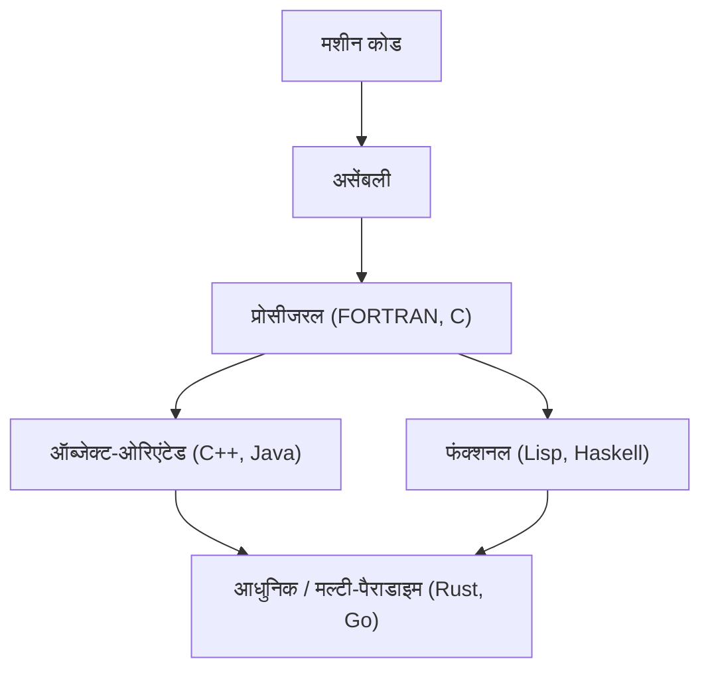
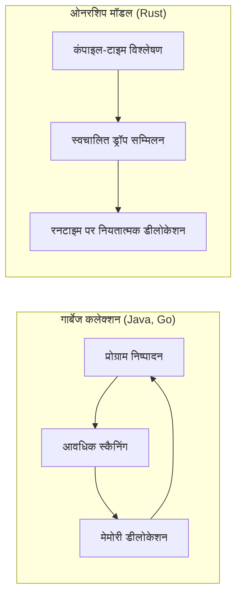

प्रोग्रामिंग भाषाओं का इतिहास इस बात का इतिहास है कि मानव जाति ने कंप्यूटर नामक जादुई बॉक्स के साथ कैसे बातचीत की है, और कैसे उन्होंने इसकी जटिलता को नियंत्रित किया है।
इस लेख में, हम प्रोग्रामिंग भाषाओं के इतिहास और उनके मूल **प्रतिमानों (पैराडाइम)** के विकास के बारे में विस्तार और व्यवस्थित रूप से चर्चा करेंगे, जो असेंबली भाषा से शुरू होकर, C भाषा, Java, और आधुनिक सिस्टम प्रोग्रामिंग का नेतृत्व करने वाले Rust और Go तक जाता है।

## 1. प्रोग्रामिंग भाषाओं का प्रारंभिक युग: मशीन भाषा से असेंबली तक

कंप्यूटर की शुरुआत में, प्रोग्रामर सीधे हार्डवेयर को निर्देश देने के लिए **मशीन भाषा** का उपयोग करते थे। मशीन भाषा "0" और "1" की एक बिट स्ट्रिंग होती है, जिसे इंसानों के लिए सीधे समझना और लिखना बहुत मुश्किल था, और इसमें आसानी से त्रुटियां (errors) हो जाती थीं।

तभी **असेंबली भाषा** सामने आई। असेंबली भाषा मशीन भाषा के निर्देशों (ऑपकोड) को छोटे स्ट्रिंग्स (निमोनिक्स) प्रदान करती है जिन्हें मनुष्य आसानी से याद रख सकते हैं। उदाहरण के लिए, डेटा ले जाने के निर्देश का नाम `MOV` रखा गया, और जोड़ने के निर्देश का नाम `ADD` रखा गया।

```assembly
; असेंबली भाषा का उदाहरण (x86)
section .text
global _start

_start:
    mov edx, len    ; संदेश की लंबाई निर्दिष्ट करें
    mov ecx, msg    ; संदेश का पता निर्दिष्ट करें
    mov ebx, 1      ; मानक आउटपुट निर्दिष्ट करें
    mov eax, 4      ; sys_write का सिस्टम कॉल नंबर
    int 0x80        ; कर्नेल कॉल

    mov eax, 1      ; sys_exit का सिस्टम कॉल नंबर
    int 0x80        ; कर्नेल कॉल

section .data
msg db 'Hello, World!', 0xa
len equ $ - msg
```

असेंबली भाषा के आने से प्रोग्रामर की उत्पादकता में काफी सुधार हुआ, लेकिन फिर भी एक समस्या थी कि यह काफी हद तक हार्डवेयर आर्किटेक्चर (CPU इंस्ट्रक्शन सेट) पर निर्भर थी। इसे किसी अन्य CPU पर चलाने के लिए, कोड को फिर से लिखना पड़ता था।


## 2. स्ट्रक्चर्ड प्रोग्रामिंग और प्रोसीजरल लैंग्वेज: C भाषा का जन्म

हार्डवेयर-स्वतंत्र प्रोग्रामिंग हासिल करने के लिए, उच्च-स्तरीय भाषाएं सामने आईं। FORTRAN और COBOL इसके अग्रणी थे। हालांकि, जैसे-जैसे प्रोग्राम बड़े होते गए, "स्पेगेटी कोड" नामक अप्रतिबंधित कंट्रोल फ्लो वाला कोड फैल गया। इसका मुख्य कारण `GOTO` स्टेटमेंट का अत्यधिक उपयोग था।

इसे **स्ट्रक्चर्ड प्रोग्रामिंग** के प्रतिमान द्वारा हल किया गया था। एडगर डिज्क्स्ट्रा और अन्य लोगों ने प्रस्तावित किया कि एक प्रोग्राम केवल तीन बुनियादी नियंत्रण संरचनाओं के साथ लिखा जा सकता है: "अनुक्रम", "चयन (if)", और "पुनरावृत्ति (while/for)"।

1972 में डेनिस रिची द्वारा विकसित **C भाषा**, इस संरचित प्रोग्रामिंग प्रतिमान का प्रतीक है और सिस्टम प्रोग्रामिंग में एक क्रांति लेकर आई।

C भाषा को UNIX ऑपरेटिंग सिस्टम लिखने के लिए बनाया गया था। इसमें असेंबली भाषा की तरह लो-लेवल मेमोरी एक्सेस (जैसे पॉइंटर्स) की क्षमता है, जबकि इसमें हार्डवेयर से स्वतंत्र पोर्टेबिलिटी भी है।

```c
#include <stdio.h>

// स्ट्रक्चर्ड प्रोग्रामिंग का उदाहरण: फैक्टोरियल की गणना
int factorial(int n) {
    int result = 1;
    for (int i = 1; i <= n; i++) {
        result *= i;
    }
    return result;
}

int main() {
    int num = 5;
    printf("Factorial of %d is %d\n", num, factorial(num));
    return 0;
}
```

C भाषा की सफलता के कारण, "प्रोसीजरल प्रोग्रामिंग" लंबे समय तक प्रोग्रामिंग के लिए एक मानक प्रतिमान बन गया। हालांकि, जैसे-जैसे सिस्टम बड़े और जटिल होते गए, डेटा और उस पर कार्य करने वाली प्रक्रियाओं (कार्यों) के अलग होने के कारण रखरखाव में कमी एक समस्या बन गई।


## 3. ऑब्जेक्ट-ओरिएंटेड प्रोग्रामिंग का उदय: जटिलता को संभालना और Java का आगमन

**ऑब्जेक्ट-ओरिएंटेड प्रोग्रामिंग ([OOP](https://kenji.blog/hi/p/object-oriented-programming-oop-solid-principles/))**, जो डेटा और प्रक्रियाओं को एक साथ समूहित करता है और प्रोग्राम को "ऑब्जेक्ट्स" के इंटरेक्शन के रूप में मॉडल करता है, ने बहुत ध्यान आकर्षित किया।

Simula और Smalltalk जैसी भाषाओं ने OOP की अवधारणा को स्थापित किया, और C भाषा में OOP सुविधाएँ जोड़ने वाली **C++** का व्यापक रूप से उपयोग किया जाने लगा। हालांकि, C++ में जटिल भाषा विनिर्देश और पॉइंटर्स के माध्यम से मेमोरी को प्रबंधित करने में कठिनाई (जैसे मेमोरी लीक और सेगमेंटेशन फॉल्ट) की समस्याएं थीं।

1995 में, सन माइक्रोसिस्टम्स (अब Oracle) ने **Java** की घोषणा की। Java ने "Write Once, Run Anywhere (एक बार लिखें, कहीं भी चलाएँ)" का नारा दिया और Java वर्चुअल मशीन (JVM) पर काम करके पूर्ण प्लेटफॉर्म स्वतंत्रता हासिल की।

Java की सबसे बड़ी विशेषता यह थी कि इसे C++ की जटिल विशेषताओं को हटाकर एक शुद्ध ऑब्जेक्ट-ओरिएंटेड भाषा के रूप में डिज़ाइन किया गया था, और इसने **गार्बेज कलेक्शन (GC)** पेश किया। इसने प्रोग्रामर्स को मेमोरी को मैन्युअल रूप से मुक्त करने के थकाऊ काम से बचा लिया।

```java
// Java में ऑब्जेक्ट-ओरिएंटेड का उदाहरण
public class Animal {
    private String name;

    public Animal(String name) {
        this.name = name;
    }

    public void speak() {
        System.out.println(this.name + " makes a sound.");
    }
}

public class Dog extends Animal {
    public Dog(String name) {
        super(name);
    }

    @Override
    public void speak() {
        System.out.println("Woof!");
    }

    public static void main(String[] args) {
        Animal myDog = new Dog("Buddy");
        myDog.speak(); // "Woof!" आउटपुट होगा
    }
}
```

Java के आगमन के साथ, ऑब्जेक्ट-ओरिएंटेड प्रोग्रामिंग बड़े पैमाने पर एंटरप्राइज़ सिस्टम के विकास में पूरी तरह से मुख्यधारा का प्रतिमान बन गया।

आइए अब प्रोग्रामिंग भाषाओं के विकास की कल्पना करें।




## 4. इंटरनेट युग और प्रतिमानों का विविधीकरण

2000 के दशक के बाद से, वेब के प्रसार के साथ, स्क्रिप्टिंग भाषाएं (Python, Ruby, JavaScript, आदि) प्रमुख हो गईं। इन भाषाओं ने विकास की गति पर जोर दिया और डायनामिक टाइपिंग और समृद्ध बिल्ट-इन डेटा संरचनाएं प्रदान कीं।
साथ ही, **फंक्शनल प्रोग्रामिंग** प्रतिमान (जैसे Haskell और Scala), जो स्टेटलेस कार्यों के मूल्यांकन के रूप में गणना को मॉडल करता है, समानांतर प्रसंस्करण में आसानी के कारण फिर से पहचाना जाने लगा।

फंक्शनल प्रोग्रामिंग में लैम्ब्डा कैलकुलस का मूल सिद्धांत कार्यों के उपयोग और अमूर्तता पर आधारित है जैसा कि निम्नलिखित सूत्र में दिखाया गया है।

$$
\text{लैम्ब्डा एक्सप्रेशन: } e ::= x \mid \lambda x.e \mid e\ e
$$

गणितीय कठोरता वाली फंक्शनल भाषाएं बिना साइड इफेक्ट्स वाले शुद्ध कार्यों के इर्द-गिर्द बनाई जाती हैं, और इसका फायदा यह है कि मजबूत कोड लिखना आसान होता है जिसमें बग्स होने की संभावना कम होती है।

## 5. आधुनिक सिस्टम प्रोग्रामिंग: Rust और Go का आगमन

क्लाउड कंप्यूटिंग और मल्टी-कोर CPU के प्रसार के साथ, आधुनिक प्रोग्रामिंग भाषाओं को एक ही समय में "उच्च प्रदर्शन", "समानांतर प्रसंस्करण में आसानी" और "मेमोरी सुरक्षा" की आवश्यकता होने लगी। इस मांग को पूरा करने के लिए **Go** और **Rust** उभरे।

### 5.1. Go भाषा: सादगी और शक्तिशाली कंकरेंसी

Google द्वारा विकसित **Go**, सिस्टम प्रोग्रामिंग भाषा होने के बावजूद C भाषा की सादगी और डायनामिक भाषा के लिखने में आसानी को जोड़ती है।
Go की सबसे बड़ी विशेषता इसका कंकरेंट प्रसंस्करण है, जो **गो-रूटीन (Goroutine)** और **चैनल (Channel)** का उपयोग करके CSP (Communicating Sequential Processes) मॉडल को अपनाता है।

```go
package main

import (
	"fmt"
	"time"
)

// वर्कर फ़ंक्शन
func worker(id int, jobs <-chan int, results chan<- int) {
	for j := range jobs {
		fmt.Printf("Worker %d started job %d\n", id, j)
		time.Sleep(time.Second) // प्रसंस्करण का अनुकरण करें
		fmt.Printf("Worker %d finished job %d\n", id, j)
		results <- j * 2
	}
}

func main() {
	jobs := make(chan int, 100)
	results := make(chan int, 100)

	// 3 वर्कर (गो-रूटीन) शुरू करें
	for w := 1; w <= 3; w++ {
		go worker(w, jobs, results)
	}

	// 5 जॉब भेजें
	for j := 1; j <= 5; j++ {
		jobs <- j
	}
	close(jobs)

	// परिणाम प्राप्त करें
	for a := 1; a <= 5; a++ {
		<-results
	}
}
```

Go में गार्बेज कलेक्शन है, जो मेमोरी प्रबंधन को स्वचालित करता है, लेकिन इसके निष्पादन की गति बहुत तेज़ है, और यह माइक्रो-सर्विसेज और क्लाउड इन्फ्रास्ट्रक्चर (जैसे Kubernetes और Docker) विकसित करने के लिए वास्तविक मानक भाषा बन गई है।

### 5.2. Rust: ओनरशिप सिस्टम के माध्यम से अंतिम मेमोरी सुरक्षा

Mozilla द्वारा मुख्य रूप से विकसित, **Rust** एक अभूतपूर्व भाषा है जो "C और C++ के बराबर प्रदर्शन" और "पूर्ण मेमोरी सुरक्षा" को जोड़ती है। Rust में गार्बेज कलेक्शन नहीं है, बल्कि संकलन के समय **"ओनरशिप (Ownership)"**, **"उधार (Borrowing)"**, और **"लाइफटाइम (Lifetime)"** की अनूठी अवधारणाओं को सत्यापित करके डेटा रेस और मेमोरी लीक जैसे बग्स को रोकता है।

```rust
fn main() {
    let s1 = String::from("hello");
    // अगर s1 की ओनरशिप फ़ंक्शन calculate_length में ले जाई (मूव) जाती है, तो s1 का बाद में उपयोग नहीं किया जा सकता है।
    // इसलिए, हम संदर्भ (reference) पास करते हैं (उधार लेते हैं)।
    let len = calculate_length(&s1);

    println!("The length of '{}' is {}.", s1, len);
}

// संदर्भ प्राप्त करें (ओनरशिप नहीं लेता)
fn calculate_length(s: &String) -> usize {
    s.len()
}
```

Rust के मेमोरी प्रबंधन मॉडल और गार्बेज कलेक्शन (GC) की तुलना नीचे दिए गए चित्र में दिखाई गई है।



Rust को तेजी से उन क्षेत्रों में अपनाया जा रहा है जहाँ इसके सुरक्षित होने के कारण उच्च विश्वसनीयता की आवश्यकता होती है, जैसे OS कर्नेल विकास (लिनक्स कर्नेल में शामिल करना), ब्राउज़र इंजन और ब्लॉकचेन तकनीक।

## 6. प्रतिमानों का एकीकरण और भविष्य की संभावनाएं

आधुनिक प्रोग्रामिंग भाषाएं एक ही प्रतिमान से बंधे रहने के बजाय कई प्रतिमानों की उत्कृष्ट विशेषताओं को शामिल करते हुए **मल्टी-पैराडाइम** बन रही हैं।

उदाहरण के लिए, Rust और Go में फंक्शनल प्रोग्रामिंग एलिमेंट्स (क्लोजर, हायर-ऑर्डर फंक्शंस, आदि) शामिल हैं, और Java और C++ ने बाद के संस्करणों में फंक्शनल-जैसी सुविधाएं (जैसे लैम्ब्डा एक्सप्रेशन) भी जोड़ी हैं।

प्रोग्रामिंग प्रतिमानों का विकास कंप्यूटर हार्डवेयर के विकास (जैसे सिंगल-कोर से मल्टी-कोर में परिवर्तन) और हल की जाने वाली समस्याओं की प्रकृति (जैसे स्थानीय अनुप्रयोगों से वितरित प्रणालियों में परिवर्तन) से बहुत प्रभावित है।

जैसा कि एमडाल का नियम (Amdahl's Law) दिखाता है, समानांतरीकरण द्वारा प्रदर्शन में सुधार की एक सीमा है।

$$
\text{गति में वृद्धि} = \frac{1}{(1 - P) + \frac{P}{N}}
$$
(यहाँ, $P$ समानांतरित किए जा सकने वाले प्रसंस्करण का अनुपात है, और $N$ प्रोसेसर की संख्या है)

इस सीमा को आगे बढ़ाने और मल्टी-कोर के प्रदर्शन को अधिकतम करने के लिए, Rust और Go, जो सुरक्षित और कुशल समानांतर प्रसंस्करण मॉडल प्रदान करते हैं, मुख्यधारा बन रहे हैं।

## 7. निष्कर्ष

हार्डवेयर के साथ सीधे इंटरैक्शन के लिए असेंबली भाषा से शुरू होकर, C भाषा के साथ संरचना और पोर्टेबिलिटी प्राप्त करने तक, Java के साथ ऑब्जेक्ट-ओरिएंटेड और मेमोरी मैनेजमेंट एब्स्ट्रेक्शन, और Rust और Go के साथ कंकरेंसी और सुरक्षा की खोज तक, प्रोग्रामिंग भाषाएं लगातार विकसित हो रही हैं।

**एक नई भाषा सीखना विचार के एक नए ढांचे (प्रतिमान) को सीखना है।** Rust के ओनरशिप सिस्टम या Go के CSP मॉडल को समझने से आप C या Java में कोड लिखते समय सुरक्षित और अधिक समवर्ती डिज़ाइन बनाने में सक्षम होंगे।

इतिहास पर नज़र डालना भविष्य में प्रौद्योगिकी के रुझान की भविष्यवाणी करने के लिए सबसे अच्छा कम्पास है। प्रोग्रामिंग भाषाओं की यात्रा कभी खत्म नहीं होगी।
