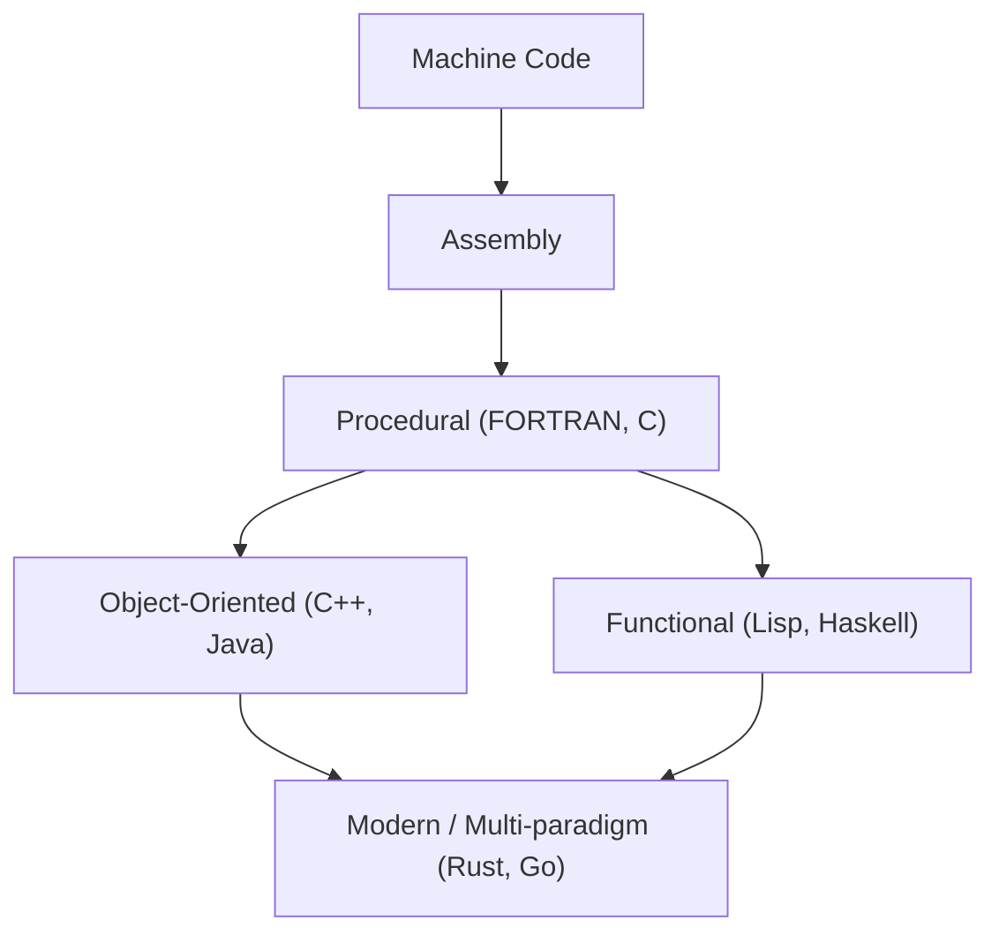
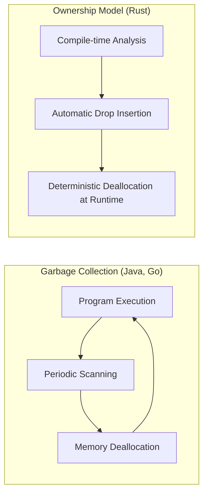

Sejarah bahasa pemrograman adalah sejarah tentang bagaimana umat manusia berinteraksi dengan kotak ajaib yang disebut komputer, dan bagaimana kita telah menjinakkan kompleksitasnya.
Artikel ini akan menjelaskan secara sangat rinci dan sistematis mengenai sejarah bahasa pemrograman dan evolusi **paradigma** yang mendasarinya, mulai dari bahasa assembly, bahasa C, Java, hingga Rust dan Go yang mendorong pemrograman sistem modern.

## 1. Fajar Bahasa Pemrograman: Dari Kode Mesin ke Assembly

Pada masa awal kelahiran komputer, pemrogram menggunakan **kode mesin (machine code)** untuk memberikan instruksi langsung kepada perangkat keras. Kode mesin adalah deretan bit "0" dan "1", yang terlalu sulit dipahami dan ditulis langsung oleh manusia, serta sangat rentan terhadap kesalahan.

Oleh karena itu, muncullah **bahasa assembly**. Bahasa assembly menetapkan string pendek (mnemonik) yang mudah diingat oleh manusia untuk instruksi kode mesin (opcode). Misalnya, instruksi untuk memindahkan data diberi nama `MOV`, dan instruksi untuk penjumlahan diberi nama `ADD`.

```assembly
; Contoh bahasa assembly (x86)
section .text
global _start

_start:
    mov edx, len    ; Tentukan panjang pesan
    mov ecx, msg    ; Tentukan alamat pesan
    mov ebx, 1      ; Tentukan output standar
    mov eax, 4      ; Nomor system call sys_write
    int 0x80        ; Panggilan kernel

    mov eax, 1      ; Nomor system call sys_exit
    int 0x80        ; Panggilan kernel

section .data
msg db 'Hello, World!', 0xa
len equ $ - msg
```

Dengan munculnya bahasa assembly, produktivitas pemrogram meningkat secara drastis, tetapi masih ada masalah ketergantungan yang kuat pada arsitektur perangkat keras (set instruksi CPU). Untuk menjalankannya di CPU yang berbeda, kode tersebut harus ditulis ulang dari awal.


## 2. Pemrograman Terstruktur dan Bahasa Prosedural: Lahirnya Bahasa C

Untuk mewujudkan pemrograman yang tidak bergantung pada perangkat keras, bahasa tingkat tinggi pun muncul. FORTRAN dan COBOL adalah beberapa pelopornya. Namun, seiring dengan semakin besarnya skala program, kode yang aliran kontrolnya tidak dapat dilacak, atau yang dikenal sebagai "kode spageti", menjadi merajalela. Ini terutama disebabkan oleh penggunaan pernyataan `GOTO` yang tidak teratur secara berlebihan.

Masalah ini diselesaikan oleh paradigma **pemrograman terstruktur**. Edsger Dijkstra dan rekan-rekannya mengusulkan bahwa program dapat ditulis hanya dengan tiga struktur kontrol dasar: "berurutan (sequence)", "seleksi (if)", dan "iterasi (while/for)".

Yang mewujudkan paradigma pemrograman terstruktur ini, dan selanjutnya membawa revolusi pada pemrograman sistem, adalah **bahasa C** yang dikembangkan oleh Dennis Ritchie pada tahun 1972.

Bahasa C diciptakan untuk menulis sistem operasi UNIX. Bahasa ini memiliki kemampuan akses memori tingkat rendah (seperti pointer) yang mendekati bahasa assembly, sekaligus memiliki portabilitas yang tidak bergantung pada perangkat keras.

```c
#include <stdio.h>

// Contoh pemrograman terstruktur: perhitungan faktorial
int factorial(int n) {
    int result = 1;
    for (int i = 1; i <= n; i++) {
        result *= i;
    }
    return result;
}

int main() {
    int num = 5;
    printf("Factorial of %d is %d\n", num, factorial(num));
    return 0;
}
```

Kesuksesan bahasa C membuat "pemrograman prosedural" bertahan lama sebagai paradigma standar dalam pemrograman. Namun, seiring dengan sistem yang menjadi lebih masif dan kompleks, pemisahan antara data dan prosedur (fungsi) yang memanipulasinya menyebabkan penurunan skalabilitas dan kemudahan pemeliharaan (maintainability).


## 3. Kebangkitan Berorientasi Objek: Mengatasi Kompleksitas dan Munculnya Java

Paradigma **Pemrograman Berorientasi Objek ([OOP](https://kenji.blog/id/p/object-oriented-programming-oop-solid-principles/))**, yang menggabungkan data dan prosedur, serta memodelkan program sebagai interaksi antar "objek", mulai menarik perhatian.

Bahasa seperti Simula dan Smalltalk membangun konsep OOP, lalu **C++** yang menambahkan fitur OOP ke dalam bahasa C menjadi tersebar luas. Namun, C++ memiliki masalah dengan spesifikasi bahasa yang kompleks dan kesulitan manajemen memori melalui pointer (seperti kebocoran memori atau kesalahan segmentasi).

Pada tahun 1995, Sun Microsystems (sekarang Oracle) merilis **Java**. Java mengusung slogan "Write Once, Run Anywhere (Tulis Sekali, Jalankan Di Mana Saja)", dan dengan beroperasi di atas Java Virtual Machine (JVM), Java mewujudkan ketidaktergantungan platform (platform independence) yang sempurna.

Fitur terbesar Java adalah didesain murni sebagai bahasa berorientasi objek dengan menghilangkan fitur-fitur kompleks C++, serta memperkenalkan **Garbage Collection (GC)**. Hal ini membebaskan pemrogram dari tugas pelepasan memori yang merepotkan.

```java
// Contoh berorientasi objek dalam Java
public class Animal {
    private String name;

    public Animal(String name) {
        this.name = name;
    }

    public void speak() {
        System.out.println(this.name + " makes a sound.");
    }
}

public class Dog extends Animal {
    public Dog(String name) {
        super(name);
    }

    @Override
    public void speak() {
        System.out.println("Woof!");
    }

    public static void main(String[] args) {
        Animal myDog = new Dog("Buddy");
        myDog.speak(); // "Woof!" akan dicetak
    }
}
```

Dengan munculnya Java, pemrograman berorientasi objek menjadi paradigma arus utama mutlak dalam pengembangan sistem perusahaan (enterprise) skala besar.

Di sini, mari kita visualisasikan evolusi bahasa pemrograman.




## 4. Era Internet dan Diversifikasi Paradigma

Sejak tahun 2000-an, seiring dengan populernya Web, bahasa skrip (Python, Ruby, JavaScript, dll.) mulai menonjol. Bahasa-bahasa ini mengutamakan kecepatan pengembangan, serta menyediakan pengetikan dinamis (dynamic typing) dan struktur data bawaan yang kaya.
Pada saat yang sama, paradigma **pemrograman fungsional** (seperti Haskell dan Scala), yang memodelkan komputasi sebagai evaluasi fungsi tak berstatus (stateless), juga dievaluasi kembali karena kemudahannya dalam pemrosesan konkurensi.

Teori dasar kalkulus lambda dalam pemrograman fungsional didasarkan pada penerapan dan abstraksi fungsi seperti yang ditunjukkan oleh rumus matematika berikut:

$$
\text{Ekspresi Lambda: } e ::= x \mid \lambda x.e \mid e\ e
$$

Bahasa fungsional dengan keketatan matematisnya dibangun di sekitar fungsi murni (pure functions) yang tidak memiliki efek samping (side effects), memberikan keuntungan berupa kemudahan penulisan kode yang tangguh dan tidak rentan terhadap bug.

## 5. Pemrograman Sistem Modern: Kemunculan Rust dan Go

Dengan penyebaran komputasi awan (cloud computing) dan CPU multi-core, bahasa pemrograman modern dituntut untuk secara bersamaan memiliki "performa tinggi", "kemudahan pemrosesan konkurensi", dan "keamanan memori". Untuk memenuhi tuntutan tersebut, muncullah **Go** dan **Rust**.

### 5.1. Bahasa Go: Kesederhanaan dan Konkurensi yang Kuat

Dikembangkan oleh Google, **Go** adalah bahasa pemrograman sistem yang memadukan kesederhanaan seperti bahasa C dan kemudahan penulisan seperti bahasa dinamis.
Fitur paling menonjol dari Go adalah pemrosesan konkurensi yang mengadopsi model CSP (Communicating Sequential Processes) melalui **Goroutine** dan **Channel**.

```go
package main

import (
	"fmt"
	"time"
)

// Fungsi pekerja (worker)
func worker(id int, jobs <-chan int, results chan<- int) {
	for j := range jobs {
		fmt.Printf("Worker %d started job %d\n", id, j)
		time.Sleep(time.Second) // Mensimulasikan pemrosesan
		fmt.Printf("Worker %d finished job %d\n", id, j)
		results <- j * 2
	}
}

func main() {
	jobs := make(chan int, 100)
	results := make(chan int, 100)

	// Memulai 3 pekerja (goroutine)
	for w := 1; w <= 3; w++ {
		go worker(w, jobs, results)
	}

	// Mengirim 5 pekerjaan
	for j := 1; j <= 5; j++ {
		jobs <- j
	}
	close(jobs)

	// Menerima hasil
	for a := 1; a <= 5; a++ {
		<-results
	}
}
```

Go memiliki Garbage Collection yang mengotomatiskan manajemen memori, namun kecepatan eksekusinya sangat tinggi. Go telah menjadi bahasa standar de facto dalam pengembangan layanan mikro (microservices) dan infrastruktur komputasi awan (seperti Kubernetes dan Docker).

### 5.2. Rust: Keamanan Memori Ekstrem Melalui Sistem Kepemilikan

**Rust**, yang pengembangannya dipimpin oleh Mozilla, merupakan bahasa inovatif yang mencapai "performa setara C atau C++" dan "keamanan memori yang sempurna" secara bersamaan. Rust tidak memiliki Garbage Collection. Sebagai gantinya, ia mencegah bug seperti *data race* atau kebocoran memori (memory leak) sejak masa kompilasi dengan memverifikasi konsep-konsep unik seperti **"Kepemilikan (Ownership)"**, **"Peminjaman (Borrowing)"**, dan **"Waktu Hidup (Lifetime)"**.

```rust
fn main() {
    let s1 = String::from("hello");
    // Jika kepemilikan s1 pindah (move) ke fungsi calculate_length, s1 tidak dapat digunakan setelahnya.
    // Oleh karena itu, kita meneruskan referensi (peminjaman).
    let len = calculate_length(&s1);

    println!("The length of '{}' is {}.", s1, len);
}

// Menerima referensi (tidak mengambil kepemilikan)
fn calculate_length(s: &String) -> usize {
    s.len()
}
```

Perbandingan model manajemen memori Rust dan Garbage Collection (GC) ditunjukkan pada diagram di bawah ini.



Karena keamanannya, Rust semakin cepat diadopsi di bidang yang menuntut keandalan yang sangat tinggi, seperti pengembangan kernel OS (pengenalan ke dalam kernel Linux), mesin peramban (browser engine), dan teknologi blockchain.

## 6. Penggabungan Paradigma dan Prospek Masa Depan

Bahasa pemrograman modern saat ini sedang bergerak menuju arah **multi-paradigma**, dengan menggabungkan fitur-fitur luar biasa dari beberapa paradigma tanpa terikat pada paradigma tunggal.

Misalnya, Rust dan Go mengadopsi elemen pemrograman fungsional (seperti *closure* dan *higher-order functions*), sementara Java dan C++ juga menambahkan fitur-fitur bergaya fungsional (seperti ekspresi lambda) pada versi-versi terbarunya.

Evolusi paradigma pemrograman sangat dipengaruhi oleh perkembangan perangkat keras komputer (seperti transisi dari single-core ke multi-core) dan sifat dari permasalahan yang harus diselesaikan (seperti pergeseran dari aplikasi lokal ke sistem terdistribusi).

Seperti yang ditunjukkan oleh Hukum Amdahl (Amdahl's Law), ada batasan dalam peningkatan kinerja melalui paralelisasi.

$$
\text{Peningkatan Kecepatan} = \frac{1}{(1 - P) + \frac{P}{N}}
$$
（Di sini, $P$ adalah persentase proses yang dapat diparalelkan, dan $N$ adalah jumlah prosesor）

Untuk mendorong batas ini dan memaksimalkan kinerja multi-core, Rust dan Go, yang menawarkan model pemrosesan konkuren yang aman dan efisien, kini menjadi arus utama (mainstream).

## 7. Kesimpulan

Mulai dari interaksi langsung dengan perangkat keras menggunakan bahasa assembly, pencapaian strukturisasi dan portabilitas melalui bahasa C, abstraksi orientasi objek dan manajemen memori melalui Java, hingga pencarian konkurensi dan keamanan melalui Rust dan Go, bahasa pemrograman terus-menerus berevolusi.

**Mempelajari bahasa baru berarti mempelajari kerangka berpikir (paradigma) yang baru.** Dengan memahami sistem kepemilikan Rust atau model CSP Go, Anda juga akan mampu merancang dengan cara yang lebih aman dan sangat konkuren bahkan ketika menulis kode C atau Java.

Melihat kembali sejarah adalah kompas terbaik untuk memprediksi tren teknologi di masa depan. Perjalanan bahasa pemrograman masih akan terus berlanjut tanpa henti.
