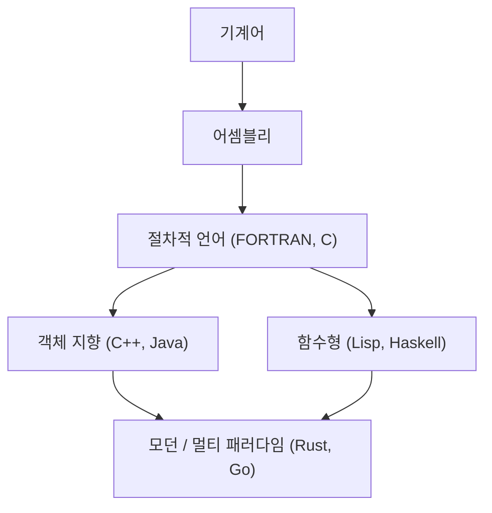
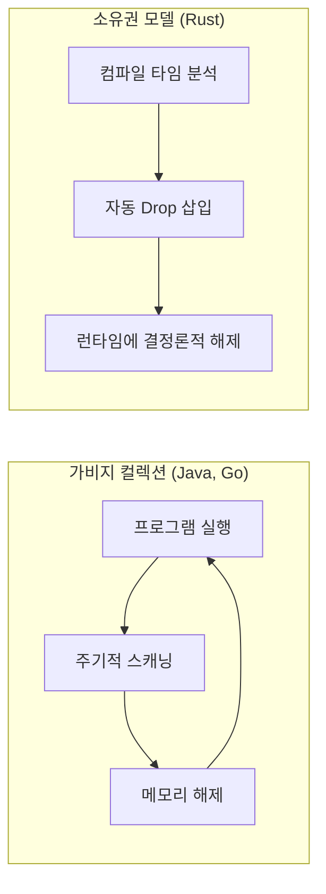

프로그래밍 언어의 역사는 인류가 컴퓨터라는 마법의 상자와 어떻게 대화해 왔는지, 그리고 어떻게 복잡성을 길들여 왔는지에 대한 역사 그 자체입니다.
본 기사에서는 프로그래밍 언어의 역사와 그 기저에 있는 **패러다임** 의 변천에 대해, 어셈블리 언어에서 시작하여 C 언어, Java, 그리고 현대의 시스템 프로그래밍을 견인하는 Rust나 Go에 이르기까지 매우 상세하고 체계적으로 해설합니다.

## 1. 프로그래밍 언어의 여명기: 기계어에서 어셈블리로

컴퓨터가 탄생한 초기, 프로그래머는 **기계어(머신어)** 를 사용하여 직접 하드웨어에 명령을 내렸습니다. 기계어는 "0"과 "1"의 비트열로, 인간이 직접 이해하고 작성하기에는 너무나 난해하고 오류를 일으키기 쉬운 것이었습니다.

그래서 등장한 것이 **어셈블리 언어** 입니다. 어셈블리 언어는 기계어의 명령(오퍼코드)에 인간이 기억하기 쉬운 짧은 문자열(니모닉)을 할당한 것입니다. 예를 들어 데이터를 이동시키는 명령에 `MOV`, 더하는 명령에 `ADD`라는 이름을 붙였습니다.

```assembly
; 어셈블리 언어의 예 (x86)
section .text
global _start

_start:
    mov edx, len    ; 메시지의 길이를 지정
    mov ecx, msg    ; 메시지의 주소를 지정
    mov ebx, 1      ; 표준 출력을 지정
    mov eax, 4      ; sys_write의 시스템 콜 번호
    int 0x80        ; 커널 호출

    mov eax, 1      ; sys_exit의 시스템 콜 번호
    int 0x80        ; 커널 호출

section .data
msg db 'Hello, World!', 0xa
len equ $ - msg
```

어셈블리 언어의 등장으로 프로그래머의 생산성은 획기적으로 향상되었지만, 여전히 하드웨어의 아키텍처(CPU의 명령어 세트)에 강하게 의존한다는 문제가 있었습니다. 다른 CPU에서 실행하기 위해서는 코드를 처음부터 다시 작성해야만 했습니다.


## 2. 구조화 프로그래밍과 절차적 언어: C 언어의 탄생

하드웨어 독립적인 프로그래밍을 실현하기 위해 고수준 언어가 등장했습니다. FORTRAN이나 COBOL 등이 그 선구자입니다. 하지만 프로그램이 대규모화됨에 따라 "스파게티 코드"라고 불리는 제어 흐름을 추적할 수 없는 코드가 만연했습니다. 이는 주로 무질서한 `GOTO` 문의 남용이 원인이었습니다.

이를 해결한 것이 **구조화 프로그래밍** 의 패러다임입니다. 에츠허르 다익스트라(Edsger W. Dijkstra) 등은 프로그램은 "순차", "선택(if)", "반복(while/for)"의 3가지 기본적인 제어 구조만으로 기술할 수 있다고 제창했습니다.

이 구조화 프로그래밍의 패러다임을 구현하고, 나아가 시스템 프로그래밍에 혁명을 가져온 것이 1972년 데니스 리치에 의해 개발된 **C 언어** 입니다.

C 언어는 UNIX 운영 체제를 작성하기 위해 만들어졌습니다. 어셈블리 언어에 가까운 저수준 메모리 접근 능력(포인터 등)을 가지면서, 하드웨어에 의존하지 않는 이식성을 갖추고 있었습니다.

```c
#include <stdio.h>

// 구조화 프로그래밍의 예: 팩토리얼 계산
int factorial(int n) {
    int result = 1;
    for (int i = 1; i <= n; i++) {
        result *= i;
    }
    return result;
}

int main() {
    int num = 5;
    printf("Factorial of %d is %d\n", num, factorial(num));
    return 0;
}
```

C 언어의 성공으로 "절차적 프로그래밍"은 오랫동안 프로그래밍의 표준 패러다임으로 자리 잡았습니다. 그러나 시스템이 더욱 거대해지고 복잡해짐에 따라 데이터와 이를 조작하는 절차(함수)가 분리되어 있어 유지보수성이 저하되는 것이 과제로 대두되었습니다.


## 3. 객체 지향의 대두: 복잡성에 대한 대처와 Java의 등장

데이터와 절차를 하나로 묶고 프로그램을 "객체"의 상호작용으로 모델링하는 **객체 지향 프로그래밍([OOP](https://kenji.blog/ko/p/object-oriented-programming-oop-solid-principles/))** 이라는 패러다임이 주목을 받았습니다.

Simula나 Smalltalk 같은 언어가 OOP의 개념을 구축했고, C 언어에 OOP 기능을 추가한 **C++** 이 널리 보급되었습니다. 하지만 C++는 복잡한 언어 사양과 포인터에 의한 메모리 관리의 어려움(메모리 누수나 세그멘테이션 폴트 등)이라는 문제를 안고 있었습니다.

1995년, 선 마이크로시스템즈(현 오라클)에서 **Java** 가 발표되었습니다. Java는 "Write Once, Run Anywhere(한 번 작성하면, 어디서든 실행된다)"라는 슬로건을 내걸고, Java 가상 머신(JVM) 위에서 동작함으로써 완전한 플랫폼 독립성을 실현했습니다.

Java의 가장 큰 특징은 C++의 복잡한 기능을 덜어내고 순수한 객체 지향 언어로 설계되었다는 점, 그리고 **가비지 컬렉션(GC)** 을 도입했다는 점입니다. 이로써 프로그래머는 번거로운 메모리 해제 작업에서 해방되었습니다.

```java
// Java에서의 객체 지향의 예
public class Animal {
    private String name;

    public Animal(String name) {
        this.name = name;
    }

    public void speak() {
        System.out.println(this.name + " makes a sound.");
    }
}

public class Dog extends Animal {
    public Dog(String name) {
        super(name);
    }

    @Override
    public void speak() {
        System.out.println("Woof!");
    }

    public static void main(String[] args) {
        Animal myDog = new Dog("Buddy");
        myDog.speak(); // "Woof!"가 출력됨
    }
}
```

Java의 등장으로 엔터프라이즈 시스템의 대규모 개발에서 객체 지향은 절대적인 주류 패러다임이 되었습니다.

여기서 프로그래밍 언어의 진화를 시각화해 보겠습니다.




## 4. 인터넷 시대와 패러다임의 다양화

2000년대 이후 웹의 보급과 함께 스크립트 언어(Python, Ruby, JavaScript 등)가 대두되었습니다. 이러한 언어는 개발 속도를 중시하고, 동적 타이핑과 풍부한 내장 데이터 구조를 제공했습니다.
동시에 상태를 가지지 않는 함수의 평가로서 계산을 모델링하는 **함수형 프로그래밍** 의 패러다임(Haskell이나 Scala 등)도 동시성 처리의 용이성 때문에 재평가받게 되었습니다.

함수형 프로그래밍에서의 람다 대수의 기초 이론은 다음 수식으로 표현되는 바와 같은 함수의 적용과 추상화에 기반하고 있습니다.

$$
\text{람다 표현식: } e ::= x \mid \lambda x.e \mid e\ e
$$

수학적인 엄밀성을 가진 함수형 언어는 부작용이 없는 순수 함수를 중심으로 구축되어, 버그가 발생하기 어려운 견고한 코드를 작성하기 쉽다는 장점이 있습니다.

## 5. 현대의 시스템 프로그래밍: Rust와 Go의 등장

클라우드 컴퓨팅과 멀티 코어 CPU의 보급으로, 현대의 프로그래밍 언어에는 "높은 퍼포먼스", "동시성 처리의 용이성", "메모리 안전성"이 동시에 요구되게 되었습니다. 이러한 요구에 부응하기 위해 등장한 것이 **Go** 와 **Rust** 입니다.

### 5.1. Go 언어: 심플함과 강력한 동시성 처리

Google에 의해 개발된 **Go** 는 시스템 프로그래밍 언어이면서도 C 언어와 같은 심플함과 동적 언어와 같은 작성 용이성을 겸비하고 있습니다.
Go의 가장 큰 특징은 **고루틴(Goroutine)** 과 **채널(Channel)** 에 의한 CSP(Communicating Sequential Processes) 모델을 채택한 동시성 처리입니다.

```go
package main

import (
	"fmt"
	"time"
)

// 워커 함수
func worker(id int, jobs <-chan int, results chan<- int) {
	for j := range jobs {
		fmt.Printf("Worker %d started job %d\n", id, j)
		time.Sleep(time.Second) // 처리를 시뮬레이트
		fmt.Printf("Worker %d finished job %d\n", id, j)
		results <- j * 2
	}
}

func main() {
	jobs := make(chan int, 100)
	results := make(chan int, 100)

	// 3개의 워커(고루틴)를 기동
	for w := 1; w <= 3; w++ {
		go worker(w, jobs, results)
	}

	// 5개의 잡을 송신
	for j := 1; j <= 5; j++ {
		jobs <- j
	}
	close(jobs)

	// 결과를 수신
	for a := 1; a <= 5; a++ {
		<-results
	}
}
```

Go는 가비지 컬렉션을 가지고 있어 메모리 관리를 자동화하고 있지만, 그 실행 속도는 매우 빠르며 마이크로서비스나 클라우드 인프라(Kubernetes나 Docker 등) 개발에서 사실상의 표준 언어가 되었습니다.

### 5.2. Rust: 소유권 시스템에 의한 궁극의 메모리 안전성

Mozilla가 중심이 되어 개발된 **Rust** 는 "C나 C++와 동등한 퍼포먼스"와 "완전한 메모리 안전성"을 양립시킨 획기적인 언어입니다. Rust는 가비지 컬렉션을 가지지 않으며, 대신 **"소유권(Ownership)", "차용(Borrowing)", "수명(Lifetime)"** 이라는 독자적인 개념을 컴파일 시에 검증함으로써 데이터 경합이나 메모리 누수 같은 버그를 미연에 방지합니다.

```rust
fn main() {
    let s1 = String::from("hello");
    // s1의 소유권이 함수 calculate_length로 이동(무브)하면, 나중에 s1을 사용할 수 없게 된다.
    // 그렇기 때문에, 참조(차용)를 전달한다.
    let len = calculate_length(&s1);

    println!("The length of '{}' is {}.", s1, len);
}

// 참조를 받는다 (소유권은 빼앗지 않는다)
fn calculate_length(s: &String) -> usize {
    s.len()
}
```

Rust의 메모리 관리 모델과 가비지 컬렉션(GC)의 비교를 아래 그림에 나타냅니다.



Rust는 그 안전성 덕분에 OS 커널 개발(Linux 커널에의 도입), 브라우저 엔진, 블록체인 기술 등 극도로 높은 신뢰성이 요구되는 영역에서 빠르게 채택되고 있습니다.

## 6. 패러다임의 융합과 미래의 전망

현대의 프로그래밍 언어는 단일 패러다임에 얽매이지 않고, 여러 패러다임의 우수한 기능을 도입하는 **멀티 패러다임** 화가 진행되고 있습니다.

예를 들어, Rust나 Go는 함수형 프로그래밍의 요소(클로저, 고차 함수 등)를 도입하고 있으며, Java나 C++도 이후 버전에서 함수형적인 기능(람다식 등)을 추가하고 있습니다.

프로그래밍 패러다임의 변천은 컴퓨터 하드웨어의 진화(싱글 코어에서 멀티 코어로의 전환 등)나 해결해야 할 문제의 성격(로컬 애플리케이션에서 분산 시스템으로의 전환 등)에 강한 영향을 받고 있습니다.

암달의 법칙(Amdahl's Law)이 보여주듯이, 병렬화를 통한 성능 향상에는 한계가 있습니다.

$$
\text{속도 향상} = \frac{1}{(1 - P) + \frac{P}{N}}
$$
(여기서, $P$ 는 병렬화 가능한 처리의 비율, $N$ 은 프로세서 수)

이 한계를 넓히고 멀티 코어의 성능을 최대한으로 이끌어내기 위해, 안전하고 효율적인 동시성 처리 모델을 제공하는 Rust나 Go가 주류가 되고 있는 것입니다.

## 7. 결론

어셈블리 언어에 의한 하드웨어와의 직접적인 대화에서 시작하여, C 언어에 의한 구조화와 이식성의 획득, Java에 의한 객체 지향과 메모리 관리의 추상화, 그리고 Rust나 Go에 의한 동시성 처리와 안전성의 추구에 이르기까지, 프로그래밍 언어는 끊임없이 진화를 거듭해 왔습니다.

**새로운 언어를 배우는 것은, 새로운 사고의 틀(패러다임)을 배우는 것입니다.** Rust의 소유권 시스템이나 Go의 CSP 모델을 이해함으로써, C 언어나 Java를 작성할 때에도 더 안전하고 동시성이 높은 설계를 할 수 있게 될 것입니다.

역사를 되돌아보는 것은 미래 기술의 흐름을 예측하기 위한 최고의 나침반이 됩니다. 프로그래밍 언어의 여정은 앞으로도 끝나지 않을 것입니다.
