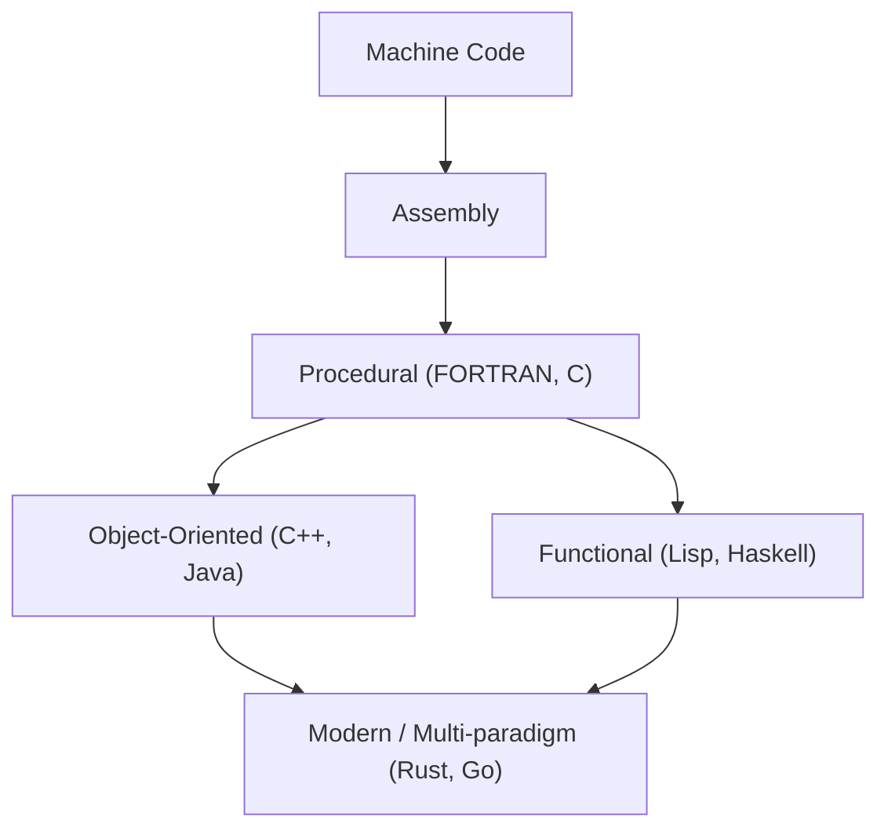
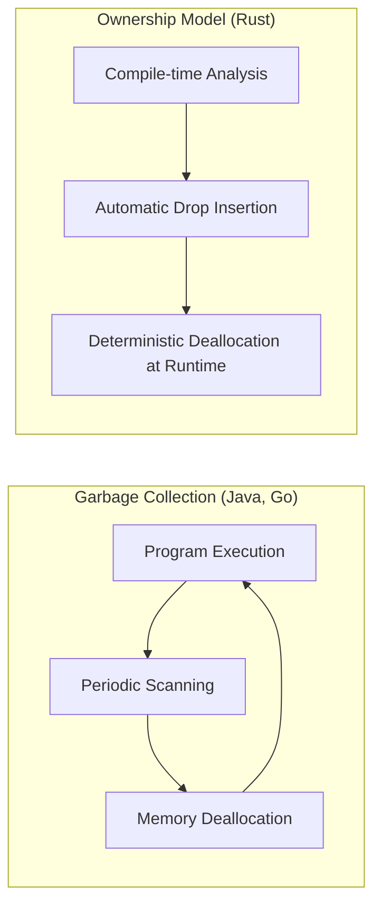

プログラミング言語の歴史は、人類が計算機という魔法の箱とどのように対話してきたか、そしていかにして複雑性を手なずけてきたかの歴史そのものです。
本記事では、プログラミング言語の歴史と、その根底にある **パラダイム** の変遷について、アセンブリ言語から始まり、[C言語](https://kenji.blog/p/c-language-pointers-memory-management-stack-heap/)、Java、そして現代のシステムプログラミングを牽引するRustやGoに至るまで、極めて詳細かつ体系的に解説します。

## 1. プログラミング言語の黎明期：機械語からアセンブリへ

コンピュータが誕生した初期、プログラマは **機械語（マシン語）** を用いて直接ハードウェアに命令を下していました。機械語は「0」と「1」のビット列であり、人間が直接理解し記述するにはあまりにも難解で、エラーを引き起こしやすいものでした。

そこで登場したのが **アセンブリ言語** です。アセンブリ言語は、機械語の命令（オペコード）に人間が記憶しやすい短い文字列（ニーモニック）を割り当てたものです。例えば、データを移動させる命令に `MOV`、加算する命令に `ADD` という名前を付けました。

```assembly
; アセンブリ言語の例 (x86)
section .text
global _start

_start:
    mov edx, len    ; メッセージの長さを指定
    mov ecx, msg    ; メッセージのアドレスを指定
    mov ebx, 1      ; 標準出力を指定
    mov eax, 4      ; sys_writeのシステムコール番号
    int 0x80        ; カーネル呼び出し

    mov eax, 1      ; sys_exitのシステムコール番号
    int 0x80        ; カーネル呼び出し

section .data
msg db 'Hello, World!', 0xa
len equ $ - msg
```

アセンブリ言語の登場により、プログラマの生産性は劇的に向上しましたが、依然としてハードウェアのアーキテクチャ（CPUの命令セット）に強く依存するという問題がありました。別のCPUで動かすためには、コードを最初から書き直さなければならなかったのです。


## 2. 構造化プログラミングと手続き型言語：[C言語](https://kenji.blog/p/c-language-pointers-memory-management-stack-heap/)の誕生

ハードウェア非依存のプログラミングを実現するため、高水準言語が登場しました。FORTRANやCOBOLなどがその先駆けです。しかし、プログラムが大規模になるにつれて、「スパゲティコード」と呼ばれる制御フローが追えないコードが蔓延しました。これは主に無秩序な `GOTO` 文の多用が原因でした。

これを解決したのが **構造化プログラミング** のパラダイムです。エドガー・ダイクストラらは、プログラムは「順次」「選択（if）」「反復（while/for）」の3つの基本的な制御構造のみで記述できると提唱しました。

この構造化プログラミングのパラダイムを体現し、さらにシステムプログラミングに革命をもたらしたのが、1972年にデニス・リッチーによって開発された **[C言語](https://kenji.blog/p/c-language-pointers-memory-management-stack-heap/)** です。

C言語は、UNIXオペレーティングシステムを記述するために作られました。アセンブリ言語に近い低レベルなメモリアクセス能力（[ポインタ](https://kenji.blog/p/c-language-pointers-memory-management-stack-heap/)など）を持ちながら、ハードウェアに依存しない移植性を備えていました。

```c
#include <stdio.h>

// 構造化プログラミングの例：階乗の計算
int factorial(int n) {
    int result = 1;
    for (int i = 1; i <= n; i++) {
        result *= i;
    }
    return result;
}

int main() {
    int num = 5;
    printf("Factorial of %d is %d\n", num, factorial(num));
    return 0;
}
```

[C言語](https://kenji.blog/p/c-language-pointers-memory-management-stack-heap/)の成功により、「手続き型プログラミング」は長らくプログラミングの標準的なパラダイムとして定着しました。しかし、システムがさらに巨大化し、複雑化するにつれて、データとそれを操作する手続き（関数）が分離していることによる保守性の低下が課題となってきました。


## 3. [オブジェクト指向](https://kenji.blog/p/object-oriented-programming-oop-solid-principles/)の台頭：複雑性への対処とJavaの登場

データと手続きをひとまとめにし、プログラムを「オブジェクト」の相互作用としてモデル化する **オブジェクト指向プログラミング（[OOP](https://kenji.blog/p/object-oriented-programming-oop-solid-principles/)）** というパラダイムが注目を集めました。

SimulaやSmalltalkといった言語がOOPの概念を築き、C言語にOOPの機能を追加した **C++** が広く普及しました。しかし、C++は複雑な言語仕様と、[ポインタ](https://kenji.blog/p/c-language-pointers-memory-management-stack-heap/)による[メモリ管理](https://kenji.blog/p/c-language-pointers-memory-management-stack-heap/)の難しさ（メモリリークやセグメンテーションフォルトなど）という問題を抱えていました。

1995年、サン・マイクロシステムズ（現オラクル）から **Java** が発表されました。Javaは「Write Once, Run Anywhere（一度書けば、どこでも動く）」というスローガンを掲げ、Java仮想マシン（JVM）上で動作することで、完全なプラットフォーム非依存を実現しました。

Javaの最大の特徴は、C++の複雑な機能を削ぎ落とし、純粋なオブジェクト指向言語として設計されたこと、そして **ガベージコレクション（GC）** を導入したことです。これにより、プログラマは煩雑なメモリ解放作業から解放されました。

```java
// Javaにおけるオブジェクト指向の例
public class Animal {
    private String name;

    public Animal(String name) {
        this.name = name;
    }

    public void speak() {
        System.out.println(this.name + " makes a sound.");
    }
}

public class Dog extends Animal {
    public Dog(String name) {
        super(name);
    }

    @Override
    public void speak() {
        System.out.println("Woof!");
    }

    public static void main(String[] args) {
        Animal myDog = new Dog("Buddy");
        myDog.speak(); // "Woof!"が出力される
    }
}
```

Javaの登場により、エンタープライズシステムの大規模開発において[オブジェクト指向](https://kenji.blog/p/object-oriented-programming-oop-solid-principles/)は絶対的な主流パラダイムとなりました。

ここで、プログラミング言語の進化を視覚化してみましょう。




## 4. インターネット時代とパラダイムの多様化

2000年代以降、Webの普及とともに、スクリプト言語（Python、Ruby、JavaScriptなど）が台頭しました。これらの言語は、開発速度を重視し、動的型付けと豊富な組み込みデータ構造を提供しました。
同時に、状態を持たない関数の評価として計算をモデル化する **[関数型プログラミング](https://kenji.blog/p/functional-programming-concepts-pure-functions-monads/)** のパラダイム（HaskellやScalaなど）も、並行処理の容易さから再評価されるようになりました。

関数型プログラミングにおけるラムダ計算の基礎理論は、以下の数式で表されるような関数の適用と抽象化に基づいています。

$$
\text{Lambda Expression: } e ::= x \mid \lambda x.e \mid e\ e
$$

数学的な厳密性を持つ関数型言語は、副作用のない[純粋関数](https://kenji.blog/p/functional-programming-concepts-pure-functions-monads/)を中心に構築され、バグの発生しにくい堅牢なコードを書きやすいという利点があります。

## 5. 現代のシステムプログラミング：RustとGoの登場

クラウドコンピューティングとマルチコアCPUの普及により、現代のプログラミング言語には「高いパフォーマンス」「並行処理の容易さ」「メモリ安全性」が同時に求められるようになりました。この要求に応えるべく登場したのが、**Go** と **Rust** です。

### 5.1. Go言語：シンプルさと強力な並行処理

Googleによって開発された **Go** は、システムプログラミング言語でありながら、[C言語](https://kenji.blog/p/c-language-pointers-memory-management-stack-heap/)のようなシンプルさと、動的言語のような書きやすさを兼ね備えています。
Goの最大の特徴は、**ゴルーチン（Goroutine）** と **チャネル（Channel）** によるCSP（Communicating Sequential Processes）モデルを採用した並行処理です。

```go
package main

import (
	"fmt"
	"time"
)

// ワーカー関数
func worker(id int, jobs <-chan int, results chan<- int) {
	for j := range jobs {
		fmt.Printf("Worker %d started job %d\n", id, j)
		time.Sleep(time.Second) // 処理をシミュレート
		fmt.Printf("Worker %d finished job %d\n", id, j)
		results <- j * 2
	}
}

func main() {
	jobs := make(chan int, 100)
	results := make(chan int, 100)

	// 3つのワーカー（ゴルーチン）を起動
	for w := 1; w <= 3; w++ {
		go worker(w, jobs, results)
	}

	// 5つのジョブを送信
	for j := 1; j <= 5; j++ {
		jobs <- j
	}
	close(jobs)

	// 結果を受信
	for a := 1; a <= 5; a++ {
		<-results
	}
}
```

Goはガベージコレクションを持ち、[メモリ管理](https://kenji.blog/p/c-language-pointers-memory-management-stack-heap/)を自動化していますが、その実行速度は非常に高速であり、マイクロサービスやクラウドインフラ（KubernetesやDockerなど）の開発において事実上の標準言語となっています。

### 5.2. Rust：所有権システムによる究極のメモリ安全性

Mozillaが中心となって開発された **Rust** は、「CやC++と同等のパフォーマンス」と「完全なメモリ安全性」を両立させた画期的な言語です。Rustはガベージコレクションを持たず、代わりに **「所有権（Ownership）」「借用（Borrowing）」「ライフタイム（Lifetime）」** という独自の概念をコンパイル時に検証することで、データ競合やメモリリークなどのバグを未然に防ぎます。

```rust
fn main() {
    let s1 = String::from("hello");
    // s1の所有権が関数calculate_lengthに移動(ムーブ)すると、後でs1を使えなくなる。
    // そのため、参照（借用）を渡す。
    let len = calculate_length(&s1);

    println!("The length of '{}' is {}.", s1, len);
}

// 参照を受け取る（所有権は奪わない）
fn calculate_length(s: &String) -> usize {
    s.len()
}
```

Rustの[メモリ管理](https://kenji.blog/p/c-language-pointers-memory-management-stack-heap/)モデルとガベージコレクション（GC）の比較を以下の図に示します。



Rustは、その安全性から、OSカーネルの開発（Linuxカーネルへの導入）、ブラウザエンジン、ブロックチェーン技術など、極めて高い信頼性が求められる領域で急速に採用が進んでいます。

## 6. パラダイムの融合と将来の展望

現代のプログラミング言語は、単一のパラダイムに縛られることなく、複数のパラダイムの優れた機能を取り入れる **マルチパラダイム** 化が進んでいます。

例えば、RustやGoは[関数型プログラミング](https://kenji.blog/p/functional-programming-concepts-pure-functions-monads/)の要素（クロージャ、高階関数など）を取り入れており、JavaやC++も後のバージョンで関数型的な機能（ラムダ式など）を追加しています。

プログラミングパラダイムの変遷は、計算機のハードウェアの進化（シングルコアからマルチコアへの移行など）や、解決すべき問題の性質（ローカルアプリケーションから分散システムへの移行など）に強く影響を受けています。

アムダールの法則（Amdahl's Law）が示すように、並列化による性能向上には限界があります。

$$
\text{Speedup} = \frac{1}{(1 - P) + \frac{P}{N}}
$$
（ここで、$P$ は並列化可能な処理の割合、$N$ はプロセッサ数）

この限界を押し広げ、マルチコアの性能を最大限に引き出すために、安全で効率的な並行処理モデルを提供するRustやGoが主流になっているのです。

## 7. 結論

アセンブリ言語によるハードウェアとの直接の対話から始まり、[C言語](https://kenji.blog/p/c-language-pointers-memory-management-stack-heap/)による構造化と移植性の獲得、Javaによるオブジェクト指向と[メモリ管理](https://kenji.blog/p/c-language-pointers-memory-management-stack-heap/)の抽象化、そしてRustやGoによる並行処理と安全性の追求に至るまで、プログラミング言語は絶えず進化を続けてきました。

**新しい言語を学ぶことは、新しい思考の枠組み（パラダイム）を学ぶことです。** Rustの所有権システムやGoのCSPモデルを理解することで、C言語やJavaを書く際にも、より安全で並行性の高い設計ができるようになるでしょう。

歴史を振り返ることは、未来の技術の潮流を予測するための最良の羅針盤となります。プログラミング言語の旅は、これからも終わることはありません。
