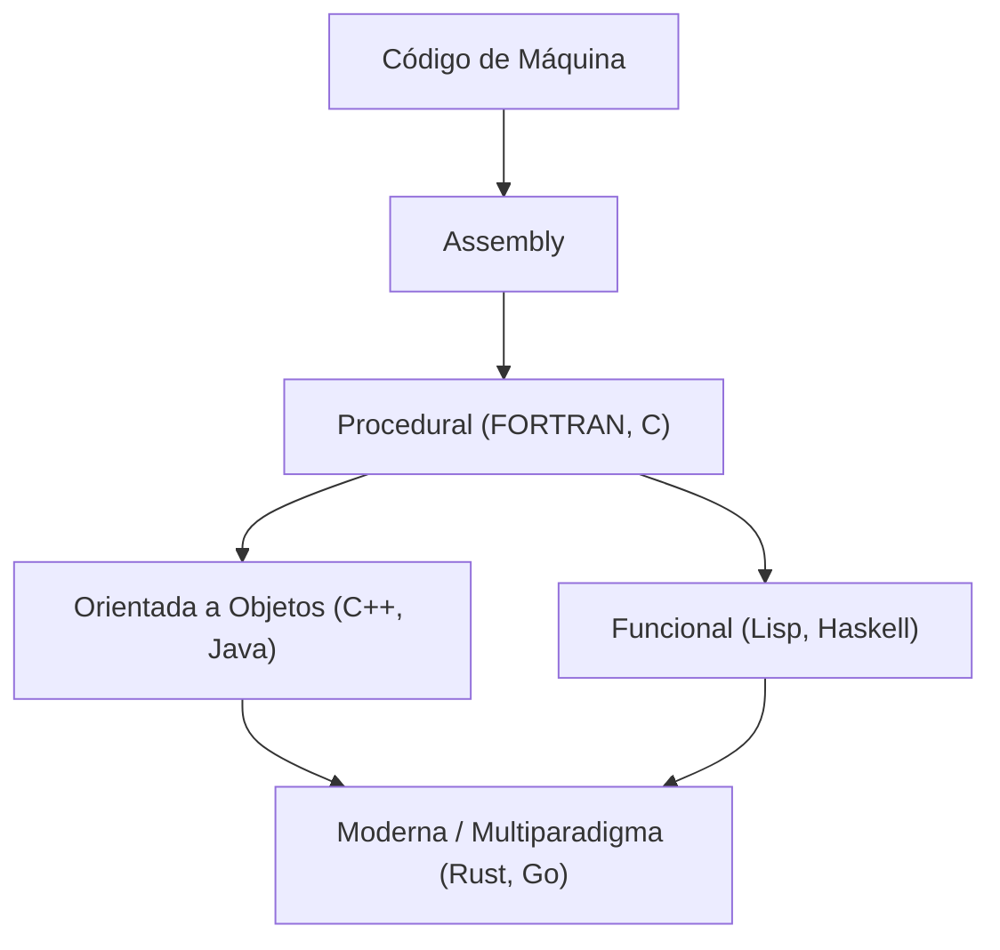
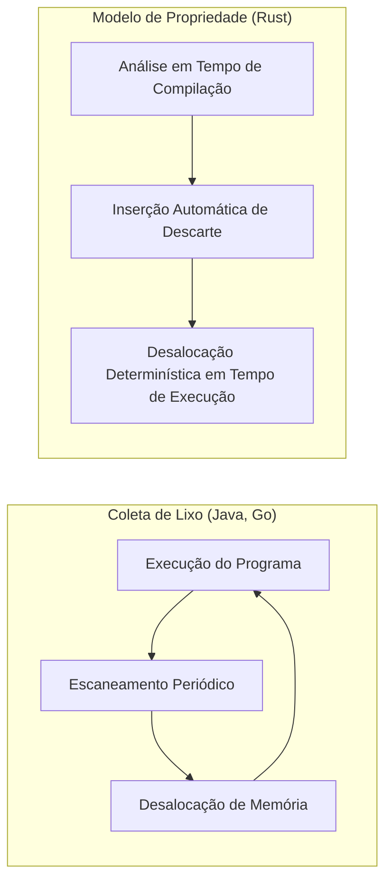

A história das linguagens de programação é a própria história de como a humanidade tem interagido com essas caixas mágicas chamadas computadores, e como conseguimos domar sua complexidade.
Neste artigo, explicaremos de forma extremamente detalhada e sistemática a história das linguagens de programação e a evolução dos **paradigmas** subjacentes a elas, começando pela linguagem Assembly, passando por C, Java e chegando a Rust e Go, que impulsionam a programação de sistemas moderna.

## 1. Os Primórdios das Linguagens de Programação: Do Código de Máquina ao Assembly

No início, quando os computadores nasceram, os programadores usavam **código de máquina** para dar comandos diretos ao hardware. O código de máquina é uma sequência de bits de "0"s e "1"s, sendo muito difícil para os humanos entenderem e escreverem diretamente, o que frequentemente causava erros.

Assim, surgiu a **linguagem Assembly**. A linguagem Assembly atribui pequenas sequências de caracteres fáceis de memorizar (mnemônicos) aos comandos do código de máquina (opcodes). Por exemplo, atribuiu-se o nome `MOV` para mover dados e `ADD` para adicionar.

```assembly
; Exemplo de linguagem Assembly (x86)
section .text
global _start

_start:
    mov edx, len    ; Especifica o comprimento da mensagem
    mov ecx, msg    ; Especifica o endereço da mensagem
    mov ebx, 1      ; Especifica a saída padrão
    mov eax, 4      ; Número da chamada de sistema para sys_write
    int 0x80        ; Chamada do kernel

    mov eax, 1      ; Número da chamada de sistema para sys_exit
    int 0x80        ; Chamada do kernel

section .data
msg db 'Hello, World!', 0xa
len equ $ - msg
```

Embora a introdução da linguagem Assembly tenha melhorado drasticamente a produtividade dos programadores, ainda havia o problema de depender fortemente da arquitetura do hardware (conjunto de instruções da CPU). Para rodar em outra CPU, o código precisava ser reescrito do zero.


## 2. Programação Estruturada e Linguagens Procedurais: O Nascimento da Linguagem C

Para alcançar a programação independente de hardware, surgiram as linguagens de alto nível. FORTRAN e COBOL foram algumas das pioneiras. No entanto, à medida que os programas se tornavam maiores, os chamados "códigos espaguete", onde o fluxo de controle não podia ser rastreado, tornaram-se comuns. Isso se devia principalmente ao uso desordenado de declarações `GOTO`.

Isso foi resolvido pelo paradigma da **programação estruturada**. Edsger Dijkstra e outros propuseram que os programas poderiam ser escritos usando apenas três estruturas de controle básicas: "sequência", "seleção (if)" e "iteração (while/for)".

A linguagem que incorporou esse paradigma de programação estruturada e revolucionou a programação de sistemas foi a **linguagem C**, desenvolvida por Dennis Ritchie em 1972.

A linguagem C foi criada para escrever o sistema operacional UNIX. Ela possuía capacidades de acesso à memória de baixo nível semelhantes às do Assembly (como ponteiros), mas oferecia a portabilidade de ser independente do hardware.

```c
#include <stdio.h>

// Exemplo de programação estruturada: cálculo do fatorial
int factorial(int n) {
    int result = 1;
    for (int i = 1; i <= n; i++) {
        result *= i;
    }
    return result;
}

int main() {
    int num = 5;
    printf("Factorial of %d is %d\n", num, factorial(num));
    return 0;
}
```

Devido ao sucesso da linguagem C, a "programação procedural" tornou-se o paradigma padrão de programação por um longo tempo. No entanto, à medida que os sistemas se tornaram maiores e mais complexos, a manutenção tornou-se um problema porque os dados e os procedimentos (funções) que operavam neles estavam separados.


## 3. A Ascensão da Orientação a Objetos: Lidando com a Complexidade e a Chegada do Java

O paradigma de **Programação Orientada a Objetos (POO)**, que agrupa dados e procedimentos e modela o programa como uma interação de "objetos", ganhou atenção.

Linguagens como Simula e Smalltalk estabeleceram os conceitos da POO, e o **C++**, que adicionou recursos de POO ao C, tornou-se amplamente utilizado. Contudo, o C++ sofria de especificações de linguagem complexas e das dificuldades de gerenciamento de memória através de ponteiros (como vazamentos de memória e falhas de segmentação).

Em 1995, o **Java** foi anunciado pela Sun Microsystems (agora Oracle). Com o slogan "Write Once, Run Anywhere" (Escreva Uma Vez, Rode em Qualquer Lugar), o Java alcançou total independência de plataforma ao ser executado na Máquina Virtual Java (JVM).

A maior característica do Java foi ter sido projetado como uma linguagem puramente orientada a objetos, eliminando as funcionalidades complexas do C++, além da introdução da **Coleta de Lixo (Garbage Collection - GC)**. Isso libertou os programadores das tediosas tarefas de liberação de memória.

```java
// Exemplo de orientação a objetos em Java
public class Animal {
    private String name;

    public Animal(String name) {
        this.name = name;
    }

    public void speak() {
        System.out.println(this.name + " makes a sound.");
    }
}

public class Dog extends Animal {
    public Dog(String name) {
        super(name);
    }

    @Override
    public void speak() {
        System.out.println("Woof!");
    }

    public static void main(String[] args) {
        Animal myDog = new Dog("Buddy");
        myDog.speak(); // "Woof!" é impresso
    }
}
```

Com o surgimento do Java, a orientação a objetos tornou-se o paradigma predominante absoluto no desenvolvimento em larga escala de sistemas corporativos.

Aqui, vamos visualizar a evolução das linguagens de programação.




## 4. A Era da Internet e a Diversificação de Paradigmas

A partir dos anos 2000, com a disseminação da Web, as linguagens de script (Python, Ruby, JavaScript, etc.) ganharam destaque. Essas linguagens enfatizavam a velocidade de desenvolvimento, oferecendo tipagem dinâmica e ricas estruturas de dados embutidas.
Ao mesmo tempo, o paradigma de **programação funcional** (como Haskell e Scala), que modela a computação como a avaliação de funções sem estado, foi reavaliado devido à sua facilidade em lidar com processamento paralelo.

A teoria fundamental do cálculo lambda na programação funcional é baseada na aplicação e abstração de funções, conforme representado pela seguinte fórmula:

$$
\text{Expressão Lambda: } e ::= x \mid \lambda x.e \mid e\ e
$$

As linguagens funcionais, que possuem rigor matemático, são construídas em torno de funções puras sem efeitos colaterais, e têm a vantagem de facilitar a escrita de código robusto e menos propenso a bugs.

## 5. Programação de Sistemas Moderna: O Surgimento de Rust e Go

Devido à disseminação da computação em nuvem e das CPUs multinúcleo, as linguagens de programação modernas agora precisam oferecer "alto desempenho", "facilidade de processamento paralelo" e "segurança de memória" simultaneamente. Para atender a essas demandas, surgiram **Go** e **Rust**.

### 5.1. Linguagem Go: Simplicidade e Processamento Paralelo Poderoso

O **Go**, desenvolvido pelo Google, é uma linguagem de programação de sistemas que combina a simplicidade da linguagem C com a facilidade de escrita de uma linguagem dinâmica.
A principal característica do Go é o processamento paralelo baseado no modelo CSP (Communicating Sequential Processes) usando **Goroutines** e **Canais (Channels)**.

```go
package main

import (
	"fmt"
	"time"
)

// Função de trabalhador
func worker(id int, jobs <-chan int, results chan<- int) {
	for j := range jobs {
		fmt.Printf("Worker %d started job %d\n", id, j)
		time.Sleep(time.Second) // Simula processamento
		fmt.Printf("Worker %d finished job %d\n", id, j)
		results <- j * 2
	}
}

func main() {
	jobs := make(chan int, 100)
	results := make(chan int, 100)

	// Inicia 3 trabalhadores (goroutines)
	for w := 1; w <= 3; w++ {
		go worker(w, jobs, results)
	}

	// Envia 5 trabalhos
	for j := 1; j <= 5; j++ {
		jobs <- j
	}
	close(jobs)

	// Recebe os resultados
	for a := 1; a <= 5; a++ {
		<-results
	}
}
```

O Go possui coleta de lixo e automatiza o gerenciamento de memória, mas sua velocidade de execução é extremamente alta, tornando-se a linguagem padrão de fato no desenvolvimento de microsserviços e infraestrutura em nuvem (como Kubernetes e Docker).

### 5.2. Rust: Segurança de Memória Extrema com o Sistema de Propriedade

O **Rust**, desenvolvido liderado pela Mozilla, é uma linguagem inovadora que alcança tanto o "desempenho equivalente ao C ou C++" quanto a "total segurança de memória". O Rust não possui coleta de lixo; em vez disso, ele previne bugs como corridas de dados e vazamentos de memória antes que eles ocorram, verificando os conceitos únicos de **"Propriedade (Ownership)"**, **"Empréstimo (Borrowing)"** e **"Tempo de vida (Lifetime)"** em tempo de compilação.

```rust
fn main() {
    let s1 = String::from("hello");
    // Se a propriedade de s1 for movida (move) para a função calculate_length, s1 não poderá ser usada posteriormente.
    // Portanto, passamos uma referência (empréstimo).
    let len = calculate_length(&s1);

    println!("The length of '{}' is {}.", s1, len);
}

// Recebe uma referência (não retira a propriedade)
fn calculate_length(s: &String) -> usize {
    s.len()
}
```

A comparação entre o modelo de gerenciamento de memória do Rust e a Coleta de Lixo (GC) é mostrada no diagrama abaixo.



Devido à sua segurança, a adoção do Rust tem crescido rapidamente em áreas que exigem extrema confiabilidade, como o desenvolvimento de kernels de sistemas operacionais (introduzido no kernel do Linux), motores de navegadores e tecnologias de blockchain.

## 6. A Fusão de Paradigmas e Perspectivas Futuras

As linguagens de programação modernas não estão mais limitadas a um único paradigma, evoluindo para se tornarem **multiparadigmas** ao incorporar os melhores recursos de vários paradigmas.

Por exemplo, Rust e Go incorporaram elementos de programação funcional (closures, funções de ordem superior, etc.), e Java e C++ também adicionaram recursos funcionais (como expressões lambda) em versões posteriores.

A evolução dos paradigmas de programação é fortemente influenciada pelos avanços no hardware dos computadores (como a transição de um núcleo para vários núcleos) e a natureza dos problemas a serem resolvidos (como a transição de aplicações locais para sistemas distribuídos).

Como mostra a Lei de Amdahl, há um limite para a melhoria de desempenho através da paralelização.

$$
\text{Aceleração} = \frac{1}{(1 - P) + \frac{P}{N}}
$$
(Onde $P$ é a proporção de processamento paralelizável e $N$ é o número de processadores)

Para ultrapassar esse limite e maximizar o desempenho dos multinúcleos, linguagens como Rust e Go, que oferecem modelos de processamento paralelo seguros e eficientes, tornaram-se populares.

## 7. Conclusão

Começando pelas interações diretas com o hardware via linguagem Assembly, ganhando estrutura e portabilidade com C, alcançando orientação a objetos e abstração do gerenciamento de memória com Java, e buscando segurança e processamento paralelo com Rust e Go, as linguagens de programação têm evoluído continuamente.

**Aprender uma nova linguagem é aprender um novo quadro de pensamento (paradigma).** Ao compreender o sistema de propriedades do Rust ou o modelo CSP do Go, você será capaz de projetar sistemas mais seguros e paralelizáveis, mesmo quando estiver escrevendo em C ou Java.

Olhar para a história é a melhor bússola para prever as tendências tecnológicas futuras. A jornada das linguagens de programação nunca terá fim.
