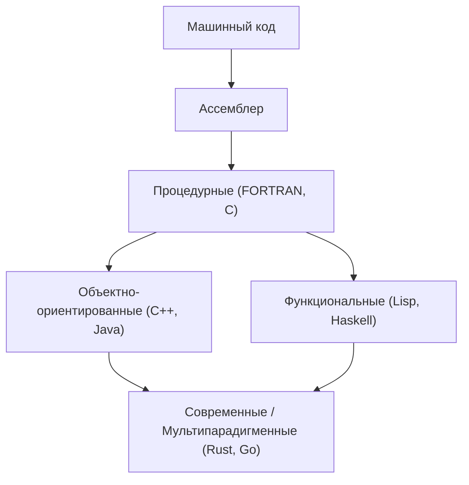
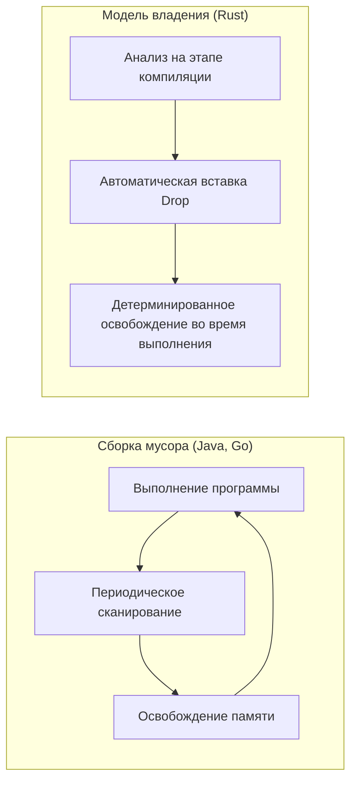

История языков программирования — это история о том, как человечество взаимодействовало с вычислительными машинами, этими волшебными ящиками, и как оно научилось укрощать сложность.
В этой статье мы максимально подробно и систематично разберем историю языков программирования и эволюцию лежащих в их основе **парадигм** , начиная с языка ассемблера, проходя через C и Java, и заканчивая современными лидерами системного программирования — Rust и Go.

## 1. Заря языков программирования: от машинного кода к ассемблеру

На заре появления компьютеров программисты отдавали команды аппаратному обеспечению напрямую, используя **машинный код** . Машинный код представлял собой последовательности битов «0» и «1», и для человека писать и понимать его было слишком сложно, что часто приводило к ошибкам.

На смену ему пришел **язык ассемблера** . В ассемблере инструкциям машинного кода (опкодам) были присвоены короткие, легко запоминающиеся строки (мнемоники). Например, команда перемещения данных получила название `MOV`, а команда сложения — `ADD`.

```assembly
; Пример на языке ассемблера (x86)
section .text
global _start

_start:
    mov edx, len    ; Установка длины сообщения
    mov ecx, msg    ; Установка адреса сообщения
    mov ebx, 1      ; Выбор стандартного вывода
    mov eax, 4      ; Номер системного вызова sys_write
    int 0x80        ; Вызов ядра

    mov eax, 1      ; Номер системного вызова sys_exit
    int 0x80        ; Вызов ядра

section .data
msg db 'Привет, Мир!', 0xa
len equ $ - msg
```

С появлением языка ассемблера производительность программистов резко возросла, но оставалась проблема сильной зависимости от аппаратной архитектуры (набора команд CPU). Чтобы запустить программу на другом процессоре, код приходилось переписывать с нуля.


## 2. Структурное программирование и процедурные языки: рождение языка C

Для обеспечения аппаратно-независимого программирования появились языки высокого уровня. Пионерами стали FORTRAN, COBOL и другие. Однако по мере роста масштабов программ стал распространяться так называемый "спагетти-код" — код, в котором невозможно отследить поток управления. Главной причиной этого было бесконтрольное использование оператора `GOTO`.

Эту проблему решила парадигма **структурного программирования** . Эдсгер Дейкстра и другие ученые предложили идею, что любую программу можно описать с помощью всего трех базовых управляющих конструкций: «следование», «ветвление (if)» и «цикл (while/for)».

Воплощением парадигмы структурного программирования, совершившим революцию в системном программировании, стал **язык C** , разработанный Деннисом Ритчи в 1972 году.

Язык C создавался для написания операционной системы UNIX. Он сочетал в себе возможности низкоуровневого доступа к памяти (например, указатели), близкие к ассемблеру, с переносимостью, не зависящей от аппаратного обеспечения.

```c
#include <stdio.h>

// Пример структурного программирования: вычисление факториала
int factorial(int n) {
    int result = 1;
    for (int i = 1; i <= n; i++) {
        result *= i;
    }
    return result;
}

int main() {
    int num = 5;
    printf("Факториал %d равен %d\n", num, factorial(num));
    return 0;
}
```

Благодаря успеху языка C «процедурное программирование» надолго закрепилось как стандартная парадигма программирования. Однако по мере дальнейшего укрупнения и усложнения систем стало очевидно снижение ремонтопригодности из-за разделения данных и процедур (функций), которые ими манипулируют.


## 3. Подъем объектно-ориентированного подхода: борьба со сложностью и появление Java

Внимание привлекла парадигма **объекто-ориентированного программирования (ООП)** , которая объединяет данные и процедуры, моделируя программу как взаимодействие «объектов».

Такие языки, как Simula и Smalltalk, заложили концепции ООП, а язык **C++** , добавивший возможности ООП в C, получил широкое распространение. Тем не менее, C++ страдал от сложных спецификаций языка и проблем с управлением памятью через указатели (таких как утечки памяти и ошибки сегментации).

В 1995 году компания Sun Microsystems (ныне Oracle) представила **Java** . Java вышла под лозунгом «Write Once, Run Anywhere (Напиши один раз, запускай везде)» и обеспечила полную независимость от платформы за счет выполнения на виртуальной машине Java (JVM).

Главной особенностью Java стал отказ от сложных функций C++ и проектирование чисто объектно-ориентированного языка, а также внедрение **сборки мусора (Garbage Collection, GC)** . Это освободило программистов от утомительной ручной работы по освобождению памяти.

```java
// Пример объектно-ориентированного подхода в Java
public class Animal {
    private String name;

    public Animal(String name) {
        this.name = name;
    }

    public void speak() {
        System.out.println(this.name + " издает звук.");
    }
}

public class Dog extends Animal {
    public Dog(String name) {
        super(name);
    }

    @Override
    public void speak() {
        System.out.println("Гав!");
    }

    public static void main(String[] args) {
        Animal myDog = new Dog("Бобик");
        myDog.speak(); // Выводит "Гав!"
    }
}
```

С появлением Java объектно-ориентированное программирование стало абсолютным мейнстримом в масштабной разработке корпоративных систем.

Давайте визуализируем эволюцию языков программирования:




## 4. Эпоха Интернета и диверсификация парадигм

С 2000-х годов, по мере распространения веб-технологий, на первый план вышли скриптовые языки (Python, Ruby, JavaScript и др.). В них упор делался на скорость разработки, предлагалась динамическая типизация и богатый набор встроенных структур данных.
В то же время была переосмыслена парадигма **функционального программирования** (Haskell, Scala и др.), моделирующая вычисления как оценку функций без состояний, в первую очередь из-за простоты параллельной обработки.

Базовая теория лямбда-исчисления в функциональном программировании основывается на применении и абстракции функций, что выражается следующей формулой:

$$
\text{Лямбда-выражение: } e ::= x \mid \lambda x.e \mid e\ e
$$

Функциональные языки, обладающие математической строгостью, строятся вокруг чистых функций без побочных эффектов. Их преимущество — легкость написания надежного кода с меньшим количеством ошибок.

## 5. Современное системное программирование: появление Rust и Go

В связи с распространением облачных вычислений и многоядерных процессоров к современным языкам программирования стали предъявляться одновременные требования: «высокая производительность», «простота параллельной обработки» и «безопасность памяти». Ответом на эти запросы стали языки **Go** и **Rust** .

### 5.1. Язык Go: простота и мощная параллельная обработка

Разработанный в Google, язык **Go** является языком системного программирования, но сочетает в себе простоту, подобную C, с легкостью написания кода, свойственной динамическим языкам.
Главная особенность Go — это параллельная обработка, основанная на модели CSP (Communicating Sequential Processes) с использованием **горутин (Goroutine)** и **каналов (Channel)** .

```go
package main

import (
	"fmt"
	"time"
)

// Функция-воркер
func worker(id int, jobs <-chan int, results chan<- int) {
	for j := range jobs {
		fmt.Printf("Воркер %d начал работу над задачей %d\n", id, j)
		time.Sleep(time.Second) // Симуляция обработки
		fmt.Printf("Воркер %d завершил задачу %d\n", id, j)
		results <- j * 2
	}
}

func main() {
	jobs := make(chan int, 100)
	results := make(chan int, 100)

	// Запуск 3 воркеров (горутин)
	for w := 1; w <= 3; w++ {
		go worker(w, jobs, results)
	}

	// Отправка 5 задач
	for j := 1; j <= 5; j++ {
		jobs <- j
	}
	close(jobs)

	// Получение результатов
	for a := 1; a <= 5; a++ {
		<-results
	}
}
```

Go использует сборку мусора для автоматизации управления памятью, но при этом отличается очень высокой скоростью выполнения. Он стал фактическим стандартом для разработки микросервисов и облачной инфраструктуры (таких как Kubernetes и Docker).

### 5.2. Rust: абсолютная безопасность памяти через систему владения

Разработанный в основном силами Mozilla, язык **Rust** — это революционный язык, совмещающий «производительность на уровне C или C++» с «полной безопасностью памяти». Rust не использует сборку мусора. Вместо этого он внедряет уникальные концепции **«Владения (Ownership)»**, **«Заимствования (Borrowing)»** и **«Времени жизни (Lifetime)»**, проверяя их на этапе компиляции. Это позволяет предотвратить такие ошибки, как состояние гонки и утечки памяти.

```rust
fn main() {
    let s1 = String::from("привет");
    // Если владение s1 переместится (move) в функцию calculate_length, мы больше не сможем использовать s1.
    // Поэтому мы передаем ссылку (заимствование).
    let len = calculate_length(&s1);

    println!("Длина строки '{}' равна {}.", s1, len);
}

// Принимает ссылку (не забирает владение)
fn calculate_length(s: &String) -> usize {
    s.len()
}
```

Сравнение модели управления памятью в Rust и сборки мусора (GC) представлено на следующей схеме:



Благодаря своей безопасности Rust стремительно набирает популярность в сферах, требующих сверхвысокой надежности, таких как разработка ядер ОС (внедрение в ядро Linux), браузерных движков и блокчейн-технологий.

## 6. Слияние парадигм и перспективы развития

Современные языки программирования не ограничиваются одной парадигмой, становясь **мультипарадигменными** и заимствуя лучшие возможности из разных подходов.

Например, Rust и Go включают элементы функционального программирования (замыкания, функции высшего порядка), а в более поздних версиях Java и C++ были добавлены функциональные возможности (такие как лямбда-выражения).

Эволюция парадигм программирования сильно зависит от развития аппаратного обеспечения (например, переход от одноядерных к многоядерным процессорам) и характера решаемых задач (переход от локальных приложений к распределенным системам).

Как показывает закон Амдала (Amdahl's Law), улучшение производительности за счет распараллеливания имеет свои пределы.

$$
\text{Ускорение} = \frac{1}{(1 - P) + \frac{P}{N}}
$$
(где $P$ — доля процесса, поддающаяся распараллеливанию, а $N$ — количество процессоров)

Чтобы раздвинуть эти границы и максимально использовать производительность многоядерных систем, в мейнстрим выходят такие языки, как Rust и Go, предлагающие безопасные и эффективные модели параллельной обработки.

## 7. Заключение

Начиная с прямого взаимодействия с оборудованием через ассемблер, проходя через структуризацию и портируемость C, абстракцию управления памятью и объектную ориентированность Java, и заканчивая современными Rust и Go с их фокусом на безопасность и параллелизм, языки программирования непрерывно эволюционировали.

**Изучение нового языка — это изучение новой системы мышления (парадигмы).** Понимание системы владения Rust или модели CSP в Go позволит вам применять более безопасные и конкурентные архитектурные решения даже при написании кода на C или Java.

Изучение истории — это лучший компас для предсказания будущих технологических трендов. Путешествие языков программирования продолжается.
