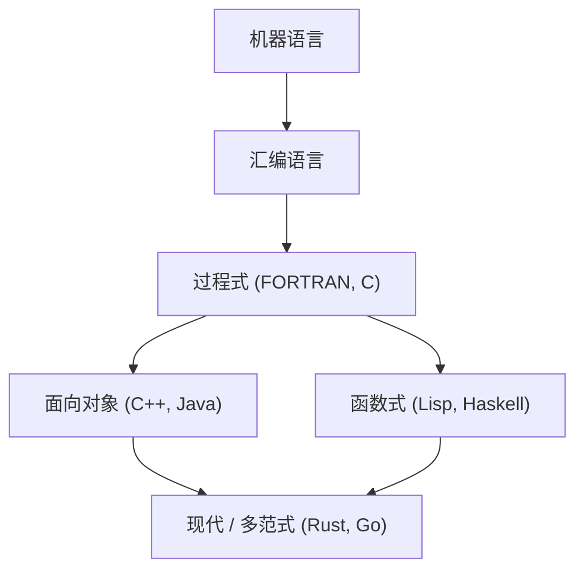
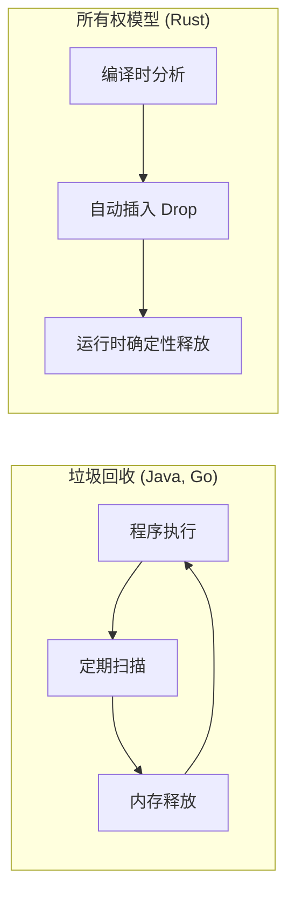

编程语言的历史，本质上就是人类如何与计算机这个魔法盒子进行对话，以及如何驯服复杂性的历史。
本文将围绕编程语言的历史及其底层的 **范式** 演变，从汇编语言开始，经过C语言、Java，直到引领现代系统编程的Rust和Go，进行极其详细且系统化的解说。

## 1. 编程语言的黎明期：从机器语言到汇编语言

在计算机诞生的初期，程序员使用 **机器语言（Machine Code）** 直接向硬件下达指令。机器语言是由“0”和“1”组成的比特流，对于人类来说直接理解和编写过于晦涩难懂，且极易引发错误。

于是，**汇编语言** 应运而生。汇编语言是将机器语言的指令（操作码）分配给人类易于记忆的短字符串（助记符）。例如，将移动数据的指令命名为 `MOV`，将执行加法的指令命名为 `ADD`。

```assembly
; 汇编语言示例 (x86)
section .text
global _start

_start:
    mov edx, len    ; 指定消息的长度
    mov ecx, msg    ; 指定消息的地址
    mov ebx, 1      ; 指定标准输出
    mov eax, 4      ; sys_write 的系统调用号
    int 0x80        ; 内核调用

    mov eax, 1      ; sys_exit 的系统调用号
    int 0x80        ; 内核调用

section .data
msg db 'Hello, World!', 0xa
len equ $ - msg
```

汇编语言的出现极大地提高了程序员的生产力，但依然存在强烈依赖于硬件架构（CPU 的指令集）的问题。为了在其他的 CPU 上运行，必须从头开始重写代码。


## 2. 结构化编程与过程式语言：C语言的诞生

为了实现独立于硬件的编程，高级语言登上了历史舞台。FORTRAN 和 COBOL 等就是其中的先驱。然而，随着程序规模的扩大，被称为“面条代码”的、控制流难以追踪的代码开始蔓延。这主要归咎于对 `GOTO` 语句的无序滥用。

解决这一问题的是 **结构化编程** 的范式。艾兹格·迪杰斯特拉（Edsger W. Dijkstra）等人提出，程序可以仅通过“顺序”、“选择（if）”和“循环（while/for）”这三种基本控制结构来编写。

体现了这种结构化编程范式，并进一步为系统编程带来革命的，是1972年由丹尼斯·里奇（Dennis Ritchie）开发的 **C语言**。

C语言是为了编写 UNIX 操作系统而诞生的。它既拥有接近汇编语言的底层内存访问能力（如指针等），又具备了不依赖于硬件的可移植性。

```c
#include <stdio.h>

// 结构化编程示例：计算阶乘
int factorial(int n) {
    int result = 1;
    for (int i = 1; i <= n; i++) {
        result *= i;
    }
    return result;
}

int main() {
    int num = 5;
    printf("Factorial of %d is %d\n", num, factorial(num));
    return 0;
}
```

随着C语言的成功，“过程式编程”长期作为编程的标准范式确立了下来。但是，随着系统变得更加庞大和复杂，数据与操作数据的过程（函数）相分离所导致的维护性下降，成为了一个亟待解决的课题。


## 3. 面向对象的崛起：应对复杂性与Java的登场

将数据和过程封装在一起，将程序建模为“对象”之间交互的 **面向对象编程 ([OOP](https://kenji.blog/zh-cn/p/object-oriented-programming-oop-solid-principles/))** 范式开始备受瞩目。

Simula 和 Smalltalk 等语言奠定了 OOP 的概念，而为C语言添加了 OOP 功能的 **C++** 得到了广泛的普及。然而，C++ 存在着语言规范复杂以及通过指针进行内存管理困难（如内存泄漏和段错误等）的问题。

1995年，Sun Microsystems（现 Oracle）发布了 **Java**。Java 提出了“Write Once, Run Anywhere（一次编写，到处运行）”的口号，通过在 Java 虚拟机（JVM）上运行，实现了完全的平台无关性。

Java 最大的特点是，它剔除了 C++ 中复杂的功能，被设计为一门纯粹的面向对象语言，并且引入了 **垃圾回收机制 (GC)**。由此，程序员从繁琐的内存释放工作中解放了出来。

```java
// Java 中的面向对象示例
public class Animal {
    private String name;

    public Animal(String name) {
        this.name = name;
    }

    public void speak() {
        System.out.println(this.name + " makes a sound.");
    }
}

public class Dog extends Animal {
    public Dog(String name) {
        super(name);
    }

    @Override
    public void speak() {
        System.out.println("Woof!");
    }

    public static void main(String[] args) {
        Animal myDog = new Dog("Buddy");
        myDog.speak(); // 将输出 "Woof!"
    }
}
```

随着 Java 的出现，面向对象在企业级系统的大规模开发中成为了绝对的主流范式。

在这里，让我们将编程语言的演变进行可视化。




## 4. 互联网时代与范式的多样化

2000年代以后，随着 Web 的普及，脚本语言（如 Python、Ruby、JavaScript 等）开始崛起。这些语言注重开发速度，并提供了动态类型和丰富的内置数据结构。
同时，将计算建模为无状态函数求值的 **函数式编程** 范式（如 Haskell 和 Scala 等），也因为其在并发处理上的便利性而得到了重新评估。

函数式编程中 Lambda 演算的基础理论，是基于如下数学公式所示的函数应用与抽象。

$$
\text{Lambda 表达式： } e ::= x \mid \lambda x.e \mid e\ e
$$

具备数学严谨性的函数式语言，以无副作用的纯函数为核心构建，其优势在于更容易编写出不易产生 Bug 的健壮代码。

## 5. 现代系统编程：Rust与Go的登场

随着云计算和多核 CPU 的普及，现代编程语言被同时要求具备“高性能”、“并发处理的便利性”和“内存安全性”。为了满足这一需求而诞生的，正是 **Go** 和 **Rust**。

### 5.1. Go语言：简洁性与强大的并发处理

由 Google 开发的 **Go**，虽然是一门系统编程语言，却兼具了类似C语言的简洁性和类似动态语言的易写性。
Go 最大的特征是，采用了基于 **协程 (Goroutine)** 和 **通道 (Channel)** 的 CSP（Communicating Sequential Processes）模型的并发处理。

```go
package main

import (
	"fmt"
	"time"
)

// 工作函数
func worker(id int, jobs <-chan int, results chan<- int) {
	for j := range jobs {
		fmt.Printf("Worker %d started job %d\n", id, j)
		time.Sleep(time.Second) // 模拟处理过程
		fmt.Printf("Worker %d finished job %d\n", id, j)
		results <- j * 2
	}
}

func main() {
	jobs := make(chan int, 100)
	results := make(chan int, 100)

	// 启动 3 个 worker（Goroutine）
	for w := 1; w <= 3; w++ {
		go worker(w, jobs, results)
	}

	// 发送 5 个任务
	for j := 1; j <= 5; j++ {
		jobs <- j
	}
	close(jobs)

	// 接收结果
	for a := 1; a <= 5; a++ {
		<-results
	}
}
```

Go 拥有垃圾回收机制，自动管理内存，同时其执行速度非常快，在微服务和云基础设施（如 Kubernetes 和 Docker 等）的开发中已成为事实上的标准语言。

### 5.2. Rust：基于所有权系统的极致内存安全

由 Mozilla 主导开发的 **Rust**，是一门实现了“与 C 或 C++ 同等性能”和“完全内存安全”两者兼得的革命性语言。Rust 没有垃圾回收机制，取而代之的是通过在编译时验证 **“所有权 (Ownership)”**、**“借用 (Borrowing)”** 和 **“生命周期 (Lifetime)”** 这三个独特的概念，来防患数据竞争和内存泄漏等 Bug 于未然。

```rust
fn main() {
    let s1 = String::from("hello");
    // 如果 s1 的所有权移动 (Move) 到了函数 calculate_length，之后就无法再使用 s1 了。
    // 因此，我们传递它的引用（借用）。
    let len = calculate_length(&s1);

    println!("The length of '{}' is {}.", s1, len);
}

// 接收引用（不剥夺所有权）
fn calculate_length(s: &String) -> usize {
    s.len()
}
```

下图展示了 Rust 的内存管理模型与垃圾回收机制（GC）的比较。



由于其安全性，Rust 在对可靠性要求极高的领域，如操作系统内核开发（已被引入 Linux 内核）、浏览器引擎、区块链技术等，正在被迅速采用。

## 6. 范式的融合与未来展望

现代的编程语言不再局限于单一的范式，而是越来越多地走向 **多范式** 化，汲取多种范式的优秀特性。

例如，Rust 和 Go 引入了函数式编程的元素（闭包、高阶函数等），而 Java 和 C++ 也在后续版本中添加了函数式的特性（如 Lambda 表达式等）。

编程范式的演变，受到了计算机硬件进化（如从单核向多核的过渡等）以及需要解决的问题性质（如从本地应用向分布式系统的过渡等）的强烈影响。

正如阿姆达尔定律（Amdahl's Law）所指出的，通过并行化带来的性能提升是存在极限的。

$$
\text{加速比} = \frac{1}{(1 - P) + \frac{P}{N}}
$$
（其中，$P$ 是可并行化处理的比例，$N$ 是处理器数量）

为了突破这一极限，最大限度地发挥多核性能，提供了安全且高效的并发处理模型的 Rust 和 Go 逐渐成为了主流。

## 7. 结论

从通过汇编语言直接与硬件对话开始，经过C语言带来的结构化与可移植性，Java 带来的面向对象与内存管理抽象化，再到 Rust 和 Go 对并发处理与安全性的追求，编程语言一直在不断地进化。

**学习一门新的语言，就是学习一种新的思考框架（范式）。** 通过理解 Rust 的所有权系统或 Go 的 CSP 模型，即使在编写C语言或 Java 时，也能设计出更安全、并发性更高的程序。

回顾历史，是预测未来技术发展趋势的最佳指南针。编程语言的旅程，在未来也绝不会止步。
